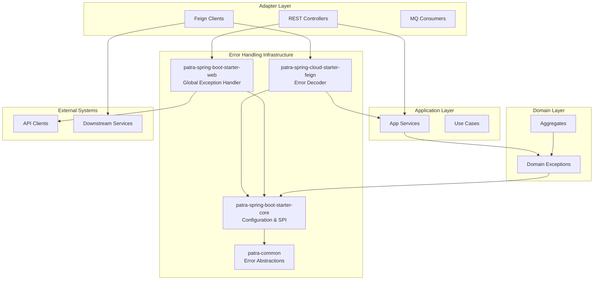
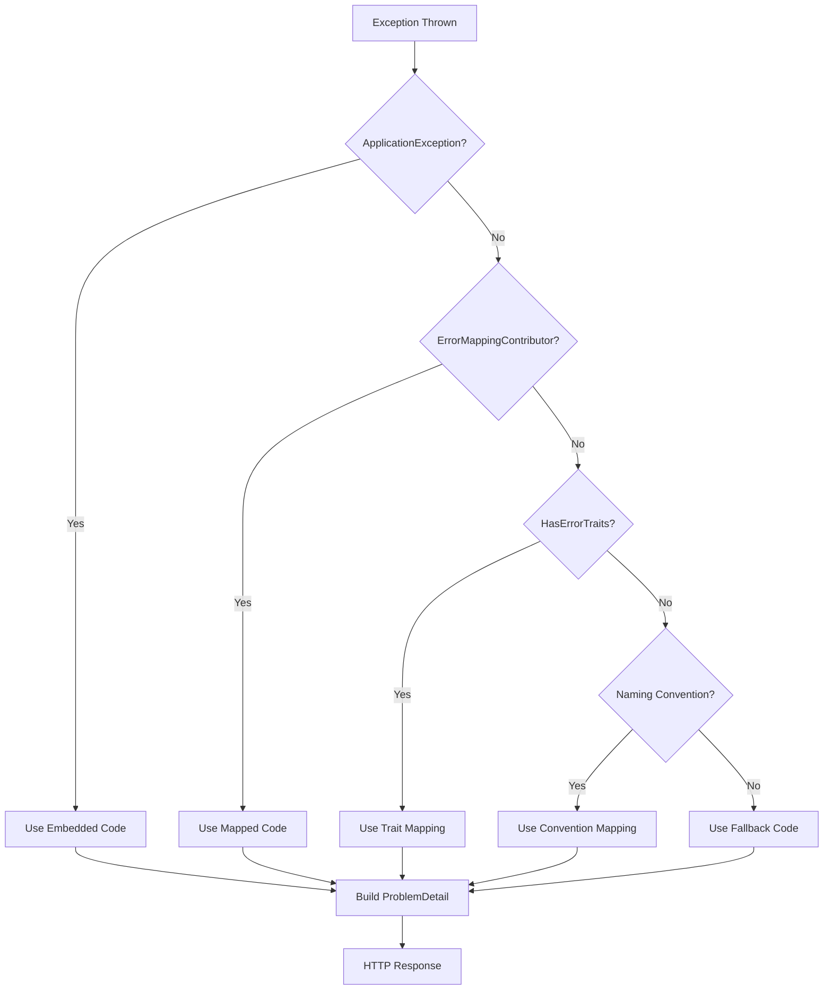

# Design Document

## Overview

The Patra Error Handling System implements a comprehensive, layered approach to exception handling across the microservices platform. The design follows hexagonal architecture principles with clean separation between domain logic and technical concerns, providing unified error handling through Spring Boot starters while maintaining zero-configuration defaults.

The system consists of four main components:
1. **patra-common**: Framework-agnostic error abstractions and contracts
2. **patra-spring-boot-starter-core**: Configuration and SPI framework
3. **patra-spring-boot-starter-web**: REST API error handling with RFC 7807 ProblemDetail
4. **patra-spring-cloud-starter-feign**: Feign client error decoding and handling

## Architecture

### System Architecture Diagram



### Error Resolution Flow



## Components and Interfaces

### 1. patra-common Module

**Core Interfaces and Classes:**

```java
// Error code contract
public interface ErrorCodeLike {
    String code();
}

// Base domain exception (no framework dependencies)
public abstract class DomainException extends RuntimeException {
    protected DomainException(String message) { super(message); }
    protected DomainException(String message, Throwable cause) { super(message, cause); }
}

// Application layer exception with error code
public class ApplicationException extends RuntimeException {
    private final ErrorCodeLike errorCode;
    
    public ApplicationException(ErrorCodeLike errorCode, String message) {
        super(message);
        this.errorCode = errorCode;
    }
    
    public ErrorCodeLike getErrorCode() { return errorCode; }
}

// Error trait system for semantic classification
public enum ErrorTrait {
    NOT_FOUND, CONFLICT, RULE_VIOLATION, QUOTA_EXCEEDED, 
    UNAUTHORIZED, FORBIDDEN, TIMEOUT, DEP_UNAVAILABLE
}

public interface HasErrorTraits {
    Set<ErrorTrait> getErrorTraits();
}

// ProblemDetail extension field constants
public final class ErrorKeys {
    public static final String CODE = "code";
    public static final String TRACE_ID = "traceId";
    public static final String PATH = "path";
    public static final String TIMESTAMP = "timestamp";
    public static final String ERRORS = "errors";
}
```

**Package Structure:**
```
com.patra.common/
├── error/
│   ├── codes/ErrorCodeLike
│   └── trait/ErrorTrait, HasErrorTraits
├── exception/DomainException, ApplicationException
└── problem/ErrorKeys
```

### 2. patra-spring-boot-starter-core Module

**Configuration Properties:**

```java
@ConfigurationProperties(prefix = "patra.error")
public class ErrorProperties {
    private boolean enabled = true;
    private String contextPrefix; // Required: REG, ORD, INV, etc.
    private MapStatusProperties mapStatus = new MapStatusProperties();
    
    public static class MapStatusProperties {
        private String strategy = "suffix-heuristic";
    }
}

@ConfigurationProperties(prefix = "patra.tracing")
public class TracingProperties {
    private List<String> headerNames = List.of("traceId", "X-B3-TraceId", "traceparent");
}
```

**SPI Interfaces:**

```java
// HTTP status mapping strategy (returns int to avoid spring-web dependency in core)
public interface StatusMappingStrategy {
    int mapToHttpStatus(ErrorCodeLike errorCode, Throwable exception);
}

// Trace ID provider
public interface TraceProvider {
    Optional<String> getCurrentTraceId();
}

// Custom field contributor (core - no web dependencies)
public interface ProblemFieldContributor {
    void contribute(Map<String, Object> fields, Throwable exception);
}

// Fine-grained error mapping
public interface ErrorMappingContributor {
    Optional<ErrorCodeLike> mapException(Throwable exception);
}
```

**Default Implementations:**

```java
// MDC-based trace provider (no web dependencies)
public class MdcTraceProvider implements TraceProvider {
    
    @Override
    public Optional<String> getCurrentTraceId() {
        String traceId = MDC.get("traceId");
        if (traceId != null && !traceId.isEmpty()) {
            return Optional.of(traceId);
        }
        
        // Try other common MDC keys
        traceId = MDC.get("X-B3-TraceId");
        if (traceId != null && !traceId.isEmpty()) {
            return Optional.of(traceId);
        }
        
        return Optional.empty();
    }
}
```

**Auto Configuration:**

```java
@Configuration
@EnableConfigurationProperties({ErrorProperties.class, TracingProperties.class})
@ConditionalOnProperty(prefix = "patra.error", name = "enabled", havingValue = "true", matchIfMissing = true)
public class CoreErrorAutoConfiguration {
    
    @Bean
    @ConditionalOnMissingBean
    public StatusMappingStrategy defaultStatusMappingStrategy() {
        return new SuffixHeuristicStatusMappingStrategy();
    }
    
    @Bean
    @ConditionalOnMissingBean
    public TraceProvider defaultTraceProvider() {
        return new MdcTraceProvider();
    }
    
    @Bean
    public ErrorResolutionService errorResolutionService(
            ErrorProperties properties,
            StatusMappingStrategy statusMappingStrategy,
            List<ErrorMappingContributor> mappingContributors) {
        return new ErrorResolutionService(properties, statusMappingStrategy, mappingContributors);
    }
}
```

**Auto Configuration Registration:**
All starters MUST use `META-INF/spring/org.springframework.boot.autoconfigure.AutoConfiguration.imports` for Spring Boot 3 auto-configuration instead of deprecated `spring.factories`.

### 3. patra-spring-boot-starter-web Module

**Configuration Properties:**

```java
@ConfigurationProperties(prefix = "patra.web.problem")
public class WebErrorProperties {
    private boolean enabled = true;
    private String typeBaseUrl = "https://errors.example.com/";
    private boolean includeStack = false;
}
```

**Web-Specific SPI:**

```java
// Web-specific field contributor with HttpServletRequest access
public interface WebProblemFieldContributor {
    void contribute(Map<String, Object> fields, Throwable exception, HttpServletRequest request);
}

// Validation errors formatter with masking
public interface ValidationErrorsFormatter {
    List<ValidationError> formatWithMasking(BindingResult bindingResult);
}

// Validation error data structure
public record ValidationError(
    String field,
    Object rejectedValue, // Will be masked for sensitive fields
    String message
) {}

// Error resolution data structure
public record ErrorResolution(
    ErrorCodeLike errorCode,
    int httpStatus
) {}
```

**Global Exception Handler:**

```java
@RestControllerAdvice
@Order(Ordered.HIGHEST_PRECEDENCE)
@Slf4j
public class GlobalRestExceptionHandler extends ResponseEntityExceptionHandler {
    
    private final ErrorResolutionService errorResolutionService;
    private final ProblemDetailBuilder problemDetailBuilder;
    
    @ExceptionHandler(Exception.class)
    public ResponseEntity<ProblemDetail> handleException(
            Exception ex, HttpServletRequest request) {
        
        log.debug("Handling exception: {}", ex.getClass().getSimpleName(), ex);
        
        ErrorResolution resolution = errorResolutionService.resolve(ex);
        ProblemDetail problemDetail = problemDetailBuilder.build(resolution, ex, request);
        
        // Convert int status to HttpStatus with fallback to 500
        HttpStatus httpStatus = convertToHttpStatus(resolution.getHttpStatus());
        
        return ResponseEntity
            .status(httpStatus)
            .contentType(MediaType.APPLICATION_PROBLEM_JSON)
            .body(problemDetail);
    }
    
    @ExceptionHandler(MethodArgumentNotValidException.class)
    public ResponseEntity<ProblemDetail> handleValidationException(
            MethodArgumentNotValidException ex, HttpServletRequest request) {
        
        ErrorResolution resolution = errorResolutionService.resolve(ex);
        ProblemDetail problemDetail = problemDetailBuilder.build(resolution, ex, request);
        
        // Add validation errors array with sensitive data masking
        List<ValidationError> errors = validationErrorsFormatter.formatWithMasking(ex.getBindingResult());
        // Limit errors array size to prevent oversized responses
        if (errors.size() > 100) {
            errors = errors.subList(0, 100);
        }
        problemDetail.setProperty(ErrorKeys.ERRORS, errors);
        
        return ResponseEntity
            .status(HttpStatus.UNPROCESSABLE_ENTITY)
            .contentType(MediaType.APPLICATION_PROBLEM_JSON)
            .body(problemDetail);
    }
    
    // Note: Data layer exceptions (DuplicateKeyException, DataIntegrityViolationException, 
    // OptimisticLockingFailureException) are handled through ErrorMappingContributor 
    // to maintain consistency with the error resolution algorithm
    
    private HttpStatus convertToHttpStatus(int status) {
        try {
            return HttpStatus.valueOf(status);
        } catch (IllegalArgumentException e) {
            log.warn("Invalid HTTP status code: {}, falling back to 500", status);
            return HttpStatus.INTERNAL_SERVER_ERROR;
        }
    }
}
```

**ProblemDetail Builder:**

```java
@Component
public class ProblemDetailBuilder {
    
    private final ErrorProperties errorProperties;
    private final WebErrorProperties webProperties;
    private final TraceProvider traceProvider;
    private final List<ProblemFieldContributor> fieldContributors;
    
    public ProblemDetail build(ErrorResolution resolution, Throwable ex, HttpServletRequest request) {
        // Convert int status to HttpStatus for ProblemDetail creation
        HttpStatus httpStatus = convertToHttpStatus(resolution.httpStatus());
        ProblemDetail problemDetail = ProblemDetail.forStatus(httpStatus);
        
        // Standard fields
        problemDetail.setType(buildTypeUri(resolution.getErrorCode()));
        problemDetail.setTitle(resolution.getErrorCode().code());
        problemDetail.setDetail(maskSensitiveData(ex.getMessage()));
        
        // Extension fields
        problemDetail.setProperty(ErrorKeys.CODE, resolution.getErrorCode().code());
        problemDetail.setProperty(ErrorKeys.PATH, extractPath(request));
        problemDetail.setProperty(ErrorKeys.TIMESTAMP, Instant.now().atOffset(ZoneOffset.UTC).toString());
        
        traceProvider.getCurrentTraceId()
            .ifPresent(traceId -> problemDetail.setProperty(ErrorKeys.TRACE_ID, traceId));
        
        // Core field contributors (no request dependency)
        Map<String, Object> coreFields = new HashMap<>();
        coreFieldContributors.forEach(contributor -> 
            contributor.contribute(coreFields, ex));
        coreFields.forEach(problemDetail::setProperty);
        
        // Web-specific field contributors (with request access)
        Map<String, Object> webFields = new HashMap<>();
        webFieldContributors.forEach(contributor -> 
            contributor.contribute(webFields, ex, request));
        webFields.forEach(problemDetail::setProperty);
        
        return problemDetail;
    }
    
    private String extractPath(HttpServletRequest request) {
        // Priority: Standard Forwarded header > X-Forwarded-* > requestURI
        String forwarded = request.getHeader("Forwarded");
        if (forwarded != null && !forwarded.isEmpty()) {
            // Parse standard Forwarded header for path/uri
            String path = parseForwardedPath(forwarded);
            if (path != null) return path;
        }
        
        String forwardedPath = request.getHeader("X-Forwarded-Path");
        if (forwardedPath != null && !forwardedPath.isEmpty()) {
            return forwardedPath;
        }
        
        String forwardedUri = request.getHeader("X-Forwarded-Uri");
        if (forwardedUri != null && !forwardedUri.isEmpty()) {
            return forwardedUri;
        }
        
        return request.getRequestURI();
    }
    
    private String parseForwardedPath(String forwarded) {
        // Simple parsing for path from Forwarded header
        // Format: for=...; proto=...; host=...; path=...
        String[] parts = forwarded.split(";");
        for (String part : parts) {
            String trimmed = part.trim();
            if (trimmed.startsWith("path=")) {
                return trimmed.substring(5).replaceAll("^\"|\"$", "");
            }
        }
        return null;
    }
    
    private HttpStatus convertToHttpStatus(int status) {
        try {
            return HttpStatus.valueOf(status);
        } catch (IllegalArgumentException e) {
            log.warn("Invalid HTTP status code: {}, falling back to 500", status);
            return HttpStatus.INTERNAL_SERVER_ERROR;
        }
    }
    
    private String maskSensitiveData(String message) {
        if (message == null) return null;
        
        // Mask common sensitive patterns
        return message
            .replaceAll("(?i)(password|token|secret|key)=[^\\s,}]+", "$1=***")
            .replaceAll("(?i)(password|token|secret|key)\":\\s*\"[^\"]+\"", "$1\":\"***\"");
    }
    
    private URI buildTypeUri(ErrorCodeLike errorCode) {
        String baseUrl = webProperties.getTypeBaseUrl();
        return URI.create(baseUrl + "/" + errorCode.code().toLowerCase());
    }
}
```

### 4. patra-spring-cloud-starter-feign Module

**Error Decoder:**

```java
public class ProblemDetailErrorDecoder implements ErrorDecoder {
    
    private final ObjectMapper objectMapper;
    private final FeignErrorProperties properties;
    
    @Override
    public Exception decode(String methodKey, Response response) {
        try {
            if (isProblemDetailResponse(response)) {
                ProblemDetail problemDetail = parseProblemDetailSafely(response);
                if (problemDetail != null) {
                    return new RemoteCallException(problemDetail, methodKey);
                }
            }
            
            if (properties.isTolerant()) {
                // Handle 404, empty body, non-JSON gracefully
                String reason = response.reason();
                if (reason == null || reason.isEmpty()) {
                    reason = "HTTP " + response.status();
                }
                
                return new RemoteCallException(
                    response.status(), 
                    reason, 
                    methodKey,
                    extractTraceId(response)
                );
            } else {
                return FeignException.errorStatus(methodKey, response);
            }
        } catch (Exception e) {
            log.warn("Failed to decode error response for {}: {}", methodKey, e.getMessage());
            
            if (properties.isTolerant()) {
                return new RemoteCallException(
                    response.status(), 
                    "Decode failed: " + e.getMessage(), 
                    methodKey, 
                    null
                );
            } else {
                return FeignException.errorStatus(methodKey, response);
            }
        }
    }
    
    private ProblemDetail parseProblemDetailSafely(Response response) {
        try {
            if (response.body() == null) {
                return null;
            }
            
            String body = Util.toString(response.body().asReader(StandardCharsets.UTF_8));
            if (body == null || body.trim().isEmpty()) {
                return null;
            }
            
            return objectMapper.readValue(body, ProblemDetail.class);
        } catch (Exception e) {
            log.debug("Failed to parse ProblemDetail: {}", e.getMessage());
            return null;
        }
    }
    
    private boolean isProblemDetailResponse(Response response) {
        Collection<String> contentTypes = response.headers().get("content-type");
        if (contentTypes == null) {
            contentTypes = response.headers().get("Content-Type");
        }
        
        return contentTypes != null && contentTypes.stream()
            .anyMatch(ct -> ct.toLowerCase().contains("application/problem+json"));
    }
    
    private String extractTraceId(Response response) {
        // Try common trace headers
        String[] traceHeaders = {"traceId", "X-B3-TraceId", "traceparent"};
        for (String header : traceHeaders) {
            Collection<String> values = response.headers().get(header);
            if (values != null && !values.isEmpty()) {
                return values.iterator().next();
            }
        }
        return null;
    }
}
```

**Remote Call Exception:**

```java
public class RemoteCallException extends RuntimeException {
    
    private final String errorCode;
    private final int httpStatus;
    private final String methodKey;
    private final String traceId;
    private final Map<String, Object> extensions;
    
    // Constructors for different scenarios
    public RemoteCallException(ProblemDetail problemDetail, String methodKey) {
        super(problemDetail.getDetail());
        this.errorCode = (String) problemDetail.getProperties().get(ErrorKeys.CODE);
        this.httpStatus = problemDetail.getStatus();
        this.methodKey = methodKey;
        this.traceId = (String) problemDetail.getProperties().get(ErrorKeys.TRACE_ID);
        this.extensions = new HashMap<>(problemDetail.getProperties());
    }
    
    public RemoteCallException(int httpStatus, String message, String methodKey, String traceId) {
        super(message);
        this.errorCode = null;
        this.httpStatus = httpStatus;
        this.methodKey = methodKey;
        this.traceId = traceId;
        this.extensions = Collections.emptyMap();
    }
    
    // Getters...
}
```

**Remote Error Helper:**

```java
public final class RemoteErrorHelper {
    
    private RemoteErrorHelper() {
        // Utility class
    }
    
    public static boolean isNotFound(RemoteCallException ex) {
        return ex.getHttpStatus() == 404 || 
               (ex.getErrorCode() != null && ex.getErrorCode().endsWith("-0404"));
    }
    
    public static boolean isConflict(RemoteCallException ex) {
        return ex.getHttpStatus() == 409 || 
               (ex.getErrorCode() != null && ex.getErrorCode().endsWith("-0409"));
    }
    
    public static boolean isClientError(RemoteCallException ex) {
        return ex.getHttpStatus() >= 400 && ex.getHttpStatus() < 500;
    }
    
    public static boolean is(RemoteCallException ex, String errorCode) {
        return errorCode.equals(ex.getErrorCode());
    }
    
    public static boolean hasErrorCode(RemoteCallException ex) {
        return ex.getErrorCode() != null && !ex.getErrorCode().isEmpty();
    }
}
```

## Data Models

### Registry Domain Exception Hierarchy

The Registry service has implemented a comprehensive domain exception hierarchy that maps directly to the error code catalog.

**Location**: `patra-registry/patra-registry-domain/src/main/java/com/patra/registry/domain/exception/`

```java
// Base semantic exceptions
public abstract class RegistryException extends DomainException {
    protected RegistryException(String message) { super(message); }
    protected RegistryException(String message, Throwable cause) { super(message, cause); }
}

public abstract class RegistryNotFound extends RegistryException implements HasErrorTraits {
    protected RegistryNotFound(String message) { super(message); }
    protected RegistryNotFound(String message, Throwable cause) { super(message, cause); }
    
    @Override
    public Set<ErrorTrait> getErrorTraits() {
        return Set.of(ErrorTrait.NOT_FOUND);
    }
}

public abstract class RegistryConflict extends RegistryException implements HasErrorTraits {
    protected RegistryConflict(String message) { super(message); }
    protected RegistryConflict(String message, Throwable cause) { super(message, cause); }
    
    @Override
    public Set<ErrorTrait> getErrorTraits() {
        return Set.of(ErrorTrait.CONFLICT);
    }
}

public abstract class RegistryRuleViolation extends RegistryException implements HasErrorTraits {
    protected RegistryRuleViolation(String message) { super(message); }
    protected RegistryRuleViolation(String message, Throwable cause) { super(message, cause); }
    
    @Override
    public Set<ErrorTrait> getErrorTraits() {
        return Set.of(ErrorTrait.RULE_VIOLATION);
    }
}

// Concrete domain exceptions - Dictionary operations
public class DictionaryNotFoundException extends RegistryNotFound {
    private final String typeCode;
    private final String itemCode;
    
    // For dictionary type not found
    public DictionaryNotFoundException(String typeCode) {
        super(String.format("Dictionary type not found: %s", typeCode));
        this.typeCode = typeCode;
        this.itemCode = null;
    }
    
    // For dictionary item not found
    public DictionaryNotFoundException(String typeCode, String itemCode) {
        super(String.format("Dictionary item not found: typeCode=%s, itemCode=%s", typeCode, itemCode));
        this.typeCode = typeCode;
        this.itemCode = itemCode;
    }
    
    public String getTypeCode() { return typeCode; }
    public String getItemCode() { return itemCode; }
}

public class DictionaryItemDisabled extends RegistryRuleViolation {
    private final String typeCode;
    private final String itemCode;
    
    public DictionaryItemDisabled(String typeCode, String itemCode) {
        super(String.format("Dictionary item is disabled: typeCode=%s, itemCode=%s", typeCode, itemCode));
        this.typeCode = typeCode;
        this.itemCode = itemCode;
    }
    
    public String getTypeCode() { return typeCode; }
    public String getItemCode() { return itemCode; }
}

public class DictionaryTypeAlreadyExists extends RegistryConflict {
    private final String typeCode;
    
    public DictionaryTypeAlreadyExists(String typeCode) {
        super(String.format("Dictionary type already exists: %s", typeCode));
        this.typeCode = typeCode;
    }
    
    public String getTypeCode() { return typeCode; }
}

public class DictionaryItemAlreadyExists extends RegistryConflict {
    // Implementation details...
}

public class DictionaryTypeDisabled extends RegistryRuleViolation {
    // Implementation details...
}

public class DictionaryValidationException extends RegistryRuleViolation {
    // Implementation details...
}

public class DictionaryDefaultItemMissing extends RegistryRuleViolation {
    // Implementation details...
}

public class DictionaryRepositoryException extends RegistryException {
    // Implementation details...
}

// Registry general exceptions
public class RegistryQuotaExceeded extends RegistryException implements HasErrorTraits {
    @Override
    public Set<ErrorTrait> getErrorTraits() {
        return Set.of(ErrorTrait.QUOTA_EXCEEDED);
    }
}
```

**Exception to Error Code Mapping:**
- `DictionaryNotFoundException` (type) → `REG-1401`
- `DictionaryNotFoundException` (item) → `REG-1402`
- `DictionaryItemDisabled` → `REG-1403`
- `DictionaryTypeAlreadyExists` → `REG-1404`
- `DictionaryItemAlreadyExists` → `REG-1405`
- `DictionaryTypeDisabled` → `REG-1406`
- `DictionaryValidationException` → `REG-1407`
- `DictionaryDefaultItemMissing` → `REG-1408`
- `DictionaryRepositoryException` → `REG-1409`
- `RegistryQuotaExceeded` → `REG-1501`

### Registry Error Code Catalog

The Registry service error code catalog has been implemented in `patra-registry-api` module with comprehensive error codes that map directly to existing domain exceptions.

**Location**: `patra-registry/patra-registry-api/src/main/java/com/patra/registry/api/error/RegistryErrorCode.java`

```java
public enum RegistryErrorCode implements ErrorCodeLike {
    
    // Common HTTP-aligned codes (0xxx series)
    REG_0400("REG-0400"), // Bad Request
    REG_0401("REG-0401"), // Unauthorized
    REG_0403("REG-0403"), // Forbidden
    REG_0404("REG-0404"), // Not Found
    REG_0409("REG-0409"), // Conflict
    REG_0422("REG-0422"), // Unprocessable Entity
    REG_0429("REG-0429"), // Too Many Requests
    REG_0500("REG-0500"), // Internal Server Error
    REG_0503("REG-0503"), // Service Unavailable
    REG_0504("REG-0504"), // Gateway Timeout
    
    // Business-specific codes (1xxx series)
    // Dictionary operations (14xx series)
    REG_1401("REG-1401"), // Dictionary Type Not Found → DictionaryNotFoundException
    REG_1402("REG-1402"), // Dictionary Item Not Found → DictionaryNotFoundException
    REG_1403("REG-1403"), // Dictionary Item Disabled → DictionaryItemDisabled
    REG_1404("REG-1404"), // Dictionary Type Already Exists → DictionaryTypeAlreadyExists
    REG_1405("REG-1405"), // Dictionary Item Already Exists → DictionaryItemAlreadyExists
    REG_1406("REG-1406"), // Dictionary Type Disabled → DictionaryTypeDisabled
    REG_1407("REG-1407"), // Dictionary Validation Error → DictionaryValidationException
    REG_1408("REG-1408"), // Dictionary Default Item Missing → DictionaryDefaultItemMissing
    REG_1409("REG-1409"), // Dictionary Repository Error → DictionaryRepositoryException
    
    // Registry general operations (15xx series)
    REG_1501("REG-1501"); // Registry Quota Exceeded → RegistryQuotaExceeded
    
    private final String code;
    
    RegistryErrorCode(String code) {
        this.code = code;
    }
    
    @Override
    public String code() {
        return code;
    }
    
    @Override
    public String toString() {
        return code;
    }
}
```

**Key Features:**
- **Domain Exception Mapping**: Each error code maps directly to existing Registry domain exceptions
- **Append-Only Policy**: New codes can be added but existing codes cannot be modified or removed
- **Comprehensive Documentation**: Complete error catalog with usage examples in `ERROR_CODE_CATALOG.md`
- **Package Documentation**: Detailed package-level documentation in `package-info.java`

**Error Code Categories:**
- **0xxx Series**: HTTP-aligned codes for common scenarios (REG-0400 to REG-0504)
- **14xx Series**: Dictionary operations (REG-1401 to REG-1409)
- **15xx Series**: Registry general operations (REG-1501)

**Documentation Files:**
- `ERROR_CODE_CATALOG.md`: Comprehensive error code reference with examples
- `package-info.java`: Package-level documentation
- `README.md`: Module usage guide and quick reference

## Error Handling

### Error Resolution Algorithm Implementation

```java
@Service
public class ErrorResolutionService {
    
    private final ErrorProperties properties;
    private final StatusMappingStrategy statusMappingStrategy;
    private final List<ErrorMappingContributor> mappingContributors;
    
    private final ConcurrentHashMap<Class<?>, ErrorResolution> resolutionCache = new ConcurrentHashMap<>();
    
    public ErrorResolution resolve(Throwable exception) {
        // Check cache first for performance
        Class<?> exceptionClass = exception.getClass();
        ErrorResolution cached = resolutionCache.get(exceptionClass);
        if (cached != null) {
            return cached;
        }
        
        // Resolve with cause chain traversal (max 10 levels)
        ErrorResolution resolution = resolveWithCauseChain(exception, 0);
        
        // Cache the resolution for this exception class
        resolutionCache.put(exceptionClass, resolution);
        
        return resolution;
    }
    
    private ErrorResolution resolveWithCauseChain(Throwable exception, int depth) {
        if (depth > 10) {
            return new ErrorResolution(createCode("0500"), 500);
        }
        
        // Fixed priority order - later cannot override earlier
        
        // 1. ApplicationException - highest priority
        if (exception instanceof ApplicationException appEx) {
            ErrorCodeLike code = appEx.getErrorCode();
            int status = statusMappingStrategy.mapToHttpStatus(code, exception);
            return new ErrorResolution(code, status);
        }
        
        // 2. ErrorMappingContributor - explicit overrides
        for (ErrorMappingContributor contributor : mappingContributors) {
            Optional<ErrorCodeLike> mapped = contributor.mapException(exception);
            if (mapped.isPresent()) {
                ErrorCodeLike code = mapped.get();
                int status = statusMappingStrategy.mapToHttpStatus(code, exception);
                return new ErrorResolution(code, status);
            }
        }
        
        // 3. HasErrorTraits - semantic classification
        if (exception instanceof HasErrorTraits traitsEx) {
            Set<ErrorTrait> traits = traitsEx.getErrorTraits();
            ErrorCodeLike code = mapTraitsToCode(traits);
            int status = mapTraitsToStatus(traits);
            return new ErrorResolution(code, status);
        }
        
        // 4. Naming convention heuristics
        String className = exception.getClass().getSimpleName();
        if (className.endsWith("NotFound")) {
            return new ErrorResolution(createCode("0404"), 404);
        } else if (className.endsWith("Conflict") || className.endsWith("AlreadyExists")) {
            return new ErrorResolution(createCode("0409"), 409);
        } else if (className.endsWith("Invalid") || className.endsWith("Validation")) {
            return new ErrorResolution(createCode("0422"), 422);
        } else if (className.endsWith("QuotaExceeded")) {
            return new ErrorResolution(createCode("0429"), 429);
        } else if (className.endsWith("Unauthorized")) {
            return new ErrorResolution(createCode("0401"), 401);
        } else if (className.endsWith("Forbidden")) {
            return new ErrorResolution(createCode("0403"), 403);
        } else if (className.endsWith("Timeout")) {
            return new ErrorResolution(createCode("0504"), 504);
        }
        
        // Try cause chain if current exception doesn't match
        Throwable cause = exception.getCause();
        if (cause != null && cause != exception) {
            return resolveWithCauseChain(cause, depth + 1);
        }
        
        // 5. Final fallback
        if (isClientError(exception)) {
            return new ErrorResolution(createCode("0422"), 422);
        } else {
            return new ErrorResolution(createCode("0500"), 500);
        }
    }
    
    private ErrorCodeLike createCode(String suffix) {
        return () -> properties.getContextPrefix() + "-" + suffix;
    }
}
```

## Testing Strategy

### Unit Testing Approach

1. **Domain Exception Tests**: Verify each domain exception carries correct traits and messages
2. **Error Resolution Tests**: Test the complete resolution algorithm with various exception types
3. **ProblemDetail Builder Tests**: Verify correct ProblemDetail structure and extension fields
4. **Feign Error Decoder Tests**: Test decoding of various ProblemDetail responses
5. **Configuration Tests**: Verify auto-configuration behavior with different properties

### Integration Testing Approach

1. **Web Integration Tests**: End-to-end REST API error handling with actual HTTP responses
2. **Feign Integration Tests**: Test Feign client error handling with mock downstream services
3. **Cross-Service Tests**: Verify error propagation between services through Feign calls

### Test Data Strategy

- Use TestContainers for integration tests requiring full Spring context
- Mock external dependencies for unit tests
- Provide test fixtures for common ProblemDetail scenarios
- Use @MockBean for SPI implementations in integration tests

**Data Layer Error Mapping Example:**

```java
// In boot module - maps data layer exceptions through unified channel
@Component
public class DataLayerErrorMappingContributor implements ErrorMappingContributor {
    
    private final ErrorProperties errorProperties;
    
    @Override
    public Optional<ErrorCodeLike> mapException(Throwable exception) {
        String contextPrefix = errorProperties.getContextPrefix();
        
        if (exception instanceof DuplicateKeyException || 
            exception instanceof DataIntegrityViolationException) {
            return Optional.of(() -> contextPrefix + "-0409");
        }
        
        if (exception instanceof OptimisticLockingFailureException) {
            return Optional.of(() -> contextPrefix + "-0409");
        }
        
        return Optional.empty();
    }
}
```

## Registry Error Code Implementation

### Implementation Status

The Registry error code catalog has been fully implemented and integrated with existing domain exceptions. The implementation follows the append-only principle and provides comprehensive documentation.

### File Structure

```
patra-registry-api/
├── src/main/java/com/patra/registry/api/error/
│   ├── RegistryErrorCode.java          # Main error code enum
│   └── package-info.java               # Package documentation
├── ERROR_CODE_CATALOG.md               # Comprehensive error reference
└── README.md                           # Module usage guide
```

### Error Code Mapping Strategy

The error codes are designed to map directly to existing Registry domain exceptions:

```java
// Example mapping in ErrorMappingContributor
public class RegistryErrorMappingContributor implements ErrorMappingContributor {
    
    @Override
    public Optional<ErrorCodeLike> mapException(Throwable exception) {
        return switch (exception) {
            case DictionaryNotFoundException dnf when dnf.getItemCode() == null -> 
                Optional.of(RegistryErrorCode.REG_1401);
            case DictionaryNotFoundException dnf when dnf.getItemCode() != null -> 
                Optional.of(RegistryErrorCode.REG_1402);
            case DictionaryItemDisabled did -> 
                Optional.of(RegistryErrorCode.REG_1403);
            case DictionaryTypeAlreadyExists dtae -> 
                Optional.of(RegistryErrorCode.REG_1404);
            case DictionaryItemAlreadyExists diae -> 
                Optional.of(RegistryErrorCode.REG_1405);
            case DictionaryTypeDisabled dtd -> 
                Optional.of(RegistryErrorCode.REG_1406);
            case DictionaryValidationException dve -> 
                Optional.of(RegistryErrorCode.REG_1407);
            case DictionaryDefaultItemMissing ddim -> 
                Optional.of(RegistryErrorCode.REG_1408);
            case DictionaryRepositoryException dre -> 
                Optional.of(RegistryErrorCode.REG_1409);
            case RegistryQuotaExceeded rqe -> 
                Optional.of(RegistryErrorCode.REG_1501);
            default -> Optional.empty();
        };
    }
}
```

### Documentation Features

1. **Comprehensive Catalog**: `ERROR_CODE_CATALOG.md` provides complete reference with:
   - Error code format explanation
   - Category organization
   - Domain exception mapping table
   - Usage examples for Java and client-side handling
   - Integration guidelines

2. **Package Documentation**: `package-info.java` includes:
   - Error code format specification
   - Category descriptions
   - Append-only policy explanation

3. **Module Guide**: `README.md` provides:
   - Quick reference for developers
   - Usage examples
   - Domain exception mapping table
   - Append-only policy explanation

### Append-Only Management

The error catalog follows strict append-only principles:
- ✅ New error codes can be added
- ✅ Documentation can be enhanced
- ❌ Existing codes cannot be removed
- ❌ Existing code meanings cannot be changed
- ❌ Code strings cannot be modified

This ensures API stability and backward compatibility for all consumers.

## Implementation Constraints

### Architectural Boundaries

1. **Core Module Dependencies**: The `patra-spring-boot-starter-core` module MUST NOT depend on `spring-web`. All HTTP-related types (HttpStatus, HttpServletRequest) SHALL be confined to the web starter.

2. **ErrorMappingContributor Placement**: ErrorMappingContributor Bean implementations SHALL be placed in `boot` or `adapter-web` modules. The `app` layer SHALL only provide pure constant mappings for reuse.

3. **Exception Boundary Enforcement**: 
   - RemoteCallException MUST NOT cross adapter boundaries into app layer
   - ProblemDetail usage SHALL be limited to HTTP adapter layer only
   - App layer SHALL only work with domain exceptions and ApplicationException

4. **Layer Isolation**: Each layer SHALL maintain clean boundaries:
   - Domain: Only DomainException and business logic
   - App: ApplicationException with ErrorCodeLike, no HTTP concepts
   - Adapter: HTTP-specific exceptions and ProblemDetail handling

### Additional Implementation Requirements

5. **Spring Boot 3 Auto-Configuration**: All starters MUST use `META-INF/spring/org.springframework.boot.autoconfigure.AutoConfiguration.imports` instead of deprecated `spring.factories`.

6. **HTTP Status Boundary**: Core module returns int status codes only; web module converts to HttpStatus with 500 fallback for invalid codes.

7. **Exception Resolution Chain**: Follow Throwable#getCause() up to 10 levels with class-level caching for performance.

8. **Resolution Priority**: Fixed order (ApplicationException > ErrorMappingContributor > Traits > naming > fallback) - later cannot override earlier.

9. **Data Layer Exception Mapping**: Map DuplicateKeyException/DataIntegrityViolationException/OptimisticLockingFailureException to 409/422 instead of 500.

10. **Transaction Semantics**: Ensure @Transactional rollback behavior works correctly with ApplicationException and domain exceptions.

11. **Batch Processing**: Use partial success structure for batch APIs instead of single ProblemDetail failing entire batch.

12. **Sensitive Data Masking**: Mask passwords, tokens, secrets in ProblemDetail and validation errors (especially rejectedValue).

13. **Path Resolution**: Extract path from Forwarded/X-Forwarded-* headers with requestURI fallback for proxy-aware routing.

14. **Retry and Idempotency**: Document retry strategies for 409/503/504 with Idempotency-Key support.

15. **Timestamp Format**: Use UTC ISO-8601 format for all timestamp fields.

16. **Non-HTTP Channels**: Use independent error envelope {code, reason, occurredAt, traceId} for messaging/events aligned with REST codes.

17. **Jackson Consistency**: Standardize ObjectMapper configuration (WRITE_DATES_AS_TIMESTAMPS=false, FAIL_ON_UNKNOWN_PROPERTIES=false) across services.

18. **MVC Integration**: Extend ResponseEntityExceptionHandler with proper @Order to avoid conflicts with existing handlers.

19. **Validation Error Limits**: Limit errors array to 100 items and 1KB per item to prevent oversized responses.

20. **Type URL Accessibility**: Ensure type-base-url points to accessible documentation for troubleshooting.

21. **Feign Tolerant Mode**: Handle 404/empty body/non-JSON gracefully without NPE in tolerant mode.

### Batch Processing and Transaction Semantics

22. **Batch API Error Structure**: Batch operations SHALL return partial success structure with per-item error details instead of failing entire batch with single ProblemDetail:
```json
{
  "results": [
    {"id": "item1", "status": "success"},
    {"id": "item2", "status": "error", "code": "REG-1001", "detail": "Namespace already exists"}
  ],
  "summary": {"total": 2, "success": 1, "failed": 1}
}
```

23. **Transaction Rollback Rules**: @Transactional methods SHALL explicitly declare rollback behavior for ApplicationException and domain exceptions. Default behavior only rolls back on RuntimeException, so use `rollbackFor = {ApplicationException.class, DomainException.class}` when needed.

### Non-HTTP Channel Error Envelope

24. **Messaging/Event Error Format**: Non-HTTP channels (MQ, events) SHALL use standardized error envelope aligned with REST error codes:
```json
{
  "code": "REG-1001",
  "reason": "Namespace already exists: analytics", 
  "occurredAt": "2025-09-19T03:08:02.417Z",
  "traceId": "c9d2a6f4c7b9e21a",
  "context": {"operation": "createNamespace", "namespace": "analytics"}
}
```

### Jackson Configuration Consistency

25. **ObjectMapper Standardization**: All services MUST use consistent Jackson configuration:
```yaml
spring:
  jackson:
    write-dates-as-timestamps: false
    fail-on-unknown-properties: false
    default-property-inclusion: non_null
```

## Performance Considerations

### Caching Strategy
- Cache error code to HTTP status mappings to avoid repeated resolution
- Use ConcurrentHashMap for thread-safe caching of mapping results
- Implement cache warming for common exception types during startup

### Memory Management
- Use flyweight pattern for common ErrorCodeLike instances
- Avoid creating unnecessary exception instances in hot paths
- Implement object pooling for ProblemDetail builders if needed

### Monitoring and Observability
- Add metrics for error resolution performance
- Track error code distribution across services
- Monitor Feign error decoding success rates
- Implement circuit breakers for error mapping contributors