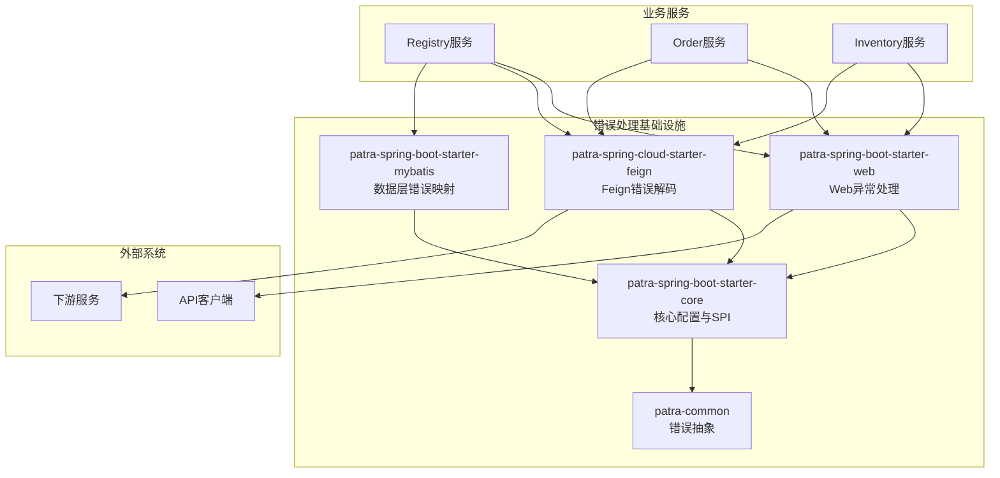

# Papertrace · Patra 错误处理系统文档体系总览

本目录汇集 Patra 错误处理系统相关的设计、配置与集成指南，已按"系统概览 → 快速开始 → 配置参考 → 集成指南 → 错误代码目录"的脉络组织，支持顺序阅读与交叉跳转。

## 导航（推荐阅读顺序）

### 1. 系统概览与架构
- **系统概览**：`overview/system-overview.md` - 错误处理系统整体架构与核心特性
- **设计原理**：`overview/design-principles.md` - 设计理念、架构决策与最佳实践

### 2. 快速开始
- **快速开始指南**：`getting-started/quick-start.md` - 5分钟快速集成指南
- **迁移指南**：`getting-started/migration-guide.md` - 从手动异常处理迁移的完整指南

### 3. 配置参考
- **配置参考手册**：`configuration/configuration-reference.md` - 所有配置属性的完整参考
- **环境配置示例**：`configuration/environment-examples.md` - 开发、测试、生产环境配置示例

### 4. 集成指南
- **Registry 服务集成**：`integration/registry-integration.md` - Registry 服务完整集成示例
- **Feign 客户端集成**：`integration/feign-client-integration.md` - 服务间调用错误处理
- **自定义扩展指南**：`integration/customization-guide.md` - SPI 接口与自定义实现

### 5. 错误代码目录
- **错误代码规范**：`error-codes/error-code-standards.md` - 错误代码设计规范与命名约定
- **错误代码目录**：`error-codes/error-code-catalog.md` - 全平台错误代码完整目录
- **Registry 错误代码**：`error-codes/registry-error-codes.md` - Registry 服务专用错误代码

### 6. 开发者指南
- **测试指南**：`developer/testing-guide.md` - 错误处理测试最佳实践
- **故障排除**：`developer/troubleshooting.md` - 常见问题与解决方案
- **性能优化**：`developer/performance-guide.md` - 性能优化建议

## 关系图（高层）

## 核心特性

- **零配置错误处理** - 开箱即用的默认配置
- **RFC 7807 ProblemDetail** - 标准化的REST API错误响应
- **自动Feign错误解码** - 服务间调用的类型化异常处理
- **分布式链路追踪** - 自动传播trace ID
- **全面的错误代码目录** - 语义化的错误代码体系
- **清洁架构兼容** - 符合领域驱动设计的分层架构

## 快速入口

### 新用户推荐路径
1. **系统概览** → `overview/system-overview.md`
2. **快速开始** → `getting-started/quick-start.md`
3. **Registry集成示例** → `integration/registry-integration.md`

### 迁移用户推荐路径
1. **迁移指南** → `getting-started/migration-guide.md`
2. **配置参考** → `configuration/configuration-reference.md`
3. **故障排除** → `developer/troubleshooting.md`

### 开发者推荐路径
1. **设计原理** → `overview/design-principles.md`
2. **自定义扩展** → `integration/customization-guide.md`
3. **测试指南** → `developer/testing-guide.md`

---

**提示**：各文档首页已统一"功能概述 + 使用示例 + 相关链接"；每个子域仅保留数篇高内聚长文，避免碎片化。建议按推荐路径顺序阅读，以获得最佳学习体验。