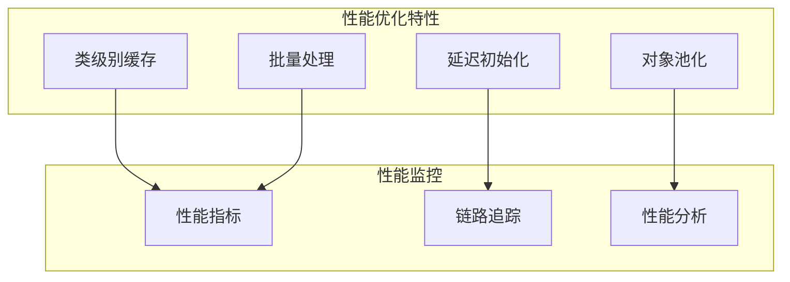

# 性能优化指南

Patra 错误处理系统的性能优化建议和最佳实践，确保在高并发环境下的高效运行。

## 目录

1. [性能概览](#性能概览)
2. [错误解析性能](#错误解析性能)
3. [响应构建性能](#响应构建性能)
4. [内存管理](#内存管理)
5. [网络性能](#网络性能)
6. [监控和调优](#监控和调优)
7. [性能测试](#性能测试)

## 性能概览

### 性能目标

| 指标 | 目标值 | 说明 |
|------|--------|------|
| 错误解析延迟 | < 1ms | 单次错误解析时间 |
| ProblemDetail构建 | < 2ms | 响应对象构建时间 |
| 内存开销 | < 10MB | 错误处理组件内存占用 |
| 缓存命中率 | > 95% | 错误解析缓存命中率 |
| GC影响 | < 1% | 垃圾回收时间占比 |

### 性能特性



## 错误解析性能

### 1. 缓存优化

#### 类级别缓存实现

```java
@Component
public class OptimizedErrorResolutionService {
    
    // 使用 Caffeine 缓存提供更好的性能
    private final Cache<Class<?>, ErrorResolution> resolutionCache;
    
    public OptimizedErrorResolutionService() {
        this.resolutionCache = Caffeine.newBuilder()
            .maximumSize(1000)                    // 限制缓存大小
            .expireAfterWrite(1, TimeUnit.HOURS)  // 1小时过期
            .recordStats()                        // 记录统计信息
            .build();
    }
    
    @Timed(name = "error.resolution.time", description = "Error resolution time")
    public ErrorResolution resolve(Throwable exception) {
        Class<?> exceptionClass = exception.getClass();
        
        // 从缓存获取，如果不存在则计算
        return resolutionCache.get(exceptionClass, key -> {
            return doResolve(exception);
        });
    }
    
    // 提供缓存统计信息
    @EventListener
    @Scheduled(fixedRate = 60000) // 每分钟记录一次
    public void recordCacheStats() {
        CacheStats stats = resolutionCache.stats();
        Metrics.gauge("error.cache.hit.rate", stats.hitRate());
        Metrics.gauge("error.cache.size", resolutionCache.estimatedSize());
        Metrics.gauge("error.cache.evictions", stats.evictionCount());
    }
}
```

#### 预热缓存

```java
@Component
public class ErrorCacheWarmer {
    
    private final ErrorResolutionService errorResolutionService;
    
    @EventListener(ApplicationReadyEvent.class)
    public void warmUpCache() {
        log.info("Warming up error resolution cache...");
        
        // 预热常见异常类型
        List<Class<? extends Exception>> commonExceptions = List.of(
            RuntimeException.class,
            IllegalArgumentException.class,
            NullPointerException.class,
            DictionaryNotFoundException.class,
            OrderNotFoundException.class
        );
        
        for (Class<? extends Exception> exceptionClass : commonExceptions) {
            try {
                Exception exception = exceptionClass.getDeclaredConstructor(String.class)
                    .newInstance("Cache warmup");
                errorResolutionService.resolve(exception);
            } catch (Exception e) {
                log.debug("Failed to warm up cache for {}: {}", exceptionClass.getSimpleName(), e.getMessage());
            }
        }
        
        log.info("Error resolution cache warmed up");
    }
}
```

### 2. 异常链遍历优化

```java
public class OptimizedCauseChainTraversal {
    
    private static final int MAX_CAUSE_DEPTH = 10;
    
    public Throwable findMostSpecificCause(Throwable exception) {
        Throwable current = exception;
        int depth = 0;
        
        // 限制遍历深度，避免无限循环
        while (current.getCause() != null && depth < MAX_CAUSE_DEPTH) {
            Throwable cause = current.getCause();
            
            // 如果找到更具体的异常类型，使用它
            if (isMoreSpecific(cause, current)) {
                current = cause;
            }
            
            depth++;
        }
        
        return current;
    }
    
    private boolean isMoreSpecific(Throwable cause, Throwable current) {
        // 领域异常比通用异常更具体
        if (cause instanceof DomainException && !(current instanceof DomainException)) {
            return true;
        }
        
        // 应用异常比运行时异常更具体
        if (cause instanceof ApplicationException && current instanceof RuntimeException) {
            return true;
        }
        
        return false;
    }
}
```

### 3. 错误映射贡献者优化

```java
@Component
@Order(1) // 高优先级，先执行
public class FastPathErrorMappingContributor implements ErrorMappingContributor {
    
    // 使用静态映射表提高查找速度
    private static final Map<Class<?>, ErrorCodeLike> FAST_MAPPINGS = Map.of(
        DictionaryNotFoundException.class, RegistryErrorCode.REG_1401,
        OrderNotFoundException.class, OrderErrorCode.ORD_1101,
        ProductNotFoundException.class, InventoryErrorCode.INV_2101
    );
    
    @Override
    public Optional<ErrorCodeLike> mapException(Throwable exception) {
        // 快速路径：直接查找映射表
        ErrorCodeLike errorCode = FAST_MAPPINGS.get(exception.getClass());
        if (errorCode != null) {
            return Optional.of(errorCode);
        }
        
        // 如果快速路径没有找到，返回空让其他贡献者处理
        return Optional.empty();
    }
}

@Component
@Order(2) // 较低优先级
public class ComplexErrorMappingContributor implements ErrorMappingContributor {
    
    @Override
    public Optional<ErrorCodeLike> mapException(Throwable exception) {
        // 复杂的映射逻辑，只有在快速路径失败时才执行
        if (exception instanceof BusinessException businessEx) {
            return mapBusinessException(businessEx);
        }
        
        return Optional.empty();
    }
    
    private Optional<ErrorCodeLike> mapBusinessException(BusinessException exception) {
        // 复杂的业务逻辑映射
        return Optional.empty();
    }
}
```

## 响应构建性能

### 1. ProblemDetail 构建优化

```java
@Component
public class OptimizedProblemDetailBuilder {
    
    // 使用对象池减少GC压力
    private final ObjectPool<ProblemDetail.Builder> builderPool;
    
    public OptimizedProblemDetailBuilder() {
        this.builderPool = new GenericObjectPool<>(new ProblemDetailBuilderFactory());
    }
    
    public ProblemDetail build(ErrorResolution resolution, HttpServletRequest request) {
        ProblemDetail.Builder builder = null;
        try {
            builder = builderPool.borrowObject();
            
            return builder
                .withStatus(resolution.httpStatus())
                .withTitle(resolution.errorCode().code())
                .withDetail(resolution.message())
                .withProperty("code", resolution.errorCode().code())
                .withProperty("traceId", extractTraceId(request))
                .withProperty("path", extractPath(request))
                .withProperty("timestamp", Instant.now())
                .build();
                
        } catch (Exception e) {
            throw new RuntimeException("Failed to build ProblemDetail", e);
        } finally {
            if (builder != null) {
                try {
                    builderPool.returnObject(builder);
                } catch (Exception e) {
                    log.warn("Failed to return builder to pool", e);
                }
            }
        }
    }
    
    // 缓存常用的字段提取结果
    private final Cache<String, String> pathCache = Caffeine.newBuilder()
        .maximumSize(100)
        .expireAfterWrite(5, TimeUnit.MINUTES)
        .build();
    
    private String extractPath(HttpServletRequest request) {
        String uri = request.getRequestURI();
        return pathCache.get(uri, key -> {
            // 复杂的路径提取逻辑
            return extractPathFromHeaders(request, uri);
        });
    }
}

// 对象池工厂
public class ProblemDetailBuilderFactory extends BasePooledObjectFactory<ProblemDetail.Builder> {
    
    @Override
    public ProblemDetail.Builder create() {
        return ProblemDetail.forStatus(HttpStatus.INTERNAL_SERVER_ERROR);
    }
    
    @Override
    public PooledObject<ProblemDetail.Builder> wrap(ProblemDetail.Builder builder) {
        return new DefaultPooledObject<>(builder);
    }
    
    @Override
    public void passivateObject(PooledObject<ProblemDetail.Builder> pooledObject) {
        // 重置构建器状态
        ProblemDetail.Builder builder = pooledObject.getObject();
        // 清理之前的状态
    }
}
```

### 2. 字段贡献者优化

```java
@Component
public class OptimizedFieldContributor implements ProblemFieldContributor {
    
    // 缓存静态信息
    private final String serviceName;
    private final String serviceVersion;
    private final String nodeId;
    
    public OptimizedFieldContributor(
            @Value("${spring.application.name}") String serviceName,
            @Value("${app.version:unknown}") String serviceVersion) {
        this.serviceName = serviceName;
        this.serviceVersion = serviceVersion;
        this.nodeId = initializeNodeId();
    }
    
    @Override
    public void contribute(Map<String, Object> fields, Throwable exception) {
        // 添加预计算的静态字段
        fields.put("service", serviceName);
        fields.put("version", serviceVersion);
        fields.put("node", nodeId);
        
        // 只在需要时添加动态字段
        if (exception instanceof BusinessException) {
            addBusinessFields(fields, (BusinessException) exception);
        }
    }
    
    private void addBusinessFields(Map<String, Object> fields, BusinessException exception) {
        // 使用 switch 表达式提高性能
        switch (exception) {
            case OrderException orderEx -> {
                fields.put("orderId", orderEx.getOrderId());
                fields.put("customerId", orderEx.getCustomerId());
            }
            case PaymentException paymentEx -> {
                fields.put("paymentId", paymentEx.getPaymentId());
                fields.put("amount", paymentEx.getAmount());
            }
            default -> {
                // 默认处理
            }
        }
    }
    
    private String initializeNodeId() {
        try {
            return InetAddress.getLocalHost().getHostName();
        } catch (Exception e) {
            return "unknown-" + System.currentTimeMillis();
        }
    }
}
```

### 3. JSON 序列化优化

```java
@Configuration
public class JsonOptimizationConfiguration {
    
    @Bean
    @Primary
    public ObjectMapper optimizedObjectMapper() {
        return JsonMapper.builder()
            .configure(SerializationFeature.WRITE_DATES_AS_TIMESTAMPS, false)
            .configure(DeserializationFeature.FAIL_ON_UNKNOWN_PROPERTIES, false)
            .configure(JsonGenerator.Feature.WRITE_NUMBERS_AS_STRINGS, false)
            .configure(JsonParser.Feature.ALLOW_UNQUOTED_FIELD_NAMES, false)
            // 启用性能优化特性
            .enable(JsonGenerator.Feature.USE_FAST_DOUBLE_WRITER)
            .enable(JsonParser.Feature.USE_FAST_DOUBLE_PARSER)
            .build();
    }
    
    @Bean
    public Jackson2ObjectMapperBuilder jackson2ObjectMapperBuilder() {
        return new Jackson2ObjectMapperBuilder()
            .serializers(new OptimizedProblemDetailSerializer())
            .deserializers(new OptimizedRemoteCallExceptionDeserializer());
    }
}

// 自定义序列化器
public class OptimizedProblemDetailSerializer extends JsonSerializer<ProblemDetail> {
    
    @Override
    public void serialize(ProblemDetail value, JsonGenerator gen, SerializerProvider serializers) 
            throws IOException {
        gen.writeStartObject();
        
        // 直接写入字段，避免反射
        gen.writeStringField("type", value.getType().toString());
        gen.writeStringField("title", value.getTitle());
        gen.writeNumberField("status", value.getStatus());
        gen.writeStringField("detail", value.getDetail());
        
        // 写入扩展属性
        Map<String, Object> properties = value.getProperties();
        if (properties != null) {
            for (Map.Entry<String, Object> entry : properties.entrySet()) {
                gen.writeObjectField(entry.getKey(), entry.getValue());
            }
        }
        
        gen.writeEndObject();
    }
}
```

## 内存管理

### 1. 内存使用优化

```java
@Component
public class MemoryOptimizedErrorHandler {
    
    // 使用弱引用缓存，允许GC回收
    private final Map<Class<?>, WeakReference<ErrorResolution>> weakCache = 
        new ConcurrentHashMap<>();
    
    // 限制验证错误数量，防止内存溢出
    private static final int MAX_VALIDATION_ERRORS = 50;
    
    public List<ValidationError> formatValidationErrors(BindingResult bindingResult) {
        return bindingResult.getFieldErrors().stream()
            .limit(MAX_VALIDATION_ERRORS)
            .map(this::createValidationError)
            .collect(Collectors.toList());
    }
    
    private ValidationError createValidationError(FieldError fieldError) {
        // 使用记录类减少内存占用
        return new ValidationError(
            fieldError.getField(),
            maskValue(fieldError.getRejectedValue()),
            fieldError.getDefaultMessage()
        );
    }
    
    private Object maskValue(Object value) {
        if (value == null) return null;
        
        // 限制字符串长度，防止大对象
        if (value instanceof String str && str.length() > 1000) {
            return str.substring(0, 997) + "...";
        }
        
        return value;
    }
}

// 使用记录类减少内存占用
public record ValidationError(
    String field,
    Object rejectedValue,
    String message
) {}
```

### 2. 垃圾回收优化

```java
@Configuration
public class GCOptimizationConfiguration {
    
    @Bean
    @ConditionalOnProperty(name = "patra.error.gc-optimization.enabled", havingValue = "true")
    public GCOptimizedErrorResolutionService gcOptimizedErrorResolutionService() {
        return new GCOptimizedErrorResolutionService();
    }
}

@Component
public class GCOptimizedErrorResolutionService {
    
    // 使用原始类型数组减少对象创建
    private final TIntObjectHashMap<ErrorResolution> resolutionCache = new TIntObjectHashMap<>();
    
    public ErrorResolution resolve(Throwable exception) {
        int classHash = exception.getClass().hashCode();
        
        ErrorResolution cached = resolutionCache.get(classHash);
        if (cached != null) {
            return cached;
        }
        
        ErrorResolution resolution = doResolve(exception);
        
        // 限制缓存大小，防止内存泄漏
        if (resolutionCache.size() < 1000) {
            resolutionCache.put(classHash, resolution);
        }
        
        return resolution;
    }
    
    // 定期清理缓存
    @Scheduled(fixedRate = 300000) // 5分钟
    public void cleanupCache() {
        if (resolutionCache.size() > 800) {
            resolutionCache.clear();
            log.debug("Cleared error resolution cache to prevent memory leak");
        }
    }
}
```

## 网络性能

### 1. HTTP 响应优化

```java
@Configuration
public class HttpOptimizationConfiguration {
    
    @Bean
    public FilterRegistrationBean<CompressionFilter> compressionFilter() {
        FilterRegistrationBean<CompressionFilter> registration = new FilterRegistrationBean<>();
        registration.setFilter(new CompressionFilter());
        registration.addUrlPatterns("/api/*");
        registration.setOrder(1);
        return registration;
    }
}

public class CompressionFilter implements Filter {
    
    @Override
    public void doFilter(ServletRequest request, ServletResponse response, FilterChain chain)
            throws IOException, ServletException {
        
        HttpServletRequest httpRequest = (HttpServletRequest) request;
        HttpServletResponse httpResponse = (HttpServletResponse) response;
        
        // 检查是否支持压缩
        String acceptEncoding = httpRequest.getHeader("Accept-Encoding");
        if (acceptEncoding != null && acceptEncoding.contains("gzip")) {
            // 对错误响应启用GZIP压缩
            if (httpRequest.getRequestURI().startsWith("/api/")) {
                httpResponse.setHeader("Content-Encoding", "gzip");
                response = new GzipResponseWrapper(httpResponse);
            }
        }
        
        chain.doFilter(request, response);
    }
}
```

### 2. Feign 客户端优化

```java
@Configuration
public class FeignOptimizationConfiguration {
    
    @Bean
    public Client feignClient() {
        return new OkHttpClient();
    }
    
    @Bean
    public Retryer feignRetryer() {
        return new Retryer.Default(100, 1000, 3);
    }
    
    @Bean
    public RequestInterceptor performanceRequestInterceptor() {
        return new PerformanceRequestInterceptor();
    }
}

public class PerformanceRequestInterceptor implements RequestInterceptor {
    
    @Override
    public void apply(RequestTemplate template) {
        // 添加性能相关的头
        template.header("Accept-Encoding", "gzip, deflate");
        template.header("Connection", "keep-alive");
        
        // 添加超时控制
        template.option(Request.Options.class, new Request.Options(
            5000,  // 连接超时
            10000  // 读取超时
        ));
    }
}
```

## 监控和调优

### 1. 性能指标监控

```java
@Component
public class ErrorHandlingMetrics {
    
    private final MeterRegistry meterRegistry;
    private final Timer errorResolutionTimer;
    private final Counter errorCounter;
    private final Gauge cacheHitRate;
    
    public ErrorHandlingMetrics(MeterRegistry meterRegistry) {
        this.meterRegistry = meterRegistry;
        this.errorResolutionTimer = Timer.builder("error.resolution.time")
            .description("Time taken to resolve errors")
            .register(meterRegistry);
        this.errorCounter = Counter.builder("error.total")
            .description("Total number of errors")
            .register(meterRegistry);
        this.cacheHitRate = Gauge.builder("error.cache.hit.rate")
            .description("Error resolution cache hit rate")
            .register(meterRegistry, this, ErrorHandlingMetrics::getCacheHitRate);
    }
    
    @EventListener
    public void onErrorResolution(ErrorResolutionEvent event) {
        Timer.Sample sample = Timer.start(meterRegistry);
        sample.stop(errorResolutionTimer);
        
        errorCounter.increment(
            Tags.of(
                "service", event.getServiceName(),
                "code", event.getErrorCode(),
                "status", String.valueOf(event.getHttpStatus())
            )
        );
    }
    
    private double getCacheHitRate() {
        // 从缓存统计中获取命中率
        return 0.95; // 示例值
    }
}
```

### 2. 性能分析

```java
@Component
@Profile("performance-analysis")
public class ErrorHandlingProfiler {
    
    private final Profiler profiler = new Profiler("ErrorHandling");
    
    @EventListener
    public void onApplicationReady(ApplicationReadyEvent event) {
        profiler.start("Application startup");
        // 性能分析逻辑
    }
    
    @Around("@annotation(Timed)")
    public Object profileMethod(ProceedingJoinPoint joinPoint) throws Throwable {
        String methodName = joinPoint.getSignature().getName();
        profiler.start(methodName);
        
        try {
            return joinPoint.proceed();
        } finally {
            profiler.stop();
        }
    }
    
    @PreDestroy
    public void printProfile() {
        log.info("Error handling performance profile:\n{}", profiler.stop());
    }
}
```

### 3. 自动调优

```java
@Component
public class AutoTuningErrorHandler {
    
    private volatile int cacheSize = 1000;
    private volatile long cacheExpireTime = 3600; // 秒
    
    @Scheduled(fixedRate = 60000) // 每分钟检查一次
    public void autoTune() {
        double hitRate = getCacheHitRate();
        double memoryUsage = getMemoryUsage();
        
        // 根据命中率调整缓存大小
        if (hitRate < 0.8 && memoryUsage < 0.7) {
            cacheSize = Math.min(cacheSize * 2, 5000);
            log.info("Increased cache size to {}", cacheSize);
        } else if (hitRate > 0.98 && memoryUsage > 0.8) {
            cacheSize = Math.max(cacheSize / 2, 500);
            log.info("Decreased cache size to {}", cacheSize);
        }
        
        // 根据内存使用情况调整过期时间
        if (memoryUsage > 0.8) {
            cacheExpireTime = Math.max(cacheExpireTime / 2, 300);
            log.info("Decreased cache expire time to {} seconds", cacheExpireTime);
        }
    }
    
    private double getCacheHitRate() {
        // 获取缓存命中率
        return 0.95;
    }
    
    private double getMemoryUsage() {
        Runtime runtime = Runtime.getRuntime();
        long used = runtime.totalMemory() - runtime.freeMemory();
        long max = runtime.maxMemory();
        return (double) used / max;
    }
}
```

## 性能测试

### 1. 基准测试

```java
@BenchmarkMode(Mode.AverageTime)
@OutputTimeUnit(TimeUnit.MICROSECONDS)
@State(Scope.Benchmark)
public class ErrorHandlingBenchmark {
    
    private ErrorResolutionService errorResolutionService;
    private List<Exception> testExceptions;
    
    @Setup
    public void setup() {
        errorResolutionService = new ErrorResolutionService(/* dependencies */);
        testExceptions = createTestExceptions();
    }
    
    @Benchmark
    public ErrorResolution benchmarkErrorResolution() {
        Exception exception = testExceptions.get(ThreadLocalRandom.current().nextInt(testExceptions.size()));
        return errorResolutionService.resolve(exception);
    }
    
    @Benchmark
    public ProblemDetail benchmarkProblemDetailBuilding() {
        ErrorResolution resolution = new ErrorResolution(TestErrorCode.TEST_ERROR, 422, "Test message");
        MockHttpServletRequest request = new MockHttpServletRequest();
        return problemDetailBuilder.build(resolution, request);
    }
    
    private List<Exception> createTestExceptions() {
        return List.of(
            new DictionaryNotFoundException("TEST"),
            new OrderNotFoundException("12345"),
            new PaymentFailedException("Payment declined"),
            new ValidationException("Validation failed")
        );
    }
}
```

### 2. 负载测试

```java
@SpringBootTest(webEnvironment = SpringBootTest.WebEnvironment.RANDOM_PORT)
class ErrorHandlingLoadTest {
    
    @Autowired
    private TestRestTemplate restTemplate;
    
    @Test
    void loadTestErrorHandling() throws InterruptedException {
        int threadCount = 100;
        int requestsPerThread = 1000;
        CountDownLatch latch = new CountDownLatch(threadCount);
        AtomicInteger successCount = new AtomicInteger();
        AtomicInteger errorCount = new AtomicInteger();
        
        ExecutorService executor = Executors.newFixedThreadPool(threadCount);
        
        long startTime = System.currentTimeMillis();
        
        for (int i = 0; i < threadCount; i++) {
            executor.submit(() -> {
                try {
                    for (int j = 0; j < requestsPerThread; j++) {
                        ResponseEntity<String> response = restTemplate.getForEntity(
                            "/api/test/error", String.class);
                        
                        if (response.getStatusCode().is4xxClientError()) {
                            successCount.incrementAndGet();
                        } else {
                            errorCount.incrementAndGet();
                        }
                    }
                } finally {
                    latch.countDown();
                }
            });
        }
        
        latch.await();
        executor.shutdown();
        
        long endTime = System.currentTimeMillis();
        long duration = endTime - startTime;
        
        int totalRequests = threadCount * requestsPerThread;
        double throughput = (double) totalRequests / duration * 1000;
        
        log.info("Load test results:");
        log.info("Total requests: {}", totalRequests);
        log.info("Success count: {}", successCount.get());
        log.info("Error count: {}", errorCount.get());
        log.info("Duration: {} ms", duration);
        log.info("Throughput: {:.2f} requests/second", throughput);
        
        assertThat(successCount.get()).isGreaterThan(totalRequests * 0.95); // 95% 成功率
        assertThat(throughput).isGreaterThan(1000); // 至少1000 RPS
    }
}
```

### 3. 内存泄漏测试

```java
@SpringBootTest
class MemoryLeakTest {
    
    @Autowired
    private ErrorResolutionService errorResolutionService;
    
    @Test
    void testMemoryLeak() {
        Runtime runtime = Runtime.getRuntime();
        long initialMemory = runtime.totalMemory() - runtime.freeMemory();
        
        // 执行大量错误解析操作
        for (int i = 0; i < 100000; i++) {
            Exception exception = new RuntimeException("Test exception " + i);
            errorResolutionService.resolve(exception);
            
            if (i % 10000 == 0) {
                System.gc();
                long currentMemory = runtime.totalMemory() - runtime.freeMemory();
                long memoryIncrease = currentMemory - initialMemory;
                
                log.info("Iteration {}: Memory increase = {} MB", 
                        i, memoryIncrease / 1024 / 1024);
                
                // 内存增长不应该超过50MB
                assertThat(memoryIncrease).isLessThan(50 * 1024 * 1024);
            }
        }
    }
}
```

通过这些性能优化策略和监控手段，可以确保 Patra 错误处理系统在高并发环境下保持高性能和稳定性。