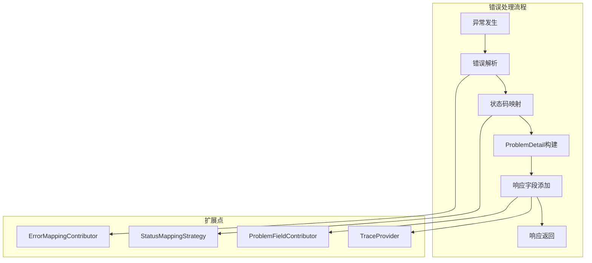

# 自定义扩展指南

详细介绍如何通过 SPI 接口扩展和自定义 Patra 错误处理系统的功能。

## 目录

1. [扩展点概览](#扩展点概览)
2. [错误映射扩展](#错误映射扩展)
3. [状态码映射扩展](#状态码映射扩展)
4. [响应字段扩展](#响应字段扩展)
5. [链路追踪扩展](#链路追踪扩展)
6. [验证错误格式化扩展](#验证错误格式化扩展)
7. [完整扩展示例](#完整扩展示例)

## 扩展点概览

Patra 错误处理系统提供多个 SPI（Service Provider Interface）接口，支持插件式扩展：

| 扩展点 | 接口 | 用途 | 优先级 |
|--------|------|------|--------|
| 错误映射 | `ErrorMappingContributor` | 异常到错误代码的映射 | 高 |
| 状态码映射 | `StatusMappingStrategy` | 错误代码到HTTP状态码的映射 | 中 |
| 响应字段 | `ProblemFieldContributor` | 添加自定义响应字段 | 中 |
| Web响应字段 | `WebProblemFieldContributor` | 添加Web特定响应字段 | 中 |
| 链路追踪 | `TraceProvider` | 自定义trace ID提取 | 低 |
| 验证格式化 | `ValidationErrorsFormatter` | 自定义验证错误格式化 | 低 |

### 扩展机制



## 错误映射扩展

### ErrorMappingContributor 接口

```java
public interface ErrorMappingContributor {
    /**
     * 将异常映射到错误代码
     * 
     * @param exception 要映射的异常
     * @return 错误代码，如果无法映射则返回空
     */
    Optional<ErrorCodeLike> mapException(Throwable exception);
}
```

### 基础实现

```java
@Component
@Order(1) // 高优先级
public class BusinessErrorMappingContributor implements ErrorMappingContributor {
    
    @Override
    public Optional<ErrorCodeLike> mapException(Throwable exception) {
        // 业务异常映射
        if (exception instanceof OrderNotFoundException) {
            return Optional.of(OrderErrorCode.ORDER_NOT_FOUND);
        }
        
        if (exception instanceof PaymentFailedException) {
            return Optional.of(OrderErrorCode.PAYMENT_FAILED);
        }
        
        return Optional.empty();
    }
}
```

### 高级实现 - 基于注解的映射

```java
@Component
public class AnnotationBasedErrorMappingContributor implements ErrorMappingContributor {
    
    @Override
    public Optional<ErrorCodeLike> mapException(Throwable exception) {
        Class<?> exceptionClass = exception.getClass();
        
        // 检查异常类上的注解
        ErrorMapping mapping = exceptionClass.getAnnotation(ErrorMapping.class);
        if (mapping != null) {
            try {
                ErrorCodeLike errorCode = mapping.value().getDeclaredConstructor(String.class)
                    .newInstance(mapping.code());
                return Optional.of(errorCode);
            } catch (Exception e) {
                log.warn("Failed to create error code from annotation: {}", e.getMessage());
            }
        }
        
        return Optional.empty();
    }
}

// 自定义注解
@Target(ElementType.TYPE)
@Retention(RetentionPolicy.RUNTIME)
public @interface ErrorMapping {
    Class<? extends ErrorCodeLike> value();
    String code();
}

// 使用示例
@ErrorMapping(value = OrderErrorCode.class, code = "ORD-1001")
public class OrderNotFoundException extends RuntimeException {
    // 异常实现
}
```

### 动态映射实现

```java
@Component
public class ConfigurableErrorMappingContributor implements ErrorMappingContributor {
    
    private final Map<String, ErrorCodeLike> mappingConfig;
    
    public ConfigurableErrorMappingContributor(
            @Value("${patra.error.mapping.config-file:classpath:error-mappings.yml}") 
            Resource configFile) {
        this.mappingConfig = loadMappingConfig(configFile);
    }
    
    @Override
    public Optional<ErrorCodeLike> mapException(Throwable exception) {
        String exceptionName = exception.getClass().getSimpleName();
        ErrorCodeLike errorCode = mappingConfig.get(exceptionName);
        return Optional.ofNullable(errorCode);
    }
    
    private Map<String, ErrorCodeLike> loadMappingConfig(Resource configFile) {
        // 从配置文件加载映射关系
        // error-mappings.yml:
        // mappings:
        //   OrderNotFoundException: ORD-1001
        //   PaymentFailedException: ORD-2001
        return new HashMap<>();
    }
}
```

## 状态码映射扩展

### StatusMappingStrategy 接口

```java
public interface StatusMappingStrategy {
    /**
     * 将错误代码映射到HTTP状态码
     * 
     * @param errorCode 错误代码
     * @param exception 原始异常
     * @return HTTP状态码
     */
    int mapToHttpStatus(ErrorCodeLike errorCode, Throwable exception);
}
```

### 自定义状态码映射

```java
@Component
public class BusinessStatusMappingStrategy implements StatusMappingStrategy {
    
    @Override
    public int mapToHttpStatus(ErrorCodeLike errorCode, Throwable exception) {
        String code = errorCode.code();
        
        // 业务特定的状态码映射
        if (code.endsWith("-QUOTA") || code.endsWith("-LIMIT")) {
            return 429; // Too Many Requests
        }
        
        if (code.endsWith("-TIMEOUT") || code.endsWith("-SLOW")) {
            return 504; // Gateway Timeout
        }
        
        if (code.endsWith("-MAINTENANCE") || code.endsWith("-DISABLED")) {
            return 503; // Service Unavailable
        }
        
        if (code.endsWith("-UNAUTHORIZED") || code.endsWith("-AUTH")) {
            return 401; // Unauthorized
        }
        
        if (code.endsWith("-FORBIDDEN") || code.endsWith("-PERM")) {
            return 403; // Forbidden
        }
        
        // 基于异常类型的映射
        if (exception instanceof SecurityException) {
            return 403;
        }
        
        if (exception instanceof TimeoutException) {
            return 504;
        }
        
        // 回退到默认策略
        return new SuffixHeuristicStatusMappingStrategy().mapToHttpStatus(errorCode, exception);
    }
}
```

### 基于配置的状态码映射

```java
@Component
@ConfigurationProperties(prefix = "patra.error.status-mapping")
public class ConfigurableStatusMappingStrategy implements StatusMappingStrategy {
    
    private Map<String, Integer> codePatterns = new HashMap<>();
    private Map<String, Integer> exceptionTypes = new HashMap<>();
    
    @Override
    public int mapToHttpStatus(ErrorCodeLike errorCode, Throwable exception) {
        String code = errorCode.code();
        
        // 检查代码模式映射
        for (Map.Entry<String, Integer> entry : codePatterns.entrySet()) {
            if (code.matches(entry.getKey())) {
                return entry.getValue();
            }
        }
        
        // 检查异常类型映射
        String exceptionType = exception.getClass().getSimpleName();
        Integer status = exceptionTypes.get(exceptionType);
        if (status != null) {
            return status;
        }
        
        return 422; // 默认状态码
    }
    
    // Getters and setters for configuration binding
    public Map<String, Integer> getCodePatterns() { return codePatterns; }
    public void setCodePatterns(Map<String, Integer> codePatterns) { this.codePatterns = codePatterns; }
    
    public Map<String, Integer> getExceptionTypes() { return exceptionTypes; }
    public void setExceptionTypes(Map<String, Integer> exceptionTypes) { this.exceptionTypes = exceptionTypes; }
}
```

配置示例：
```yaml
patra:
  error:
    status-mapping:
      code-patterns:
        ".*-QUOTA": 429
        ".*-TIMEOUT": 504
        ".*-AUTH.*": 401
      exception-types:
        SecurityException: 403
        TimeoutException: 504
        QuotaExceededException: 429
```

## 响应字段扩展

### ProblemFieldContributor 接口

```java
public interface ProblemFieldContributor {
    /**
     * 向ProblemDetail响应添加自定义字段
     * 
     * @param fields 字段映射
     * @param exception 原始异常
     */
    void contribute(Map<String, Object> fields, Throwable exception);
}
```

### 基础字段贡献者

```java
@Component
public class ServiceInfoFieldContributor implements ProblemFieldContributor {
    
    @Value("${spring.application.name}")
    private String serviceName;
    
    @Value("${app.version:unknown}")
    private String serviceVersion;
    
    @Value("${spring.profiles.active:default}")
    private String environment;
    
    @Override
    public void contribute(Map<String, Object> fields, Throwable exception) {
        fields.put("service", serviceName);
        fields.put("version", serviceVersion);
        fields.put("environment", environment);
        fields.put("node", getNodeId());
    }
    
    private String getNodeId() {
        try {
            return InetAddress.getLocalHost().getHostName();
        } catch (Exception e) {
            return "unknown";
        }
    }
}
```

### 业务上下文字段贡献者

```java
@Component
public class BusinessContextFieldContributor implements ProblemFieldContributor {
    
    @Override
    public void contribute(Map<String, Object> fields, Throwable exception) {
        // 添加业务特定字段
        if (exception instanceof OrderException orderEx) {
            fields.put("orderId", orderEx.getOrderId());
            fields.put("customerId", orderEx.getCustomerId());
        }
        
        if (exception instanceof PaymentException paymentEx) {
            fields.put("paymentId", paymentEx.getPaymentId());
            fields.put("amount", paymentEx.getAmount());
            fields.put("currency", paymentEx.getCurrency());
        }
        
        // 添加用户上下文
        String userId = getCurrentUserId();
        if (userId != null) {
            fields.put("userId", userId);
        }
        
        // 添加请求上下文
        String requestId = getCurrentRequestId();
        if (requestId != null) {
            fields.put("requestId", requestId);
        }
    }
    
    private String getCurrentUserId() {
        // 从安全上下文获取用户ID
        return SecurityContextHolder.getContext()
            .getAuthentication()
            .getName();
    }
    
    private String getCurrentRequestId() {
        // 从MDC获取请求ID
        return MDC.get("requestId");
    }
}
```

### Web特定字段贡献者

```java
@Component
public class WebContextFieldContributor implements WebProblemFieldContributor {
    
    @Override
    public void contribute(Map<String, Object> fields, Throwable exception, HttpServletRequest request) {
        // 添加请求信息
        fields.put("method", request.getMethod());
        fields.put("userAgent", request.getHeader("User-Agent"));
        fields.put("clientIp", extractClientIp(request));
        fields.put("referer", request.getHeader("Referer"));
        
        // 添加请求参数（非敏感）
        Map<String, String[]> params = request.getParameterMap();
        if (!params.isEmpty()) {
            Map<String, Object> sanitizedParams = sanitizeParameters(params);
            fields.put("parameters", sanitizedParams);
        }
        
        // 添加会话信息
        HttpSession session = request.getSession(false);
        if (session != null) {
            fields.put("sessionId", session.getId());
            fields.put("sessionCreated", session.getCreationTime());
        }
    }
    
    private String extractClientIp(HttpServletRequest request) {
        String forwarded = request.getHeader("X-Forwarded-For");
        if (forwarded != null && !forwarded.isEmpty()) {
            return forwarded.split(",")[0].trim();
        }
        
        String realIp = request.getHeader("X-Real-IP");
        if (realIp != null && !realIp.isEmpty()) {
            return realIp;
        }
        
        return request.getRemoteAddr();
    }
    
    private Map<String, Object> sanitizeParameters(Map<String, String[]> params) {
        Map<String, Object> sanitized = new HashMap<>();
        Set<String> sensitiveKeys = Set.of("password", "token", "secret", "key");
        
        for (Map.Entry<String, String[]> entry : params.entrySet()) {
            String key = entry.getKey().toLowerCase();
            boolean isSensitive = sensitiveKeys.stream().anyMatch(key::contains);
            
            if (isSensitive) {
                sanitized.put(entry.getKey(), "***");
            } else {
                String[] values = entry.getValue();
                sanitized.put(entry.getKey(), values.length == 1 ? values[0] : values);
            }
        }
        
        return sanitized;
    }
}
```

## 链路追踪扩展

### TraceProvider 接口

```java
public interface TraceProvider {
    /**
     * 获取当前的trace ID
     * 
     * @return trace ID，如果不可用则返回空
     */
    Optional<String> getCurrentTraceId();
}
```

### 自定义链路追踪集成

```java
@Component
public class CustomTraceProvider implements TraceProvider {
    
    private final YourTracingSystem tracingSystem;
    
    @Override
    public Optional<String> getCurrentTraceId() {
        // 1. 从自定义追踪系统获取
        String customTraceId = tracingSystem.getCurrentTraceId();
        if (customTraceId != null && !customTraceId.isEmpty()) {
            return Optional.of(customTraceId);
        }
        
        // 2. 从 Spring Cloud Sleuth 获取
        TraceContext traceContext = CurrentTraceContext.current();
        if (traceContext != null) {
            return Optional.of(traceContext.traceId());
        }
        
        // 3. 从 MDC 获取
        String mdcTraceId = MDC.get("traceId");
        if (mdcTraceId != null && !mdcTraceId.isEmpty()) {
            return Optional.of(mdcTraceId);
        }
        
        // 4. 从请求头获取
        HttpServletRequest request = getCurrentRequest();
        if (request != null) {
            String headerTraceId = request.getHeader("X-Trace-Id");
            if (headerTraceId != null && !headerTraceId.isEmpty()) {
                return Optional.of(headerTraceId);
            }
        }
        
        return Optional.empty();
    }
    
    private HttpServletRequest getCurrentRequest() {
        RequestAttributes attrs = RequestContextHolder.getRequestAttributes();
        if (attrs instanceof ServletRequestAttributes) {
            return ((ServletRequestAttributes) attrs).getRequest();
        }
        return null;
    }
}
```

### 多源trace ID提供者

```java
@Component
public class MultiSourceTraceProvider implements TraceProvider {
    
    private final List<TraceProvider> providers;
    
    public MultiSourceTraceProvider(List<TraceProvider> providers) {
        this.providers = providers.stream()
            .filter(p -> !(p instanceof MultiSourceTraceProvider)) // 避免循环依赖
            .collect(Collectors.toList());
    }
    
    @Override
    public Optional<String> getCurrentTraceId() {
        for (TraceProvider provider : providers) {
            Optional<String> traceId = provider.getCurrentTraceId();
            if (traceId.isPresent()) {
                return traceId;
            }
        }
        return Optional.empty();
    }
}
```

## 验证错误格式化扩展

### ValidationErrorsFormatter 接口

```java
public interface ValidationErrorsFormatter {
    /**
     * 格式化验证错误并进行敏感数据掩码
     * 
     * @param bindingResult 验证结果
     * @return 格式化后的验证错误列表
     */
    List<ValidationError> formatWithMasking(BindingResult bindingResult);
}
```

### 自定义验证错误格式化

```java
@Component
public class EnhancedValidationErrorsFormatter implements ValidationErrorsFormatter {
    
    private static final Set<String> SENSITIVE_FIELDS = Set.of(
        "password", "token", "secret", "key", "credential", "ssn", "creditcard"
    );
    
    @Override
    public List<ValidationError> formatWithMasking(BindingResult bindingResult) {
        List<ValidationError> errors = new ArrayList<>();
        
        // 处理字段错误
        for (FieldError fieldError : bindingResult.getFieldErrors()) {
            ValidationError error = formatFieldError(fieldError);
            errors.add(error);
        }
        
        // 处理全局错误
        for (ObjectError objectError : bindingResult.getGlobalErrors()) {
            ValidationError error = formatGlobalError(objectError);
            errors.add(error);
        }
        
        // 限制错误数量
        return errors.stream().limit(50).collect(Collectors.toList());
    }
    
    private ValidationError formatFieldError(FieldError fieldError) {
        String field = fieldError.getField();
        Object rejectedValue = maskSensitiveValue(field, fieldError.getRejectedValue());
        String message = enhanceMessage(fieldError);
        
        return ValidationError.builder()
            .field(field)
            .rejectedValue(rejectedValue)
            .message(message)
            .code(fieldError.getCode())
            .build();
    }
    
    private ValidationError formatGlobalError(ObjectError objectError) {
        return ValidationError.builder()
            .field("_global")
            .message(objectError.getDefaultMessage())
            .code(objectError.getCode())
            .build();
    }
    
    private Object maskSensitiveValue(String field, Object value) {
        if (value == null) return null;
        
        String fieldLower = field.toLowerCase();
        boolean isSensitive = SENSITIVE_FIELDS.stream()
            .anyMatch(fieldLower::contains);
        
        if (isSensitive) {
            return "***";
        }
        
        // 对于长字符串，只显示前几个字符
        if (value instanceof String str && str.length() > 50) {
            return str.substring(0, 47) + "...";
        }
        
        return value;
    }
    
    private String enhanceMessage(FieldError fieldError) {
        String message = fieldError.getDefaultMessage();
        if (message == null) return "Validation failed";
        
        // 添加字段名到消息中（如果不存在）
        if (!message.toLowerCase().contains(fieldError.getField().toLowerCase())) {
            return fieldError.getField() + ": " + message;
        }
        
        return message;
    }
}
```

## 完整扩展示例

### 电商系统错误处理扩展

```java
@Configuration
public class ECommerceErrorHandlingConfiguration {
    
    /**
     * 电商业务错误映射
     */
    @Bean
    @Order(1)
    public ErrorMappingContributor ecommerceErrorMappingContributor() {
        return new ECommerceErrorMappingContributor();
    }
    
    /**
     * 电商业务状态码映射
     */
    @Bean
    public StatusMappingStrategy ecommerceStatusMappingStrategy() {
        return new ECommerceStatusMappingStrategy();
    }
    
    /**
     * 电商业务字段贡献者
     */
    @Bean
    public ProblemFieldContributor ecommerceFieldContributor() {
        return new ECommerceFieldContributor();
    }
    
    /**
     * 用户上下文字段贡献者
     */
    @Bean
    public WebProblemFieldContributor userContextFieldContributor() {
        return new UserContextFieldContributor();
    }
}

@Component
public class ECommerceErrorMappingContributor implements ErrorMappingContributor {
    
    @Override
    public Optional<ErrorCodeLike> mapException(Throwable exception) {
        // 订单相关异常
        if (exception instanceof OrderNotFoundException) {
            return Optional.of(ECommerceErrorCode.ORDER_NOT_FOUND);
        }
        if (exception instanceof OrderCancelledException) {
            return Optional.of(ECommerceErrorCode.ORDER_CANCELLED);
        }
        
        // 商品相关异常
        if (exception instanceof ProductOutOfStockException) {
            return Optional.of(ECommerceErrorCode.PRODUCT_OUT_OF_STOCK);
        }
        if (exception instanceof ProductNotFoundException) {
            return Optional.of(ECommerceErrorCode.PRODUCT_NOT_FOUND);
        }
        
        // 支付相关异常
        if (exception instanceof PaymentDeclinedException) {
            return Optional.of(ECommerceErrorCode.PAYMENT_DECLINED);
        }
        if (exception instanceof InsufficientFundsException) {
            return Optional.of(ECommerceErrorCode.INSUFFICIENT_FUNDS);
        }
        
        // 用户相关异常
        if (exception instanceof UserNotVerifiedException) {
            return Optional.of(ECommerceErrorCode.USER_NOT_VERIFIED);
        }
        
        return Optional.empty();
    }
}

@Component
public class ECommerceFieldContributor implements ProblemFieldContributor {
    
    @Override
    public void contribute(Map<String, Object> fields, Throwable exception) {
        // 添加业务上下文
        if (exception instanceof OrderException orderEx) {
            fields.put("orderId", orderEx.getOrderId());
            fields.put("orderStatus", orderEx.getOrderStatus());
            fields.put("totalAmount", orderEx.getTotalAmount());
        }
        
        if (exception instanceof ProductException productEx) {
            fields.put("productId", productEx.getProductId());
            fields.put("productName", productEx.getProductName());
            fields.put("category", productEx.getCategory());
        }
        
        if (exception instanceof PaymentException paymentEx) {
            fields.put("paymentMethod", paymentEx.getPaymentMethod());
            fields.put("transactionId", paymentEx.getTransactionId());
            // 不包含敏感的支付信息
        }
        
        // 添加推荐操作
        fields.put("recommendedActions", getRecommendedActions(exception));
    }
    
    private List<String> getRecommendedActions(Throwable exception) {
        if (exception instanceof ProductOutOfStockException) {
            return List.of(
                "Check alternative products",
                "Set up stock notification",
                "Contact customer service"
            );
        }
        
        if (exception instanceof PaymentDeclinedException) {
            return List.of(
                "Try a different payment method",
                "Check card details",
                "Contact your bank"
            );
        }
        
        return List.of("Contact customer support");
    }
}
```

通过这些扩展机制，您可以根据具体的业务需求定制错误处理系统，提供更丰富的错误信息和更好的用户体验。