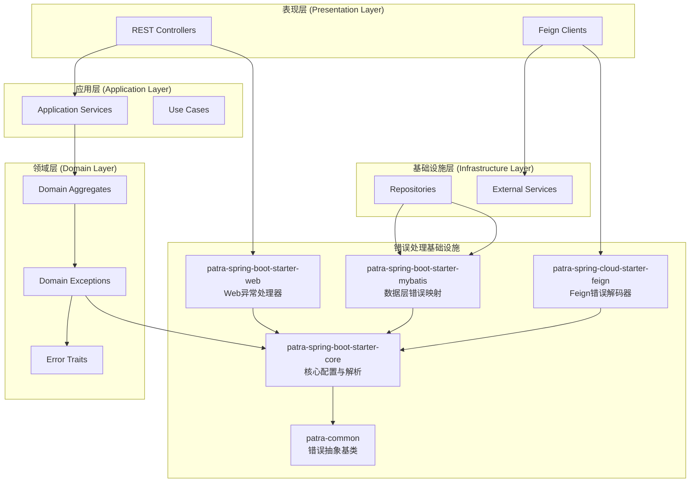
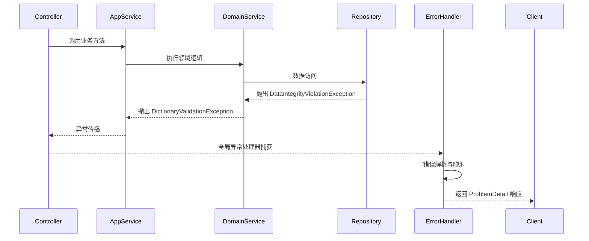

# Patra 错误处理系统 - 系统概览

## 系统简介

Patra 错误处理系统是为 Papertrace 微服务平台设计的统一错误处理基础设施，提供零配置的错误处理能力，支持 RFC 7807 ProblemDetail 标准，实现了清洁架构与领域驱动设计的最佳实践。

## 核心价值

### 1. 统一的错误处理体验
- **一致的错误响应格式** - 所有服务返回标准化的 ProblemDetail 响应
- **语义化的错误代码** - 基于业务语义的错误代码体系
- **自动化的异常映射** - 领域异常自动映射为HTTP状态码和错误代码

### 2. 零配置开箱即用
- **自动配置** - Spring Boot 自动配置，最小化配置工作
- **合理的默认值** - 开箱即用的默认配置，适合大多数场景
- **渐进式增强** - 支持按需自定义和扩展

### 3. 微服务友好
- **Feign 错误解码** - 自动解码下游服务的 ProblemDetail 响应
- **分布式链路追踪** - 自动传播和提取 trace ID
- **容错处理** - 优雅处理非标准响应和网络异常

## 系统架构

### 分层架构



### 核心组件

#### 1. patra-common
- **错误抽象基类** - `DomainException`、`ApplicationException`
- **错误特征接口** - `HasErrorTraits`、`ErrorTrait`
- **错误代码接口** - `ErrorCodeLike`

#### 2. patra-spring-boot-starter-core
- **错误解析服务** - `ErrorResolutionService`
- **SPI 接口定义** - `ErrorMappingContributor`、`StatusMappingStrategy`
- **自动配置** - `CoreErrorAutoConfiguration`

#### 3. patra-spring-boot-starter-web
- **全局异常处理器** - `GlobalRestExceptionHandler`
- **ProblemDetail 构建器** - `ProblemDetailBuilder`
- **验证错误格式化** - `ValidationErrorsFormatter`

#### 4. patra-spring-cloud-starter-feign
- **错误解码器** - `ProblemDetailErrorDecoder`
- **远程调用异常** - `RemoteCallException`
- **错误辅助工具** - `RemoteErrorHelper`

## 错误处理流程

### 1. 异常产生与传播



### 2. 错误解析算法

系统使用确定性的错误解析算法，按优先级顺序处理异常：

1. **ApplicationException** - 直接提取错误代码
2. **ErrorMappingContributor** - 显式异常映射
3. **HasErrorTraits** - 基于错误特征的语义映射
4. **命名约定** - 基于异常类名的启发式映射
5. **默认回退** - 默认错误代码（422客户端错误，500服务器错误）

### 3. HTTP 状态码映射

```java
// 错误特征到HTTP状态码的映射
ErrorTrait.NOT_FOUND        → 404 Not Found
ErrorTrait.CONFLICT         → 409 Conflict  
ErrorTrait.RULE_VIOLATION   → 422 Unprocessable Entity
ErrorTrait.UNAUTHORIZED     → 401 Unauthorized
ErrorTrait.FORBIDDEN        → 403 Forbidden
```

## 错误代码体系

### 代码格式
所有错误代码遵循格式：`{SERVICE_PREFIX}-{NNNN}`

- **SERVICE_PREFIX**: 2-4字符服务标识符（REG、ORD、INV等）
- **NNNN**: 4位数字代码，具有语义分组

### 代码分类
- **0xxx**: HTTP对齐的通用代码（0400、0404、0409、0422、0500等）
- **1xxx-9xxx**: 业务特定代码，按功能领域分组

### 示例
```
REG-0404  → Registry服务通用404错误
REG-1401  → 字典类型未找到
REG-1402  → 字典项未找到
REG-1404  → 字典类型已存在
```

## 响应格式

### ProblemDetail 响应示例

```json
{
  "type": "https://errors.patra.com/reg-1401",
  "title": "REG-1401",
  "status": 404,
  "detail": "Dictionary type not found: COUNTRY",
  "code": "REG-1401",
  "traceId": "abc123def456",
  "path": "/api/registry/dictionaries/COUNTRY",
  "timestamp": "2025-09-20T10:30:00Z"
}
```

### 验证错误响应示例

```json
{
  "type": "https://errors.patra.com/reg-0422",
  "title": "REG-0422",
  "status": 422,
  "detail": "Validation failed",
  "code": "REG-0422",
  "traceId": "abc123def456",
  "path": "/api/registry/dictionaries",
  "timestamp": "2025-09-20T10:30:00Z",
  "errors": [
    {
      "field": "typeCode",
      "rejectedValue": null,
      "message": "Type code is required"
    }
  ]
}
```

## 核心特性详解

### 1. 自动异常处理

控制器无需手动异常处理：

```java
@RestController
public class DictionaryController {
    
    @GetMapping("/dictionaries/{typeCode}")
    public DictionaryTypeDto getDictionaryType(@PathVariable String typeCode) {
        // 直接抛出领域异常 - 自动处理
        throw new DictionaryNotFoundException(typeCode);
        // 自动转换为 REG-1401 404 响应
    }
}
```

### 2. 类型化的远程调用异常

Feign客户端自动解码ProblemDetail响应：

```java
@Service
public class IntegrationService {
    
    public Optional<ResourceDto> getResourceIfExists(String id) {
        try {
            return Optional.of(client.getResource(id));
        } catch (RemoteCallException ex) {
            if (RemoteErrorHelper.isNotFound(ex)) {
                return Optional.empty();
            }
            throw ex;
        }
    }
}
```

### 3. 分布式链路追踪

自动传播和提取trace ID：

```java
// 自动添加到出站请求
traceId: abc123def456

// 自动包含在错误响应中
{
  "traceId": "abc123def456",
  // ... 其他字段
}
```

## 性能特性

### 1. 高性能错误解析
- **类级别缓存** - 异常解析结果按异常类缓存
- **原因链遍历** - 高效处理包装异常（最大10层）
- **延迟初始化** - 组件按需创建

### 2. 内存优化
- **最小对象创建** - 复用ProblemDetail构建器
- **敏感数据掩码** - 防止敏感信息泄露
- **响应大小限制** - 验证错误限制100项

## 扩展性设计

### SPI 接口
系统提供多个SPI接口支持自定义扩展：

- **ErrorMappingContributor** - 自定义异常映射
- **StatusMappingStrategy** - 自定义状态码映射
- **ProblemFieldContributor** - 自定义响应字段
- **TraceProvider** - 自定义链路追踪集成

### 配置驱动
所有功能都可以通过配置启用/禁用：

```yaml
patra:
  error:
    enabled: true
    context-prefix: REG
  web:
    problem:
      enabled: true
  feign:
    problem:
      enabled: true
```

## 下一步

- **快速开始** - 查看 `../getting-started/quick-start.md`
- **设计原理** - 查看 `design-principles.md`
- **迁移指南** - 查看 `../getting-started/migration-guide.md`
- **配置参考** - 查看 `../configuration/configuration-reference.md`