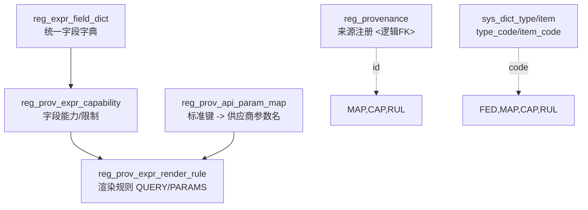

# Registry · Expr 子域：SQL 设计文档与使用说明
> 版本：2025-09-18 09:08:54 UTC · 适配 MySQL 8.0 / InnoDB / utf8mb4_0900_ai_ci  
> 关联脚本：**reg_expr_final.sql**（四张表）

---

## 1. 设计背景与目标

**目标**：将系统的统一查询语义（Expr）抽象，与不同数据源（Provenance）的查询语法解耦，通过配置实现：
- 统一内部字段语义（`reg_expr_field_dict`）。
- 将标准键映射为供应商参数名（`reg_prov_api_param_map`）。
- 定义来源在各字段上的能力与约束（`reg_prov_expr_capability`）。
- 将 Expr 原子（字段 + 操作）渲染为 query 片段或 params（`reg_prov_expr_render_rule`）。

**原则**：
- **跨环境稳定**：一律使用 `*_code`（来自 `sys_dict_item.item_code`），不使用 ENUM。
- **确定性选择**：源敏感表按照“**作用域/任务类型/时间片 [from, to)** + 维度唯一键”建模，读侧任一时刻只返回 0..1 条。
- **职责边界清晰**：参数名映射（键名层）与渲染（模板层）分离；值级转换与模板级策略分离。
- **无物理外键**：`provenance_id` 等采用逻辑外键；靠上线校验与应用缓存保证一致性。

**非目标**：
- 不覆盖端点/分页等 HTTP 执行合同（仍由 `reg_prov_*` 负责）。
- 不做运行时合并/优先级竞争（用“时间片 + 唯一维度 + 当前生效”规则）。

---

## 2. 模型与依赖



**字典类型建议**：
- `reg_data_type`：`DATE/DATETIME/NUMBER/TEXT/KEYWORD/BOOLEAN/TOKEN`
- `reg_cardinality`：`SINGLE/MULTI`
- `reg_operation`：`SEARCH/DETAIL/LOOKUP`
- `reg_expr_op`：`TERM/IN/RANGE/EXISTS/TOKEN`
- `reg_range_kind`：`NONE/DATE/DATETIME/NUMBER`
- `reg_match_type`：`PHRASE/EXACT/ANY`
- `reg_emit_type`：`QUERY/PARAMS`
- `reg_transform`：如 `TO_EXCLUSIVE_MINUS_1D`、`PUBMED_DATETYPE`（可扩展）

> 约定：`item_code` 全大写；配置表中的 `*_code` 推荐大写，或查询时 `UPPER()` 对齐。

---

## 3. 表结构与要点

### 3.1 `reg_expr_field_dict`（统一字段字典）
**用途**：系统内部字段统一语义的唯一事实来源；无源敏感。

关键列：
- `field_key`：统一内部字段键（小写蛇形/缩写），唯一。
- `data_type_code`：`DATE/DATETIME/NUMBER/TEXT/KEYWORD/BOOLEAN/TOKEN`。
- `cardinality_code`：`SINGLE/MULTI`。
- `exposable`：全局可暴露开关（与来源能力层区分）。
- `is_date`：冗余标记，便于 UI/DateLens 快速判断。

索引：`UK(field_key)`，`idx(updated_at)`。

---

### 3.2 `reg_prov_api_param_map`（API 参数映射）
**用途**：将标准键（统一内部语义）映射为供应商参数名（HTTP 层）。

维度与时间片唯一键：
```
(provenance_id, scope, task_type_key, operation_code, std_key, effective_from)
```

关键列：
- `scope`：`SOURCE`/`TASK`（可扩展）。
- `task_type`/`task_type_key`：任务类型，`NULL→ALL`（生成列）。
- `operation_code`：`SEARCH/DETAIL/LOOKUP`。
- `std_key`：标准键（通常来自 `reg_expr_field_dict.field_key`）。
- `provider_param_name`：供应商参数名。
- `transform_code`：值级转换（如 `TO_EXCLUSIVE_MINUS_1D`）。

索引：`idx(provenance_id, operation_code, std_key)`；反查 `idx(provider_param_name)`。

---

### 3.3 `reg_prov_expr_capability`（字段能力）
**用途**：声明某来源在特定字段上的可用操作与限制。

维度与时间片唯一键：
```
(provenance_id, scope, task_type_key, field_key, effective_from)
```

关键列：
- `ops`：允许的表达式操作集合，如 `["TERM","IN","RANGE"]`。
- `term_*`/`in_*`/`range_*`：匹配策略、大小写、最小长度/最大长度/集合大小上限、范围类型与边界等。
- `range_kind_code`：`NONE/DATE/DATETIME/NUMBER`。

索引：`idx(provenance_id, field_key)`；`idx(updated_at)`。

---

### 3.4 `reg_prov_expr_render_rule`（渲染规则）
**用途**：把 Expr 原子渲染为 query 片段或 params；不重复做键名映射。

维度与时间片唯一键（引入归一化列消除 NULL 歧义）：
```
(provenance_id, scope, task_type_key, field_key,
 op_code, match_type_key, negated_key, value_type_key,
 emit_type_code, effective_from)
```

关键列：
- `op_code`：`TERM/IN/RANGE/EXISTS/TOKEN`。
- `emit_type_code`：`QUERY` 或 `PARAMS`。
- `match_type_key`：`match_type_code` 的归一化（`NULL→ANY`）。
- `negated_key`：`negated` 的归一化（`T/F/ANY`）。
- `value_type_key`：`value_type_code` 的归一化（`NULL→ANY`）。
- `template/item_template/joiner/wrap_group`：用于 `QUERY` 渲染。
- `params/fn_code`：用于 `PARAMS` 渲染（参数名由 `param_map` 统一解析）。

索引：`idx(provenance_id, field_key, op_code)`；`idx(updated_at)`。

---

## 4. 生效规则与读侧查询模板

**当前生效**判定：
```sql
WHERE deleted=0
  AND NOW() BETWEEN effective_from AND COALESCE(effective_to,'9999-12-31')
ORDER BY effective_from DESC
LIMIT 1;
```

**参数名映射**：
```sql
SELECT m.provider_param_name, m.transform_code
FROM reg_prov_api_param_map m
WHERE m.deleted=0
  AND m.provenance_id=:provId
  AND m.scope=:scopeCode
  AND m.task_type_key=:taskKey
  AND m.operation_code=:opCode
  AND m.std_key=:stdKey
  AND NOW() BETWEEN m.effective_from AND COALESCE(m.effective_to,'9999-12-31')
ORDER BY m.effective_from DESC
LIMIT 1;
```

**字段能力**：
```sql
SELECT c.ops, c.term_matches, c.range_kind_code, c.in_max_size, c.range_allow_open_end, ...
FROM reg_prov_expr_capability c
WHERE c.deleted=0
  AND c.provenance_id=:provId
  AND c.scope=:scopeCode
  AND c.task_type_key=:taskKey
  AND c.field_key=:fieldKey
  AND NOW() BETWEEN c.effective_from AND COALESCE(c.effective_to,'9999-12-31')
ORDER BY c.effective_from DESC
LIMIT 1;
```

**渲染规则**：
```sql
SELECT r.emit_type_code, r.template, r.item_template, r.joiner, r.wrap_group, r.params, r.fn_code
FROM reg_prov_expr_render_rule r
WHERE r.deleted=0
  AND r.provenance_id=:provId
  AND r.scope=:scopeCode
  AND r.task_type_key=:taskKey
  AND r.field_key=:fieldKey
  AND r.op_code=:opCode
  AND r.match_type_key=:matchKey  -- 'ANY' 表示不区分
  AND r.negated_key=:negKey       -- 'T'/'F'/'ANY'
  AND r.value_type_key=:valKey    -- 'STRING'/'DATE'/'DATETIME'/'NUMBER'/'ANY'
  AND NOW() BETWEEN r.effective_from AND COALESCE(r.effective_to,'9999-12-31')
ORDER BY r.effective_from DESC
LIMIT 1;
```

---

## 5. 使用流程（Adapter → App → Domain）

1. 将外部输入解析为统一 **Expr**（`field_key`、`op_code`、值、`match_type`、`negated` 等）。
2. 从 **capability** 读取当前生效配置，验证该 `field_key + op_code` 是否被允许，校验长度/大小写/范围等。
3. 若 **param_map** 为该 `std_key/operation_code` 提供了 `transform_code`，先对值做**值级转换**。
4. 从 **render_rule** 读取渲染模板：
   - `emit=QUERY`：使用 `template/item_template/joiner/wrap_group` 生成查询片段；
   - `emit=PARAMS`：生成标准键的参数集合（如 `from/to`）。
5. 使用 **param_map** 将标准键替换为供应商参数名（如 `from → mindate`）。
6. 与 `reg_prov_*` 端点/分页配置组合，发起 HTTP 调用。

> 推荐顺序：**capability → transform → render → param_map**。

---

## 6. 示例（Publish Date 范围检索）

**统一字段**：
```sql
INSERT INTO reg_expr_field_dict(id, field_key, data_type_code, cardinality_code, exposable, is_date)
VALUES (1001, 'publish_date', 'DATE', 'SINGLE', 1, 1);
```

**参数名映射（PubMed SEARCH）**：
```sql
INSERT INTO reg_prov_api_param_map
(id, provenance_id, scope, task_type, operation_code, std_key, provider_param_name, transform_code, effective_from)
VALUES
(2001, 1, 'SOURCE', NULL, 'SEARCH', 'from', 'mindate', NULL, '2025-01-01 00:00:00'),
(2002, 1, 'SOURCE', NULL, 'SEARCH', 'to',   'maxdate', 'TO_EXCLUSIVE_MINUS_1D', '2025-01-01 00:00:00');
```

**字段能力**：
```sql
INSERT INTO reg_prov_expr_capability
(id, provenance_id, scope, task_type, field_key, effective_from, ops, range_kind_code, range_allow_open_end)
VALUES
(3001, 1, 'SOURCE', NULL, 'publish_date', '2025-01-01 00:00:00',
  JSON_ARRAY('RANGE'), 'DATE', 1);
```

**渲染规则（PARAMS）**：
```sql
INSERT INTO reg_prov_expr_render_rule
(id, provenance_id, scope, task_type, field_key, op_code, emit_type_code, value_type_code,
 effective_from, params, fn_code)
VALUES
(4001, 1, 'SOURCE', NULL, 'publish_date', 'RANGE', 'PARAMS', 'DATE',
 '2025-01-01 00:00:00',
 JSON_OBJECT('from','from','to','to'), 'PUBMED_DATETYPE');
```

> 执行流：Expr {{field_key=publish_date, op=RANGE, from=2025-01-01, to=2025-02-01}} → 渲染为标准键 {{from:..., to:...}} → param_map 映射为 {{mindate:..., maxdate:...}}，并对 `to` 应用 `TO_EXCLUSIVE_MINUS_1D`。

---

## 7. 质量保障（Lint / 自检）

**时间片重叠**（以 param_map 为例）：
```sql
SELECT a.id AS a_id, b.id AS b_id, a.provenance_id, a.std_key, a.operation_code,
       a.effective_from a_from, a.effective_to a_to, b.effective_from b_from, b.effective_to b_to
FROM reg_prov_api_param_map a
JOIN reg_prov_api_param_map b
  ON a.id<>b.id AND a.deleted=0 AND b.deleted=0
 AND a.provenance_id=b.provenance_id
 AND a.scope=b.scope AND a.task_type_key=b.task_type_key
 AND a.operation_code=b.operation_code AND a.std_key=b.std_key
 AND COALESCE(a.effective_to,'9999-12-31') > b.effective_from
 AND COALESCE(b.effective_to,'9999-12-31') > a.effective_from;
```

**能力-渲染不匹配**：
```sql
SELECT c.provenance_id, c.field_key
FROM reg_prov_expr_capability c
LEFT JOIN reg_prov_expr_render_rule r
  ON r.provenance_id=c.provenance_id
 AND r.field_key=c.field_key
 AND r.op_code='TERM'
 AND NOW() BETWEEN r.effective_from AND COALESCE(r.effective_to,'9999-12-31')
WHERE c.deleted=0
  AND JSON_CONTAINS(c.ops, JSON_ARRAY('TERM'))
  AND NOW() BETWEEN c.effective_from AND COALESCE(c.effective_to,'9999-12-31')
  AND r.id IS NULL;
```

**渲染规则中的参数名硬编码检查**：
```sql
SELECT id, provenance_id, params
FROM reg_prov_expr_render_rule
WHERE deleted=0 AND params IS NOT NULL
  AND JSON_SEARCH(JSON_EXTRACT(params, '$'), 'one', '%mindate%') IS NOT NULL;
```

---

## 8. 与 `reg_prov_*` 的边界

- **端点/分页/HTTP/限流/重试/凭证**：由 `reg_prov_*` 维护。
- **表达式统一与渲染**：由本子域维护。参数名映射只在 `reg_prov_api_param_map`。渲染规则不重复做键名映射。
- **操作名**：端点操作 `reg_operation`（SEARCH/DETAIL/LOOKUP）；表达式操作符 `reg_expr_op`（TERM/IN/RANGE/EXISTS/TOKEN）。两者在代码层用不同的值对象。

---

## 9. 运行与运维建议

- **灰度**：通过 `scope='TASK'` + 指定 `task_type` 生效；稳定后迁移到 `SOURCE/ALL`。
- **版本化**：新增时间片（更新 `effective_from`），不编辑历史段；历史段不必软删。
- **监控**：为“查不到当前生效”的情况记录详细维度键，便于回溯。
- **导入导出**：配置以 `*_code` 与 `field_key` 为主键，适配 GitOps 与多环境迁移。

---

## 10. FAQ

**Q：为什么不用 ENUM？**  
A：`*_code` 来自字典表，便于扩展与跨环境迁移，避免硬编码。

**Q：为什么 render_rule 不做参数名映射？**  
A：为保证职责单一与一致性，参数名映射集中在 `param_map`。

**Q：NULL 如何参与维度匹配？**  
A：通过生成列将 `NULL` 归一化为 `ANY`，保证维度键唯一与查询确定性。

---

## 11. 变更清单（与初版差异）

- 名称统一：`reg_expr_field_dict / reg_prov_api_param_map / reg_prov_expr_capability / reg_prov_expr_render_rule`。
- 去 ENUM：改为 `*_code VARCHAR`，与 `sys_dict_item.item_code` 对齐。
- 增加 `scope/task_type/task_type_key/effective_from/effective_to`。
- 维度唯一键改造：渲染规则引入归一化键（`match_type_key/negated_key/value_type_key`）。
- 参数名映射与渲染模板解耦；transform（值级）与 fn（模板级）解耦。

---

**附**：请配合仓库中的 **reg_expr_final.sql** 使用，确保建表结构与本文一致。
