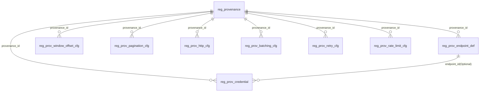

# Papertrace Registry Schema & SQL 指南

> 对齐说明（2025-09-18 更新）
>
> - 全库“枚举/字典值”一律以 DICT CODE（`sys_dict_item.item_code`）存储与查询，绝不使用 *_id 外键。
> - 生命周期字段统一使用 `lifecycle_status='ACTIVE'` 表示“当前生效”；
> - 端点用途的规范取值为 `SEARCH | DETAIL | BATCH | AUTH | HEALTH`；
> - 限流桶粒度 `bucket_granularity_scope` 的规范取值为 `GLOBAL | CREDENTIAL | ENDPOINT | IP | TASK`；
> - 关于列命名：文档中使用语义名（如 `scope`/`endpoint_usage`/`http_method`/`lifecycle_status`），
>   而迁移脚本当前采用带后缀的列名（如 `scope_code`/`endpoint_usage_code`/`http_method_code`/`lifecycle_status_code`），两者语义一致且均保存 DICT CODE。

## 0. 摘要（Executive Summary）

本设计面向**医学文献数据采集**（如 **PubMed / Crossref** 等多源对接）的**通用配置库**，目标是在 **MySQL 8.0** 上以*
*高度拆分、强语义命名、低耦合、可演进**的方式，沉淀采集端最常见且多变的配置维度（时间窗口、增量指针、分页/游标、端点与
HTTP、批量成型、重试退避、限流并发、鉴权密钥）。

**关键特点**

* **分维度建模 + 精准命名**：

    * 主表：`reg_provenance`（数据来源登记）；
    * 维度配置表（统一前缀 `reg_prov_`）：

        * `reg_prov_endpoint_def`（端点定义）
        * `reg_prov_window_offset_cfg`（时间窗口与增量指针）
        * `reg_prov_pagination_cfg`（分页与游标）
        * `reg_prov_http_cfg`（HTTP 策略）
        * `reg_prov_batching_cfg`（批量抓取与请求成型）
        * `reg_prov_retry_cfg`（重试与退避）
        * `reg_prov_rate_limit_cfg`（限流与并发）
        * `reg_prov_credential`（鉴权/密钥，支持可选绑定端点）
* **统一作用域模型**：每个配置可作用于**来源级（SOURCE）**或**来源+任务级（TASK）**；任务枚举：`harvest | update | backfill`。
* **时间区间语义**：配置采用 `[effective_from, effective_to)`；**不使用触发器与 CHECK**，**不做数据库层校验**，一切业务规则由应用层保证。
* **无链式覆盖**：不做模板/继承，不做字段级“层层 override”。推荐策略是**优先取 TASK 级配置**（若存在），否则**回退 SOURCE 级**
  ；字段为 **NULL** 表示“由应用使用默认值”。
* **可扩展 & 可维护**：

    * 为少量非结构化参数预留 `JSON` 字段；
    * 常用查询路径下建好复合索引；
    * 外键只指向**来源主键**与**端点定义主键**，其余跨维度依赖留在应用侧装配。
* **契合 DDD / 六边形 / CQRS 的落地**：

    * 领域层只依赖 **端口（Ports）/仓储（Repositories）** 抽象；
    * 基础设施层（MyBatis-Plus + Jackson）做关系-对象映射与 JSON 映射；
    * 读写分离：读侧可直接组织“当前生效配置”的查询与缓存；写侧通过新增区间记录实现“灰度切换、平滑回滚”。

**最小可用流程（Quick Start）**

1. 在 `reg_provenance` 登记来源（如 `pubmed`、`crossref`）；
2. 为目标任务类型（如 `update`）各维度插入**一条**生效配置（`reg_prov_*_cfg` 与/或 `reg_prov_endpoint_def`）；
3. 运行时**按维度取单条“当前生效记录”**（优先 TASK 级，否则 SOURCE 级）；
4. 将这些维度拼成一次抓取的“执行合同”，驱动采集器完成：**搜索 → 翻页/游标 → 详情批量 → 重试退避 → 限流并发 → 鉴权**。

> 预览示例（简化版）：
>
> ```sql
> -- 1) 登记来源
> INSERT INTO reg_provenance (provenance_code, provenance_name, base_url_default)
> VALUES ('pubmed','PubMed','https://eutils.ncbi.nlm.nih.gov/entrez'),
>        ('crossref','Crossref','https://api.crossref.org');
>
> -- 2) 为 PubMed update 任务配置窗口与增量指针（按天滑动，EDAT 字段）
> INSERT INTO reg_prov_window_offset_cfg
> (provenance_id, scope, task_type, effective_from, window_mode, window_size_value, window_size_unit,
>  overlap_value, overlap_unit, offset_type, default_date_field_name)
> VALUES ( (SELECT id FROM reg_provenance WHERE provenance_code='pubmed'),
>          'TASK','update','2025-01-01','SLIDING',1,'DAY',1,'DAY','DATE','EDAT');
>
> -- 3) 为 Crossref harvest 配置游标分页（cursor）
> INSERT INTO reg_prov_pagination_cfg
> (provenance_id, scope, task_type, effective_from, pagination_mode,
>  cursor_param_name, next_cursor_jsonpath)
> VALUES ( (SELECT id FROM reg_provenance WHERE provenance_code='crossref'),
>          'TASK','harvest','2025-01-01','CURSOR','cursor','$.message.next-cursor');
> ```

---

## 1. 背景与总体设计

### 1.1 业务背景

* 医学文献生态存在多个主流数据源（如 **PubMed**、**Crossref**），**API 风格差异大**：增量字段命名不同、分页/游标机制不同、端点与
  HTTP 约束不同、配额与限流策略不同、鉴权方式也不同。
* 采集团队需要一个**统一的配置模型**来描述这些差异，做到\*\*“新增/切换数据源不改代码或少改代码”\*\*，同时满足：

    * **可灰度**：支持在不下线的情况下切换配置（新增新区间记录→切流）；
    * **可并存**：同维度可并存多条历史配置（只要同一时间不冲突）；
    * **可观测**：字段直观、命名清晰、便于排障与对账；
    * **可扩展**：为少量“供应商特有参数”预留 JSON 扩展位；
    * **跨任务差异**：同一数据源在 `harvest | update | backfill` 的策略可不同（窗口、分页、重试、限流等）。

### 1.2 设计原则与不做的事

* **维度拆分优先**：将“时间窗口/指针、分页/游标、端点与 HTTP、批量、重试、限流、鉴权”分别建表，**避免大而全的胖表**与后续频繁改表。
* **强语义命名**：表使用 `reg_prov_` 前缀 + 清晰后缀，字段避免缩写歧义；`provenance_id` 统一指向 `reg_provenance(id)`。
* **时间区间驱动的演进**：不做版本号；采用 `[effective_from, effective_to)`；**不在 DB 层做重叠校验**（**无触发器、无 CHECK**
  ），由应用层保证。
* **无链式覆盖/继承**：**不做模板引入**、**不提供字段级 override**；**字段为 NULL** 意味着“由应用使用默认值”。
* **作用域简洁**：仅两层——`SOURCE`（来源级通用）与 `TASK`（来源+任务级）；应用读取时**优先 TASK、否则回退 SOURCE**，而**不是**
  层层字段覆盖合并。
* **读写分离**（契合 CQRS）：

    * 写侧：新增一条新区间记录用于灰度切换，旧记录可带 `effective_to` 关窗；
    * 读侧：每个维度**只取一条当前生效记录**，再组合成“执行合同”。
* **扩展而不过度设计**：特殊参数放 `JSON`，但常用路径（索引键、过滤键）必须是结构化列。

### 1.3 表与关系（概览）

* **主数据表**

    * `reg_provenance`：登记来源（`provenance_code`、`base_url_default`、`timezone_default`…）。
* **配置/定义表（均含 `provenance_id` → `reg_provenance.id`）**

  * `reg_prov_endpoint_def`：端点名称、用途（SEARCH/DETAIL/TOKEN…）、HTTP 方法、路径模板、默认 Query/Body；端点级参数名（如
      `page_param_name`）仅用于**描述该端点本身**。
    * `reg_prov_window_offset_cfg`：时间窗口模型（SLIDING/CALENDAR）、窗口长度/重叠/回看、水位滞后；增量指针（DATE/ID/COMPOSITE、默认日期字段）。
    * `reg_prov_pagination_cfg`：分页模式（PAGE\_NUMBER/CURSOR/TOKEN/SCROLL）、参数名、游标提取 JSONPath。
    * `reg_prov_http_cfg`：基础 URL 覆盖、Headers、超时、TLS/代理、`Retry-After` 与幂等等。
    * `reg_prov_batching_cfg`：详情批量、ID 参数名/分隔符、并行与背压、请求模板。
    * `reg_prov_retry_cfg`：最大重试、退避策略、状态码白/黑名单、断路器阈值与冷却。
  * `reg_prov_rate_limit_cfg`：QPS、突发桶、并发上限、桶粒度（GLOBAL/CREDENTIAL/ENDPOINT）。
    * `reg_prov_credential`：鉴权/密钥；可**可选**绑定到 `reg_prov_endpoint_def.id`（当某凭证只用于某端点）。
* **生成列**

    * 所有 `*_cfg`/`_def`（除凭证）含 `task_type_key`（`IFNULL(task_type,'ALL')`），用于唯一索引
      `(provenance_id, scope, task_type_key, effective_from)` 与查询过滤。

> **ER 关系（文字版）**
> `reg_provenance (1) ──< (N) reg_prov_endpoint_def`
> `reg_provenance (1) ──< (N) reg_prov_*_cfg`
> `reg_prov_endpoint_def (1) ──< (0..N) reg_prov_credential`（可选）
> 运行时：应用分别从各表**各取一条当前生效**（优先 TASK → 回退 SOURCE），再拼成“执行合同”。

### 1.4 作用域与时间模型

* **作用域**

    * `SOURCE`：来源级通用策略；
    * `TASK`：来源 + 任务类型（`harvest | update | backfill`）的特化策略；
    * 读取规则：**若存在 TASK 级**，取 TASK；**否则**取 SOURCE；**不进行字段级 merge**。
* **时间模型**

    * 区间 `[effective_from, effective_to)`；`effective_to` 可为 `NULL`（表示“截至未来”）；
    * **不重叠由应用层保证**（建表时无触发器/CHECK）；
    * 灰度切换：**先插入新记录（新起点），再关闭旧记录**（写入 `effective_to`），观察后清理。

### 1.5 技术选型与实现边界

* **数据库**：MySQL 8.0 / InnoDB / `utf8mb4_0900_ai_ci`；
* **结构化为主、JSON 为辅**：端点默认参数、请求模板、状态码列表等用 `JSON` 存储；
* **索引**：覆盖 `(provenance_id, scope, task_type_key, effective_from)` 与常用维度（如端点用途、时间上界）；
* **应用层**（建议栈）：Java 21 + Spring Boot 3.2.x + Spring Cloud 2023.0.1 + Spring Cloud Alibaba 2023.0.1.0 +
  MyBatis-Plus 3.5.12 + Jackson。

    * **Hexagonal**：适配器（REST/MQ/调度）→ 应用服务用例（CQRS）→ 领域（配置装配）→ 仓储（MyBatis-Plus 映射到 `reg_prov_*`）。
    * **读侧缓存**：可将“当前生效配置”以 `(provenance_code, task_type)` 为 Key 做短TTL缓存，降低 DB 压力。

### 1.6 使用方式（读写路径概要）

* **写入顺序**

    1. `reg_provenance` 建立来源；
    2. 按需向各 `reg_prov_*` 维度插入**一条**或多条**不重叠**区间记录；
    3. 鉴权如需端点绑定，先插入 `reg_prov_endpoint_def`，再写 `reg_prov_credential.endpoint_id`。
* **读取“当前生效配置”（模板 SQL）**

    * 以 **PubMed update** 为例（只演示分页维度；其它维度同理改表名）：
        ```mysql
              -- 取 pid
          SELECT id INTO @pid FROM reg_provenance WHERE provenance_code='pubmed';
           SET @now = UTC_TIMESTAMP();
           (SELECT *
           FROM reg_prov_pagination_cfg
           WHERE provenance_id=@pid AND scope='TASK' AND task_type='update'
           AND effective_from<=@now AND (effective_to IS NULL OR effective_to>@now)
           ORDER BY effective_from DESC, id DESC
           LIMIT 1)
           UNION ALL
           (SELECT *
           FROM reg_prov_pagination_cfg
           WHERE provenance_id=@pid AND scope='SOURCE'
           AND effective_from<=@now AND (effective_to IS NULL OR effective_to>@now)
           ORDER BY effective_from DESC, id DESC
           LIMIT 1)
           LIMIT 1;      
  ```

    * 应用侧按此模式对**各维度**各取一条，组装为一次运行的“执行合同”。

### 1.7 示例预览（PubMed / Crossref，简版）

> 详细完整示例会在后续章节给出，这里先放一组**可直接执行**的核心样例，帮助理解模型。

```sql
-- 1) 来源登记
INSERT INTO reg_provenance (provenance_code, provenance_name, base_url_default, timezone_default)
VALUES ('pubmed', 'PubMed', 'https://eutils.ncbi.nlm.nih.gov/entrez', 'UTC'),
       ('crossref', 'Crossref', 'https://api.crossref.org', 'UTC');

-- PubMed 的 id
SET @pubmed_id = (SELECT id
                  FROM reg_provenance
                  WHERE provenance_code = 'pubmed');
SET @crossref_id = (SELECT id
                    FROM reg_provenance
                    WHERE provenance_code = 'crossref');

-- 2) 端点定义（示例）
-- PubMed: ESearch（检索）与 EFetch（详情）
INSERT INTO reg_prov_endpoint_def
(provenance_id, scope, task_type, endpoint_name, effective_from,
 endpoint_usage, http_method, path_template, default_query_params, request_content_type, is_auth_required)
VALUES (@pubmed_id, 'TASK', 'update', 'esearch', '2025-01-01', 'SEARCH', 'GET', '/eutils/esearch.fcgi',
        JSON_OBJECT('db', 'pubmed', 'retmode', 'json'), 'application/json', 0),
  (@pubmed_id, 'TASK', 'update', 'efetch', '2025-01-01', 'DETAIL', 'GET', '/eutils/efetch.fcgi',
        JSON_OBJECT('db', 'pubmed', 'retmode', 'xml'), 'application/xml', 0);

-- Crossref: works 搜索端点（cursor-based）
INSERT INTO reg_prov_endpoint_def
(provenance_id, scope, task_type, endpoint_name, effective_from,
 endpoint_usage, http_method, path_template, request_content_type, is_auth_required)
VALUES (@crossref_id, 'TASK', 'harvest', 'works', '2025-01-01', 'SEARCH', 'GET', '/works',
        'application/json', 0);

-- 3) 时间窗口与增量指针
-- PubMed update：按天滑动 + 1 天重叠；DATE 指针默认 EDAT
INSERT INTO reg_prov_window_offset_cfg
(provenance_id, scope, task_type, effective_from,
 window_mode, window_size_value, window_size_unit, overlap_value, overlap_unit,
 offset_type, default_date_field_name)
VALUES (@pubmed_id, 'TASK', 'update', '2025-01-01',
        'SLIDING', 1, 'DAY', 1, 'DAY',
        'DATE', 'EDAT');

-- Crossref harvest：按天滑动；DATE 指针使用 indexed
INSERT INTO reg_prov_window_offset_cfg
(provenance_id, scope, task_type, effective_from,
 window_mode, window_size_value, window_size_unit,
 offset_type, default_date_field_name)
VALUES (@crossref_id, 'TASK', 'harvest', '2025-01-01',
        'SLIDING', 1, 'DAY',
        'DATE', 'indexed');

-- 4) 分页/游标
-- PubMed：页码分页
INSERT INTO reg_prov_pagination_cfg
(provenance_id, scope, task_type, effective_from,
 pagination_mode, page_size_value, page_number_param_name, page_size_param_name, start_page_number)
VALUES (@pubmed_id, 'TASK', 'update', '2025-01-01',
        'PAGE_NUMBER', 100, 'page', 'retmax', 1);

-- Crossref：cursor 分页，下一游标在 $.message.next-cursor
INSERT INTO reg_prov_pagination_cfg
(provenance_id, scope, task_type, effective_from,
 pagination_mode, cursor_param_name, next_cursor_jsonpath)
VALUES (@crossref_id, 'TASK', 'harvest', '2025-01-01',
        'CURSOR', 'cursor', '$.message["next-cursor"]');

-- 5) HTTP 策略（示例：设置 UA / 超时）
INSERT INTO reg_prov_http_cfg
(provenance_id, scope, task_type, effective_from,
 default_headers_json, timeout_connect_millis, timeout_read_millis)
VALUES (@pubmed_id, 'SOURCE', NULL, '2025-01-01',
        JSON_OBJECT('User-Agent', 'PapertraceHarvester/1.0', 'From', 'ops@example.com'), 2000, 10000),
       (@crossref_id, 'SOURCE', NULL, '2025-01-01',
        JSON_OBJECT('User-Agent', 'PapertraceHarvester/1.0', 'mailto', 'ops@example.com'), 2000, 12000);
```

## 2. 表清单与关系概览

### 2.1 表清单（逐表一句话定位）

* **`reg_provenance`**：来源主数据（Provenance Registry），登记外部数据源（如 PubMed、Crossref）的基础信息（编码、名称、默认
  BaseURL、默认时区、启用状态等）。
* **`reg_prov_endpoint_def`**：端点定义（Endpoint Definition），描述某来源在某时间区间内可用的**搜索/详情/令牌**
  等端点形态与默认参数（HTTP 方法、路径模板、默认 query/body、是否鉴权、端点级分页参数名等）。
* **`reg_prov_window_offset_cfg`**：时间窗口与增量指针配置（Window &
  Offset），定义窗口切分模式（滑动/日历对齐）、窗口长度/重叠/回看、水位滞后，以及增量指针类型与默认日期字段。
* **`reg_prov_pagination_cfg`**：分页与游标配置（Pagination），定义页码/游标/令牌式分页策略及响应中下一游标的提取方式。
* **`reg_prov_http_cfg`**：HTTP 策略（HTTP Policy），定义基础 URL 覆盖、默认请求头、超时、TLS、代理、`Retry-After` 与幂等等策略。
* **`reg_prov_batching_cfg`**：批量抓取与请求成型（Batching & Request Shaping），控制详情批量、ID 参数名/分隔符、并行度/背压、请求模板与压缩策略。
* **`reg_prov_retry_cfg`**：重试与退避（Retry & Backoff），定义最大重试、退避策略、状态码白/黑名单、断路器阈值与冷却时间。
* **`reg_prov_rate_limit_cfg`**：限流与并发（Rate Limit & Concurrency），定义 QPS、突发桶、并发上限、桶粒度（全局/按密钥/按端点）、平滑窗口、自适应服务端速率头。
* **`reg_prov_credential`**：鉴权/密钥（Credentials/Authentication），定义多把凭证（API Key、Bearer、Basic、OAuth2 等），可**可选
  **绑定到某个端点定义，支持区间重叠以实现平滑轮换。

> 注：除凭证外，所有 `reg_prov_*` 配置/定义表均支持**作用域** `scope={SOURCE|TASK}` 与**任务**
`task_type={harvest|update|backfill}`；生成列 `task_type_key = IFNULL(task_type,'ALL')` 用于唯一索引与查询过滤。
> 约定：**不使用触发器/CHECK**；区间不重叠、作用域-任务互斥等规则由**应用层保证**。

### 2.2 关系图（ER 概览）



* **强外键**

    * 所有 `reg_prov_*` 表通过 `provenance_id → reg_provenance.id` 强关联。
    * `reg_prov_credential.endpoint_id → reg_prov_endpoint_def.id` 为**可选外键**（即此凭证仅用于某个端点）。
* **弱组合（运行时装配）**

    * 端点定义 + HTTP 策略 + 分页/游标 + 批量成型 + 重试退避 + 限流并发 + 凭证，共同构成一次“采集运行合同”。
    * 组合时，**每个维度只取一条“当前生效记录”**（优先 TASK → 回退 SOURCE）。

### 2.3 维度、作用域与时间区间的组合规则

* **作用域选择**：当同一维度同时存在 `TASK` 与 `SOURCE` 两种配置，运行时**优先 TASK**（严格匹配 `task_type`），否则回退
  `SOURCE`。
* **时间区间**：采用 `[effective_from, effective_to)`；`effective_to` 可为 NULL 表示“未设结束时间”。同维度不重叠由**应用层
  **保证。
* **端点局部覆盖**：端点定义提供 `page_param_name / page_size_param_name / cursor_param_name / ids_param_name` 等**端点级覆盖
  **，只对该端点请求生效。

### 2.4 “当前生效配置”的装配流程（读侧）

**输入**：`provenance_code`、`task_type`（可选）、`endpoint_name`（可选）。
**输出**：每个维度一条“当前生效”记录。

伪 SQL 模板（以“分页维度”为例，其它维度仅换表名）：

```sql
-- 获取 provenance_id
SELECT id
INTO @pid
FROM reg_provenance
WHERE provenance_code = :code;

-- 统一时间戳（UTC）
SET @now = UTC_TIMESTAMP();

-- 优先 TASK 级（严格匹配 task_type）
(SELECT *
 FROM reg_prov_pagination_cfg
 WHERE provenance_id = @pid
   AND scope = 'TASK'
   AND task_type = :taskType
   AND lifecycle_status = 'ACTIVE'
   AND deleted = 0
   AND effective_from <= @now
   AND (effective_to IS NULL OR effective_to > @now)
 ORDER BY effective_from DESC, id DESC
 LIMIT 1)
UNION ALL
-- 回退 SOURCE 级
(SELECT *
 FROM reg_prov_pagination_cfg
 WHERE provenance_id = @pid
   AND scope = 'SOURCE'
   AND lifecycle_status = 'ACTIVE'
   AND deleted = 0
   AND effective_from <= @now
   AND (effective_to IS NULL OR effective_to > @now)
 ORDER BY effective_from DESC, id DESC
 LIMIT 1)
LIMIT 1;
```

> 建议：应用层封装“取一维度当前生效”的通用方法，避免重复 SQL。

---

## 2. 表清单与关系概览

### 2.1 表清单（逐表一句话定位）

* **`reg_provenance`**：来源主数据（Provenance Registry），登记外部数据源（如 PubMed、Crossref）的基础信息（编码、名称、默认
  BaseURL、默认时区、启用状态等）。
* **`reg_prov_endpoint_def`**：端点定义（Endpoint Definition），描述某来源在某时间区间内可用的**搜索/详情/令牌**
  等端点形态与默认参数（HTTP 方法、路径模板、默认 Query/Body、是否鉴权、端点级分页参数名等）。
* **`reg_prov_window_offset_cfg`**：时间窗口与增量指针配置（Window &
  Offset），定义窗口切分模式（SLIDING/CALENDAR）、窗口长度/重叠/回看、水位滞后，以及增量指针类型与默认日期字段。
* **`reg_prov_pagination_cfg`**：分页与游标配置（Pagination），定义页码/游标/令牌式分页策略及响应中下一游标的提取方式。
* **`reg_prov_http_cfg`**：HTTP 策略（HTTP Policy），定义基础 URL 覆盖、默认请求头、超时、TLS/代理、`Retry-After` 与幂等等策略。
* **`reg_prov_batching_cfg`**：批量抓取与请求成型（Batching & Request Shaping），控制详情批量、ID 参数名/分隔符、并行度/背压、请求模板与压缩策略。
* **`reg_prov_retry_cfg`**：重试与退避（Retry & Backoff），定义最大重试、退避策略、状态码白/黑名单、断路器阈值与冷却时间。
* **`reg_prov_rate_limit_cfg`**：限流与并发（Rate Limit & Concurrency），定义 QPS、突发桶、并发上限、桶粒度（全局/按密钥/按端点）、平滑窗口、自适应服务端速率头。
* **`reg_prov_credential`**：鉴权/密钥（Credentials/Authentication），定义多把凭证（API Key、Bearer、Basic、OAuth2 等），可**可选
  **绑定到某个端点定义，支持区间重叠以实现平滑轮换。

> 注：除凭证外，所有 `reg_prov_*` 配置/定义表均支持**作用域** `scope={SOURCE|TASK}` 与**任务**
`task_type={harvest|update|backfill}`；生成列 `task_type_key = IFNULL(task_type,'ALL')` 用于唯一索引与查询过滤。
> 约定：**不使用触发器/CHECK**；区间不重叠、作用域-任务互斥等规则由**应用层保证**。

### 2.2 关系图（ER 概览）


* **强外键**

    * 所有 `reg_prov_*` 表通过 `provenance_id → reg_provenance.id` 强关联。
    * `reg_prov_credential.endpoint_id → reg_prov_endpoint_def.id` 为**可选外键**（即此凭证仅用于某个端点）。
* **弱组合（运行时装配）**

    * 端点定义 + HTTP 策略 + 分页/游标 + 批量成型 + 重试退避 + 限流并发 + 凭证，共同构成一次“采集运行合同”。
    * 组合时，**每个维度只取一条“当前生效记录”**（优先 TASK → 回退 SOURCE）。

### 2.3 维度、作用域与时间区间的组合规则

* **作用域选择**：当同一维度同时存在 `TASK` 与 `SOURCE` 两种配置，运行时**优先 TASK**（严格匹配 `task_type`），否则回退
  `SOURCE`。
* **时间区间**：采用 `[effective_from, effective_to)`；`effective_to` 可为 NULL 表示“未设结束时间”。同维度不重叠由**应用层
  **保证。
* **端点局部覆盖**：端点定义提供 `page_param_name / page_size_param_name / cursor_param_name / ids_param_name` 等**端点级覆盖
  **，只对该端点请求生效。

### 2.4 “当前生效配置”的装配流程（读侧）

**输入**：`provenance_code`、`task_type`（可选）、`endpoint_name`（可选）。
**输出**：每个维度一条“当前生效”记录。

伪 SQL 模板（以“分页维度”为例，其它维度仅换表名）：

```sql
-- 获取 provenance_id
SELECT id
INTO @pid
FROM reg_provenance
WHERE provenance_code = :code;

-- 统一时间戳（UTC）
SET @now = UTC_TIMESTAMP();

-- 优先 TASK 级（严格匹配 task_type）
(SELECT *
 FROM reg_prov_pagination_cfg
 WHERE provenance_id = @pid
   AND scope = 'TASK'
   AND task_type = :taskType
   AND lifecycle_status = 'PUBLISHED'
   AND deleted = 0
   AND effective_from <= @now
   AND (effective_to IS NULL OR effective_to > @now)
 ORDER BY effective_from DESC, id DESC
 LIMIT 1)
UNION ALL
-- 回退 SOURCE 级
(SELECT *
 FROM reg_prov_pagination_cfg
 WHERE provenance_id = @pid
   AND scope = 'SOURCE'
   AND lifecycle_status = 'PUBLISHED'
   AND deleted = 0
   AND effective_from <= @now
   AND (effective_to IS NULL OR effective_to > @now)
 ORDER BY effective_from DESC, id DESC
 LIMIT 1)
LIMIT 1;
```

> 建议：应用层封装“取一维度当前生效”的通用方法，避免重复 SQL。

---

## 2. 表清单与关系概览

### 2.1 表清单（逐表一句话定位）

* **`reg_provenance`**：来源主数据（Provenance Registry），登记外部数据源（如 PubMed、Crossref）的基础信息（编码、名称、默认
  BaseURL、默认时区、启用状态等）。
* **`reg_prov_endpoint_def`**：端点定义（Endpoint Definition），描述某来源在某时间区间内可用的**搜索/详情/令牌**
  等端点形态与默认参数（HTTP 方法、路径模板、默认 Query/Body、是否鉴权、端点级分页参数名等）。
* **`reg_prov_window_offset_cfg`**：时间窗口与增量指针配置（Window &
  Offset），定义窗口切分模式（SLIDING/CALENDAR）、窗口长度/重叠/回看、水位滞后，以及增量指针类型与默认日期字段。
* **`reg_prov_pagination_cfg`**：分页与游标配置（Pagination），定义页码/游标/令牌式分页策略及响应中下一游标的提取方式。
* **`reg_prov_http_cfg`**：HTTP 策略（HTTP Policy），定义基础 URL 覆盖、默认请求头、超时、TLS/代理、`Retry-After` 与幂等等策略。
* **`reg_prov_batching_cfg`**：批量抓取与请求成型（Batching & Request Shaping），控制详情批量、ID 参数名/分隔符、并行度/背压、请求模板与压缩策略。
* **`reg_prov_retry_cfg`**：重试与退避（Retry & Backoff），定义最大重试、退避策略、状态码白/黑名单、断路器阈值与冷却时间。
* **`reg_prov_rate_limit_cfg`**：限流与并发（Rate Limit & Concurrency），定义 QPS、突发桶、并发上限、桶粒度（全局/按密钥/按端点）、平滑窗口、自适应服务端速率头。
* **`reg_prov_credential`**：鉴权/密钥（Credentials/Authentication），定义多把凭证（API Key、Bearer、Basic、OAuth2 等），可**可选
  **绑定到某个端点定义，支持区间重叠以实现平滑轮换。

> 注：除凭证外，所有 `reg_prov_*` 配置/定义表均支持**作用域** `scope={SOURCE|TASK}` 与**任务**
`task_type={harvest|update|backfill}`；生成列 `task_type_key = IFNULL(task_type,'ALL')` 用于唯一索引与查询过滤。
> 约定：**不使用触发器/CHECK**；区间不重叠、作用域-任务互斥等规则由**应用层保证**。

### 2.2 关系图（ER 概览）


* **强外键**

    * 所有 `reg_prov_*` 表通过 `provenance_id → reg_provenance.id` 强关联。
    * `reg_prov_credential.endpoint_id → reg_prov_endpoint_def.id` 为**可选外键**（即此凭证仅用于某个端点）。
* **弱组合（运行时装配）**

    * 端点定义 + HTTP 策略 + 分页/游标 + 批量成型 + 重试退避 + 限流并发 + 凭证，共同构成一次“采集运行合同”。
    * 组合时，**每个维度只取一条“当前生效记录”**（优先 TASK → 回退 SOURCE）。

### 2.3 维度、作用域与时间区间的组合规则

* **作用域选择**：当同一维度同时存在 `TASK` 与 `SOURCE` 两种配置，运行时**优先 TASK**（严格匹配 `task_type`），否则回退
  `SOURCE`。
* **时间区间**：采用 `[effective_from, effective_to)`；`effective_to` 可为 NULL 表示“未设结束时间”。同维度不重叠由**应用层
  **保证。
* **端点局部覆盖**：端点定义提供 `page_param_name / page_size_param_name / cursor_param_name / ids_param_name` 等**端点级覆盖
  **，只对该端点请求生效。

### 2.4 “当前生效配置”的装配流程（读侧）

**输入**：`provenance_code`、`task_type`（可选）、`endpoint_name`（可选）。
**输出**：每个维度一条“当前生效”记录。

伪 SQL 模板（以“分页维度”为例，其它维度仅换表名）：

```sql
-- 获取 provenance_id
SELECT id
INTO @pid
FROM reg_provenance
WHERE provenance_code = :code;

-- 统一时间戳（UTC）
SET @now = UTC_TIMESTAMP();

-- 优先 TASK 级（严格匹配 task_type）
(SELECT *
 FROM reg_prov_pagination_cfg
 WHERE provenance_id = @pid
   AND scope = 'TASK'
   AND task_type = :taskType
   AND lifecycle_status = 'PUBLISHED'
   AND deleted = 0
   AND effective_from <= @now
   AND (effective_to IS NULL OR effective_to > @now)
 ORDER BY effective_from DESC, id DESC
 LIMIT 1)
UNION ALL
-- 回退 SOURCE 级
(SELECT *
 FROM reg_prov_pagination_cfg
 WHERE provenance_id = @pid
   AND scope = 'SOURCE'
   AND lifecycle_status = 'PUBLISHED'
   AND deleted = 0
   AND effective_from <= @now
   AND (effective_to IS NULL OR effective_to > @now)
 ORDER BY effective_from DESC, id DESC
 LIMIT 1)
LIMIT 1;
```

> 建议：应用层封装“取一维度当前生效”的通用方法，避免重复 SQL。

---

## 2. 表清单与关系概览

### 2.1 表清单（逐表一句话定位）

* **`reg_provenance`**：来源主数据（Provenance Registry），登记外部数据源（如 PubMed、Crossref）的基础信息（编码、名称、默认
  BaseURL、默认时区、启用状态等）。
* **`reg_prov_endpoint_def`**：端点定义（Endpoint Definition），描述某来源在某时间区间内可用的**搜索/详情/令牌**
  等端点形态与默认参数（HTTP 方法、路径模板、默认 Query/Body、是否鉴权、端点级分页参数名等）。
* **`reg_prov_window_offset_cfg`**：时间窗口与增量指针配置（Window &
  Offset），定义窗口切分模式（SLIDING/CALENDAR）、窗口长度/重叠/回看、水位滞后，以及增量指针类型与默认日期字段。
* **`reg_prov_pagination_cfg`**：分页与游标配置（Pagination），定义页码/游标/令牌式分页策略及响应中下一游标的提取方式。
* **`reg_prov_http_cfg`**：HTTP 策略（HTTP Policy），定义基础 URL 覆盖、默认请求头、超时、TLS/代理、`Retry-After` 与幂等等策略。
* **`reg_prov_batching_cfg`**：批量抓取与请求成型（Batching & Request Shaping），控制详情批量、ID 参数名/分隔符、并行度/背压、请求模板与压缩策略。
* **`reg_prov_retry_cfg`**：重试与退避（Retry & Backoff），定义最大重试、退避策略、状态码白/黑名单、断路器阈值与冷却时间。
* **`reg_prov_rate_limit_cfg`**：限流与并发（Rate Limit & Concurrency），定义 QPS、突发桶、并发上限、桶粒度（全局/按密钥/按端点）、平滑窗口、自适应服务端速率头。
* **`reg_prov_credential`**：鉴权/密钥（Credentials/Authentication），定义多把凭证（API Key、Bearer、Basic、OAuth2 等），可**可选
  **绑定到某个端点定义，支持区间重叠以实现平滑轮换。

> 注：除凭证外，所有 `reg_prov_*` 配置/定义表均支持**作用域** `scope={SOURCE|TASK}` 与**任务**
`task_type={harvest|update|backfill}`；生成列 `task_type_key = IFNULL(task_type,'ALL')` 用于唯一索引与查询过滤。
> 约定：**不使用触发器/CHECK**；区间不重叠、作用域-任务互斥等规则由**应用层保证**。

### 2.2 关系图（ER 概览）


* **强外键**

    * 所有 `reg_prov_*` 表通过 `provenance_id → reg_provenance.id` 强关联。
    * `reg_prov_credential.endpoint_id → reg_prov_endpoint_def.id` 为**可选外键**（即此凭证仅用于某个端点）。
* **弱组合（运行时装配）**

    * 端点定义 + HTTP 策略 + 分页/游标 + 批量成型 + 重试退避 + 限流并发 + 凭证，共同构成一次“采集运行合同”。
    * 组合时，**每个维度只取一条“当前生效记录”**（优先 TASK → 回退 SOURCE）。

### 2.3 维度、作用域与时间区间的组合规则

* **作用域选择**：当同一维度同时存在 `TASK` 与 `SOURCE` 两种配置，运行时**优先 TASK**（严格匹配 `task_type`），否则回退
  `SOURCE`。
* **时间区间**：采用 `[effective_from, effective_to)`；`effective_to` 可为 NULL 表示“未设结束时间”。同维度不重叠由**应用层
  **保证。
* **端点局部覆盖**：端点定义提供 `page_param_name / page_size_param_name / cursor_param_name / ids_param_name` 等**端点级覆盖
  **，只对该端点请求生效。

### 2.4 “当前生效配置”的装配流程（读侧）

**输入**：`provenance_code`、`task_type`（可选）、`endpoint_name`（可选）。
**输出**：每个维度一条“当前生效”记录。

伪 SQL 模板（以“分页维度”为例，其它维度仅换表名）：

```sql
-- 获取 provenance_id
SELECT id
INTO @pid
FROM reg_provenance
WHERE provenance_code = :code;

-- 统一时间戳（UTC）
SET @now = UTC_TIMESTAMP();

-- 优先 TASK 级（严格匹配 task_type）
(SELECT *
 FROM reg_prov_pagination_cfg
 WHERE provenance_id = @pid
   AND scope = 'TASK'
   AND task_type = :taskType
   AND lifecycle_status = 'PUBLISHED'
   AND deleted = 0
   AND effective_from <= @now
   AND (effective_to IS NULL OR effective_to > @now)
 ORDER BY effective_from DESC, id DESC
 LIMIT 1)
UNION ALL
-- 回退 SOURCE 级
(SELECT *
 FROM reg_prov_pagination_cfg
 WHERE provenance_id = @pid
   AND scope = 'SOURCE'
   AND lifecycle_status = 'PUBLISHED'
   AND deleted = 0
   AND effective_from <= @now
   AND (effective_to IS NULL OR effective_to > @now)
 ORDER BY effective_from DESC, id DESC
 LIMIT 1)
LIMIT 1;
```

> 建议：应用层封装“取一维度当前生效”的通用方法，避免重复 SQL。

---

## 2. 表清单与关系概览

### 2.1 表清单（逐表一句话定位）

* **`reg_provenance`**：来源主数据（Provenance Registry），登记外部数据源（如 PubMed、Crossref）的基础信息（编码、名称、默认
  BaseURL、默认时区、启用状态等）。
* **`reg_prov_endpoint_def`**：端点定义（Endpoint Definition），描述某来源在某时间区间内可用的**搜索/详情/令牌**
  等端点形态与默认参数（HTTP 方法、路径模板、默认 Query/Body、是否鉴权、端点级分页参数名等）。
* **`reg_prov_window_offset_cfg`**：时间窗口与增量指针配置（Window &
  Offset），定义窗口切分模式（SLIDING/CALENDAR）、窗口长度/重叠/回看、水位滞后，以及增量指针类型与默认日期字段。
* **`reg_prov_pagination_cfg`**：分页与游标配置（Pagination），定义页码/游标/令牌式分页策略及响应中下一游标的提取方式。
* **`reg_prov_http_cfg`**：HTTP 策略（HTTP Policy），定义基础 URL 覆盖、默认请求头、超时、TLS/代理、`Retry-After` 与幂等等策略。
* **`reg_prov_batching_cfg`**：批量抓取与请求成型（Batching & Request Shaping），控制详情批量、ID 参数名/分隔符、并行度/背压、请求模板与压缩策略。
* **`reg_prov_retry_cfg`**：重试与退避（Retry & Backoff），定义最大重试、退避策略、状态码白/黑名单、断路器阈值与冷却时间。
* **`reg_prov_rate_limit_cfg`**：限流与并发（Rate Limit & Concurrency），定义 QPS、突发桶、并发上限、桶粒度（全局/按密钥/按端点）、平滑窗口、自适应服务端速率头。
* **`reg_prov_credential`**：鉴权/密钥（Credentials/Authentication），定义多把凭证（API Key、Bearer、Basic、OAuth2 等），可**可选
  **绑定到某个端点定义，支持区间重叠以实现平滑轮换。

> 注：除凭证外，所有 `reg_prov_*` 配置/定义表均支持**作用域** `scope={SOURCE|TASK}` 与**任务**
`task_type={harvest|update|backfill}`；生成列 `task_type_key = IFNULL(task_type,'ALL')` 用于唯一索引与查询过滤。
> 约定：**不使用触发器/CHECK**；区间不重叠、作用域-任务互斥等规则由**应用层保证**。

### 2.2 关系图（ER 概览）


* **强外键**

    * 所有 `reg_prov_*` 表通过 `provenance_id → reg_provenance.id` 强关联。
    * `reg_prov_credential.endpoint_id → reg_prov_endpoint_def.id` 为**可选外键**（即此凭证仅用于某个端点）。
* **弱组合（运行时装配）**

    * 端点定义 + HTTP 策略 + 分页/游标 + 批量成型 + 重试退避 + 限流并发 + 凭证，共同构成一次“采集运行合同”。
    * 组合时，**每个维度只取一条“当前生效记录”**（优先 TASK → 回退 SOURCE）。

### 2.3 维度、作用域与时间区间的组合规则

* **作用域选择**：当同一维度同时存在 `TASK` 与 `SOURCE` 两种配置，运行时**优先 TASK**（严格匹配 `task_type`），否则回退
  `SOURCE`。
* **时间区间**：采用 `[effective_from, effective_to)`；`effective_to` 可为 NULL 表示“未设结束时间”。同维度不重叠由**应用层
  **保证。
* **端点局部覆盖**：端点定义提供 `page_param_name / page_size_param_name / cursor_param_name / ids_param_name` 等**端点级覆盖
  **，只对该端点请求生效。

### 2.4 “当前生效配置”的装配流程（读侧）

**输入**：`provenance_code`、`task_type`（可选）、`endpoint_name`（可选）。
**输出**：每个维度一条“当前生效”记录。

伪 SQL 模板（以“分页维度”为例，其它维度仅换表名）：

```sql
-- 获取 provenance_id
SELECT id
INTO @pid
FROM reg_provenance
WHERE provenance_code = :code;

-- 统一时间戳（UTC）
SET @now = UTC_TIMESTAMP();

-- 优先 TASK 级（严格匹配 task_type）
(SELECT *
 FROM reg_prov_pagination_cfg
 WHERE provenance_id = @pid
   AND scope = 'TASK'
   AND task_type = :taskType
   AND lifecycle_status = 'PUBLISHED'
   AND deleted = 0
   AND effective_from <= @now
   AND (effective_to IS NULL OR effective_to > @now)
 ORDER BY effective_from DESC, id DESC
 LIMIT 1)
UNION ALL
-- 回退 SOURCE 级
(SELECT *
 FROM reg_prov_pagination_cfg
 WHERE provenance_id = @pid
   AND scope = 'SOURCE'
   AND lifecycle_status = 'PUBLISHED'
   AND deleted = 0
   AND effective_from <= @now
   AND (effective_to IS NULL OR effective_to > @now)
 ORDER BY effective_from DESC, id DESC
 LIMIT 1)
LIMIT 1;
```

> 建议：应用层封装“取一维度当前生效”的通用方法，避免重复 SQL。

---

## 2. 表清单与关系概览

### 2.1 表清单（逐表一句话定位）

* **`reg_provenance`**：来源主数据（Provenance Registry），登记外部数据源（如 PubMed、Crossref）的基础信息（编码、名称、默认
  BaseURL、默认时区、启用状态等）。
* **`reg_prov_endpoint_def`**：端点定义（Endpoint Definition），描述某来源在某时间区间内可用的**搜索/详情/令牌**
  等端点形态与默认参数（HTTP 方法、路径模板、默认 Query/Body、是否鉴权、端点级分页参数名等）。
* **`reg_prov_window_offset_cfg`**：时间窗口与增量指针配置（Window &
  Offset），定义窗口切分模式（SLIDING/CALENDAR）、窗口长度/重叠/回看、水位滞后，以及增量指针类型与默认日期字段。
* **`reg_prov_pagination_cfg`**：分页与游标配置（Pagination），定义页码/游标/令牌式分页策略及响应中下一游标的提取方式。
* **`reg_prov_http_cfg`**：HTTP 策略（HTTP Policy），定义基础 URL 覆盖、默认请求头、超时、TLS/代理、`Retry-After` 与幂等等策略。
* **`reg_prov_batching_cfg`**：批量抓取与请求成型（Batching & Request Shaping），控制详情批量、ID 参数名/分隔符、并行度/背压、请求模板与压缩策略。
* **`reg_prov_retry_cfg`**：重试与退避（Retry & Backoff），定义最大重试、退避策略、状态码白/黑名单、断路器阈值与冷却时间。
* **`reg_prov_rate_limit_cfg`**：限流与并发（Rate Limit & Concurrency），定义 QPS、突发桶、并发上限、桶粒度（全局/按密钥/按端点）、平滑窗口、自适应服务端速率头。
* **`reg_prov_credential`**：鉴权/密钥（Credentials/Authentication），定义多把凭证（API Key、Bearer、Basic、OAuth2 等），可**可选
  **绑定到某个端点定义，支持区间重叠以实现平滑轮换。

> 注：除凭证外，所有 `reg_prov_*` 配置/定义表均支持**作用域** `scope={SOURCE|TASK}` 与**任务**
`task_type={harvest|update|backfill}`；生成列 `task_type_key = IFNULL(task_type,'ALL')` 用于唯一索引与查询过滤。
> 约定：**不使用触发器/CHECK**；区间不重叠、作用域-任务互斥等规则由**应用层保证**。

### 2.2 关系图（ER 概览）


* **强外键**

    * 所有 `reg_prov_*` 表通过 `provenance_id → reg_provenance.id` 强关联。
    * `reg_prov_credential.endpoint_id → reg_prov_endpoint_def.id` 为**可选外键**（即此凭证仅用于某个端点）。
* **弱组合（运行时装配）**

    * 端点定义 + HTTP 策略 + 分页/游标 + 批量成型 + 重试退避 + 限流并发 + 凭证，共同构成一次“采集运行合同”。
    * 组合时，**每个维度只取一条“当前生效记录”**（优先 TASK → 回退 SOURCE）。

### 2.3 维度、作用域与时间区间的组合规则

* **作用域选择**：当同一维度同时存在 `TASK` 与 `SOURCE` 两种配置，运行时**优先 TASK**（严格匹配 `task_type`），否则回退
  `SOURCE`。
* **时间区间**：采用 `[effective_from, effective_to)`；`effective_to` 可为 NULL 表示“未设结束时间”。同维度不重叠由**应用层
  **保证。
* **端点局部覆盖**：端点定义提供 `page_param_name / page_size_param_name / cursor_param_name / ids_param_name` 等**端点级覆盖
  **，只对该端点请求生效。

### 2.4 “当前生效配置”的装配流程（读侧）

**输入**：`provenance_code`、`task_type`（可选）、`endpoint_name`（可选）。
**输出**：每个维度一条“当前生效”记录。

伪 SQL 模板（以“分页维度”为例，其它维度仅换表名）：

```sql
-- 获取 provenance_id
SELECT id
INTO @pid
FROM reg_provenance
WHERE provenance_code = :code;

-- 统一时间戳（UTC）
SET @now = UTC_TIMESTAMP();

-- 优先 TASK 级（严格匹配 task_type）
(SELECT *
 FROM reg_prov_pagination_cfg
 WHERE provenance_id = @pid
   AND scope = 'TASK'
   AND task_type = :taskType
   AND lifecycle_status = 'PUBLISHED'
   AND deleted = 0
   AND effective_from <= @now
   AND (effective_to IS NULL OR effective_to > @now)
 ORDER BY effective_from DESC, id DESC
 LIMIT 1)
UNION ALL
-- 回退 SOURCE 级
(SELECT *
 FROM reg_prov_pagination_cfg
 WHERE provenance_id = @pid
   AND scope = 'SOURCE'
   AND lifecycle_status = 'PUBLISHED'
   AND deleted = 0
   AND effective_from <= @now
   AND (effective_to IS NULL OR effective_to > @now)
 ORDER BY effective_from DESC, id DESC
 LIMIT 1)
LIMIT 1;
```

> 建议：应用层封装“取一维度当前生效”的通用方法，避免重复 SQL。

---

## 2. 表清单与关系概览

### 2.1 表清单（逐表一句话定位）

* **`reg_provenance`**：来源主数据（Provenance Registry），登记外部数据源（如 PubMed、Crossref）的基础信息（编码、名称、默认
  BaseURL、默认时区、启用状态等）。
* **`reg_prov_endpoint_def`**：端点定义（Endpoint Definition），描述某来源在某时间区间内可用的**搜索/详情/令牌**
  等端点形态与默认参数（HTTP 方法、路径模板、默认 Query/Body、是否鉴权、端点级分页参数名等）。
* **`reg_prov_window_offset_cfg`**：时间窗口与增量指针配置（Window &
  Offset），定义窗口切分模式（SLIDING/CALENDAR）、窗口长度/重叠/回看、水位滞后，以及增量指针类型与默认日期字段。
* **`reg_prov_pagination_cfg`**：分页与游标配置（Pagination），定义页码/游标/令牌式分页策略及响应中下一游标的提取方式。
* **`reg_prov_http_cfg`**：HTTP 策略（HTTP Policy），定义基础 URL 覆盖、默认请求头、超时、TLS/代理、`Retry-After` 与幂等等策略。
* **`reg_prov_batching_cfg`**：批量抓取与请求成型（Batching & Request Shaping），控制详情批量、ID 参数名/分隔符、并行度/背压、请求模板与压缩策略。
* **`reg_prov_retry_cfg`**：重试与退避（Retry & Backoff），定义最大重试、退避策略、状态码白/黑名单、断路器阈值与冷却时间。
* **`reg_prov_rate_limit_cfg`**：限流与并发（Rate Limit & Concurrency），定义 QPS、突发桶、并发上限、桶粒度（全局/按密钥/按端点）、平滑窗口、自适应服务端速率头。
* **`reg_prov_credential`**：鉴权/密钥（Credentials/Authentication），定义多把凭证（API Key、Bearer、Basic、OAuth2 等），可**可选
  **绑定到某个端点定义，支持区间重叠以实现平滑轮换。

> 注：除凭证外，所有 `reg_prov_*` 配置/定义表均支持**作用域** `scope={SOURCE|TASK}` 与**任务**
`task_type={harvest|update|backfill}`；生成列 `task_type_key = IFNULL(task_type,'ALL')` 用于唯一索引与查询过滤。
> 约定：**不使用触发器/CHECK**；区间不重叠、作用域-任务互斥等规则由**应用层保证**。

### 2.2 关系图（ER 概览）


* **强外键**

    * 所有 `reg_prov_*` 表通过 `provenance_id → reg_provenance.id` 强关联。
    * `reg_prov_credential.endpoint_id → reg_prov_endpoint_def.id` 为**可选外键**（即此凭证仅用于某个端点）。
* **弱组合（运行时装配）**

    * 端点定义 + HTTP 策略 + 分页/游标 + 批量成型 + 重试退避 + 限流并发 + 凭证，共同构成一次“采集运行合同”。
    * 组合时，**每个维度只取一条“当前生效记录”**（优先 TASK → 回退 SOURCE）。

### 2.3 维度、作用域与时间区间的组合规则

* **作用域选择**：当同一维度同时存在 `TASK` 与 `SOURCE` 两种配置，运行时**优先 TASK**（严格匹配 `task_type`），否则回退
  `SOURCE`。
* **时间区间**：采用 `[effective_from, effective_to)`；`effective_to` 可为 NULL 表示“未设结束时间”。同维度不重叠由**应用层
  **保证。
* **端点局部覆盖**：端点定义提供 `page_param_name / page_size_param_name / cursor_param_name / ids_param_name` 等**端点级覆盖
  **，只对该端点请求生效。

### 2.4 “当前生效配置”的装配流程（读侧）

**输入**：`provenance_code`、`task_type`（可选）、`endpoint_name`（可选）。
**输出**：每个维度一条“当前生效”记录。

伪 SQL 模板（以“分页维度”为例，其它维度仅换表名）：

```sql
-- 获取 provenance_id
SELECT id
INTO @pid
FROM reg_provenance
WHERE provenance_code = :code;

-- 统一时间戳（UTC）
SET @now = UTC_TIMESTAMP();

-- 优先 TASK 级（严格匹配 task_type）
(SELECT *
 FROM reg_prov_pagination_cfg
 WHERE provenance_id = @pid
   AND scope = 'TASK'
   AND task_type = :taskType
   AND lifecycle_status = 'PUBLISHED'
   AND deleted = 0
   AND effective_from <= @now
   AND (effective_to IS NULL OR effective_to > @now)
 ORDER BY effective_from DESC, id DESC
 LIMIT 1)
UNION ALL
-- 回退 SOURCE 级
(SELECT *
 FROM reg_prov_pagination_cfg
 WHERE provenance_id = @pid
   AND scope = 'SOURCE'
   AND lifecycle_status = 'PUBLISHED'
   AND deleted = 0
   AND effective_from <= @now
   AND (effective_to IS NULL OR effective_to > @now)
 ORDER BY effective_from DESC, id DESC
 LIMIT 1)
LIMIT 1;
```

> 建议：应用层封装“取一维度当前生效”的通用方法，避免重复 SQL。

---

## 2. 表清单与关系概览

### 2.1 表清单（逐表一句话定位）

* **`reg_provenance`**：来源主数据（Provenance Registry），登记外部数据源（如 PubMed、Crossref）的基础信息（编码、名称、默认
  BaseURL、默认时区、启用状态等）。
* **`reg_prov_endpoint_def`**：端点定义（Endpoint Definition），描述某来源在某时间区间内可用的**搜索/详情/令牌**
  等端点形态与默认参数（HTTP 方法、路径模板、默认 Query/Body、是否鉴权、端点级分页参数名等）。
* **`reg_prov_window_offset_cfg`**：时间窗口与增量指针配置（Window &
  Offset），定义窗口切分模式（SLIDING/CALENDAR）、窗口长度/重叠/回看、水位滞后，以及增量指针类型与默认日期字段。
* **`reg_prov_pagination_cfg`**：分页与游标配置（Pagination），定义页码/游标/令牌式分页策略及响应中下一游标的提取方式。
* **`reg_prov_http_cfg`**：HTTP 策略（HTTP Policy），定义基础 URL 覆盖、默认请求头、超时、TLS/代理、`Retry-After` 与幂等等策略。
* **`reg_prov_batching_cfg`**：批量抓取与请求成型（Batching & Request Shaping），控制详情批量、ID 参数名/分隔符、并行度/背压、请求模板与压缩策略。
* **`reg_prov_retry_cfg`**：重试与退避（Retry & Backoff），定义最大重试、退避策略、状态码白/黑名单、断路器阈值与冷却时间。
* **`reg_prov_rate_limit_cfg`**：限流与并发（Rate Limit & Concurrency），定义 QPS、突发桶、并发上限、桶粒度（全局/按密钥/按端点）、平滑窗口、自适应服务端速率头。
* **`reg_prov_credential`**：鉴权/密钥（Credentials/Authentication），定义多把凭证（API Key、Bearer、Basic、OAuth2 等），可**可选
  **绑定到某个端点定义，支持区间重叠以实现平滑轮换。

> 注：除凭证外，所有 `reg_prov_*` 配置/定义表均支持**作用域** `scope={SOURCE|TASK}` 与**任务**
`task_type={harvest|update|backfill}`；生成列 `task_type_key = IFNULL(task_type,'ALL')` 用于唯一索引与查询过滤。
> 约定：**不使用触发器/CHECK**；区间不重叠、作用域-任务互斥等规则由**应用层保证**。

### 2.2 关系图（ER 概览）


* **强外键**

    * 所有 `reg_prov_*` 表通过 `provenance_id → reg_provenance.id` 强关联。
    * `reg_prov_credential.endpoint_id → reg_prov_endpoint_def.id` 为**可选外键**（即此凭证仅用于某个端点）。
* **弱组合（运行时装配）**

    * 端点定义 + HTTP 策略 + 分页/游标 + 批量成型 + 重试退避 + 限流并发 + 凭证，共同构成一次“采集运行合同”。
    * 组合时，**每个维度只取一条“当前生效记录”**（优先 TASK → 回退 SOURCE）。

### 2.3 维度、作用域与时间区间的组合规则

* **作用域选择**：当同一维度同时存在 `TASK` 与 `SOURCE` 两种配置，运行时**优先 TASK**（严格匹配 `task_type`），否则回退
  `SOURCE`。
* **时间区间**：采用 `[effective_from, effective_to)`；`effective_to` 可为 NULL 表示“未设结束时间”。同维度不重叠由**应用层
  **保证。
* **端点局部覆盖**：端点定义提供 `page_param_name / page_size_param_name / cursor_param_name / ids_param_name` 等**端点级覆盖
  **，只对该端点请求生效。

### 2.4 “当前生效配置”的装配流程（读侧）

**输入**：`provenance_code`、`task_type`（可选）、`endpoint_name`（可选）。
**输出**：每个维度一条“当前生效”记录。

伪 SQL 模板（以“分页维度”为例，其它维度仅换表名）：

```sql
-- 获取 provenance_id
SELECT id
INTO @pid
FROM reg_provenance
WHERE provenance_code = :code;

-- 统一时间戳（UTC）
SET @now = UTC_TIMESTAMP();

-- 优先 TASK 级（严格匹配 task_type）
(SELECT *
 FROM reg_prov_pagination_cfg
 WHERE provenance_id = @pid
   AND scope = 'TASK'
   AND task_type = :taskType
   AND lifecycle_status = 'PUBLISHED'
   AND deleted = 0
   AND effective_from <= @now
   AND (effective_to IS NULL OR effective_to > @now)
 ORDER BY effective_from DESC, id DESC
 LIMIT 1)
UNION ALL
-- 回退 SOURCE 级
(SELECT *
 FROM reg_prov_pagination_cfg
 WHERE provenance_id = @pid
   AND scope = 'SOURCE'
   AND lifecycle_status = 'PUBLISHED'
   AND deleted = 0
   AND effective_from <= @now
   AND (effective_to IS NULL OR effective_to > @now)
 ORDER BY effective_from DESC, id DESC
 LIMIT 1)
LIMIT 1;
```

> 建议：应用层封装“取一维度当前生效”的通用方法，避免重复 SQL。

---

## 2. 表清单与关系概览

### 2.1 表清单（逐表一句话定位）

* **`reg_provenance`**：来源主数据（Provenance Registry），登记外部数据源（如 PubMed、Crossref）的基础信息（编码、名称、默认
  BaseURL、默认时区、启用状态等）。
* **`reg_prov_endpoint_def`**：端点定义（Endpoint Definition），描述某来源在某时间区间内可用的**搜索/详情/令牌**
  等端点形态与默认参数（HTTP 方法、路径模板、默认 Query/Body、是否鉴权、端点级分页参数名等）。
* **`reg_prov_window_offset_cfg`**：时间窗口与增量指针配置（Window &
  Offset），定义窗口切分模式（SLIDING/CALENDAR）、窗口长度/重叠/回看、水位滞后，以及增量指针类型与默认日期字段。
* **`reg_prov_pagination_cfg`**：分页与游标配置（Pagination），定义页码/游标/令牌式分页策略及响应中下一游标的提取方式。
* **`reg_prov_http_cfg`**：HTTP 策略（HTTP Policy），定义基础 URL 覆盖、默认请求头、超时、TLS/代理、`Retry-After` 与幂等等策略。
* **`reg_prov_batching_cfg`**：批量抓取与请求成型（Batching & Request Shaping），控制详情批量、ID 参数名/分隔符、并行度/背压、请求模板与压缩策略。
* **`reg_prov_retry_cfg`**：重试与退避（Retry & Backoff），定义最大重试、退避策略、状态码白/黑名单、断路器阈值与冷却时间。
* **`reg_prov_rate_limit_cfg`**：限流与并发（Rate Limit & Concurrency），定义 QPS、突发桶、并发上限、桶粒度（全局/按密钥/按端点）、平滑窗口、自适应服务端速率头。
* **`reg_prov_credential`**：鉴权/密钥（Credentials/Authentication），定义多把凭证（API Key、Bearer、Basic、OAuth2 等），可**可选
  **绑定到某个端点定义，支持区间重叠以实现平滑轮换。

> 注：除凭证外，所有 `reg_prov_*` 配置/定义表均支持**作用域** `scope={SOURCE|TASK}` 与**任务**
`task_type={harvest|update|backfill}`；生成列 `task_type_key = IFNULL(task_type,'ALL')` 用于唯一索引与查询过滤。
> 约定：**不使用触发器/CHECK**；区间不重叠、作用域-任务互斥等规则由**应用层保证**。

### 2.2 关系图（ER 概览）


* **强外键**

    * 所有 `reg_prov_*` 表通过 `provenance_id → reg_provenance.id` 强关联。
    * `reg_prov_credential.endpoint_id → reg_prov_endpoint_def.id` 为**可选外键**（即此凭证仅用于某个端点）。
* **弱组合（运行时装配）**

    * 端点定义 + HTTP 策略 + 分页/游标 + 批量成型 + 重试退避 + 限流并发 + 凭证，共同构成一次“采集运行合同”。
    * 组合时，**每个维度只取一条“当前生效记录”**（优先 TASK → 回退 SOURCE）。

### 2.3 维度、作用域与时间区间的组合规则

* **作用域选择**：当同一维度同时存在 `TASK` 与 `SOURCE` 两种配置，运行时**优先 TASK**（严格匹配 `task_type`），否则回退
  `SOURCE`。
* **时间区间**：采用 `[effective_from, effective_to)`；`effective_to` 可为 NULL 表示“未设结束时间”。同维度不重叠由**应用层
  **保证。
* **端点局部覆盖**：端点定义提供 `page_param_name / page_size_param_name / cursor_param_name / ids_param_name` 等**端点级覆盖
  **，只对该端点请求生效。

### 2.4 “当前生效配置”的装配流程（读侧）

**输入**：`provenance_code`、`task_type`（可选）、`endpoint_name`（可选）。
**输出**：每个维度一条“当前生效”记录。

伪 SQL 模板（以“分页维度”为例，其它维度仅换表名）：

```sql
-- 获取 provenance_id
SELECT id
INTO @pid
FROM reg_provenance
WHERE provenance_code = :code;

-- 统一时间戳（UTC）
SET @now = UTC_TIMESTAMP();

-- 优先 TASK 级（严格匹配 task_type）
(SELECT *
 FROM reg_prov_pagination_cfg
 WHERE provenance_id = @pid
   AND scope = 'TASK'
   AND task_type = :taskType
   AND lifecycle_status = 'PUBLISHED'
   AND deleted = 0
   AND effective_from <= @now
   AND (effective_to IS NULL OR effective_to > @now)
 ORDER BY effective_from DESC, id DESC
 LIMIT 1)
UNION ALL
-- 回退 SOURCE 级
(SELECT *
 FROM reg_prov_pagination_cfg
 WHERE provenance_id = @pid
   AND scope = 'SOURCE'
   AND lifecycle_status = 'PUBLISHED'
   AND deleted = 0
   AND effective_from <= @now
   AND (effective_to IS NULL OR effective_to > @now)
 ORDER BY effective_from DESC, id DESC
 LIMIT 1)
LIMIT 1;
```

> 建议：应用层封装“取一维度当前生效”的通用方法，避免重复 SQL。

---

## 2. 表清单与关系概览

### 2.1 表清单（逐表一句话定位）

* **`reg_provenance`**：来源主数据（Provenance Registry），登记外部数据源（如 PubMed、Crossref）的基础信息（编码、名称、默认
  BaseURL、默认时区、启用状态等）。
* **`reg_prov_endpoint_def`**：端点定义（Endpoint Definition），描述某来源在某时间区间内可用的**搜索/详情/令牌**
  等端点形态与默认参数（HTTP 方法、路径模板、默认 Query/Body、是否鉴权、端点级分页参数名等）。
* **`reg_prov_window_offset_cfg`**：时间窗口与增量指针配置（Window &
  Offset），定义窗口切分模式（SLIDING/CALENDAR）、窗口长度/重叠/回看、水位滞后，以及增量指针类型与默认日期字段。
* **`reg_prov_pagination_cfg`**：分页与游标配置（Pagination），定义页码/游标/令牌式分页策略及响应中下一游标的提取方式。
* **`reg_prov_http_cfg`**：HTTP 策略（HTTP Policy），定义基础 URL 覆盖、默认请求头、超时、TLS/代理、`Retry-After` 与幂等等策略。
* **`reg_prov_batching_cfg`**：批量抓取与请求成型（Batching & Request Shaping），控制详情批量、ID 参数名/分隔符、并行度/背压、请求模板与压缩策略。
* **`reg_prov_retry_cfg`**：重试与退避（Retry & Backoff），定义最大重试、退避策略、状态码白/黑名单、断路器阈值与冷却时间。
* **`reg_prov_rate_limit_cfg`**：限流与并发（Rate Limit & Concurrency），定义 QPS、突发桶、并发上限、桶粒度（全局/按密钥/按端点）、平滑窗口、自适应服务端速率头。
* **`reg_prov_credential`**：鉴权/密钥（Credentials/Authentication），定义多把凭证（API Key、Bearer、Basic、OAuth2 等），可**可选
  **绑定到某个端点定义，支持区间重叠以实现平滑轮换。

> 注：除凭证外，所有 `reg_prov_*` 配置/定义表均支持**作用域** `scope={SOURCE|TASK}` 与**任务**
`task_type={harvest|update|backfill}`；生成列 `task_type_key = IFNULL(task_type,'ALL')` 用于唯一索引与查询过滤。
> 约定：**不使用触发器/CHECK**；区间不重叠、作用域-任务互斥等规则由**应用层保证**。

### 2.2 关系图（ER 概览）


* **强外键**

    * 所有 `reg_prov_*` 表通过 `provenance_id → reg_provenance.id` 强关联。
    * `reg_prov_credential.endpoint_id → reg_prov_endpoint_def.id` 为**可选外键**（即此凭证仅用于某个端点）。
* **弱组合（运行时装配）**

    * 端点定义 + HTTP 策略 + 分页/游标 + 批量成型 + 重试退避 + 限流并发 + 凭证，共同构成一次“采集运行合同”。
    * 组合时，**每个维度只取一条“当前生效记录”**（优先 TASK → 回退 SOURCE）。

### 2.3 维度、作用域与时间区间的组合规则

* **作用域选择**：当同一维度同时存在 `TASK` 与 `SOURCE` 两种配置，运行时**优先 TASK**（严格匹配 `task_type`），否则回退
  `SOURCE`。
* **时间区间**：采用 `[effective_from, effective_to)`；`effective_to` 可为 NULL 表示“未设结束时间”。同维度不重叠由**应用层
  **保证。
* **端点局部覆盖**：端点定义提供 `page_param_name / page_size_param_name / cursor_param_name / ids_param_name` 等**端点级覆盖
  **，只对该端点请求生效。

### 2.4 “当前生效配置”的装配流程（读侧）

**输入**：`provenance_code`、`task_type`（可选）、`endpoint_name`（可选）。
**输出**：每个维度一条“当前生效”记录。

伪 SQL 模板（以“分页维度”为例，其它维度仅换表名）：

```sql
-- 获取 provenance_id
SELECT id
INTO @pid
FROM reg_provenance
WHERE provenance_code = :code;

-- 统一时间戳（UTC）
SET @now = UTC_TIMESTAMP();

-- 优先 TASK 级（严格匹配 task_type）
(SELECT *
 FROM reg_prov_pagination_cfg
 WHERE provenance_id = @pid
   AND scope = 'TASK'
   AND task_type = :taskType
   AND lifecycle_status = 'PUBLISHED'
   AND deleted = 0
   AND effective_from <= @now
   AND (effective_to IS NULL OR effective_to > @now)
 ORDER BY effective_from DESC, id DESC
 LIMIT 1)
UNION ALL
-- 回退 SOURCE 级
(SELECT *
 FROM reg_prov_pagination_cfg
 WHERE provenance_id = @pid
   AND scope = 'SOURCE'
   AND lifecycle_status = 'PUBLISHED'
   AND deleted = 0
   AND effective_from <= @now
   AND (effective_to IS NULL OR effective_to > @now)
 ORDER BY effective_from DESC, id DESC
 LIMIT 1)
LIMIT 1;
```

> 建议：应用层封装“取一维度当前生效”的通用方法，避免重复 SQL。

---

## 2. 表清单与关系概览

### 2.1 表清单（逐表一句话定位）

* **`reg_provenance`**：来源主数据（Provenance Registry），登记外部数据源（如 PubMed、Crossref）的基础信息（编码、名称、默认
  BaseURL、默认时区、启用状态等）。
* **`reg_prov_endpoint_def`**：端点定义（Endpoint Definition），描述某来源在某时间区间内可用的**搜索/详情/令牌**
  等端点形态与默认参数（HTTP 方法、路径模板、默认 Query/Body、是否鉴权、端点级分页参数名等）。
* **`reg_prov_window_offset_cfg`**：时间窗口与增量指针配置（Window &
  Offset），定义窗口切分模式（SLIDING/CALENDAR）、窗口长度/重叠/回看、水位滞后，以及增量指针类型与默认日期字段。
* **`reg_prov_pagination_cfg`**：分页与游标配置（Pagination），定义页码/游标/令牌式分页策略及响应中下一游标的提取方式。
* **`reg_prov_http_cfg`**：HTTP 策略（HTTP Policy），定义基础 URL 覆盖、默认请求头、超时、TLS/代理、`Retry-After` 与幂等等策略。
* **`reg_prov_batching_cfg`**：批量抓取与请求成型（Batching & Request Shaping），控制详情批量、ID 参数名/分隔符、并行度/背压、请求模板与压缩策略。
* **`reg_prov_retry_cfg`**：重试与退避（Retry & Backoff），定义最大重试、退避策略、状态码白/黑名单、断路器阈值与冷却时间。
* **`reg_prov_rate_limit_cfg`**：限流与并发（Rate Limit & Concurrency），定义 QPS、突发桶、并发上限、桶粒度（全局/按密钥/按端点）、平滑窗口、自适应服务端速率头。
* **`reg_prov_credential`**：鉴权/密钥（Credentials/Authentication），定义多把凭证（API Key、Bearer、Basic、OAuth2 等），可**可选
  **绑定到某个端点定义，支持区间重叠以实现平滑轮换。

> 注：除凭证外，所有 `reg_prov_*` 配置/定义表均支持**作用域** `scope={SOURCE|TASK}` 与**任务**
`task_type={harvest|update|backfill}`；生成列 `task_type_key = IFNULL(task_type,'ALL')` 用于唯一索引与查询过滤。
> 约定：**不使用触发器/CHECK**；区间不重叠、作用域-任务互斥等规则由**应用层保证**。

### 2.2 关系图（ER 概览）


* **强外键**

    * 所有 `reg_prov_*` 表通过 `provenance_id → reg_provenance.id` 强关联。
    * `reg_prov_credential.endpoint_id → reg_prov_endpoint_def.id` 为**可选外键**（即此凭证仅用于某个端点）。
* **弱组合（运行时装配）**

    * 端点定义 + HTTP 策略 + 分页/游标 + 批量成型 + 重试退避 + 限流并发 + 凭证，共同构成一次“采集运行合同”。
    * 组合时，**每个维度只取一条“当前生效记录”**（优先 TASK → 回退 SOURCE）。

### 2.3 维度、作用域与时间区间的组合规则

* **作用域选择**：当同一维度同时存在 `TASK` 与 `SOURCE` 两种配置，运行时**优先 TASK**（严格匹配 `task_type`），否则回退
  `SOURCE`。
* **时间区间**：采用 `[effective_from, effective_to)`；`effective_to` 可为 NULL 表示“未设结束时间”。同维度不重叠由**应用层
  **保证。
* **端点局部覆盖**：端点定义提供 `page_param_name / page_size_param_name / cursor_param_name / ids_param_name` 等**端点级覆盖
  **，只对该端点请求生效。

### 2.4 “当前生效配置”的装配流程（读侧）

**输入**：`provenance_code`、`task_type`（可选）、`endpoint_name`（可选）。
**输出**：每个维度一条“当前生效”记录。

伪 SQL 模板（以“分页维度”为例，其它维度仅换表名）：

```sql
-- 获取 provenance_id
SELECT id
INTO @pid
FROM reg_provenance
WHERE provenance_code = :code;

-- 统一时间戳（UTC）
SET @now = UTC_TIMESTAMP();

-- 优先 TASK 级（严格匹配 task_type）
(SELECT *
 FROM reg_prov_pagination_cfg
 WHERE provenance_id = @pid
   AND scope = 'TASK'
   AND task_type = :taskType
   AND lifecycle_status = 'PUBLISHED'
   AND deleted = 0
   AND effective_from <= @now
   AND (effective_to IS NULL OR effective_to > @now)
 ORDER BY effective_from DESC, id DESC
 LIMIT 1)
UNION ALL
-- 回退 SOURCE 级
(SELECT *
 FROM reg_prov_pagination_cfg
 WHERE provenance_id = @pid
   AND scope = 'SOURCE'
   AND lifecycle_status = 'PUBLISHED'
   AND deleted = 0
   AND effective_from <= @now
   AND (effective_to IS NULL OR effective_to > @now)
 ORDER BY effective_from DESC, id DESC
 LIMIT 1)
LIMIT 1;
```

> 建议：应用层封装“取一维度当前生效”的通用方法，避免重复 SQL。

---

## 2. 表清单与关系概览

### 2.1 表清单（逐表一句话定位）

* **`reg_provenance`**：来源主数据（Provenance Registry），登记外部数据源（如 PubMed、Crossref）的基础信息（编码、名称、默认
  BaseURL、默认时区、启用状态等）。
* **`reg_prov_endpoint_def`**：端点定义（Endpoint Definition），描述某来源在某时间区间内可用的**搜索/详情/令牌**
  等端点形态与默认参数（HTTP 方法、路径模板、默认 Query/Body、是否鉴权、端点级分页参数名等）。
* **`reg_prov_window_offset_cfg`**：时间窗口与增量指针配置（Window &
  Offset），定义窗口切分模式（SLIDING/CALENDAR）、窗口长度/重叠/回看、水位滞后，以及增量指针类型与默认日期字段。
* **`reg_prov_pagination_cfg`**：分页与游标配置（Pagination），定义页码/游标/令牌式分页策略及响应中下一游标的提取方式。
* **`reg_prov_http_cfg`**：HTTP 策略（HTTP Policy），定义基础 URL 覆盖、默认请求头、超时、TLS/代理、`Retry-After` 与幂等等策略。
* **`reg_prov_batching_cfg`**：批量抓取与请求成型（Batching & Request Shaping），控制详情批量、ID 参数名/分隔符、并行度/背压、请求模板与压缩策略。
* **`reg_prov_retry_cfg`**：重试与退避（Retry & Backoff），定义最大重试、退避策略、状态码白/黑名单、断路器阈值与冷却时间。
* **`reg_prov_rate_limit_cfg`**：限流与并发（Rate Limit & Concurrency），定义 QPS、突发桶、并发上限、桶粒度（全局/按密钥/按端点）、平滑窗口、自适应服务端速率头。
* **`reg_prov_credential`**：鉴权/密钥（Credentials/Authentication），定义多把凭证（API Key、Bearer、Basic、OAuth2 等），可**可选
  **绑定到某个端点定义，支持区间重叠以实现平滑轮换。

> 注：除凭证外，所有 `reg_prov_*` 配置/定义表均支持**作用域** `scope={SOURCE|TASK}` 与**任务**
`task_type={harvest|update|backfill}`；生成列 `task_type_key = IFNULL(task_type,'ALL')` 用于唯一索引与查询过滤。
> 约定：**不使用触发器/CHECK**；区间不重叠、作用域-任务互斥等规则由**应用层保证**。

### 2.2 关系图（ER 概览）


* **强外键**

    * 所有 `reg_prov_*` 表通过 `provenance_id → reg_provenance.id` 强关联。
    * `reg_prov_credential.endpoint_id → reg_prov_endpoint_def.id` 为**可选外键**（即此凭证仅用于某个端点）。
* **弱组合（运行时装配）**

    * 端点定义 + HTTP 策略 + 分页/游标 + 批量成型 + 重试退避 + 限流并发 + 凭证，共同构成一次“采集运行合同”。
    * 组合时，**每个维度只取一条“当前生效记录”**（优先 TASK → 回退 SOURCE）。

### 2.3 维度、作用域与时间区间的组合规则

* **作用域选择**：当同一维度同时存在 `TASK` 与 `SOURCE` 两种配置，运行时**优先 TASK**（严格匹配 `task_type`），否则回退
  `SOURCE`。
* **时间区间**：采用 `[effective_from, effective_to)`；`effective_to` 可为 NULL 表示“未设结束时间”。同维度不重叠由**应用层
  **保证。
* **端点局部覆盖**：端点定义提供 `page_param_name / page_size_param_name / cursor_param_name / ids_param_name` 等**端点级覆盖
  **，只对该端点请求生效。

### 2.4 “当前生效配置”的装配流程（读侧）

**输入**：`provenance_code`、`task_type`（可选）、`endpoint_name`（可选）。
**输出**：每个维度一条“当前生效”记录。

伪 SQL 模板（以“分页维度”为例，其它维度仅换表名）：

```sql
-- 获取 provenance_id
SELECT id
INTO @pid
FROM reg_provenance
WHERE provenance_code = :code;

-- 统一时间戳（UTC）
SET @now = UTC_TIMESTAMP();

-- 优先 TASK 级（严格匹配 task_type）
(SELECT *
 FROM reg_prov_pagination_cfg
 WHERE provenance_id = @pid
   AND scope = 'TASK'
   AND task_type = :taskType
   AND lifecycle_status = 'PUBLISHED'
   AND deleted = 0
   AND effective_from <= @now
   AND (effective_to IS NULL OR effective_to > @now)
 ORDER BY effective_from DESC, id DESC
 LIMIT 1)
UNION ALL
-- 回退 SOURCE 级
(SELECT *
 FROM reg_prov_pagination_cfg
 WHERE provenance_id = @pid
   AND scope = 'SOURCE'
   AND lifecycle_status = 'PUBLISHED'
   AND deleted = 0
   AND effective_from <= @now
   AND (effective_to IS NULL OR effective_to > @now)
 ORDER BY effective_from DESC, id DESC
 LIMIT 1)
LIMIT 1;
```

> 建议：应用层封装“取一维度当前生效”的通用方法，避免重复 SQL。

---

## 2. 表清单与关系概览

### 2.1 表清单（逐表一句话定位）

* **`reg_provenance`**：来源主数据（Provenance Registry），登记外部数据源（如 PubMed、Crossref）的基础信息（编码、名称、默认
  BaseURL、默认时区、启用状态等）。
* **`reg_prov_endpoint_def`**：端点定义（Endpoint Definition），描述某来源在某时间区间内可用的**搜索/详情/令牌**
  等端点形态与默认参数（HTTP 方法、路径模板、默认 Query/Body、是否鉴权、端点级分页参数名等）。
* **`reg_prov_window_offset_cfg`**：时间窗口与增量指针配置（Window &
  Offset），定义窗口切分模式（SLIDING/CALENDAR）、窗口长度/重叠/回看、水位滞后，以及增量指针类型与默认日期字段。
* **`reg_prov_pagination_cfg`**：分页与游标配置（Pagination），定义页码/游标/令牌式分页策略及响应中下一游标的提取方式。
* **`reg_prov_http_cfg`**：HTTP 策略（HTTP Policy），定义基础 URL 覆盖、默认请求头、超时、TLS/代理、`Retry-After` 与幂等等策略。
* **`reg_prov_batching_cfg`**：批量抓取与请求成型（Batching & Request Shaping），控制详情批量、ID 参数名/分隔符、并行度/背压、请求模板与压缩策略。
* **`reg_prov_retry_cfg`**：重试与退避（Retry & Backoff），定义最大重试、退避策略、状态码白/黑名单、断路器阈值与冷却时间。
* **`reg_prov_rate_limit_cfg`**：限流与并发（Rate Limit & Concurrency），定义 QPS、突发桶、并发上限、桶粒度（全局/按密钥/按端点）、平滑窗口、自适应服务端速率头。
* **`reg_prov_credential`**：鉴权/密钥（Credentials/Authentication），定义多把凭证（API Key、Bearer、Basic、OAuth2 等），可**可选
  **绑定到某个端点定义，支持区间重叠以实现平滑轮换。

> 注：除凭证外，所有 `reg_prov_*` 配置/定义表均支持**作用域** `scope={SOURCE|TASK}` 与**任务**
`task_type={harvest|update|backfill}`；生成列 `task_type_key = IFNULL(task_type,'ALL')` 用于唯一索引与查询过滤。
> 约定：**不使用触发器/CHECK**；区间不重叠、作用域-任务互斥等规则由**应用层保证**。

### 2.2 关系图（ER 概览）


* **强外键**

    * 所有 `reg_prov_*` 表通过 `provenance_id → reg_provenance.id` 强关联。
    * `reg_prov_credential.endpoint_id → reg_prov_endpoint_def.id` 为**可选外键**（即此凭证仅用于某个端点）。
* **弱组合（运行时装配）**

    * 端点定义 + HTTP 策略 + 分页/游标 + 批量成型 + 重试退避 + 限流并发 + 凭证，共同构成一次“采集运行合同”。
    * 组合时，**每个维度只取一条“当前生效记录”**（优先 TASK → 回退 SOURCE）。

### 2.3 维度、作用域与时间区间的组合规则

* **作用域选择**：当同一维度同时存在 `TASK` 与 `SOURCE` 两种配置，运行时**优先 TASK**（严格匹配 `task_type`），否则回退
  `SOURCE`。
* **时间区间**：采用 `[effective_from, effective_to)`；`effective_to` 可为 NULL 表示“未设结束时间”。同维度不重叠由**应用层
  **保证。
* **端点局部覆盖**：端点定义提供 `page_param_name / page_size_param_name / cursor_param_name / ids_param_name` 等**端点级覆盖
  **，只对该端点请求生效。

### 2.4 “当前生效配置”的装配流程（读侧）

**输入**：`provenance_code`、`task_type`（可选）、`endpoint_name`（可选）。
**输出**：每个维度一条“当前生效”记录。

伪 SQL 模板（以“分页维度”为例，其它维度仅换表名）：

```sql
-- 获取 provenance_id
SELECT id
INTO @pid
FROM reg_provenance
WHERE provenance_code = :code;

-- 统一时间戳（UTC）
SET @now = UTC_TIMESTAMP();

-- 优先 TASK 级（严格匹配 task_type）
(SELECT *
 FROM reg_prov_pagination_cfg
 WHERE provenance_id = @pid
   AND scope = 'TASK'
   AND task_type = :taskType
   AND lifecycle_status = 'PUBLISHED'
   AND deleted = 0
   AND effective_from <= @now
   AND (effective_to IS NULL OR effective_to > @now)
 ORDER BY effective_from DESC, id DESC
 LIMIT 1)
UNION ALL
-- 回退 SOURCE 级
(SELECT *
 FROM reg_prov_pagination_cfg
 WHERE provenance_id = @pid
   AND scope = 'SOURCE'
   AND lifecycle_status = 'PUBLISHED'
   AND deleted = 0
   AND effective_from <= @now
   AND (effective_to IS NULL OR effective_to > @now)
 ORDER BY effective_from DESC, id DESC
 LIMIT 1)
LIMIT 1;
```

> 建议：应用层封装“取一维度当前生效”的通用方法，避免重复 SQL。

---

## 2. 表清单与关系概览

### 2.1 表清单（逐表一句话定位）

* **`reg_provenance`**：来源主数据（Provenance Registry），登记外部数据源（如 PubMed、Crossref）的基础信息（编码、名称、默认
  BaseURL、默认时区、启用状态等）。
* **`reg_prov_endpoint_def`**：端点定义（Endpoint Definition），描述某来源在某时间区间内可用的**搜索/详情/令牌**
  等端点形态与默认参数（HTTP 方法、路径模板、默认 Query/Body、是否鉴权、端点级分页参数名等）。
* **`reg_prov_window_offset_cfg`**：时间窗口与增量指针配置（Window &
  Offset），定义窗口切分模式（SLIDING/CALENDAR）、窗口长度/重叠/回看、水位滞后，以及增量指针类型与默认日期字段。
* **`reg_prov_pagination_cfg`**：分页与游标配置（Pagination），定义页码/游标/令牌式分页策略及响应中下一游标的提取方式。
* **`reg_prov_http_cfg`**：HTTP 策略（HTTP Policy），定义基础 URL 覆盖、默认请求头、超时、TLS/代理、`Retry-After` 与幂等等策略。
* **`reg_prov_batching_cfg`**：批量抓取与请求成型（Batching & Request Shaping），控制详情批量、ID 参数名/分隔符、并行度/背压、请求模板与压缩策略。
* **`reg_prov_retry_cfg`**：重试与退避（Retry & Backoff），定义最大重试、退避策略、状态码白/黑名单、断路器阈值与冷却时间。
* **`reg_prov_rate_limit_cfg`**：限流与并发（Rate Limit & Concurrency），定义 QPS、突发桶、并发上限、桶粒度（全局/按密钥/按端点）、平滑窗口、自适应服务端速率头。
* **`reg_prov_credential`**：鉴权/密钥（Credentials/Authentication），定义多把凭证（API Key、Bearer、Basic、OAuth2 等），可**可选
  **绑定到某个端点定义，支持区间重叠以实现平滑轮换。

> 注：除凭证外，所有 `reg_prov_*` 配置/定义表均支持**作用域** `scope={SOURCE|TASK}` 与**任务**
`task_type={harvest|update|backfill}`；生成列 `task_type_key = IFNULL(task_type,'ALL')` 用于唯一索引与查询过滤。
> 约定：**不使用触发器/CHECK**；区间不重叠、作用域-任务互斥等规则由**应用层保证**。

### 2.2 关系图（ER 概览）


* **强外键**

    * 所有 `reg_prov_*` 表通过 `provenance_id → reg_provenance.id` 强关联。
    * `reg_prov_credential.endpoint_id → reg_prov_endpoint_def.id` 为**可选外键**（即此凭证仅用于某个端点）。
* **弱组合（运行时装配）**

    * 端点定义 + HTTP 策略 + 分页/游标 + 批量成型 + 重试退避 + 限流并发 + 凭证，共同构成一次“采集运行合同”。
    * 组合时，**每个维度只取一条“当前生效记录”**（优先 TASK → 回退 SOURCE）。

### 2.3 维度、作用域与时间区间的组合规则

* **作用域选择**：当同一维度同时存在 `TASK` 与 `SOURCE` 两种配置，运行时**优先 TASK**（严格匹配 `task_type`），否则回退
  `SOURCE`。
* **时间区间**：采用 `[effective_from, effective_to)`；`effective_to` 可为 NULL 表示“未设结束时间”。同维度不重叠由**应用层
  **保证。
* **端点局部覆盖**：端点定义提供 `page_param_name / page_size_param_name / cursor_param_name / ids_param_name` 等**端点级覆盖
  **，只对该端点请求生效。

### 2.4 “当前生效配置”的装配流程（读侧）

**输入**：`provenance_code`、`task_type`（可选）、`endpoint_name`（可选）。
**输出**：每个维度一条“当前生效”记录。

伪 SQL 模板（以“分页维度”为例，其它维度仅换表名）：

```sql
-- 获取 provenance_id
SELECT id
INTO @pid
FROM reg_provenance
WHERE provenance_code = :code;

-- 统一时间戳（UTC）
SET @now = UTC_TIMESTAMP();

-- 优先 TASK 级（严格匹配 task_type）
(SELECT *
 FROM reg_prov_pagination_cfg
 WHERE provenance_id = @pid
   AND scope = 'TASK'
   AND task_type = :taskType
   AND lifecycle_status = 'PUBLISHED'
   AND deleted = 0
   AND effective_from <= @now
   AND (effective_to IS NULL OR effective_to > @now)
 ORDER BY effective_from DESC, id DESC
 LIMIT 1)
UNION ALL
-- 回退 SOURCE 级
(SELECT *
 FROM reg_prov_pagination_cfg
 WHERE provenance_id = @pid
   AND scope = 'SOURCE'
   AND lifecycle_status = 'PUBLISHED'
   AND deleted = 0
   AND effective_from <= @now
   AND (effective_to IS NULL OR effective_to > @now)
 ORDER BY effective_from DESC, id DESC
 LIMIT 1)
LIMIT 1;
```

> 建议：应用层封装“取一维度当前生效”的通用方法，避免重复 SQL。

---

## 2. 表清单与关系概览

### 2.1 表清单（逐表一句话定位）

* **`reg_provenance`**：来源主数据（Provenance Registry），登记外部数据源（如 PubMed、Crossref）的基础信息（编码、名称、默认
  BaseURL、默认时区、启用状态等）。
* **`reg_prov_endpoint_def`**：端点定义（Endpoint Definition），描述某来源在某时间区间内可用的**搜索/详情/令牌**
  等端点形态与默认参数（HTTP 方法、路径模板、默认 Query/Body、是否鉴权、端点级分页参数名等）。
* **`reg_prov_window_offset_cfg`**：时间窗口与增量指针配置（Window &
  Offset），定义窗口切分模式（SLIDING/CALENDAR）、窗口长度/重叠/回看、水位滞后，以及增量指针类型与默认日期字段。
* **`reg_prov_pagination_cfg`**：分页与游标配置（Pagination），定义页码/游标/令牌式分页策略及响应中下一游标的提取方式。
* **`reg_prov_http_cfg`**：HTTP 策略（HTTP Policy），定义基础 URL 覆盖、默认请求头、超时、TLS/代理、`Retry-After` 与幂等等策略。
* **`reg_prov_batching_cfg`**：批量抓取与请求成型（Batching & Request Shaping），控制详情批量、ID 参数名/分隔符、并行度/背压、请求模板与压缩策略。
* **`reg_prov_retry_cfg`**：重试与退避（Retry & Backoff），定义最大重试、退避策略、状态码白/黑名单、断路器阈值与冷却时间。
* **`reg_prov_rate_limit_cfg`**：限流与并发（Rate Limit & Concurrency），定义 QPS、突发桶、并发上限、桶粒度（全局/按密钥/按端点）、平滑窗口、自适应服务端速率头。
* **`reg_prov_credential`**：鉴权/密钥（Credentials/Authentication），定义多把凭证（API Key、Bearer、Basic、OAuth2 等），可**可选
  **绑定到某个端点定义，支持区间重叠以实现平滑轮换。

> 注：除凭证外，所有 `reg_prov_*` 配置/定义表均支持**作用域** `scope={SOURCE|TASK}` 与**任务**
`task_type={harvest|update|backfill}`；生成列 `task_type_key = IFNULL(task_type,'ALL')` 用于唯一索引与查询过滤。
> 约定：**不使用触发器/CHECK**；区间不重叠、作用域-任务互斥等规则由**应用层保证**。

### 2.2 关系图（ER 概览）


* **强外键**

    * 所有 `reg_prov_*` 表通过 `provenance_id → reg_provenance.id` 强关联。
    * `reg_prov_credential.endpoint_id → reg_prov_endpoint_def.id` 为**可选外键**（即此凭证仅用于某个端点）。
* **弱组合（运行时装配）**

    * 端点定义 + HTTP 策略 + 分页/游标 + 批量成型 + 重试退避 + 限流并发 + 凭证，共同构成一次“采集运行合同”。
    * 组合时，**每个维度只取一条“当前生效记录”**（优先 TASK → 回退 SOURCE）。

### 2.3 维度、作用域与时间区间的组合规则

* **作用域选择**：当同一维度同时存在 `TASK` 与 `SOURCE` 两种配置，运行时**优先 TASK**（严格匹配 `task_type`），否则回退
  `SOURCE`。
* **时间区间**：采用 `[effective_from, effective_to)`；`effective_to` 可为 NULL 表示“未设结束时间”。同维度不重叠由**应用层
  **保证。
* **端点局部覆盖**：端点定义提供 `page_param_name / page_size_param_name / cursor_param_name / ids_param_name` 等**端点级覆盖
  **，只对该端点请求生效。

### 2.4 “当前生效配置”的装配流程（读侧）

**输入**：`provenance_code`、`task_type`（可选）、`endpoint_name`（可选）。
**输出**：每个维度一条“当前生效”记录。

伪 SQL 模板（以“分页维度”为例，其它维度仅换表名）：

```sql
-- 获取 provenance_id
SELECT id
INTO @pid
FROM reg_provenance
WHERE provenance_code = :code;

-- 统一时间戳（UTC）
SET @now = UTC_TIMESTAMP();

-- 优先 TASK 级（严格匹配 task_type）
(SELECT *
 FROM reg_prov_pagination_cfg
 WHERE provenance_id = @pid
   AND scope = 'TASK'
   AND task_type = :taskType
   AND lifecycle_status = 'PUBLISHED'
   AND deleted = 0
   AND effective_from <= @now
   AND (effective_to IS NULL OR effective_to > @now)
 ORDER BY effective_from DESC, id DESC
 LIMIT 1)
UNION ALL
-- 回退 SOURCE 级
(SELECT *
 FROM reg_prov_pagination_cfg
 WHERE provenance_id = @pid
   AND scope = 'SOURCE'
   AND lifecycle_status = 'PUBLISHED'
   AND deleted = 0
   AND effective_from <= @now
   AND (effective_to IS NULL OR effective_to > @now)
 ORDER BY effective_from DESC, id DESC
 LIMIT 1)
LIMIT 1;
```

> 建议：应用层封装“取一维度当前生效”的通用方法，避免重复 SQL。

---

## 2. 表清单与关系概览

### 2.1 表清单（逐表一句话定位）

* **`reg_provenance`**：来源主数据（Provenance Registry），登记外部数据源（如 PubMed、Crossref）的基础信息（编码、名称、默认
  BaseURL、默认时区、启用状态等）。
* **`reg_prov_endpoint_def`**：端点定义（Endpoint Definition），描述某来源在某时间区间内可用的**搜索/详情/令牌**
  等端点形态与默认参数（HTTP 方法、路径模板、默认 Query/Body、是否鉴权、端点级分页参数名等）。
* **`reg_prov_window_offset_cfg`**：时间窗口与增量指针配置（Window &
  Offset），定义窗口切分模式（SLIDING/CALENDAR）、窗口长度/重叠/回看、水位滞后，以及增量指针类型与默认日期字段。
* **`reg_prov_pagination_cfg`**：分页与游标配置（Pagination），定义页码/游标/令牌式分页策略及响应中下一游标的提取方式。
* **`reg_prov_http_cfg`**：HTTP 策略（HTTP Policy），定义基础 URL 覆盖、默认请求头、超时、TLS/代理、`Retry-After` 与幂等等策略。
* **`reg_prov_batching_cfg`**：批量抓取与请求成型（Batching & Request Shaping），控制详情批量、ID 参数名/分隔符、并行度/背压、请求模板与压缩策略。
* **`reg_prov_retry_cfg`**：重试与退避（Retry & Backoff），定义最大重试、退避策略、状态码白/黑名单、断路器阈值与冷却时间。
* **`reg_prov_rate_limit_cfg`**：限流与并发（Rate Limit & Concurrency），定义 QPS、突发桶、并发上限、桶粒度（全局/按密钥/按端点）、平滑窗口、自适应服务端速率头。
* **`reg_prov_credential`**：鉴权/密钥（Credentials/Authentication），定义多把凭证（API Key、Bearer、Basic、OAuth2 等），可**可选
  **绑定到某个端点定义，支持区间重叠以实现平滑轮换。

> 注：除凭证外，所有 `reg_prov_*` 配置/定义表均支持**作用域** `scope={SOURCE|TASK}` 与**任务**
`task_type={harvest|update|backfill}`；生成列 `task_type_key = IFNULL(task_type,'ALL')` 用于唯一索引与查询过滤。
> 约定：**不使用触发器/CHECK**；区间不重叠、作用域-任务互斥等规则由**应用层保证**。

### 2.2 关系图（ER 概览）


* **强外键**

    * 所有 `reg_prov_*` 表通过 `provenance_id → reg_provenance.id` 强关联。
    * `reg_prov_credential.endpoint_id → reg_prov_endpoint_def.id` 为**可选外键**（即此凭证仅用于某个端点）。
* **弱组合（运行时装配）**

    * 端点定义 + HTTP 策略 + 分页/游标 + 批量成型 + 重试退避 + 限流并发 + 凭证，共同构成一次“采集运行合同”。
    * 组合时，**每个维度只取一条“当前生效记录”**（优先 TASK → 回退 SOURCE）。

### 2.3 维度、作用域与时间区间的组合规则

* **作用域选择**：当同一维度同时存在 `TASK` 与 `SOURCE` 两种配置，运行时**优先 TASK**（严格匹配 `task_type`），否则回退
  `SOURCE`。
* **时间区间**：采用 `[effective_from, effective_to)`；`effective_to` 可为 NULL 表示“未设结束时间”。同维度不重叠由**应用层
  **保证。
* **端点局部覆盖**：端点定义提供 `page_param_name / page_size_param_name / cursor_param_name / ids_param_name` 等**端点级覆盖
  **，只对该端点请求生效。

### 2.4 “当前生效配置”的装配流程（读侧）

**输入**：`provenance_code`、`task_type`（可选）、`endpoint_name`（可选）。
**输出**：每个维度一条“当前生效”记录。

伪 SQL 模板（以“分页维度”为例，其它维度仅换表名）：

```sql
-- 获取 provenance_id
SELECT id
INTO @pid
FROM reg_provenance
WHERE provenance_code = :code;

-- 统一时间戳（UTC）
SET @now = UTC_TIMESTAMP();

-- 优先 TASK 级（严格匹配 task_type）
(SELECT *
 FROM reg_prov_pagination_cfg
 WHERE provenance_id = @pid
   AND scope = 'TASK'
   AND task_type = :taskType
   AND lifecycle_status = 'PUBLISHED'
   AND deleted = 0
   AND effective_from <= @now
   AND (effective_to IS NULL OR effective_to > @now)
 ORDER BY effective_from DESC, id DESC
 LIMIT 1)
UNION ALL
-- 回退 SOURCE 级
(SELECT *
 FROM reg_prov_pagination_cfg
 WHERE provenance_id = @pid
   AND scope = 'SOURCE'
   AND lifecycle_status = 'PUBLISHED'
   AND deleted = 0
   AND effective_from <= @now
   AND (effective_to IS NULL OR effective_to > @now)
 ORDER BY effective_from DESC, id DESC
 LIMIT 1)
LIMIT 1;
```

> 建议：应用层封装“取一维度当前生效”的通用方法，避免重复 SQL。

---

## 2. 表清单与关系概览

### 2.1 表清单（逐表一句话定位）

* **`reg_provenance`**：来源主数据（Provenance Registry），登记外部数据源（如 PubMed、Crossref）的基础信息（编码、名称、默认
  BaseURL、默认时区、启用状态等）。
* **`reg_prov_endpoint_def`**：端点定义（Endpoint Definition），描述某来源在某时间区间内可用的**搜索/详情/令牌**
  等端点形态与默认参数（HTTP 方法、路径模板、默认 Query/Body、是否鉴权、端点级分页参数名等）。
* **`reg_prov_window_offset_cfg`**：时间窗口与增量指针配置（Window &
  Offset），定义窗口切分模式（SLIDING/CALENDAR）、窗口长度/重叠/回看、水位滞后，以及增量指针类型与默认日期字段。
* **`reg_prov_pagination_cfg`**：分页与游标配置（Pagination），定义页码/游标/令牌式分页策略及响应中下一游标的提取方式。
* **`reg_prov_http_cfg`**：HTTP 策略（HTTP Policy），定义基础 URL 覆盖、默认请求头、超时、TLS/代理、`Retry-After` 与幂等等策略。
* **`reg_prov_batching_cfg`**：批量抓取与请求成型（Batching & Request Shaping），控制详情批量、ID 参数名/分隔符、并行度/背压、请求模板与压缩策略。
* **`reg_prov_retry_cfg`**：重试与退避（Retry & Backoff），定义最大重试、退避策略、状态码白/黑名单、断路器阈值与冷却时间。
* **`reg_prov_rate_limit_cfg`**：限流与并发（Rate Limit & Concurrency），定义 QPS、突发桶、并发上限、桶粒度（全局/按密钥/按端点）、平滑窗口、自适应服务端速率头。
* **`reg_prov_credential`**：鉴权/密钥（Credentials/Authentication），定义多把凭证（API Key、Bearer、Basic、OAuth2 等），可**可选
  **绑定到某个端点定义，支持区间重叠以实现平滑轮换。

> 注：除凭证外，所有 `reg_prov_*` 配置/定义表均支持**作用域** `scope={SOURCE|TASK}` 与**任务**
`task_type={harvest|update|backfill}`；生成列 `task_type_key = IFNULL(task_type,'ALL')` 用于唯一索引与查询过滤。
> 约定：**不使用触发器/CHECK**；区间不重叠、作用域-任务互斥等规则由**应用层保证**。

### 2.2 关系图（ER 概览）


* **强外键**

    * 所有 `reg_prov_*` 表通过 `provenance_id → reg_provenance.id` 强关联。
    * `reg_prov_credential.endpoint_id → reg_prov_endpoint_def.id` 为**可选外键**（即此凭证仅用于某个端点）。
* **弱组合（运行时装配）**

    * 端点定义 + HTTP 策略 + 分页/游标 + 批量成型 + 重试退避 + 限流并发 + 凭证，共同构成一次“采集运行合同”。
    * 组合时，**每个维度只取一条“当前生效记录”**（优先 TASK → 回退 SOURCE）。

### 2.3 维度、作用域与时间区间的组合规则

* **作用域选择**：当同一维度同时存在 `TASK` 与 `SOURCE` 两种配置，运行时**优先 TASK**（严格匹配 `task_type`），否则回退
  `SOURCE`。
* **时间区间**：采用 `[effective_from, effective_to)`；`effective_to` 可为 NULL 表示“未设结束时间”。同维度不重叠由**应用层
  **保证。
* **端点局部覆盖**：端点定义提供 `page_param_name / page_size_param_name / cursor_param_name / ids_param_name` 等**端点级覆盖
  **，只对该端点请求生效。

### 2.4 “当前生效配置”的装配流程（读侧）

**输入**：`provenance_code`、`task_type`（可选）、`endpoint_name`（可选）。
**输出**：每个维度一条“当前生效”记录。

伪 SQL 模板（以“分页维度”为例，其它维度仅换表名）：

```sql
-- 获取 provenance_id
SELECT id
INTO @pid
FROM reg_provenance
WHERE provenance_code = :code;

-- 统一时间戳（UTC）
SET @now = UTC_TIMESTAMP();

-- 优先 TASK 级（严格匹配 task_type）
(SELECT *
 FROM reg_prov_pagination_cfg
 WHERE provenance_id = @pid
   AND scope = 'TASK'
   AND task_type = :taskType
   AND lifecycle_status = 'PUBLISHED'
   AND deleted = 0
   AND effective_from <= @now
   AND (effective_to IS NULL OR effective_to > @now)
 ORDER BY effective_from DESC, id DESC
 LIMIT 1)
UNION ALL
-- 回退 SOURCE 级
(SELECT *
 FROM reg_prov_pagination_cfg
 WHERE provenance_id = @pid
   AND scope = 'SOURCE'
   AND lifecycle_status = 'PUBLISHED'
   AND deleted = 0
   AND effective_from <= @now
   AND (effective_to IS NULL OR effective_to > @now)
 ORDER BY effective_from DESC, id DESC
 LIMIT 1)
LIMIT 1;
```

> 建议：应用层封装“取一维度当前生效”的通用方法，避免重复 SQL。

---

## 2. 表清单与关系概览

### 2.1 表清单（逐表一句话定位）

* **`reg_provenance`**：来源主数据（Provenance Registry），登记外部数据源（如 PubMed、Crossref）的基础信息（编码、名称、默认
  BaseURL、默认时区、启用状态等）。
* **`reg_prov_endpoint_def`**：端点定义（Endpoint Definition），描述某来源在某时间区间内可用的**搜索/详情/令牌**
  等端点形态与默认参数（HTTP 方法、路径模板、默认 Query/Body、是否鉴权、端点级分页参数名等）。
* **`reg_prov_window_offset_cfg`**：时间窗口与增量指针配置（Window &
  Offset），定义窗口切分模式（SLIDING/CALENDAR）、窗口长度/重叠/回看、水位滞后，以及增量指针类型与默认日期字段。
* **`reg_prov_pagination_cfg`**：分页与游标配置（Pagination），定义页码/游标/令牌式分页策略及响应中下一游标的提取方式。
* **`reg_prov_http_cfg`**：HTTP 策略（HTTP Policy），定义基础 URL 覆盖、默认请求头、超时、TLS/代理、`Retry-After` 与幂等等策略。
* **`reg_prov_batching_cfg`**：批量抓取与请求成型（Batching & Request Shaping），控制详情批量、ID 参数名/分隔符、并行度/背压、请求模板与压缩策略。
* **`reg_prov_retry_cfg`**：重试与退避（Retry & Backoff），定义最大重试、退避策略、状态码白/黑名单、断路器阈值与冷却时间。
* **`reg_prov_rate_limit_cfg`**：限流与并发（Rate Limit & Concurrency），定义 QPS、突发桶、并发上限、桶粒度（全局/按密钥/按端点）、平滑窗口、自适应服务端速率头。
* **`reg_prov_credential`**：鉴权/密钥（Credentials/Authentication），定义多把凭证（API Key、Bearer、Basic、OAuth2 等），可**可选
  **绑定到某个端点定义，支持区间重叠以实现平滑轮换。

> 注：除凭证外，所有 `reg_prov_*` 配置/定义表均支持**作用域** `scope={SOURCE|TASK}` 与**任务**
`task_type={harvest|update|backfill}`；生成列 `task_type_key = IFNULL(task_type,'ALL')` 用于唯一索引与查询过滤。
> 约定：**不使用触发器/CHECK**；区间不重叠、作用域-任务互斥等规则由**应用层保证**。

### 2.2 关系图（ER 概览）


* **强外键**

    * 所有 `reg_prov_*` 表通过 `provenance_id → reg_provenance.id` 强关联。
    * `reg_prov_credential.endpoint_id → reg_prov_endpoint_def.id` 为**可选外键**（即此凭证仅用于某个端点）。
* **弱组合（运行时装配）**

    * 端点定义 + HTTP 策略 + 分页/游标 + 批量成型 + 重试退避 + 限流并发 + 凭证，共同构成一次“采集运行合同”。
    * 组合时，**每个维度只取一条“当前生效记录”**（优先 TASK → 回退 SOURCE）。

### 2.3 维度、作用域与时间区间的组合规则

* **作用域选择**：当同一维度同时存在 `TASK` 与 `SOURCE` 两种配置，运行时**优先 TASK**（严格匹配 `task_type`），否则回退
  `SOURCE`。
* **时间区间**：采用 `[effective_from, effective_to)`；`effective_to` 可为 NULL 表示“未设结束时间”。同维度不重叠由**应用层
  **保证。
* **端点局部覆盖**：端点定义提供 `page_param_name / page_size_param_name / cursor_param_name / ids_param_name` 等**端点级覆盖
  **，只对该端点请求生效。

### 2.4 “当前生效配置”的装配流程（读侧）

**输入**：`provenance_code`、`task_type`（可选）、`endpoint_name`（可选）。
**输出**：每个维度一条“当前生效”记录。

伪 SQL 模板（以“分页维度”为例，其它维度仅换表名）：

```sql
-- 获取 provenance_id
SELECT id
INTO @pid
FROM reg_provenance
WHERE provenance_code = :code;

-- 统一时间戳（UTC）
SET @now = UTC_TIMESTAMP();

-- 优先 TASK 级（严格匹配 task_type）
(SELECT *
 FROM reg_prov_pagination_cfg
 WHERE provenance_id = @pid
   AND scope = 'TASK'
   AND task_type = :taskType
   AND lifecycle_status = 'PUBLISHED'
   AND deleted = 0
   AND effective_from <= @now
   AND (effective_to IS NULL OR effective_to > @now)
 ORDER BY effective_from DESC, id DESC
 LIMIT 1)
UNION ALL
-- 回退 SOURCE 级
(SELECT *
 FROM reg_prov_pagination_cfg
 WHERE provenance_id = @pid
   AND scope = 'SOURCE'
   AND lifecycle_status = 'PUBLISHED'
   AND deleted = 0
   AND effective_from <= @now
   AND (effective_to IS NULL OR effective_to > @now)
 ORDER BY effective_from DESC, id DESC
 LIMIT 1)
LIMIT 1;
```

> 建议：应用层封装“取一维度当前生效”的通用方法，避免重复 SQL。

---

## 2. 表清单与关系概览

### 2.1 表清单（逐表一句话定位）

* **`reg_provenance`**：来源主数据（Provenance Registry），登记外部数据源（如 PubMed、Crossref）的基础信息（编码、名称、默认
  BaseURL、默认时区、启用状态等）。
* **`reg_prov_endpoint_def`**：端点定义（Endpoint Definition），描述某来源在某时间区间内可用的**搜索/详情/令牌**
  等端点形态与默认参数（HTTP 方法、路径模板、默认 Query/Body、是否鉴权、端点级分页参数名等）。
* **`reg_prov_window_offset_cfg`**：时间窗口与增量指针配置（Window &
  Offset），定义窗口切分模式（SLIDING/CALENDAR）、窗口长度/重叠/回看、水位滞后，以及增量指针类型与默认日期字段。
* **`reg_prov_pagination_cfg`**：分页与游标配置（Pagination），定义页码/游标/令牌式分页策略及响应中下一游标的提取方式。
* **`reg_prov_http_cfg`**：HTTP 策略（HTTP Policy），定义基础 URL 覆盖、默认请求头、超时、TLS/代理、`Retry-After` 与幂等等策略。
* **`reg_prov_batching_cfg`**：批量抓取与请求成型（Batching & Request Shaping），控制详情批量、ID 参数名/分隔符、并行度/背压、请求模板与压缩策略。
* **`reg_prov_retry_cfg`**：重试与退避（Retry & Backoff），定义最大重试、退避策略、状态码白/黑名单、断路器阈值与冷却时间。
* **`reg_prov_rate_limit_cfg`**：限流与并发（Rate Limit & Concurrency），定义 QPS、突发桶、并发上限、桶粒度（全局/按密钥/按端点）、平滑窗口、自适应服务端速率头。
* **`reg_prov_credential`**：鉴权/密钥（Credentials/Authentication），定义多把凭证（API Key、Bearer、Basic、OAuth2 等），可**可选
  **绑定到某个端点定义，支持区间重叠以实现平滑轮换。

> 注：除凭证外，所有 `reg_prov_*` 配置/定义表均支持**作用域** `scope={SOURCE|TASK}` 与**任务**
`task_type={harvest|update|backfill}`；生成列 `task_type_key = IFNULL(task_type,'ALL')` 用于唯一索引与查询过滤。
> 约定：**不使用触发器/CHECK**；区间不重叠、作用域-任务互斥等规则由**应用层保证**。

### 2.2 关系图（ER 概览）


* **强外键**

    * 所有 `reg_prov_*` 表通过 `provenance_id → reg_provenance.id` 强关联。
    * `reg_prov_credential.endpoint_id → reg_prov_endpoint_def.id` 为**可选外键**（即此凭证仅用于某个端点）。
* **弱组合（运行时装配）**

    * 端点定义 + HTTP 策略 + 分页/游标 + 批量成型 + 重试退避 + 限流并发 + 凭证，共同构成一次“采集运行合同”。
    * 组合时，**每个维度只取一条“当前生效记录”**（优先 TASK → 回退 SOURCE）。

### 2.3 维度、作用域与时间区间的组合规则

* **作用域选择**：当同一维度同时存在 `TASK` 与 `SOURCE` 两种配置，运行时**优先 TASK**（严格匹配 `task_type`），否则回退
  `SOURCE`。
* **时间区间**：采用 `[effective_from, effective_to)`；`effective_to` 可为 NULL 表示“未设结束时间”。同维度不重叠由**应用层
  **保证。
* **端点局部覆盖**：端点定义提供 `page_param_name / page_size_param_name / cursor_param_name / ids_param_name` 等**端点级覆盖
  **，只对该端点请求生效。

### 2.4 “当前生效配置”的装配流程（读侧）

**输入**：`provenance_code`、`task_type`（可选）、`endpoint_name`（可选）。
**输出**：每个维度一条“当前生效”记录。

伪 SQL 模板（以“分页维度”为例，其它维度仅换表名）：

```sql
-- 获取 provenance_id
SELECT id
INTO @pid
FROM reg_provenance
WHERE provenance_code = :code;

-- 统一时间戳（UTC）
SET @now = UTC_TIMESTAMP();

-- 优先 TASK 级（严格匹配 task_type）
(SELECT *
 FROM reg_prov_pagination_cfg
 WHERE provenance_id = @pid
   AND scope = 'TASK'
   AND task_type = :taskType
   AND lifecycle_status = 'PUBLISHED'
   AND deleted = 0
   AND effective_from <= @now
   AND (effective_to IS NULL OR effective_to > @now)
 ORDER BY effective_from DESC, id DESC
 LIMIT 1)
UNION ALL
-- 回退 SOURCE 级
(SELECT *
 FROM reg_prov_pagination_cfg
 WHERE provenance_id = @pid
   AND scope = 'SOURCE'
   AND lifecycle_status = 'PUBLISHED'
   AND deleted = 0
   AND effective_from <= @now
   AND (effective_to IS NULL OR effective_to > @now)
 ORDER BY effective_from DESC, id DESC
 LIMIT 1)
LIMIT 1;
```

> 建议：应用层封装“取一维度当前生效”的通用方法，避免重复 SQL。

---

## 2. 表清单与关系概览

### 2.1 表清单（逐表一句话定位）

* **`reg_provenance`**：来源主数据（Provenance Registry），登记外部数据源（如 PubMed、Crossref）的基础信息（编码、名称、默认
  BaseURL、默认时区、启用状态等）。
* **`reg_prov_endpoint_def`**：端点定义（Endpoint Definition），描述某来源在某时间区间内可用的**搜索/详情/令牌**
  等端点形态与默认参数（HTTP 方法、路径模板、默认 Query/Body、是否鉴权、端点级分页参数名等）。
* **`reg_prov_window_offset_cfg`**：时间窗口与增量指针配置（Window &
  Offset），定义窗口切分模式（SLIDING/CALENDAR）、窗口长度/重叠/回看、水位滞后，以及增量指针类型与默认日期字段。
* **`reg_prov_pagination_cfg`**：分页与游标配置（Pagination），定义页码/游标/令牌式分页策略及响应中下一游标的提取方式。
* **`reg_prov_http_cfg`**：HTTP 策略（HTTP Policy），定义基础 URL 覆盖、默认请求头、超时、TLS/代理、`Retry-After` 与幂等等策略。
* **`reg_prov_batching_cfg`**：批量抓取与请求成型（Batching & Request Shaping），控制详情批量、ID 参数名/分隔符、并行度/背压、请求模板与压缩策略。
* **`reg_prov_retry_cfg`**：重试与退避（Retry & Backoff），定义最大重试、退避策略、状态码白/黑名单、断路器阈值与冷却时间。
* **`reg_prov_rate_limit_cfg`**：限流与并发（Rate Limit & Concurrency），定义 QPS、突发桶、并发上限、桶粒度（全局/按密钥/按端点）、平滑窗口、自适应服务端速率头。
* **`reg_prov_credential`**：鉴权/密钥（Credentials/Authentication），定义多把凭证（API Key、Bearer、Basic、OAuth2 等），可**可选
  **绑定到某个端点定义，支持区间重叠以实现平滑轮换。

> 注：除凭证外，所有 `reg_prov_*` 配置/定义表均支持**作用域** `scope={SOURCE|TASK}` 与**任务**
`task_type={harvest|update|backfill}`；生成列 `task_type_key = IFNULL(task_type,'ALL')` 用于唯一索引与查询过滤。
> 约定：**不使用触发器/CHECK**；区间不重叠、作用域-任务互斥等规则由**应用层保证**。

### 2.2 关系图（ER 概览）


* **强外键**

    * 所有 `reg_prov_*` 表通过 `provenance_id → reg_provenance.id` 强关联。
    * `reg_prov_credential.endpoint_id → reg_prov_endpoint_def.id` 为**可选外键**（即此凭证仅用于某个端点）。
* **弱组合（运行时装配）**

    * 端点定义 + HTTP 策略 + 分页/游标 + 批量成型 + 重试退避 + 限流并发 + 凭证，共同构成一次“采集运行合同”。
    * 组合时，**每个维度只取一条“当前生效记录”**（优先 TASK → 回退 SOURCE）。

### 2.3 维度、作用域与时间区间的组合规则

* **作用域选择**：当同一维度同时存在 `TASK` 与 `SOURCE` 两种配置，运行时**优先 TASK**（严格匹配 `task_type`），否则回退
  `SOURCE`。
* **时间区间**：采用 `[effective_from, effective_to)`；`effective_to` 可为 NULL 表示“未设结束时间”。同维度不重叠由**应用层
  **保证。
* **端点局部覆盖**：端点定义提供 `page_param_name / page_size_param_name / cursor_param_name / ids_param_name` 等**端点级覆盖
  **，只对该端点请求生效。

### 2.4 “当前生效配置”的装配流程（读侧）

**输入**：`provenance_code`、`task_type`（可选）、`endpoint_name`（可选）。
**输出**：每个维度一条“当前生效”记录。

伪 SQL 模板（以“分页维度”为例，其它维度仅换表名）：

```sql
-- 获取 provenance_id
SELECT id
INTO @pid
FROM reg_provenance
WHERE provenance_code = :code;

-- 统一时间戳（UTC）
SET @now = UTC_TIMESTAMP();

-- 优先 TASK 级（严格匹配 task_type）
(SELECT *
 FROM reg_prov_pagination_cfg
 WHERE provenance_id = @pid
   AND scope = 'TASK'
   AND task_type = :taskType
   AND lifecycle_status = 'PUBLISHED'
   AND deleted = 0
   AND effective_from <= @now
   AND (effective_to IS NULL OR effective_to > @now)
 ORDER BY effective_from DESC, id DESC
 LIMIT 1)
UNION ALL
-- 回退 SOURCE 级
(SELECT *
 FROM reg_prov_pagination_cfg
 WHERE provenance_id = @pid
   AND scope = 'SOURCE'
   AND lifecycle_status = 'PUBLISHED'
   AND deleted = 0
   AND effective_from <= @now
   AND (effective_to IS NULL OR effective_to > @now)
 ORDER BY effective_from DESC, id DESC
 LIMIT 1)
LIMIT 1;
```

> 建议：应用层封装“取一维度当前生效”的通用方法，避免重复 SQL。

---

## 2. 表清单与关系概览

### 2.1 表清单（逐表一句话定位）

* **`reg_provenance`**：来源主数据（Provenance Registry），登记外部数据源（如 PubMed、Crossref）的基础信息（编码、名称、默认
  BaseURL、默认时区、启用状态等）。
* **`reg_prov_endpoint_def`**：端点定义（Endpoint Definition），描述某来源在某时间区间内可用的**搜索/详情/令牌**
  等端点形态与默认参数（HTTP 方法、路径模板、默认 Query/Body、是否鉴权、端点级分页参数名等）。
* **`reg_prov_window_offset_cfg`**：时间窗口与增量指针配置（Window &
  Offset），定义窗口切分模式（SLIDING/CALENDAR）、窗口长度/重叠/回看、水位滞后，以及增量指针类型与默认日期字段。
* **`reg_prov_pagination_cfg`**：分页与游标配置（Pagination），定义页码/游标/令牌式分页策略及响应中下一游标的提取方式。
* **`reg_prov_http_cfg`**：HTTP 策略（HTTP Policy），定义基础 URL 覆盖、默认请求头、超时、TLS/代理、`Retry-After` 与幂等等策略。
* **`reg_prov_batching_cfg`**：批量抓取与请求成型（Batching & Request Shaping），控制详情批量、ID 参数名/分隔符、并行度/背压、请求模板与压缩策略。
* **`reg_prov_retry_cfg`**：重试与退避（Retry & Backoff），定义最大重试、退避策略、状态码白/黑名单、断路器阈值与冷却时间。
* **`reg_prov_rate_limit_cfg`**：限流与并发（Rate Limit & Concurrency），定义 QPS、突发桶、并发上限、桶粒度（全局/按密钥/按端点）、平滑窗口、自适应服务端速率头。
* **`reg_prov_credential`**：鉴权/密钥（Credentials/Authentication），定义多把凭证（API Key、Bearer、Basic、OAuth2 等），可**可选
  **绑定到某个端点定义，支持区间重叠以实现平滑轮换。

> 注：除凭证外，所有 `reg_prov_*` 配置/定义表均支持**作用域** `scope={SOURCE|TASK}` 与**任务**
`task_type={harvest|update|backfill}`；生成列 `task_type_key = IFNULL(task_type,'ALL')` 用于唯一索引与查询过滤。
> 约定：**不使用触发器/CHECK**；区间不重叠、作用域-任务互斥等规则由**应用层保证**。

### 2.2 关系图（ER 概览）

```mermaid
erDiagram
    reg_provenance ||--o{ reg_prov_endpoint_def: "provenance_id"
    reg_provenance ||--o{ reg_prov_window_offset_cfg: "provenance_id"
    reg_provenance ||--o{ reg_prov_pagination_cfg: "provenance_id"
    reg_provenance ||--o{ reg_prov_http_cfg: "provenance_id"
    reg_provenance ||--o{ reg_prov_batching_cfg: "provenance_id"
    reg_provenance ||--o{ reg_prov_retry_cfg: "provenance_id"
    reg_provenance ||--o{ reg_prov_rate_limit_cfg: "provenance_id"
    reg_provenance ||--o{ reg_prov_credential: "provenance_id"
    reg_prov_endpoint_def ||--o{ reg_prov_credential: "endpoint_id(Optional)"
```

* **强外键**

    * 所有 `reg_prov_*` 表通过 `provenance_id → reg_provenance.id` 强关联。
    * `reg_prov_credential.endpoint_id → reg_prov_endpoint_def.id` 为**可选外键**（即此凭证仅用于某个端点）。
* **弱组合（运行时装配）**

    * 端点定义 + HTTP 策略 + 分页/游标 + 批量成型 + 重试退避 + 限流并发 + 凭证，共同构成一次“采集运行合同”。
    * 组合时，**每个维度只取一条“当前生效记录”**（优先 TASK → 回退 SOURCE）。

### 2.3 维度、作用域与时间区间的组合规则

* **作用域选择**：当同一维度同时存在 `TASK` 与 `SOURCE` 两种配置，运行时**优先 TASK**（严格匹配 `task_type`），否则回退
  `SOURCE`。
* **时间区间**：采用 `[effective_from, effective_to)`；`effective_to` 可为 NULL 表示“未设结束时间”。同维度不重叠由**应用层
  **保证。
* **端点局部覆盖**：端点定义提供 `page_param_name / page_size_param_name / cursor_param_name / ids_param_name` 等**端点级覆盖
  **，只对该端点请求生效。

### 2.4 “当前生效配置”的装配流程（读侧）

**输入**：`provenance_code`、`task_type`（可选）、`endpoint_name`（可选）。
**输出**：每个维度一条“当前生效”记录。

伪 SQL 模板（以“分页维度”为例，其它维度仅换表名）：

```sql
-- 获取 provenance_id
SELECT id
INTO @pid
FROM reg_provenance
WHERE provenance_code = :code;

-- 统一时间戳（UTC）
SET @now = UTC_TIMESTAMP();

-- 优先 TASK 级（严格匹配 task_type）
(SELECT *
 FROM reg_prov_pagination_cfg
 WHERE provenance_id = @pid
   AND scope = 'TASK'
   AND task_type = :taskType
   AND lifecycle_status = 'PUBLISHED'
   AND deleted = 0
   AND effective_from <= @now
   AND (effective_to IS NULL OR effective_to > @now)
 ORDER BY effective_from DESC, id DESC
 LIMIT 1)
UNION ALL
-- 回退 SOURCE 级
(SELECT *
 FROM reg_prov_pagination_cfg
 WHERE provenance_id = @pid
   AND scope = 'SOURCE'
   AND lifecycle_status = 'PUBLISHED'
   AND deleted = 0
   AND effective_from <= @now
   AND (effective_to IS NULL OR effective_to > @now)
 ORDER BY effective_from DESC, id DESC
 LIMIT 1)
LIMIT 1;
```

> 建议：应用层封装“取一维度当前生效”的通用方法，避免重复 SQL。

---

## 2. 表清单与关系概览

### 2.1 表清单（逐表一句话定位）

* **`reg_provenance`**：来源主数据（Provenance Registry），登记外部数据源（如 PubMed、Crossref）的基础信息（编码、名称、默认
  BaseURL、默认时区、启用状态等）。
* **`reg_prov_endpoint_def`**：端点定义（Endpoint Definition），描述某来源在某时间区间内可用的**搜索/详情/令牌**
  等端点形态与默认参数（HTTP 方法、路径模板、默认 Query/Body、是否鉴权、端点级分页参数名等）。
* **`reg_prov_window_offset_cfg`**：时间窗口与增量指针配置（Window &
  Offset），定义窗口切分模式（SLIDING/CALENDAR）、窗口长度/重叠/回看、水位滞后，以及增量指针类型与默认日期字段。
* **`reg_prov_pagination_cfg`**：分页与游标配置（Pagination），定义页码/游标/令牌式分页策略及响应中下一游标的提取方式。
* **`reg_prov_http_cfg`**：HTTP 策略（HTTP Policy），定义基础 URL 覆盖、默认请求头、超时、TLS/代理、`Retry-After` 与幂等等策略。
* **`reg_prov_batching_cfg`**：批量抓取与请求成型（Batching & Request Shaping），控制详情批量、ID 参数名/分隔符、并行度/背压、请求模板与压缩策略。
* **`reg_prov_retry_cfg`**：重试与退避（Retry & Backoff），定义最大重试、退避策略、状态码白/黑名单、断路器阈值与冷却时间。
* **`reg_prov_rate_limit_cfg`**：限流与并发（Rate Limit & Concurrency），定义 QPS、突发桶、并发上限、桶粒度（全局/按密钥/按端点）、平滑窗口、自适应服务端速率头。
* **`reg_prov_credential`**：鉴权/密钥（Credentials/Authentication），定义多把凭证（API Key、Bearer、Basic、OAuth2 等），可**可选
  **绑定到某个端点定义，支持区间重叠以实现平滑轮换。

> 注：除凭证外，所有 `reg_prov_*` 配置/定义表均支持**作用域** `scope={SOURCE|TASK}` 与**任务**
`task_type={harvest|update|backfill}`；生成列 `task_type_key = IFNULL(task_type,'ALL')` 用于唯一索引与查询过滤。
> 约定：**不使用触发器/CHECK**；区间不重叠、作用域-任务互斥等规则由**应用层保证**。

### 2.2 关系图（ER 概览）

```mermaid
erDiagram
    reg_provenance ||--o{ reg_prov_endpoint_def: "provenance_id"
    reg_provenance ||--o{ reg_prov_window_offset_cfg: "provenance_id"
    reg_provenance ||--o{ reg_prov_pagination_cfg: "provenance_id"
    reg_provenance ||--o{ reg_prov_http_cfg: "provenance_id"
    reg_provenance ||--o{ reg_prov_batching_cfg: "provenance_id"
    reg_provenance ||--o{ reg_prov_retry_cfg: "provenance_id"
    reg_provenance ||--o{ reg_prov_rate_limit_cfg: "provenance_id"
    reg_provenance ||--o{ reg_prov_credential: "provenance_id"
    reg_prov_endpoint_def ||--o{ reg_prov_credential: "endpoint_id(Optional)"
```

* **强外键**

    * 所有 `reg_prov_*` 表通过 `provenance_id → reg_provenance.id` 强关联。
    * `reg_prov_credential.endpoint_id → reg_prov_endpoint_def.id` 为**可选外键**（即此凭证仅用于某个端点）。
* **弱组合（运行时装配）**

    * 端点定义 + HTTP 策略 + 分页/游标 + 批量成型 + 重试退避 + 限流并发 + 凭证，共同构成一次“采集运行合同”。
    * 组合时，**每个维度只取一条“当前生效记录”**（优先 TASK → 回退 SOURCE）。

### 2.3 维度、作用域与时间区间的组合规则

* **作用域选择**：当同一维度同时存在 `TASK` 与 `SOURCE` 两种配置，运行时**优先 TASK**（严格匹配 `task_type`），否则回退
  `SOURCE`。
* **时间区间**：采用 `[effective_from, effective_to)`；`effective_to` 可为 NULL 表示“未设结束时间”。同维度不重叠由**应用层
  **保证。
* **端点局部覆盖**：端点定义提供 `page_param_name / page_size_param_name / cursor_param_name / ids_param_name` 等**端点级覆盖
  **，只对该端点请求生效。

### 2.4 “当前生效配置”的装配流程（读侧）

**输入**：`provenance_code`、`task_type`（可选）、`endpoint_name`（可选）。
**输出**：每个维度一条“当前生效”记录。

伪 SQL 模板（以“分页维度”为例，其它维度仅换表名）：

```sql
-- 获取 provenance_id
SELECT id
INTO @pid
FROM reg_provenance
WHERE provenance_code = :code;

-- 统一时间戳（UTC）
SET @now = UTC_TIMESTAMP();

-- 优先 TASK 级（严格匹配 task_type）
(SELECT *
 FROM reg_prov_pagination_cfg
 WHERE provenance_id = @pid
   AND scope = 'TASK'
   AND task_type = :taskType
   AND lifecycle_status = 'PUBLISHED'
   AND deleted = 0
   AND effective_from <= @now
   AND (effective_to IS NULL OR effective_to > @now)
 ORDER BY effective_from DESC, id DESC
 LIMIT 1)
UNION ALL
-- 回退 SOURCE 级
(SELECT *
 FROM reg_prov_pagination_cfg
 WHERE provenance_id = @pid
   AND scope = 'SOURCE'
   AND lifecycle_status = 'PUBLISHED'
   AND deleted = 0
   AND effective_from <= @now
   AND (effective_to IS NULL OR effective_to > @now)
 ORDER BY effective_from DESC, id DESC
 LIMIT 1)
LIMIT 1;
```

> 建议：应用层封装“取一维度当前生效”的通用方法，避免重复 SQL。

---

## 2. 表清单与关系概览

### 2.1 表清单（逐表一句话定位）

* **`reg_provenance`**：来源主数据（Provenance Registry），登记外部数据源（如 PubMed、Crossref）的基础信息（编码、名称、默认
  BaseURL、默认时区、启用状态等）。
* **`reg_prov_endpoint_def`**：端点定义（Endpoint Definition），描述某来源在某时间区间内可用的**搜索/详情/令牌**
  等端点形态与默认参数（HTTP 方法、路径模板、默认 Query/Body、是否鉴权、端点级分页参数名等）。
* **`reg_prov_window_offset_cfg`**：时间窗口与增量指针配置（Window &
  Offset），定义窗口切分模式（SLIDING/CALENDAR）、窗口长度/重叠/回看、水位滞后，以及增量指针类型与默认日期字段。
* **`reg_prov_pagination_cfg`**：分页与游标配置（Pagination），定义页码/游标/令牌式分页策略及响应中下一游标的提取方式。
* **`reg_prov_http_cfg`**：HTTP 策略（HTTP Policy），定义基础 URL 覆盖、默认请求头、超时、TLS/代理、`Retry-After` 与幂等等策略。
* **`reg_prov_batching_cfg`**：批量抓取与请求成型（Batching & Request Shaping），控制详情批量、ID 参数名/分隔符、并行度/背压、请求模板与压缩策略。
* **`reg_prov_retry_cfg`**：重试与退避（Retry & Backoff），定义最大重试、退避策略、状态码白/黑名单、断路器阈值与冷却时间。
* **`reg_prov_rate_limit_cfg`**：限流与并发（Rate Limit & Concurrency），定义 QPS、突发桶、并发上限、桶粒度（全局/按密钥/按端点）、平滑窗口、自适应服务端速率头。
* **`reg_prov_credential`**：鉴权/密钥（Credentials/Authentication），定义多把凭证（API Key、Bearer、Basic、OAuth2 等），可**可选
  **绑定到某个端点定义，支持区间重叠以实现平滑轮换。

> 注：除凭证外，所有 `reg_prov_*` 配置/定义表均支持**作用域** `scope={SOURCE|TASK}` 与**任务**
`task_type={harvest|update|backfill}`；生成列 `task_type_key = IFNULL(task_type,'ALL')` 用于唯一索引与查询过滤。
> 约定：**不使用触发器/CHECK**；区间不重叠、作用域-任务互斥等规则由**应用层保证**。

### 2.2 关系图（ER 概览）

```mermaid
erDiagram
    reg_provenance ||--o{ reg_prov_endpoint_def: "provenance_id"
    reg_provenance ||--o{ reg_prov_window_offset_cfg: "provenance_id"
    reg_provenance ||--o{ reg_prov_pagination_cfg: "provenance_id"
    reg_provenance ||--o{ reg_prov_http_cfg: "provenance_id"
    reg_provenance ||--o{ reg_prov_batching_cfg: "provenance_id"
    reg_provenance ||--o{ reg_prov_retry_cfg: "provenance_id"
    reg_provenance ||--o{ reg_prov_rate_limit_cfg: "provenance_id"
    reg_provenance ||--o{ reg_prov_credential: "provenance_id"
    reg_prov_endpoint_def ||--o{ reg_prov_credential: "endpoint_id(Optional)"
```

* **强外键**

    * 所有 `reg_prov_*` 表通过 `provenance_id → reg_provenance.id` 强关联。
    * `reg_prov_credential.endpoint_id → reg_prov_endpoint_def.id` 为**可选外键**（即此凭证仅用于某个端点）。
* **弱组合（运行时装配）**

    * 端点定义 + HTTP 策略 + 分页/游标 + 批量成型 + 重试退避 + 限流并发 + 凭证，共同构成一次“采集运行合同”。
    * 组合时，**每个维度只取一条“当前生效记录”**（优先 TASK → 回退 SOURCE）。

### 2.3 维度、作用域与时间区间的组合规则

* **作用域选择**：当同一维度同时存在 `TASK` 与 `SOURCE` 两种配置，运行时**优先 TASK**（严格匹配 `task_type`），否则回退
  `SOURCE`。
* **时间区间**：采用 `[effective_from, effective_to)`；`effective_to` 可为 NULL 表示“未设结束时间”。同维度不重叠由**应用层
  **保证。
* **端点局部覆盖**：端点定义提供 `page_param_name / page_size_param_name / cursor_param_name / ids_param_name` 等**端点级覆盖
  **，只对该端点请求生效。

### 2.4 “当前生效配置”的装配流程（读侧）

**输入**：`provenance_code`、`task_type`（可选）、`endpoint_name`（可选）。
**输出**：每个维度一条“当前生效”记录。

伪 SQL 模板（以“分页维度”为例，其它维度仅换表名）：

```sql
-- 获取 provenance_id
SELECT id
INTO @pid
FROM reg_provenance
WHERE provenance_code = :code;

-- 统一时间戳（UTC）
SET @now = UTC_TIMESTAMP();

-- 优先 TASK 级（严格匹配 task_type）
(SELECT *
 FROM reg_prov_pagination_cfg
 WHERE provenance_id = @pid
   AND scope = 'TASK'
   AND task_type = :taskType
   AND lifecycle_status = 'PUBLISHED'
   AND deleted = 0
   AND effective_from <= @now
   AND (effective_to IS NULL OR effective_to > @now)
 ORDER BY effective_from DESC, id DESC
 LIMIT 1)
UNION ALL
-- 回退 SOURCE 级
(SELECT *
 FROM reg_prov_pagination_cfg
 WHERE provenance_id = @pid
   AND scope = 'SOURCE'
   AND lifecycle_status = 'PUBLISHED'
   AND deleted = 0
   AND effective_from <= @now
   AND (effective_to IS NULL OR effective_to > @now)
 ORDER BY effective_from DESC, id DESC
 LIMIT 1)
LIMIT 1;
```

> 建议：应用层封装“取一维度当前生效”的通用方法，避免重复 SQL。

---

## 2. 表清单与关系概览

### 2.1 表清单（逐表一句话定位）

* **`reg_provenance`**：来源主数据（Provenance Registry），登记外部数据源（如 PubMed、Crossref）的基础信息（编码、名称、默认
  BaseURL、默认时区、启用状态等）。
* **`reg_prov_endpoint_def`**：端点定义（Endpoint Definition），描述某来源在某时间区间内可用的**搜索/详情/令牌**
  等端点形态与默认参数（HTTP 方法、路径模板、默认 Query/Body、是否鉴权、端点级分页参数名等）。
* **`reg_prov_window_offset_cfg`**：时间窗口与增量指针配置（Window &
  Offset），定义窗口切分模式（SLIDING/CALENDAR）、窗口长度/重叠/回看、水位滞后，以及增量指针类型与默认日期字段。
* **`reg_prov_pagination_cfg`**：分页与游标配置（Pagination），定义页码/游标/令牌式分页策略及响应中下一游标的提取方式。
* **`reg_prov_http_cfg`**：HTTP 策略（HTTP Policy），定义基础 URL 覆盖、默认请求头、超时、TLS/代理、`Retry-After` 与幂等等策略。
* **`reg_prov_batching_cfg`**：批量抓取与请求成型（Batching & Request Shaping），控制详情批量、ID 参数名/分隔符、并行度/背压、请求模板与压缩策略。
* **`reg_prov_retry_cfg`**：重试与退避（Retry & Backoff），定义最大重试、退避策略、状态码白/黑名单、断路器阈值与冷却时间。
* **`reg_prov_rate_limit_cfg`**：限流与并发（Rate Limit & Concurrency），定义 QPS、突发桶、并发上限、桶粒度（全局/按密钥/按端点）、平滑窗口、自适应服务端速率头。
* **`reg_prov_credential`**：鉴权/密钥（Credentials/Authentication），定义多把凭证（API Key、Bearer、Basic、OAuth2 等），可**可选
  **绑定到某个端点定义，支持区间重叠以实现平滑轮换。

> 注：除凭证外，所有 `reg_prov_*` 配置/定义表均支持**作用域** `scope={SOURCE|TASK}` 与**任务**
`task_type={harvest|update|backfill}`；生成列 `task_type_key = IFNULL(task_type,'ALL')` 用于唯一索引与查询过滤。
> 约定：**不使用触发器/CHECK**；区间不重叠、作用域-任务互斥等规则由**应用层保证**。

### 2.2 关系图（ER 概览）

```mermaid
erDiagram
    reg_provenance ||--o{ reg_prov_endpoint_def: "provenance_id"
    reg_provenance ||--o{ reg_prov_window_offset_cfg: "provenance_id"
    reg_provenance ||--o{ reg_prov_pagination_cfg: "provenance_id"
    reg_provenance ||--o{ reg_prov_http_cfg: "provenance_id"
    reg_provenance ||--o{ reg_prov_batching_cfg: "provenance_id"
    reg_provenance ||--o{ reg_prov_retry_cfg: "provenance_id"
    reg_provenance ||--o{ reg_prov_rate_limit_cfg: "provenance_id"
    reg_provenance ||--o{ reg_prov_credential: "provenance_id"
    reg_prov_endpoint_def ||--o{ reg_prov_credential: "endpoint_id(Optional)"
```

* **强外键**

    * 所有 `reg_prov_*` 表通过 `provenance_id → reg_provenance.id` 强关联。
    * `reg_prov_credential.endpoint_id → reg_prov_endpoint_def.id` 为**可选外键**（即此凭证仅用于某个端点）。
* **弱组合（运行时装配）**

    * 端点定义 + HTTP 策略 + 分页/游标 + 批量成型 + 重试退避 + 限流并发 + 凭证，共同构成一次“采集运行合同”。
    * 组合时，**每个维度只取一条“当前生效记录”**（优先 TASK → 回退 SOURCE）。

### 2.3 维度、作用域与时间区间的组合规则

* **作用域选择**：当同一维度同时存在 `TASK` 与 `SOURCE` 两种配置，运行时**优先 TASK**（严格匹配 `task_type`），否则回退
  `SOURCE`。
* **时间区间**：采用 `[effective_from, effective_to)`；`effective_to` 可为 NULL 表示“未设结束时间”。同维度不重叠由**应用层
  **保证。
* **端点局部覆盖**：端点定义提供 `page_param_name / page_size_param_name / cursor_param_name / ids_param_name` 等**端点级覆盖
  **，只对该端点请求生效。

### 2.4 “当前生效配置”的装配流程（读侧）

**输入**：`provenance_code`、`task_type`（可选）、`endpoint_name`（可选）。
**输出**：每个维度一条“当前生效”记录。

伪 SQL 模板（以“分页维度”为例，其它维度仅换表名）：

```sql
-- 获取 provenance_id
SELECT id
INTO @pid
FROM reg_provenance
WHERE provenance_code = :code;

-- 统一时间戳（UTC）
SET @now = UTC_TIMESTAMP();

-- 优先 TASK 级（严格匹配 task_type）
(SELECT *
 FROM reg_prov_pagination_cfg
 WHERE provenance_id = @pid
   AND scope = 'TASK'
   AND task_type = :taskType
   AND lifecycle_status = 'PUBLISHED'
   AND deleted = 0
   AND effective_from <= @now
   AND (effective_to IS NULL OR effective_to > @now)
 ORDER BY effective_from DESC, id DESC
 LIMIT 1)
UNION ALL
-- 回退 SOURCE 级
(SELECT *
 FROM reg_prov_pagination_cfg
 WHERE provenance_id = @pid
   AND scope = 'SOURCE'
   AND lifecycle_status = 'PUBLISHED'
   AND deleted = 0
   AND effective_from <= @now
   AND (effective_to IS NULL OR effective_to > @now)
 ORDER BY effective_from DESC, id DESC
 LIMIT 1)
LIMIT 1;
```

> 建议：应用层封装“取一维度当前生效”的通用方法，避免重复 SQL。

---

## 2. 表清单与关系概览

### 2.1 表清单（逐表一句话定位）

* **`reg_provenance`**：来源主数据（Provenance Registry），登记外部数据源（如 PubMed、Crossref）的基础信息（编码、名称、默认
  BaseURL、默认时区、启用状态等）。
* **`reg_prov_endpoint_def`**：端点定义（Endpoint Definition），描述某来源在某时间区间内可用的**搜索/详情/令牌**
  等端点形态与默认参数（HTTP 方法、路径模板、默认 Query/Body、是否鉴权、端点级分页参数名等）。
* **`reg_prov_window_offset_cfg`**：时间窗口与增量指针配置（Window &
  Offset），定义窗口切分模式（SLIDING/CALENDAR）、窗口长度/重叠/回看、水位滞后，以及增量指针类型与默认日期字段。
* **`reg_prov_pagination_cfg`**：分页与游标配置（Pagination），定义页码/游标/令牌式分页策略及响应中下一游标的提取方式。
* **`reg_prov_http_cfg`**：HTTP 策略（HTTP Policy），定义基础 URL 覆盖、默认请求头、超时、TLS/代理、`Retry-After` 与幂等等策略。
* **`reg_prov_batching_cfg`**：批量抓取与请求成型（Batching & Request Shaping），控制详情批量、ID 参数名/分隔符、并行度/背压、请求模板与压缩策略。
* **`reg_prov_retry_cfg`**：重试与退避（Retry & Backoff），定义最大重试、退避策略、状态码白/黑名单、断路器阈值与冷却时间。
* **`reg_prov_rate_limit_cfg`**：限流与并发（Rate Limit & Concurrency），定义 QPS、突发桶、并发上限、桶粒度（全局/按密钥/按端点）、平滑窗口、自适应服务端速率头。
* **`reg_prov_credential`**：鉴权/密钥（Credentials/Authentication），定义多把凭证（API Key、Bearer、Basic、OAuth2 等），可**可选
  **绑定到某个端点定义，支持区间重叠以实现平滑轮换。

> 注：除凭证外，所有 `reg_prov_*` 配置/定义表均支持**作用域** `scope={SOURCE|TASK}` 与**任务**
`task_type={harvest|update|backfill}`；生成列 `task_type_key = IFNULL(task_type,'ALL')` 用于唯一索引与查询过滤。
> 约定：**不使用触发器/CHECK**；区间不重叠、作用域-任务互斥等规则由**应用层保证**。

### 2.2 关系图（ER 概览）

```mermaid
erDiagram
    reg_provenance ||--o{ reg_prov_endpoint_def: "provenance_id"
    reg_provenance ||--o{ reg_prov_window_offset_cfg: "provenance_id"
    reg_provenance ||--o{ reg_prov_pagination_cfg: "provenance_id"
    reg_provenance ||--o{ reg_prov_http_cfg: "provenance_id"
    reg_provenance ||--o{ reg_prov_batching_cfg: "provenance_id"
    reg_provenance ||--o{ reg_prov_retry_cfg: "provenance_id"
    reg_provenance ||--o{ reg_prov_rate_limit_cfg: "provenance_id"
    reg_provenance ||--o{ reg_prov_credential: "provenance_id"
    reg_prov_endpoint_def ||--o{ reg_prov_credential: "endpoint_id(Optional)"
```

* **强外键**

    * 所有 `reg_prov_*` 表通过 `provenance_id → reg_provenance.id` 强关联。
    * `reg_prov_credential.endpoint_id → reg_prov_endpoint_def.id` 为**可选外键**（即此凭证仅用于某个端点）。
* **弱组合（运行时装配）**

    * 端点定义 + HTTP 策略 + 分页/游标 + 批量成型 + 重试退避 + 限流并发 + 凭证，共同构成一次“采集运行合同”。
    * 组合时，**每个维度只取一条“当前生效记录”**（优先 TASK → 回退 SOURCE）。

### 2.3 维度、作用域与时间区间的组合规则

* **作用域选择**：当同一维度同时存在 `TASK` 与 `SOURCE` 两种配置，运行时**优先 TASK**（严格匹配 `task_type`），否则回退
  `SOURCE`。
* **时间区间**：采用 `[effective_from, effective_to)`；`effective_to` 可为 NULL 表示“未设结束时间”。同维度不重叠由**应用层
  **保证。
* **端点局部覆盖**：端点定义提供 `page_param_name / page_size_param_name / cursor_param_name / ids_param_name` 等**端点级覆盖
  **，只对该端点请求生效。

### 2.4 “当前生效配置”的装配流程（读侧）

**输入**：`provenance_code`、`task_type`（可选）、`endpoint_name`（可选）。
**输出**：每个维度一条“当前生效”记录。

伪 SQL 模板（以“分页维度”为例，其它维度仅换表名）：

```sql
-- 获取 provenance_id
SELECT id
INTO @pid
FROM reg_provenance
WHERE provenance_code = :code;

-- 统一时间戳（UTC）
SET @now = UTC_TIMESTAMP();

-- 优先 TASK 级（严格匹配 task_type）
(SELECT *
 FROM reg_prov_pagination_cfg
 WHERE provenance_id = @pid
   AND scope = 'TASK'
   AND task_type = :taskType
   AND lifecycle_status = 'PUBLISHED'
   AND deleted = 0
   AND effective_from <= @now
   AND (effective_to IS NULL OR effective_to > @now)
 ORDER BY effective_from DESC, id DESC
 LIMIT 1)
UNION ALL
-- 回退 SOURCE 级
(SELECT *
 FROM reg_prov_pagination_cfg
 WHERE provenance_id = @pid
   AND scope = 'SOURCE'
   AND lifecycle_status = 'PUBLISHED'
   AND deleted = 0
   AND effective_from <= @now
   AND (effective_to IS NULL OR effective_to > @now)
 ORDER BY effective_from DESC, id DESC
 LIMIT 1)
LIMIT 1;
```

> 建议：应用层封装“取一维度当前生效”的通用方法，避免重复 SQL。

---

## 2. 表清单与关系概览

### 2.1 表清单（逐表一句话定位）

* **`reg_provenance`**：来源主数据（Provenance Registry），登记外部数据源（如 PubMed、Crossref）的基础信息（编码、名称、默认
  BaseURL、默认时区、启用状态等）。
* **`reg_prov_endpoint_def`**：端点定义（Endpoint Definition），描述某来源在某时间区间内可用的**搜索/详情/令牌**
  等端点形态与默认参数（HTTP 方法、路径模板、默认 Query/Body、是否鉴权、端点级分页参数名等）。
* **`reg_prov_window_offset_cfg`**：时间窗口与增量指针配置（Window &
  Offset），定义窗口切分模式（SLIDING/CALENDAR）、窗口长度/重叠/回看、水位滞后，以及增量指针类型与默认日期字段。
* **`reg_prov_pagination_cfg`**：分页与游标配置（Pagination），定义页码/游标/令牌式分页策略及响应中下一游标的提取方式。
* **`reg_prov_http_cfg`**：HTTP 策略（HTTP Policy），定义基础 URL 覆盖、默认请求头、超时、TLS/代理、`Retry-After` 与幂等等策略。
* **`reg_prov_batching_cfg`**：批量抓取与请求成型（Batching & Request Shaping），控制详情批量、ID 参数名/分隔符、并行度/背压、请求模板与压缩策略。
* **`reg_prov_retry_cfg`**：重试与退避（Retry & Backoff），定义最大重试、退避策略、状态码白/黑名单、断路器阈值与冷却时间。
* **`reg_prov_rate_limit_cfg`**：限流与并发（Rate Limit & Concurrency），定义 QPS、突发桶、并发上限、桶粒度（全局/按密钥/按端点）、平滑窗口、自适应服务端速率头。
* **`reg_prov_credential`**：鉴权/密钥（Credentials/Authentication），定义多把凭证（API Key、Bearer、Basic、OAuth2 等），可**可选
  **绑定到某个端点定义，支持区间重叠以实现平滑轮换。

> 注：除凭证外，所有 `reg_prov_*` 配置/定义表均支持**作用域** `scope={SOURCE|TASK}` 与**任务**
`task_type={harvest|update|backfill}`；生成列 `task_type_key = IFNULL(task_type,'ALL')` 用于唯一索引与查询过滤。
> 约定：**不使用触发器/CHECK**；区间不重叠、作用域-任务互斥等规则由**应用层保证**。

### 2.2 关系图（ER 概览）

```mermaid
erDiagram
    reg_provenance ||--o{ reg_prov_endpoint_def: "provenance_id"
    reg_provenance ||--o{ reg_prov_window_offset_cfg: "provenance_id"
    reg_provenance ||--o{ reg_prov_pagination_cfg: "provenance_id"
    reg_provenance ||--o{ reg_prov_http_cfg: "provenance_id"
    reg_provenance ||--o{ reg_prov_batching_cfg: "provenance_id"
    reg_provenance ||--o{ reg_prov_retry_cfg: "provenance_id"
    reg_provenance ||--o{ reg_prov_rate_limit_cfg: "provenance_id"
    reg_provenance ||--o{ reg_prov_credential: "provenance_id"
    reg_prov_endpoint_def ||--o{ reg_prov_credential: "endpoint_id(Optional)"
```

* **强外键**

    * 所有 `reg_prov_*` 表通过 `provenance_id → reg_provenance.id` 强关联。
    * `reg_prov_credential.endpoint_id → reg_prov_endpoint_def.id` 为**可选外键**（即此凭证仅用于某个端点）。
* **弱组合（运行时装配）**

    * 端点定义 + HTTP 策略 + 分页/游标 + 批量成型 + 重试退避 + 限流并发 + 凭证，共同构成一次“采集运行合同”。
    * 组合时，**每个维度只取一条“当前生效记录”**（优先 TASK → 回退 SOURCE）。

### 2.3 维度、作用域与时间区间的组合规则

* **作用域选择**：当同一维度同时存在 `TASK` 与 `SOURCE` 两种配置，运行时**优先 TASK**（严格匹配 `task_type`），否则回退
  `SOURCE`。
* **时间区间**：采用 `[effective_from, effective_to)`；`effective_to` 可为 NULL 表示“未设结束时间”。同维度不重叠由**应用层
  **保证。
* **端点局部覆盖**：端点定义提供 `page_param_name / page_size_param_name / cursor_param_name / ids_param_name` 等**端点级覆盖
  **，只对该端点请求生效。

### 2.4 “当前生效配置”的装配流程（读侧）

**输入**：`provenance_code`、`task_type`（可选）、`endpoint_name`（可选）。
**输出**：每个维度一条“当前生效”记录。

伪 SQL 模板（以“分页维度”为例，其它维度仅换表名）：

```sql
-- 获取 provenance_id
SELECT id
INTO @pid
FROM reg_provenance
WHERE provenance_code = :code;

-- 统一时间戳（UTC）
SET @now = UTC_TIMESTAMP();

-- 优先 TASK 级（严格匹配 task_type）
(SELECT *
 FROM reg_prov_pagination_cfg
 WHERE provenance_id = @pid
   AND scope = 'TASK'
   AND task_type = :taskType
   AND lifecycle_status = 'PUBLISHED'
   AND deleted = 0
   AND effective_from <= @now
   AND (effective_to IS NULL OR effective_to > @now)
 ORDER BY effective_from DESC, id DESC
 LIMIT 1)
UNION ALL
-- 回退 SOURCE 级
(SELECT *
 FROM reg_prov_pagination_cfg
 WHERE provenance_id = @pid
   AND scope = 'SOURCE'
   AND lifecycle_status = 'PUBLISHED'
   AND deleted = 0
   AND effective_from <= @now
   AND (effective_to IS NULL OR effective_to > @now)
 ORDER BY effective_from DESC, id DESC
 LIMIT 1)
LIMIT 1;
```

> 建议：应用层封装“取一维度当前生效”的通用方法，避免重复 SQL。

---

## 2. 表清单与关系概览

### 2.1 表清单（逐表一句话定位）

* **`reg_provenance`**：来源主数据（Provenance Registry），登记外部数据源（如 PubMed、Crossref）的基础信息（编码、名称、默认
  BaseURL、默认时区、启用状态等）。
* **`reg_prov_endpoint_def`**：端点定义（Endpoint Definition），描述某来源在某时间区间内可用的**搜索/详情/令牌**
  等端点形态与默认参数（HTTP 方法、路径模板、默认 Query/Body、是否鉴权、端点级分页参数名等）。
* **`reg_prov_window_offset_cfg`**：时间窗口与增量指针配置（Window &
  Offset），定义窗口切分模式（SLIDING/CALENDAR）、窗口长度/重叠/回看、水位滞后，以及增量指针类型与默认日期字段。
* **`reg_prov_pagination_cfg`**：分页与游标配置（Pagination），定义页码/游标/令牌式分页策略及响应中下一游标的提取方式。
* **`reg_prov_http_cfg`**：HTTP 策略（HTTP Policy），定义基础 URL 覆盖、默认请求头、超时、TLS/代理、`Retry-After` 与幂等等策略。
* **`reg_prov_batching_cfg`**：批量抓取与请求成型（Batching & Request Shaping），控制详情批量、ID 参数名/分隔符、并行度/背压、请求模板与压缩策略。
* **`reg_prov_retry_cfg`**：重试与退避（Retry & Backoff），定义最大重试、退避策略、状态码白/黑名单、断路器阈值与冷却时间。
* **`reg_prov_rate_limit_cfg`**：限流与并发（Rate Limit & Concurrency），定义 QPS、突发桶、并发上限、桶粒度（全局/按密钥/按端点）、平滑窗口、自适应服务端速率头。
* **`reg_prov_credential`**：鉴权/密钥（Credentials/Authentication），定义多把凭证（API Key、Bearer、Basic、OAuth2 等），可**可选
  **绑定到某个端点定义，支持区间重叠以实现平滑轮换。

> 注：除凭证外，所有 `reg_prov_*` 配置/定义表均支持**作用域** `scope={SOURCE|TASK}` 与**任务**
`task_type={harvest|update|backfill}`；生成列 `task_type_key = IFNULL(task_type,'ALL')` 用于唯一索引与查询过滤。
> 约定：**不使用触发器/CHECK**；区间不重叠、作用域-任务互斥等规则由**应用层保证**。

### 2.2 关系图（ER 概览）

```mermaid
erDiagram
    reg_provenance ||--o{ reg_prov_endpoint_def: "provenance_id"
    reg_provenance ||--o{ reg_prov_window_offset_cfg: "provenance_id"
    reg_provenance ||--o{ reg_prov_pagination_cfg: "provenance_id"
    reg_provenance ||--o{ reg_prov_http_cfg: "provenance_id"
    reg_provenance ||--o{ reg_prov_batching_cfg: "provenance_id"
    reg_provenance ||--o{ reg_prov_retry_cfg: "provenance_id"
    reg_provenance ||--o{ reg_prov_rate_limit_cfg: "provenance_id"
    reg_provenance ||--o{ reg_prov_credential: "provenance_id"
    reg_prov_endpoint_def ||--o{ reg_prov_credential: "endpoint_id(Optional)"
```

* **强外键**

    * 所有 `reg_prov_*` 表通过 `provenance_id → reg_provenance.id` 强关联。
    * `reg_prov_credential.endpoint_id → reg_prov_endpoint_def.id` 为**可选外键**（即此凭证仅用于某个端点）。
* **弱组合（运行时装配）**

    * 端点定义 + HTTP 策略 + 分页/游标 + 批量成型 + 重试退避 + 限流并发 + 凭证，共同构成一次“采集运行合同”。
    * 组合时，**每个维度只取一条“当前生效记录”**（优先 TASK → 回退 SOURCE）。

### 2.3 维度、作用域与时间区间的组合规则

* **作用域选择**：当同一维度同时存在 `TASK` 与 `SOURCE` 两种配置，运行时**优先 TASK**（严格匹配 `task_type`），否则回退
  `SOURCE`。
* **时间区间**：采用 `[effective_from, effective_to)`；`effective_to` 可为 NULL 表示“未设结束时间”。同维度不重叠由**应用层
  **保证。
* **端点局部覆盖**：端点定义提供 `page_param_name / page_size_param_name / cursor_param_name / ids_param_name` 等**端点级覆盖
  **，只对该端点请求生效。

### 2.4 “当前生效配置”的装配流程（读侧）

**输入**：`provenance_code`、`task_type`（可选）、`endpoint_name`（可选）。
**输出**：每个维度一条“当前生效”记录。

伪 SQL 模板（以“分页维度”为例，其它维度仅换表名）：

```sql
-- 获取 provenance_id
SELECT id
INTO @pid
FROM reg_provenance
WHERE provenance_code = :code;

-- 统一时间戳（UTC）
SET @now = UTC_TIMESTAMP();

-- 优先 TASK 级（严格匹配 task_type）
(SELECT *
 FROM reg_prov_pagination_cfg
 WHERE provenance_id = @pid
   AND scope = 'TASK'
   AND task_type = :taskType
   AND lifecycle_status = 'PUBLISHED'
   AND deleted = 0
   AND effective_from <= @now
   AND (effective_to IS NULL OR effective_to > @now)
 ORDER BY effective_from DESC, id DESC
 LIMIT 1)
UNION ALL
-- 回退 SOURCE 级
(SELECT *
 FROM reg_prov_pagination_cfg
 WHERE provenance_id = @pid
   AND scope = 'SOURCE'
   AND lifecycle_status = 'PUBLISHED'
   AND deleted = 0
   AND effective_from <= @now
   AND (effective_to IS NULL OR effective_to > @now)
 ORDER BY effective_from DESC, id DESC
 LIMIT 1)
LIMIT 1;
```

> 建议：应用层封装“取一维度当前生效”的通用方法，避免重复 SQL。

---

## 2. 表清单与关系概览

### 2.1 表清单（逐表一句话定位）

* **`reg_provenance`**：来源主数据（Provenance Registry），登记外部数据源（如 PubMed、Crossref）的基础信息（编码、名称、默认
  BaseURL、默认时区、启用状态等）。
* **`reg_prov_endpoint_def`**：端点定义（Endpoint Definition），描述某来源在某时间区间内可用的**搜索/详情/令牌**
  等端点形态与默认参数（HTTP 方法、路径模板、默认 Query/Body、是否鉴权、端点级分页参数名等）。
* **`reg_prov_window_offset_cfg`**：时间窗口与增量指针配置（Window &
  Offset），定义窗口切分模式（SLIDING/CALENDAR）、窗口长度/重叠/回看、水位滞后，以及增量指针类型与默认日期字段。
* **`reg_prov_pagination_cfg`**：分页与游标配置（Pagination），定义页码/游标/令牌式分页策略及响应中下一游标的提取方式。
* **`reg_prov_http_cfg`**：HTTP 策略（HTTP Policy），定义基础 URL 覆盖、默认请求头、超时、TLS/代理、`Retry-After` 与幂等等策略。
* **`reg_prov_batching_cfg`**：批量抓取与请求成型（Batching & Request Shaping），控制详情批量、ID 参数名/分隔符、并行度/背压、请求模板与压缩策略。
* **`reg_prov_retry_cfg`**：重试与退避（Retry & Backoff），定义最大重试、退避策略、状态码白/黑名单、断路器阈值与冷却时间。
* **`reg_prov_rate_limit_cfg`**：限流与并发（Rate Limit & Concurrency），定义 QPS、突发桶、并发上限、桶粒度（全局/按密钥/按端点）、平滑窗口、自适应服务端速率头。
* **`reg_prov_credential`**：鉴权/密钥（Credentials/Authentication），定义多把凭证（API Key、Bearer、Basic、OAuth2 等），可**可选
  **绑定到某个端点定义，支持区间重叠以实现平滑轮换。

> 注：除凭证外，所有 `reg_prov_*` 配置/定义表均支持**作用域** `scope={SOURCE|TASK}` 与**任务**
`task_type={harvest|update|backfill}`；生成列 `task_type_key = IFNULL(task_type,'ALL')` 用于唯一索引与查询过滤。
> 约定：**不使用触发器/CHECK**；区间不重叠、作用域-任务互斥等规则由**应用层保证**。

### 2.2 关系图（ER 概览）

```mermaid
erDiagram
    reg_provenance ||--o{ reg_prov_endpoint_def: "provenance_id"
    reg_provenance ||--o{ reg_prov_window_offset_cfg: "provenance_id"
    reg_provenance ||--o{ reg_prov_pagination_cfg: "provenance_id"
    reg_provenance ||--o{ reg_prov_http_cfg: "provenance_id"
    reg_provenance ||--o{ reg_prov_batching_cfg: "provenance_id"
    reg_provenance ||--o{ reg_prov_retry_cfg: "provenance_id"
    reg_provenance ||--o{ reg_prov_rate_limit_cfg: "provenance_id"
    reg_provenance ||--o{ reg_prov_credential: "provenance_id"
    reg_prov_endpoint_def ||--o{ reg_prov_credential: "endpoint_id(Optional)"
```

* **强外键**

    * 所有 `reg_prov_*` 表通过 `provenance_id → reg_provenance.id` 强关联。
    * `reg_prov_credential.endpoint_id → reg_prov_endpoint_def.id` 为**可选外键**（即此凭证仅用于某个端点）。
* **弱组合（运行时装配）**

    * 端点定义 + HTTP 策略 + 分页/游标 + 批量成型 + 重试退避 + 限流并发 + 凭证，共同构成一次“采集运行合同”。
    * 组合时，**每个维度只取一条“当前生效记录”**（优先 TASK → 回退 SOURCE）。

### 2.3 维度、作用域与时间区间的组合规则

* **作用域选择**：当同一维度同时存在 `TASK` 与 `SOURCE` 两种配置，运行时**优先 TASK**（严格匹配 `task_type`），否则回退
  `SOURCE`。
* **时间区间**：采用 `[effective_from, effective_to)`；`effective_to` 可为 NULL 表示“未设结束时间”。同维度不重叠由**应用层
  **保证。
* **端点局部覆盖**：端点定义提供 `page_param_name / page_size_param_name / cursor_param_name / ids_param_name` 等**端点级覆盖
  **，只对该端点请求生效。

### 2.4 “当前生效配置”的装配流程（读侧）

**输入**：`provenance_code`、`task_type`（可选）、`endpoint_name`（可选）。
**输出**：每个维度一条“当前生效”记录。

伪 SQL 模板（以“分页维度”为例，其它维度仅换表名）：

```sql
-- 获取 provenance_id
SELECT id
INTO @pid
FROM reg_provenance
WHERE provenance_code = :code;

-- 统一时间戳（UTC）
SET @now = UTC_TIMESTAMP();

-- 优先 TASK 级（严格匹配 task_type）
(SELECT *
 FROM reg_prov_pagination_cfg
 WHERE provenance_id = @pid
   AND scope = 'TASK'
   AND task_type = :taskType
   AND lifecycle_status = 'PUBLISHED'
   AND deleted = 0
   AND effective_from <= @now
   AND (effective_to IS NULL OR effective_to > @now)
 ORDER BY effective_from DESC, id DESC
 LIMIT 1)
UNION ALL
-- 回退 SOURCE 级
(SELECT *
 FROM reg_prov_pagination_cfg
 WHERE provenance_id = @pid
   AND scope = 'SOURCE'
   AND lifecycle_status = 'PUBLISHED'
   AND deleted = 0
   AND effective_from <= @now
   AND (effective_to IS NULL OR effective_to > @now)
 ORDER BY effective_from DESC, id DESC
 LIMIT 1)
LIMIT 1;
```

> 建议：应用层封装“取一维度当前生效”的通用方法，避免重复 SQL。

---

## 2. 表清单与关系概览

### 2.1 表清单（逐表一句话定位）

* **`reg_provenance`**：来源主数据（Provenance Registry），登记外部数据源（如 PubMed、Crossref）的基础信息（编码、名称、默认
  BaseURL、默认时区、启用状态等）。
* **`reg_prov_endpoint_def`**：端点定义（Endpoint Definition），描述某来源在某时间区间内可用的**搜索/详情/令牌**
  等端点形态与默认参数（HTTP 方法、路径模板、默认 Query/Body、是否鉴权、端点级分页参数名等）。
* **`reg_prov_window_offset_cfg`**：时间窗口与增量指针配置（Window &
  Offset），定义窗口切分模式（SLIDING/CALENDAR）、窗口长度/重叠/回看、水位滞后，以及增量指针类型与默认日期字段。
* **`reg_prov_pagination_cfg`**：分页与游标配置（Pagination），定义页码/游标/令牌式分页策略及响应中下一游标的提取方式。
* **`reg_prov_http_cfg`**：HTTP 策略（HTTP Policy），定义基础 URL 覆盖、默认请求头、超时、TLS/代理、`Retry-After` 与幂等等策略。
* **`reg_prov_batching_cfg`**：批量抓取与请求成型（Batching & Request Shaping），控制详情批量、ID 参数名/分隔符、并行度/背压、请求模板与压缩策略。
* **`reg_prov_retry_cfg`**：重试与退避（Retry & Backoff），定义最大重试、退避策略、状态码白/黑名单、断路器阈值与冷却时间。
* **`reg_prov_rate_limit_cfg`**：限流与并发（Rate Limit & Concurrency），定义 QPS、突发桶、并发上限、桶粒度（全局/按密钥/按端点）、平滑窗口、自适应服务端速率头。
* **`reg_prov_credential`**：鉴权/密钥（Credentials/Authentication），定义多把凭证（API Key、Bearer、Basic、OAuth2 等），可**可选
  **绑定到某个端点定义，支持区间重叠以实现平滑轮换。

> 注：除凭证外，所有 `reg_prov_*` 配置/定义表均支持**作用域** `scope={SOURCE|TASK}` 与**任务**
`task_type={harvest|update|backfill}`；生成列 `task_type_key = IFNULL(task_type,'ALL')` 用于唯一索引与查询过滤。
> 约定：**不使用触发器/CHECK**；区间不重叠、作用域-任务互斥等规则由**应用层保证**。

### 2.2 关系图（ER 概览）

```mermaid
erDiagram
    reg_provenance ||--o{ reg_prov_endpoint_def: "provenance_id"
    reg_provenance ||--o{ reg_prov_window_offset_cfg: "provenance_id"
    reg_provenance ||--o{ reg_prov_pagination_cfg: "provenance_id"
    reg_provenance ||--o{ reg_prov_http_cfg: "provenance_id"
    reg_provenance ||--o{ reg_prov_batching_cfg: "provenance_id"
    reg_provenance ||--o{ reg_prov_retry_cfg: "provenance_id"
    reg_provenance ||--o{ reg_prov_rate_limit_cfg: "provenance_id"
    reg_provenance ||--o{ reg_prov_credential: "provenance_id"
    reg_prov_endpoint_def ||--o{ reg_prov_credential: "endpoint_id(Optional)"
```

* **强外键**

    * 所有 `reg_prov_*` 表通过 `provenance_id → reg_provenance.id` 强关联。
    * `reg_prov_credential.endpoint_id → reg_prov_endpoint_def.id` 为**可选外键**（即此凭证仅用于某个端点）。
* **弱组合（运行时装配）**

    * 端点定义 + HTTP 策略 + 分页/游标 + 批量成型 + 重试退避 + 限流并发 + 凭证，共同构成一次“采集运行合同”。
    * 组合时，**每个维度只取一条“当前生效记录”**（优先 TASK → 回退 SOURCE）。

### 2.3 维度、作用域与时间区间的组合规则

* **作用域选择**：当同一维度同时存在 `TASK` 与 `SOURCE` 两种配置，运行时**优先 TASK**（严格匹配 `task_type`），否则回退
  `SOURCE`。
* **时间区间**：采用 `[effective_from, effective_to)`；`effective_to` 可为 NULL 表示“未设结束时间”。同维度不重叠由**应用层
  **保证。
* **端点局部覆盖**：端点定义提供 `page_param_name / page_size_param_name / cursor_param_name / ids_param_name` 等**端点级覆盖
  **，只对该端点请求生效。

### 2.4 “当前生效配置”的装配流程（读侧）

**输入**：`provenance_code`、`task_type`（可选）、`endpoint_name`（可选）。
**输出**：每个维度一条“当前生效”记录。

伪 SQL 模板（以“分页维度”为例，其它维度仅换表名）：

```sql
-- 获取 provenance_id
SELECT id
INTO @pid
FROM reg_provenance
WHERE provenance_code = :code;

-- 统一时间戳（UTC）
SET @now = UTC_TIMESTAMP();

-- 优先 TASK 级（严格匹配 task_type）
(SELECT *
 FROM reg_prov_pagination_cfg
 WHERE provenance_id = @pid
   AND scope = 'TASK'
   AND task_type = :taskType
   AND lifecycle_status = 'PUBLISHED'
   AND deleted = 0
   AND effective_from <= @now
   AND (effective_to IS NULL OR effective_to > @now)
 ORDER BY effective_from DESC, id DESC
 LIMIT 1)
UNION ALL
-- 回退 SOURCE 级
(SELECT *
 FROM reg_prov_pagination_cfg
 WHERE provenance_id = @pid
   AND scope = 'SOURCE'
   AND lifecycle_status = 'PUBLISHED'
   AND deleted = 0
   AND effective_from <= @now
   AND (effective_to IS NULL OR effective_to > @now)
 ORDER BY effective_from DESC, id DESC
 LIMIT 1)
LIMIT 1;
```

> 建议：应用层封装“取一维度当前生效”的通用方法，避免重复 SQL。

---

## 2. 表清单与关系概览

### 2.1 表清单（逐表一句话定位）

* **`reg_provenance`**：来源主数据（Provenance Registry），登记外部数据源（如 PubMed、Crossref）的基础信息（编码、名称、默认
  BaseURL、默认时区、启用状态等）。
* **`reg_prov_endpoint_def`**：端点定义（Endpoint Definition），描述某来源在某时间区间内可用的**搜索/详情/令牌**
  等端点形态与默认参数（HTTP 方法、路径模板、默认 Query/Body、是否鉴权、端点级分页参数名等）。
* **`reg_prov_window_offset_cfg`**：时间窗口与增量指针配置（Window &
  Offset），定义窗口切分模式（SLIDING/CALENDAR）、窗口长度/重叠/回看、水位滞后，以及增量指针类型与默认日期字段。
* **`reg_prov_pagination_cfg`**：分页与游标配置（Pagination），定义页码/游标/令牌式分页策略及响应中下一游标的提取方式。
* **`reg_prov_http_cfg`**：HTTP 策略（HTTP Policy），定义基础 URL 覆盖、默认请求头、超时、TLS/代理、`Retry-After` 与幂等等策略。
* **`reg_prov_batching_cfg`**：批量抓取与请求成型（Batching & Request Shaping），控制详情批量、ID 参数名/分隔符、并行度/背压、请求模板与压缩策略。
* **`reg_prov_retry_cfg`**：重试与退避（Retry & Backoff），定义最大重试、退避策略、状态码白/黑名单、断路器阈值与冷却时间。
* **`reg_prov_rate_limit_cfg`**：限流与并发（Rate Limit & Concurrency），定义 QPS、突发桶、并发上限、桶粒度（全局/按密钥/按端点）、平滑窗口、自适应服务端速率头。
* **`reg_prov_credential`**：鉴权/密钥（Credentials/Authentication），定义多把凭证（API Key、Bearer、Basic、OAuth2 等），可**可选
  **绑定到某个端点定义，支持区间重叠以实现平滑轮换。

> 注：除凭证外，所有 `reg_prov_*` 配置/定义表均支持**作用域** `scope={SOURCE|TASK}` 与**任务**
`task_type={harvest|update|backfill}`；生成列 `task_type_key = IFNULL(task_type,'ALL')` 用于唯一索引与查询过滤。
> 约定：**不使用触发器/CHECK**；区间不重叠、作用域-任务互斥等规则由**应用层保证**。

### 2.2 关系图（ER 概览）

```mermaid
erDiagram
    reg_provenance ||--o{ reg_prov_endpoint_def: "provenance_id"
    reg_provenance ||--o{ reg_prov_window_offset_cfg: "provenance_id"
    reg_provenance ||--o{ reg_prov_pagination_cfg: "provenance_id"
    reg_provenance ||--o{ reg_prov_http_cfg: "provenance_id"
    reg_provenance ||--o{ reg_prov_batching_cfg: "provenance_id"
    reg_provenance ||--o{ reg_prov_retry_cfg: "provenance_id"
    reg_provenance ||--o{ reg_prov_rate_limit_cfg: "provenance_id"
    reg_provenance ||--o{ reg_prov_credential: "provenance_id"
    reg_prov_endpoint_def ||--o{ reg_prov_credential: "endpoint_id(Optional)"
```

* **强外键**

    * 所有 `reg_prov_*` 表通过 `provenance_id → reg_provenance.id` 强关联。
    * `reg_prov_credential.endpoint_id → reg_prov_endpoint_def.id` 为**可选外键**（即此凭证仅用于某个端点）。
* **弱组合（运行时装配）**

    * 端点定义 + HTTP 策略 + 分页/游标 + 批量成型 + 重试退避 + 限流并发 + 凭证，共同构成一次“采集运行合同”。
    * 组合时，**每个维度只取一条“当前生效记录”**（优先 TASK → 回退 SOURCE）。

### 2.3 维度、作用域与时间区间的组合规则

* **作用域选择**：当同一维度同时存在 `TASK` 与 `SOURCE` 两种配置，运行时**优先 TASK**（严格匹配 `task_type`），否则回退
  `SOURCE`。
* **时间区间**：采用 `[effective_from, effective_to)`；`effective_to` 可为 NULL 表示“未设结束时间”。同维度不重叠由**应用层
  **保证。
* **端点局部覆盖**：端点定义提供 `page_param_name / page_size_param_name / cursor_param_name / ids_param_name` 等**端点级覆盖
  **，只对该端点请求生效。

### 2.4 “当前生效配置”的装配流程（读侧）

**输入**：`provenance_code`、`task_type`（可选）、`endpoint_name`（可选）。
**输出**：每个维度一条“当前生效”记录。

伪 SQL 模板（以“分页维度”为例，其它维度仅换表名）：

```sql
-- 获取 provenance_id
SELECT id
INTO @pid
FROM reg_provenance
WHERE provenance_code = :code;

-- 统一时间戳（UTC）
SET @now = UTC_TIMESTAMP();

-- 优先 TASK 级（严格匹配 task_type）
(SELECT *
 FROM reg_prov_pagination_cfg
 WHERE provenance_id = @pid
   AND scope = 'TASK'
   AND task_type = :taskType
   AND lifecycle_status = 'PUBLISHED'
   AND deleted = 0
   AND effective_from <= @now
   AND (effective_to IS NULL OR effective_to > @now)
 ORDER BY effective_from DESC, id DESC
 LIMIT 1)
UNION ALL
-- 回退 SOURCE 级
(SELECT *
 FROM reg_prov_pagination_cfg
 WHERE provenance_id = @pid
   AND scope = 'SOURCE'
   AND lifecycle_status = 'PUBLISHED'
   AND deleted = 0
   AND effective_from <= @now
   AND (effective_to IS NULL OR effective_to > @now)
 ORDER BY effective_from DESC, id DESC
 LIMIT 1)
LIMIT 1;
```

> 建议：应用层封装“取一维度当前生效”的通用方法，避免重复 SQL。

---

## 2. 表清单与关系概览

### 2.1 表清单（逐表一句话定位）

* **`reg_provenance`**：来源主数据（Provenance Registry），登记外部数据源（如 PubMed、Crossref）的基础信息（编码、名称、默认
  BaseURL、默认时区、启用状态等）。
* **`reg_prov_endpoint_def`**：端点定义（Endpoint Definition），描述某来源在某时间区间内可用的**搜索/详情/令牌**
  等端点形态与默认参数（HTTP 方法、路径模板、默认 Query/Body、是否鉴权、端点级分页参数名等）。
* **`reg_prov_window_offset_cfg`**：时间窗口与增量指针配置（Window &
  Offset），定义窗口切分模式（SLIDING/CALENDAR）、窗口长度/重叠/回看、水位滞后，以及增量指针类型与默认日期字段。
* **`reg_prov_pagination_cfg`**：分页与游标配置（Pagination），定义页码/游标/令牌式分页策略及响应中下一游标的提取方式。
* **`reg_prov_http_cfg`**：HTTP 策略（HTTP Policy），定义基础 URL 覆盖、默认请求头、超时、TLS/代理、`Retry-After` 与幂等等策略。
* **`reg_prov_batching_cfg`**：批量抓取与请求成型（Batching & Request Shaping），控制详情批量、ID 参数名/分隔符、并行度/背压、请求模板与压缩策略。
* **`reg_prov_retry_cfg`**：重试与退避（Retry & Backoff），定义最大重试、退避策略、状态码白/黑名单、断路器阈值与冷却时间。
* **`reg_prov_rate_limit_cfg`**：限流与并发（Rate Limit & Concurrency），定义 QPS、突发桶、并发上限、桶粒度（全局/按密钥/按端点）、平滑窗口、自适应服务端速率头。
* **`reg_prov_credential`**：鉴权/密钥（Credentials/Authentication），定义多把凭证（API Key、Bearer、Basic、OAuth2 等），可**可选
  **绑定到某个端点定义，支持区间重叠以实现平滑轮换。

> 注：除凭证外，所有 `reg_prov_*` 配置/定义表均支持**作用域** `scope={SOURCE|TASK}` 与**任务**
`task_type={harvest|update|backfill}`；生成列 `task_type_key = IFNULL(task_type,'ALL')` 用于唯一索引与查询过滤。
> 约定：**不使用触发器/CHECK**；区间不重叠、作用域-任务互斥等规则由**应用层保证**。

### 2.2 关系图（ER 概览）

```mermaid
erDiagram
    reg_provenance ||--o{ reg_prov_endpoint_def: "provenance_id"
    reg_provenance ||--o{ reg_prov_window_offset_cfg: "provenance_id"
    reg_provenance ||--o{ reg_prov_pagination_cfg: "provenance_id"
    reg_provenance ||--o{ reg_prov_http_cfg: "provenance_id"
    reg_provenance ||--o{ reg_prov_batching_cfg: "provenance_id"
    reg_provenance ||--o{ reg_prov_retry_cfg: "provenance_id"
    reg_provenance ||--o{ reg_prov_rate_limit_cfg: "provenance_id"
    reg_provenance ||--o{ reg_prov_credential: "provenance_id"
    reg_prov_endpoint_def ||--o{ reg_prov_credential: "endpoint_id(Optional)"
```

* **强外键**

    * 所有 `reg_prov_*` 表通过 `provenance_id → reg_provenance.id` 强关联。
    * `reg_prov_credential.endpoint_id → reg_prov_endpoint_def.id` 为**可选外键**（即此凭证仅用于某个端点）。
* **弱组合（运行时装配）**

    * 端点定义 + HTTP 策略 + 分页/游标 + 批量成型 + 重试退避 + 限流并发 + 凭证，共同构成一次“采集运行合同”。
    * 组合时，**每个维度只取一条“当前生效记录”**（优先 TASK → 回退 SOURCE）。

### 2.3 维度、作用域与时间区间的组合规则

* **作用域选择**：当同一维度同时存在 `TASK` 与 `SOURCE` 两种配置，运行时**优先 TASK**（严格匹配 `task_type`），否则回退
  `SOURCE`。
* **时间区间**：采用 `[effective_from, effective_to)`；`effective_to` 可为 NULL 表示“未设结束时间”。同维度不重叠由**应用层
  **保证。
* **端点局部覆盖**：端点定义提供 `page_param_name / page_size_param_name / cursor_param_name / ids_param_name` 等**端点级覆盖
  **，只对该端点请求生效。

### 2.4 “当前生效配置”的装配流程（读侧）

**输入**：`provenance_code`、`task_type`（可选）、`endpoint_name`（可选）。
**输出**：每个维度一条“当前生效”记录。

伪 SQL 模板（以“分页维度”为例，其它维度仅换表名）：

```sql
-- 获取 provenance_id
SELECT id
INTO @pid
FROM reg_provenance
WHERE provenance_code = :code;

-- 统一时间戳（UTC）
SET @now = UTC_TIMESTAMP();

-- 优先 TASK 级（严格匹配 task_type）
(SELECT *
 FROM reg_prov_pagination_cfg
 WHERE provenance_id = @pid
   AND scope = 'TASK'
   AND task_type = :taskType
   AND lifecycle_status = 'PUBLISHED'
   AND deleted = 0
   AND effective_from <= @now
   AND (effective_to IS NULL OR effective_to > @now)
 ORDER BY effective_from DESC, id DESC
 LIMIT 1)
UNION ALL
-- 回退 SOURCE 级
(SELECT *
 FROM reg_prov_pagination_cfg
 WHERE provenance_id = @pid
   AND scope = 'SOURCE'
   AND lifecycle_status = 'PUBLISHED'
   AND deleted = 0
   AND effective_from <= @now
   AND (effective_to IS NULL OR effective_to > @now)
 ORDER BY effective_from DESC, id DESC
 LIMIT 1)
LIMIT 1;
```

> 建议：应用层封装“取一维度当前生效”的通用方法，避免重复 SQL。

---

## 2. 表清单与关系概览

### 2.1 表清单（逐表一句话定位）

* **`reg_provenance`**：来源主数据（Provenance Registry），登记外部数据源（如 PubMed、Crossref）的基础信息（编码、名称、默认
  BaseURL、默认时区、启用状态等）。
* **`reg_prov_endpoint_def`**：端点定义（Endpoint Definition），描述某来源在某时间区间内可用的**搜索/详情/令牌**
  等端点形态与默认参数（HTTP 方法、路径模板、默认 Query/Body、是否鉴权、端点级分页参数名等）。
* **`reg_prov_window_offset_cfg`**：时间窗口与增量指针配置（Window &
  Offset），定义窗口切分模式（SLIDING/CALENDAR）、窗口长度/重叠/回看、水位滞后，以及增量指针类型与默认日期字段。
* **`reg_prov_pagination_cfg`**：分页与游标配置（Pagination），定义页码/游标/令牌式分页策略及响应中下一游标的提取方式。
* **`reg_prov_http_cfg`**：HTTP 策略（HTTP Policy），定义基础 URL 覆盖、默认请求头、超时、TLS/代理、`Retry-After` 与幂等等策略。
* **`reg_prov_batching_cfg`**：批量抓取与请求成型（Batching & Request Shaping），控制详情批量、ID 参数名/分隔符、并行度/背压、请求模板与压缩策略。
* **`reg_prov_retry_cfg`**：重试与退避（Retry & Backoff），定义最大重试、退避策略、状态码白/黑名单、断路器阈值与冷却时间。
* **`reg_prov_rate_limit_cfg`**：限流与并发（Rate Limit & Concurrency），定义 QPS、突发桶、并发上限、桶粒度（全局/按密钥/按端点）、平滑窗口、自适应服务端速率头。
* **`reg_prov_credential`**：鉴权/密钥（Credentials/Authentication），定义多把凭证（API Key、Bearer、Basic、OAuth2 等），可**可选
  **绑定到某个端点定义，支持区间重叠以实现平滑轮换。

> 注：除凭证外，所有 `reg_prov_*` 配置/定义表均支持**作用域** `scope={SOURCE|TASK}` 与**任务**
`task_type={harvest|update|backfill}`；生成列 `task_type_key = IFNULL(task_type,'ALL')` 用于唯一索引与查询过滤。
> 约定：**不使用触发器/CHECK**；区间不重叠、作用域-任务互斥等规则由**应用层保证**。

### 2.2 关系图（ER 概览）

```mermaid
erDiagram
    reg_provenance ||--o{ reg_prov_endpoint_def: "provenance_id"
    reg_provenance ||--o{ reg_prov_window_offset_cfg: "provenance_id"
    reg_provenance ||--o{ reg_prov_pagination_cfg: "provenance_id"
    reg_provenance ||--o{ reg_prov_http_cfg: "provenance_id"
    reg_provenance ||--o{ reg_prov_batching_cfg: "provenance_id"
    reg_provenance ||--o{ reg_prov_retry_cfg: "provenance_id"
    reg_provenance ||--o{ reg_prov_rate_limit_cfg: "provenance_id"
    reg_provenance ||--o{ reg_prov_credential: "provenance_id"
    reg_prov_endpoint_def ||--o{ reg_prov_credential: "endpoint_id(Optional)"
```

* **强外键**

    * 所有 `reg_prov_*` 表通过 `provenance_id → reg_provenance.id` 强关联。
    * `reg_prov_credential.endpoint_id → reg_prov_endpoint_def.id` 为**可选外键**（即此凭证仅用于某个端点）。
* **弱组合（运行时装配）**

    * 端点定义 + HTTP 策略 + 分页/游标 + 批量成型 + 重试退避 + 限流并发 + 凭证，共同构成一次“采集运行合同”。
    * 组合时，**每个维度只取一条“当前生效记录”**（优先 TASK → 回退 SOURCE）。

### 2.3 维度、作用域与时间区间的组合规则

* **作用域选择**：当同一维度同时存在 `TASK` 与 `SOURCE` 两种配置，运行时**优先 TASK**（严格匹配 `task_type`），否则回退
  `SOURCE`。
* **时间区间**：采用 `[effective_from, effective_to)`；`effective_to` 可为 NULL 表示“未设结束时间”。同维度不重叠由**应用层
  **保证。
* **端点局部覆盖**：端点定义提供 `page_param_name / page_size_param_name / cursor_param_name / ids_param_name` 等**端点级覆盖
  **，只对该端点请求生效。

### 2.4 “当前生效配置”的装配流程（读侧）

**输入**：`provenance_code`、`task_type`（可选）、`endpoint_name`（可选）。
**输出**：每个维度一条“当前生效”记录。

伪 SQL 模板（以“分页维度”为例，其它维度仅换表名）：

```sql
-- 获取 provenance_id
SELECT id
INTO @pid
FROM reg_provenance
WHERE provenance_code = :code;

-- 统一时间戳（UTC）
SET @now = UTC_TIMESTAMP();

-- 优先 TASK 级（严格匹配 task_type）
(SELECT *
 FROM reg_prov_pagination_cfg
 WHERE provenance_id = @pid
   AND scope = 'TASK'
   AND task_type = :taskType
   AND lifecycle_status = 'PUBLISHED'
   AND deleted = 0
   AND effective_from <= @now
   AND (effective_to IS NULL OR effective_to > @now)
 ORDER BY effective_from DESC, id DESC
 LIMIT 1)
UNION ALL
-- 回退 SOURCE 级
(SELECT *
 FROM reg_prov_pagination_cfg
 WHERE provenance_id = @pid
   AND scope = 'SOURCE'
   AND lifecycle_status = 'PUBLISHED'
   AND deleted = 0
   AND effective_from <= @now
   AND (effective_to IS NULL OR effective_to > @now)
 ORDER BY effective_from DESC, id DESC
 LIMIT 1)
LIMIT 1;
```

> 建议：应用层封装“取一维度当前生效”的通用方法，避免重复 SQL。

---

## 2. 表清单与关系概览

### 2.1 表清单（逐表一句话定位）

* **`reg_provenance`**：来源主数据（Provenance Registry），登记外部数据源（如 PubMed、Crossref）的基础信息（编码、名称、默认
  BaseURL、默认时区、启用状态等）。
* **`reg_prov_endpoint_def`**：端点定义（Endpoint Definition），描述某来源在某时间区间内可用的**搜索/详情/令牌**
  等端点形态与默认参数（HTTP 方法、路径模板、默认 Query/Body、是否鉴权、端点级分页参数名等）。
* **`reg_prov_window_offset_cfg`**：时间窗口与增量指针配置（Window &
  Offset），定义窗口切分模式（SLIDING/CALENDAR）、窗口长度/重叠/回看、水位滞后，以及增量指针类型与默认日期字段。
* **`reg_prov_pagination_cfg`**：分页与游标配置（Pagination），定义页码/游标/令牌式分页策略及响应中下一游标的提取方式。
* **`reg_prov_http_cfg`**：HTTP 策略（HTTP Policy），定义基础 URL 覆盖、默认请求头、超时、TLS/代理、`Retry-After` 与幂等等策略。
* **`reg_prov_batching_cfg`**：批量抓取与请求成型（Batching & Request Shaping），控制详情批量、ID 参数名/分隔符、并行度/背压、请求模板与压缩策略。
* **`reg_prov_retry_cfg`**：重试与退避（Retry & Backoff），定义最大重试、退避策略、状态码白/黑名单、断路器阈值与冷却时间。
* **`reg_prov_rate_limit_cfg`**：限流与并发（Rate Limit & Concurrency），定义 QPS、突发桶、并发上限、桶粒度（全局/按密钥/按端点）、平滑窗口、自适应服务端速率头。
* **`reg_prov_credential`**：鉴权/密钥（Credentials/Authentication），定义多把凭证（API Key、Bearer、Basic、OAuth2 等），可**可选
  **绑定到某个端点定义，支持区间重叠以实现平滑轮换。

> 注：除凭证外，所有 `reg_prov_*` 配置/定义表均支持**作用域** `scope={SOURCE|TASK}` 与**任务**
`task_type={harvest|update|backfill}`；生成列 `task_type_key = IFNULL(task_type,'ALL')` 用于唯一索引与查询过滤。
> 约定：**不使用触发器/CHECK**；区间不重叠、作用域-任务互斥等规则由**应用层保证**。

### 2.2 关系图（ER 概览）

```mermaid
erDiagram
    reg_provenance ||--o{ reg_prov_endpoint_def: "provenance_id"
    reg_provenance ||--o{ reg_prov_window_offset_cfg: "provenance_id"
    reg_provenance ||--o{ reg_prov_pagination_cfg: "provenance_id"
    reg_provenance ||--o{ reg_prov_http_cfg: "provenance_id"
    reg_provenance ||--o{ reg_prov_batching_cfg: "provenance_id"
    reg_provenance ||--o{ reg_prov_retry_cfg: "provenance_id"
    reg_provenance ||--o{ reg_prov_rate_limit_cfg: "provenance_id"
    reg_provenance ||--o{ reg_prov_credential: "provenance_id"
    reg_prov_endpoint_def ||--o{ reg_prov_credential: "endpoint_id(Optional)"
```

* **强外键**

    * 所有 `reg_prov_*` 表通过 `provenance_id → reg_provenance.id` 强关联。
    * `reg_prov_credential.endpoint_id → reg_prov_endpoint_def.id` 为**可选外键**（即此凭证仅用于某个端点）。
* **弱组合（运行时装配）**

    * 端点定义 + HTTP 策略 + 分页/游标 + 批量成型 + 重试退避 + 限流并发 + 凭证，共同构成一次“采集运行合同”。
    * 组合时，**每个维度只取一条“当前生效记录”**（优先 TASK → 回退 SOURCE）。

### 2.3 维度、作用域与时间区间的组合规则

* **作用域选择**：当同一维度同时存在 `TASK` 与 `SOURCE` 两种配置，运行时**优先 TASK**（严格匹配 `task_type`），否则回退
  `SOURCE`。
* **时间区间**：采用 `[effective_from, effective_to)`；`effective_to` 可为 NULL 表示“未设结束时间”。同维度不重叠由**应用层
  **保证。
* **端点局部覆盖**：端点定义提供 `page_param_name / page_size_param_name / cursor_param_name / ids_param_name` 等**端点级覆盖
  **，只对该端点请求生效。

### 2.4 “当前生效配置”的装配流程（读侧）

**输入**：`provenance_code`、`task_type`（可选）、`endpoint_name`（可选）。
**输出**：每个维度一条“当前生效”记录。

伪 SQL 模板（以“分页维度”为例，其它维度仅换表名）：

```sql
-- 获取 provenance_id
SELECT id
INTO @pid
FROM reg_provenance
WHERE provenance_code = :code;

-- 统一时间戳（UTC）
SET @now = UTC_TIMESTAMP();

-- 优先 TASK 级（严格匹配 task_type）
(SELECT *
 FROM reg_prov_pagination_cfg
 WHERE provenance_id = @pid
   AND scope = 'TASK'
   AND task_type = :taskType
   AND lifecycle_status = 'PUBLISHED'
   AND deleted = 0
   AND effective_from <= @now
   AND (effective_to IS NULL OR effective_to > @now)
 ORDER BY effective_from DESC, id DESC
 LIMIT 1)
UNION ALL
-- 回退 SOURCE 级
(SELECT *
 FROM reg_prov_pagination_cfg
 WHERE provenance_id = @pid
   AND scope = 'SOURCE'
   AND lifecycle_status = 'PUBLISHED'
   AND deleted = 0
   AND effective_from <= @now
   AND (effective_to IS NULL OR effective_to > @now)
 ORDER BY effective_from DESC, id DESC
 LIMIT 1)
LIMIT 1;
```

> 建议：应用层封装“取一维度当前生效”的通用方法，避免重复 SQL。

---

## 2. 表清单与关系概览

### 2.1 表清单（逐表一句话定位）

* **`reg_provenance`**：来源主数据（Provenance Registry），登记外部数据源（如 PubMed、Crossref）的基础信息（编码、名称、默认
  BaseURL、默认时区、启用状态等）。
* **`reg_prov_endpoint_def`**：端点定义（Endpoint Definition），描述某来源在某时间区间内可用的**搜索/详情/令牌**
  等端点形态与默认参数（HTTP 方法、路径模板、默认 Query/Body、是否鉴权、端点级分页参数名等）。
* **`reg_prov_window_offset_cfg`**：时间窗口与增量指针配置（Window &
  Offset），定义窗口切分模式（SLIDING/CALENDAR）、窗口长度/重叠/回看、水位滞后，以及增量指针类型与默认日期字段。
* **`reg_prov_pagination_cfg`**：分页与游标配置（Pagination），定义页码/游标/令牌式分页策略及响应中下一游标的提取方式。
* **`reg_prov_http_cfg`**：HTTP 策略（HTTP Policy），定义基础 URL 覆盖、默认请求头、超时、TLS/代理、`Retry-After` 与幂等等策略。
* **`reg_prov_batching_cfg`**：批量抓取与请求成型（Batching & Request Shaping），控制详情批量、ID 参数名/分隔符、并行度/背压、请求模板与压缩策略。
* **`reg_prov_retry_cfg`**：重试与退避（Retry & Backoff），定义最大重试、退避策略、状态码白/黑名单、断路器阈值与冷却时间。
* **`reg_prov_rate_limit_cfg`**：限流与并发（Rate Limit & Concurrency），定义 QPS、突发桶、并发上限、桶粒度（全局/按密钥/按端点）、平滑窗口、自适应服务端速率头。
* **`reg_prov_credential`**：鉴权/密钥（Credentials/Authentication），定义多把凭证（API Key、Bearer、Basic、OAuth2 等），可**可选
  **绑定到某个端点定义，支持区间重叠以实现平滑轮换。

> 注：除凭证外，所有 `reg_prov_*` 配置/定义表均支持**作用域** `scope={SOURCE|TASK}` 与**任务**
`task_type={harvest|update|backfill}`；生成列 `task_type_key = IFNULL(task_type,'ALL')` 用于唯一索引与查询过滤。
> 约定：**不使用触发器/CHECK**；区间不重叠、作用域-任务互斥等规则由**应用层保证**。

### 2.2 关系图（ER 概览）

```mermaid
erDiagram
    reg_provenance ||--o{ reg_prov_endpoint_def: "provenance_id"
    reg_provenance ||--o{ reg_prov_window_offset_cfg: "provenance_id"
    reg_provenance ||--o{ reg_prov_pagination_cfg: "provenance_id"
    reg_provenance ||--o{ reg_prov_http_cfg: "provenance_id"
    reg_provenance ||--o{ reg_prov_batching_cfg: "provenance_id"
    reg_provenance ||--o{ reg_prov_retry_cfg: "provenance_id"
    reg_provenance ||--o{ reg_prov_rate_limit_cfg: "provenance_id"
    reg_provenance ||--o{ reg_prov_credential: "provenance_id"
    reg_prov_endpoint_def ||--o{ reg_prov_credential: "endpoint_id(Optional)"
```

* **强外键**

    * 所有 `reg_prov_*` 表通过 `provenance_id → reg_provenance.id` 强关联。
    * `reg_prov_credential.endpoint_id → reg_prov_endpoint_def.id` 为**可选外键**（即此凭证仅用于某个端点）。
* **弱组合（运行时装配）**

    * 端点定义 + HTTP 策略 + 分页/游标 + 批量成型 + 重试退避 + 限流并发 + 凭证，共同构成一次“采集运行合同”。
    * 组合时，**每个维度只取一条“当前生效记录”**（优先 TASK → 回退 SOURCE）。

### 2.3 维度、作用域与时间区间的组合规则

* **作用域选择**：当同一维度同时存在 `TASK` 与 `SOURCE` 两种配置，运行时**优先 TASK**（严格匹配 `task_type`），否则回退
  `SOURCE`。
* **时间区间**：采用 `[effective_from, effective_to)`；`effective_to` 可为 NULL 表示“未设结束时间”。同维度不重叠由**应用层
  **保证。
* **端点局部覆盖**：端点定义提供 `page_param_name / page_size_param_name / cursor_param_name / ids_param_name` 等**端点级覆盖
  **，只对该端点请求生效。

### 2.4 “当前生效配置”的装配流程（读侧）

**输入**：`provenance_code`、`task_type`（可选）、`endpoint_name`（可选）。
**输出**：每个维度一条“当前生效”记录。

伪 SQL 模板（以“分页维度”为例，其它维度仅换表名）：

```sql
-- 获取 provenance_id
SELECT id
INTO @pid
FROM reg_provenance
WHERE provenance_code = :code;

-- 统一时间戳（UTC）
SET @now = UTC_TIMESTAMP();

-- 优先 TASK 级（严格匹配 task_type）
(SELECT *
 FROM reg_prov_pagination_cfg
 WHERE provenance_id = @pid
   AND scope = 'TASK'
   AND task_type = :taskType
   AND lifecycle_status = 'PUBLISHED'
   AND deleted = 0
   AND effective_from <= @now
   AND (effective_to IS NULL OR effective_to > @now)
 ORDER BY effective_from DESC, id DESC
 LIMIT 1)
UNION ALL
-- 回退 SOURCE 级
(SELECT *
 FROM reg_prov_pagination_cfg
 WHERE provenance_id = @pid
   AND scope = 'SOURCE'
   AND lifecycle_status = 'PUBLISHED'
   AND deleted = 0
   AND effective_from <= @now
   AND (effective_to IS NULL OR effective_to > @now)
 ORDER BY effective_from DESC, id DESC
 LIMIT 1)
LIMIT 1;
```

> 建议：应用层封装“取一维度当前生效”的通用方法，避免重复 SQL。

---

## 2. 表清单与关系概览

### 2.1 表清单（逐表一句话定位）

* **`reg_provenance`**：来源主数据（Provenance Registry），登记外部数据源（如 PubMed、Crossref）的基础信息（编码、名称、默认
  BaseURL、默认时区、启用状态等）。
* **`reg_prov_endpoint_def`**：端点定义（Endpoint Definition），描述某来源在某时间区间内可用的**搜索/详情/令牌**
  等端点形态与默认参数（HTTP 方法、路径模板、默认 Query/Body、是否鉴权、端点级分页参数名等）。
* **`reg_prov_window_offset_cfg`**：时间窗口与增量指针配置（Window &
  Offset），定义窗口切分模式（SLIDING/CALENDAR）、窗口长度/重叠/回看、水位滞后，以及增量指针类型与默认日期字段。
* **`reg_prov_pagination_cfg`**：分页与游标配置（Pagination），定义页码/游标/令牌式分页策略及响应中下一游标的提取方式。
* **`reg_prov_http_cfg`**：HTTP 策略（HTTP Policy），定义基础 URL 覆盖、默认请求头、超时、TLS/代理、`Retry-After` 与幂等等策略。
* **`reg_prov_batching_cfg`**：批量抓取与请求成型（Batching & Request Shaping），控制详情批量、ID 参数名/分隔符、并行度/背压、请求模板与压缩策略。
* **`reg_prov_retry_cfg`**：重试与退避（Retry & Backoff），定义最大重试、退避策略、状态码白/黑名单、断路器阈值与冷却时间。
* **`reg_prov_rate_limit_cfg`**：限流与并发（Rate Limit & Concurrency），定义 QPS、突发桶、并发上限、桶粒度（全局/按密钥/按端点）、平滑窗口、自适应服务端速率头。
* **`reg_prov_credential`**：鉴权/密钥（Credentials/Authentication），定义多把凭证（API Key、Bearer、Basic、OAuth2 等），可**可选
  **绑定到某个端点定义，支持区间重叠以实现平滑轮换。

> 注：除凭证外，所有 `reg_prov_*` 配置/定义表均支持**作用域** `scope={SOURCE|TASK}` 与**任务**
`task_type={harvest|update|backfill}`；生成列 `task_type_key = IFNULL(task_type,'ALL')` 用于唯一索引与查询过滤。
> 约定：**不使用触发器/CHECK**；区间不重叠、作用域-任务互斥等规则由**应用层保证**。

### 2.2 关系图（ER 概览）

```mermaid
erDiagram
    reg_provenance ||--o{ reg_prov_endpoint_def: "provenance_id"
    reg_provenance ||--o{ reg_prov_window_offset_cfg: "provenance_id"
    reg_provenance ||--o{ reg_prov_pagination_cfg: "provenance_id"
    reg_provenance ||--o{ reg_prov_http_cfg: "provenance_id"
    reg_provenance ||--o{ reg_prov_batching_cfg: "provenance_id"
    reg_provenance ||--o{ reg_prov_retry_cfg: "provenance_id"
    reg_provenance ||--o{ reg_prov_rate_limit_cfg: "provenance_id"
    reg_provenance ||--o{ reg_prov_credential: "provenance_id"
    reg_prov_endpoint_def ||--o{ reg_prov_credential: "endpoint_id(Optional)"
```

* **强外键**

    * 所有 `reg_prov_*` 表通过 `provenance_id → reg_provenance.id` 强关联。
    * `reg_prov_credential.endpoint_id → reg_prov_endpoint_def.id` 为**可选外键**（即此凭证仅用于某个端点）。
* **弱组合（运行时装配）**

    * 端点定义 + HTTP 策略 + 分页/游标 + 批量成型 + 重试退避 + 限流并发 + 凭证，共同构成一次“采集运行合同”。
    * 组合时，**每个维度只取一条“当前生效记录”**（优先 TASK → 回退 SOURCE）。

### 2.3 维度、作用域与时间区间的组合规则

* **作用域选择**：当同一维度同时存在 `TASK` 与 `SOURCE` 两种配置，运行时**优先 TASK**（严格匹配 `task_type`），否则回退
  `SOURCE`。
* **时间区间**：采用 `[effective_from, effective_to)`；`effective_to` 可为 NULL 表示“未设结束时间”。同维度不重叠由**应用层
  **保证。
* **端点局部覆盖**：端点定义提供 `page_param_name / page_size_param_name / cursor_param_name / ids_param_name` 等**端点级覆盖
  **，只对该端点请求生效。

### 2.4 “当前生效配置”的装配流程（读侧）

**输入**：`provenance_code`、`task_type`（可选）、`endpoint_name`（可选）。
**输出**：每个维度一条“当前生效”记录。

伪 SQL 模板（以“分页维度”为例，其它维度仅换表名）：

```sql
-- 获取 provenance_id
SELECT id
INTO @pid
FROM reg_provenance
WHERE provenance_code = :code;

-- 统一时间戳（UTC）
SET @now = UTC_TIMESTAMP();

-- 优先 TASK 级（严格匹配 task_type）
(SELECT *
 FROM reg_prov_pagination_cfg
 WHERE provenance_id = @pid
   AND scope = 'TASK'
   AND task_type = :taskType
   AND lifecycle_status = 'PUBLISHED'
   AND deleted = 0
   AND effective_from <= @now
   AND (effective_to IS NULL OR effective_to > @now)
 ORDER BY effective_from DESC, id DESC
 LIMIT 1)
UNION ALL
-- 回退 SOURCE 级
(SELECT *
 FROM reg_prov_pagination_cfg
 WHERE provenance_id = @pid
   AND scope = 'SOURCE'
   AND lifecycle_status = 'PUBLISHED'
   AND deleted = 0
   AND effective_from <= @now
   AND (effective_to IS NULL OR effective_to > @now)
 ORDER BY effective_from DESC, id DESC
 LIMIT 1)
LIMIT 1;
```

> 建议：应用层封装“取一维度当前生效”的通用方法，避免重复 SQL。

---

## 2. 表清单与关系概览

### 2.1 表清单（逐表一句话定位）

* **`reg_provenance`**：来源主数据（Provenance Registry），登记外部数据源（如 PubMed、Crossref）的基础信息（编码、名称、默认
  BaseURL、默认时区、启用状态等）。
* **`reg_prov_endpoint_def`**：端点定义（Endpoint Definition），描述某来源在某时间区间内可用的**搜索/详情/令牌**
  等端点形态与默认参数（HTTP 方法、路径模板、默认 Query/Body、是否鉴权、端点级分页参数名等）。
* **`reg_prov_window_offset_cfg`**：时间窗口与增量指针配置（Window &
  Offset），定义窗口切分模式（SLIDING/CALENDAR）、窗口长度/重叠/回看、水位滞后，以及增量指针类型与默认日期字段。
* **`reg_prov_pagination_cfg`**：分页与游标配置（Pagination），定义页码/游标/令牌式分页策略及响应中下一游标的提取方式。
* **`reg_prov_http_cfg`**：HTTP 策略（HTTP Policy），定义基础 URL 覆盖、默认请求头、超时、TLS/代理、`Retry-After` 与幂等等策略。
* **`reg_prov_batching_cfg`**：批量抓取与请求成型（Batching & Request Shaping），控制详情批量、ID 参数名/分隔符、并行度/背压、请求模板与压缩策略。
* **`reg_prov_retry_cfg`**：重试与退避（Retry & Backoff），定义最大重试、退避策略、状态码白/黑名单、断路器阈值与冷却时间。
* **`reg_prov_rate_limit_cfg`**：限流与并发（Rate Limit & Concurrency），定义 QPS、突发桶、并发上限、桶粒度（全局/按密钥/按端点）、平滑窗口、自适应服务端速率头。
* **`reg_prov_credential`**：鉴权/密钥（Credentials/Authentication），定义多把凭证（API Key、Bearer、Basic、OAuth2 等），可**可选
  **绑定到某个端点定义，支持区间重叠以实现平滑轮换。

> 注：除凭证外，所有 `reg_prov_*` 配置/定义表均支持**作用域** `scope={SOURCE|TASK}` 与**任务**
`task_type={harvest|update|backfill}`；生成列 `task_type_key = IFNULL(task_type,'ALL')` 用于唯一索引与查询过滤。
> 约定：**不使用触发器/CHECK**；区间不重叠、作用域-任务互斥等规则由**应用层保证**。

### 2.2 关系图（ER 概览）

```mermaid
erDiagram
    reg_provenance ||--o{ reg_prov_endpoint_def: "provenance_id"
    reg_provenance ||--o{ reg_prov_window_offset_cfg: "provenance_id"
    reg_provenance ||--o{ reg_prov_pagination_cfg: "provenance_id"
    reg_provenance ||--o{ reg_prov_http_cfg: "provenance_id"
    reg_provenance ||--o{ reg_prov_batching_cfg: "provenance_id"
    reg_provenance ||--o{ reg_prov_retry_cfg: "provenance_id"
    reg_provenance ||--o{ reg_prov_rate_limit_cfg: "provenance_id"
    reg_provenance ||--o{ reg_prov_credential: "provenance_id"
    reg_prov_endpoint_def ||--o{ reg_prov_credential: "endpoint_id(Optional)"
```

* **强外键**

    * 所有 `reg_prov_*` 表通过 `provenance_id → reg_provenance.id` 强关联。
    * `reg_prov_credential.endpoint_id → reg_prov_endpoint_def.id` 为**可选外键**（即此凭证仅用于某个端点）。
* **弱组合（运行时装配）**

    * 端点定义 + HTTP 策略 + 分页/游标 + 批量成型 + 重试退避 + 限流并发 + 凭证，共同构成一次“采集运行合同”。
    * 组合时，**每个维度只取一条“当前生效记录”**（优先 TASK → 回退 SOURCE）。

### 2.3 维度、作用域与时间区间的组合规则

* **作用域选择**：当同一维度同时存在 `TASK` 与 `SOURCE` 两种配置，运行时**优先 TASK**（严格匹配 `task_type`），否则回退
  `SOURCE`。
* **时间区间**：采用 `[effective_from, effective_to)`；`effective_to` 可为 NULL 表示“未设结束时间”。同维度不重叠由**应用层
  **保证。
* **端点局部覆盖**：端点定义提供 `page_param_name / page_size_param_name / cursor_param_name / ids_param_name` 等**端点级覆盖
  **，只对该端点请求生效。

### 2.4 “当前生效配置”的装配流程（读侧）

**输入**：`provenance_code`、`task_type`（可选）、`endpoint_name`（可选）。
**输出**：每个维度一条“当前生效”记录。

伪 SQL 模板（以“分页维度”为例，其它维度仅换表名）：

```sql
-- 获取 provenance_id
SELECT id
INTO @pid
FROM reg_provenance
WHERE provenance_code = :code;

-- 统一时间戳（UTC）
SET @now = UTC_TIMESTAMP();

-- 优先 TASK 级（严格匹配 task_type）
(SELECT *
 FROM reg_prov_pagination_cfg
 WHERE provenance_id = @pid
   AND scope = 'TASK'
   AND task_type = :taskType
   AND lifecycle_status = 'PUBLISHED'
   AND deleted = 0
   AND effective_from <= @now
   AND (effective_to IS NULL OR effective_to > @now)
 ORDER BY effective_from DESC, id DESC
 LIMIT 1)
UNION ALL
-- 回退 SOURCE 级
(SELECT *
 FROM reg_prov_pagination_cfg
 WHERE provenance_id = @pid
   AND scope = 'SOURCE'
   AND lifecycle_status = 'PUBLISHED'
   AND deleted = 0
   AND effective_from <= @now
   AND (effective_to IS NULL OR effective_to > @now)
 ORDER BY effective_from DESC, id DESC
 LIMIT 1)
LIMIT 1;
```

> 建议：应用层封装“取一维度当前生效”的通用方法，避免重复 SQL。

---

## 2. 表清单与关系概览

### 2.1 表清单（逐表一句话定位）

* **`reg_provenance`**：来源主数据（Provenance Registry），登记外部数据源（如 PubMed、Crossref）的基础信息（编码、名称、默认
  BaseURL、默认时区、启用状态等）。
* **`reg_prov_endpoint_def`**：端点定义（Endpoint Definition），描述某来源在某时间区间内可用的**搜索/详情/令牌**
  等端点形态与默认参数（HTTP 方法、路径模板、默认 Query/Body、是否鉴权、端点级分页参数名等）。
* **`reg_prov_window_offset_cfg`**：时间窗口与增量指针配置（Window &
  Offset），定义窗口切分模式（SLIDING/CALENDAR）、窗口长度/重叠/回看、水位滞后，以及增量指针类型与默认日期字段。
* **`reg_prov_pagination_cfg`**：分页与游标配置（Pagination），定义页码/游标/令牌式分页策略及响应中下一游标的提取方式。
* **`reg_prov_http_cfg`**：HTTP 策略（HTTP Policy），定义基础 URL 覆盖、默认请求头、超时、TLS/代理、`Retry-After` 与幂等等策略。
* **`reg_prov_batching_cfg`**：批量抓取与请求成型（Batching & Request Shaping），控制详情批量、ID 参数名/分隔符、并行度/背压、请求模板与压缩策略。
* **`reg_prov_retry_cfg`**：重试与退避（Retry & Backoff），定义最大重试、退避策略、状态码白/黑名单、断路器阈值与冷却时间。
* **`reg_prov_rate_limit_cfg`**：限流与并发（Rate Limit & Concurrency），定义 QPS、突发桶、并发上限、桶粒度（全局/按密钥/按端点）、平滑窗口、自适应服务端速率头。
* **`reg_prov_credential`**：鉴权/密钥（Credentials/Authentication），定义多把凭证（API Key、Bearer、Basic、OAuth2 等），可**可选
  **绑定到某个端点定义，支持区间重叠以实现平滑轮换。

> 注：除凭证外，所有 `reg_prov_*` 配置/定义表均支持**作用域** `scope={SOURCE|TASK}` 与**任务**
`task_type={harvest|update|backfill}`；生成列 `task_type_key = IFNULL(task_type,'ALL')` 用于唯一索引与查询过滤。
> 约定：**不使用触发器/CHECK**；区间不重叠、作用域-任务互斥等规则由**应用层保证**。

### 2.2 关系图（ER 概览）

```mermaid
erDiagram
    reg_provenance ||--o{ reg_prov_endpoint_def: "provenance_id"
    reg_provenance ||--o{ reg_prov_window_offset_cfg: "provenance_id"
    reg_provenance ||--o{ reg_prov_pagination_cfg: "provenance_id"
    reg_provenance ||--o{ reg_prov_http_cfg: "provenance_id"
    reg_provenance ||--o{ reg_prov_batching_cfg: "provenance_id"
    reg_provenance ||--o{ reg_prov_retry_cfg: "provenance_id"
    reg_provenance ||--o{ reg_prov_rate_limit_cfg: "provenance_id"
    reg_provenance ||--o{ reg_prov_credential: "provenance_id"
    reg_prov_endpoint_def ||--o{ reg_prov_credential: "endpoint_id(Optional)"
```

* **强外键**

    * 所有 `reg_prov_*` 表通过 `provenance_id → reg_provenance.id` 强关联。
    * `reg_prov_credential.endpoint_id → reg_prov_endpoint_def.id` 为**可选外键**（即此凭证仅用于某个端点）。
* **弱组合（运行时装配）**

    * 端点定义 + HTTP 策略 + 分页/游标 + 批量成型 + 重试退避 + 限流并发 + 凭证，共同构成一次“采集运行合同”。
    * 组合时，**每个维度只取一条“当前生效记录”**（优先 TASK → 回退 SOURCE）。

### 2.3 维度、作用域与时间区间的组合规则

* **作用域选择**：当同一维度同时存在 `TASK` 与 `SOURCE` 两种配置，运行时**优先 TASK**（严格匹配 `task_type`），否则回退
  `SOURCE`。
* **时间区间**：采用 `[effective_from, effective_to)`；`effective_to` 可为 NULL 表示“未设结束时间”。同维度不重叠由**应用层
  **保证。
* **端点局部覆盖**：端点定义提供 `page_param_name / page_size_param_name / cursor_param_name / ids_param_name` 等**端点级覆盖
  **，只对该端点请求生效。

### 2.4 “当前生效配置”的装配流程（读侧）

**输入**：`provenance_code`、`task_type`（可选）、`endpoint_name`（可选）。
**输出**：每个维度一条“当前生效”记录。

伪 SQL 模板（以“分页维度”为例，其它维度仅换表名）：

```sql
-- 获取 provenance_id
SELECT id
INTO @pid
FROM reg_provenance
WHERE provenance_code = :code;

-- 统一时间戳（UTC）
SET @now = UTC_TIMESTAMP();

-- 优先 TASK 级（严格匹配 task_type）
(SELECT *
 FROM reg_prov_pagination_cfg
 WHERE provenance_id = @pid
   AND scope = 'TASK'
   AND task_type = :taskType
   AND lifecycle_status = 'PUBLISHED'
   AND deleted = 0
   AND effective_from <= @now
   AND (effective_to IS NULL OR effective_to > @now)
 ORDER BY effective_from DESC, id DESC
 LIMIT 1)
UNION ALL
-- 回退 SOURCE 级
(SELECT *
 FROM reg_prov_pagination_cfg
 WHERE provenance_id = @pid
   AND scope = 'SOURCE'
   AND lifecycle_status = 'PUBLISHED'
   AND deleted = 0
   AND effective_from <= @now
   AND (effective_to IS NULL OR effective_to > @now)
 ORDER BY effective_from DESC, id DESC
 LIMIT 1)
LIMIT 1;
```

> 建议：应用层封装“取一维度当前生效”的通用方法，避免重复 SQL。

---

## 2. 表清单与关系概览

### 2.1 表清单（逐表一句话定位）

* **`reg_provenance`**：来源主数据（Provenance Registry），登记外部数据源（如 PubMed、Crossref）的基础信息（编码、名称、默认
  BaseURL、默认时区、启用状态等）。
* **`reg_prov_endpoint_def`**：端点定义（Endpoint Definition），描述某来源在某时间区间内可用的**搜索/详情/令牌**
  等端点形态与默认参数（HTTP 方法、路径模板、默认 Query/Body、是否鉴权、端点级分页参数名等）。
* **`reg_prov_window_offset_cfg`**：时间窗口与增量指针配置（Window &
  Offset），定义窗口切分模式（SLIDING/CALENDAR）、窗口长度/重叠/回看、水位滞后，以及增量指针类型与默认日期字段。
* **`reg_prov_pagination_cfg`**：分页与游标配置（Pagination），定义页码/游标/令牌式分页策略及响应中下一游标的提取方式。
* **`reg_prov_http_cfg`**：HTTP 策略（HTTP Policy），定义基础 URL 覆盖、默认请求头、超时、TLS/代理、`Retry-After` 与幂等等策略。
* **`reg_prov_batching_cfg`**：批量抓取与请求成型（Batching & Request Shaping），控制详情批量、ID 参数名/分隔符、并行度/背压、请求模板与压缩策略。
* **`reg_prov_retry_cfg`**：重试与退避（Retry & Backoff），定义最大重试、退避策略、状态码白/黑名单、断路器阈值与冷却时间。
* **`reg_prov_rate_limit_cfg`**：限流与并发（Rate Limit & Concurrency），定义 QPS、突发桶、并发上限、桶粒度（全局/按密钥/按端点）、平滑窗口、自适应服务端速率头。
* **`reg_prov_credential`**：鉴权/密钥（Credentials/Authentication），定义多把凭证（API Key、Bearer、Basic、OAuth2 等），可**可选
  **绑定到某个端点定义，支持区间重叠以实现平滑轮换。

> 注：除凭证外，所有 `reg_prov_*` 配置/定义表均支持**作用域** `scope={SOURCE|TASK}` 与**任务**
`task_type={harvest|update|backfill}`；生成列 `task_type_key = IFNULL(task_type,'ALL')` 用于唯一索引与查询过滤。
> 约定：**不使用触发器/CHECK**；区间不重叠、作用域-任务互斥等规则由**应用层保证**。

### 2.2 关系图（ER 概览）

```mermaid
erDiagram
    reg_provenance ||--o{ reg_prov_endpoint_def: "provenance_id"
    reg_provenance ||--o{ reg_prov_window_offset_cfg: "provenance_id"
    reg_provenance ||--o{ reg_prov_pagination_cfg: "provenance_id"
    reg_provenance ||--o{ reg_prov_http_cfg: "provenance_id"
    reg_provenance ||--o{ reg_prov_batching_cfg: "provenance_id"
    reg_provenance ||--o{ reg_prov_retry_cfg: "provenance_id"
    reg_provenance ||--o{ reg_prov_rate_limit_cfg: "provenance_id"
    reg_provenance ||--o{ reg_prov_credential: "provenance_id"
    reg_prov_endpoint_def ||--o{ reg_prov_credential: "endpoint_id(Optional)"
```

* **强外键**

    * 所有 `reg_prov_*` 表通过 `provenance_id → reg_provenance.id` 强关联。
    * `reg_prov_credential.endpoint_id → reg_prov_endpoint_def.id` 为**可选外键**（即此凭证仅用于某个端点）。
* **弱组合（运行时装配）**

    * 端点定义 + HTTP 策略 + 分页/游标 + 批量成型 + 重试退避 + 限流并发 + 凭证，共同构成一次“采集运行合同”。
    * 组合时，**每个维度只取一条“当前生效记录”**（优先 TASK → 回退 SOURCE）。

### 2.3 维度、作用域与时间区间的组合规则

* **作用域选择**：当同一维度同时存在 `TASK` 与 `SOURCE` 两种配置，运行时**优先 TASK**（严格匹配 `task_type`），否则回退
  `SOURCE`。
* **时间区间**：采用 `[effective_from, effective_to)`；`effective_to` 可为 NULL 表示“未设结束时间”。同维度不重叠由**应用层
  **保证。
* **端点局部覆盖**：端点定义提供 `page_param_name / page_size_param_name / cursor_param_name / ids_param_name` 等**端点级覆盖
  **，只对该端点请求生效。

### 2.4 “当前生效配置”的装配流程（读侧）

**输入**：`provenance_code`、`task_type`（可选）、`endpoint_name`（可选）。
**输出**：每个维度一条“当前生效”记录。

伪 SQL 模板（以“分页维度”为例，其它维度仅换表名）：

```sql
-- 获取 provenance_id
SELECT id
INTO @pid
FROM reg_provenance
WHERE provenance_code = :code;

-- 统一时间戳（UTC）
SET @now = UTC_TIMESTAMP();

-- 优先 TASK 级（严格匹配 task_type）
(SELECT *
 FROM reg_prov_pagination_cfg
 WHERE provenance_id = @pid
   AND scope = 'TASK'
   AND task_type = :taskType
   AND lifecycle_status = 'PUBLISHED'
   AND deleted = 0
   AND effective_from <= @now
   AND (effective_to IS NULL OR effective_to > @now)
 ORDER BY effective_from DESC, id DESC
 LIMIT 1)
UNION ALL
-- 回退 SOURCE 级
(SELECT *
 FROM reg_prov_pagination_cfg
 WHERE provenance_id = @pid
   AND scope = 'SOURCE'
   AND lifecycle_status = 'PUBLISHED'
   AND deleted = 0
   AND effective_from <= @now
   AND (effective_to IS NULL OR effective_to > @now)
 ORDER BY effective_from DESC, id DESC
 LIMIT 1)
LIMIT 1;
```

> 建议：应用层封装“取一维度当前生效”的通用方法，避免重复 SQL。

---

## 2. 表清单与关系概览

### 2.1 表清单（逐表一句话定位）

* **`reg_provenance`**：来源主数据（Provenance Registry），登记外部数据源（如 PubMed、Crossref）的基础信息（编码、名称、默认
  BaseURL、默认时区、启用状态等）。
* **`reg_prov_endpoint_def`**：端点定义（Endpoint Definition），描述某来源在某时间区间内可用的**搜索/详情/令牌**
  等端点形态与默认参数（HTTP 方法、路径模板、默认 Query/Body、是否鉴权、端点级分页参数名等）。
* **`reg_prov_window_offset_cfg`**：时间窗口与增量指针配置（Window &
  Offset），定义窗口切分模式（SLIDING/CALENDAR）、窗口长度/重叠/回看、水位滞后，以及增量指针类型与默认日期字段。
* **`reg_prov_pagination_cfg`**：分页与游标配置（Pagination），定义页码/游标/令牌式分页策略及响应中下一游标的提取方式。
* **`reg_prov_http_cfg`**：HTTP 策略（HTTP Policy），定义基础 URL 覆盖、默认请求头、超时、TLS/代理、`Retry-After` 与幂等等策略。
* **`reg_prov_batching_cfg`**：批量抓取与请求成型（Batching & Request Shaping），控制详情批量、ID 参数名/分隔符、并行度/背压、请求模板与压缩策略。
* **`reg_prov_retry_cfg`**：重试与退避（Retry & Backoff），定义最大重试、退避策略、状态码白/黑名单、断路器阈值与冷却时间。
* **`reg_prov_rate_limit_cfg`**：限流与并发（Rate Limit & Concurrency），定义 QPS、突发桶、并发上限、桶粒度（全局/按密钥/按端点）、平滑窗口、自适应服务端速率头。
* **`reg_prov_credential`**：鉴权/密钥（Credentials/Authentication），定义多把凭证（API Key、Bearer、Basic、OAuth2 等），可**可选
  **绑定到某个端点定义，支持区间重叠以实现平滑轮换。

> 注：除凭证外，所有 `reg_prov_*` 配置/定义表均支持**作用域** `scope={SOURCE|TASK}` 与**任务**
`task_type={harvest|update|backfill}`；生成列 `task_type_key = IFNULL(task_type,'ALL')` 用于唯一索引与查询过滤。
> 约定：**不使用触发器/CHECK**；区间不重叠、作用域-任务互斥等规则由**应用层保证**。

### 2.2 关系图（ER 概览）

```mermaid
erDiagram
    reg_provenance ||--o{ reg_prov_endpoint_def: "provenance_id"
    reg_provenance ||--o{ reg_prov_window_offset_cfg: "provenance_id"
    reg_provenance ||--o{ reg_prov_pagination_cfg: "provenance_id"
    reg_provenance ||--o{ reg_prov_http_cfg: "provenance_id"
    reg_provenance ||--o{ reg_prov_batching_cfg: "provenance_id"
    reg_provenance ||--o{ reg_prov_retry_cfg: "provenance_id"
    reg_provenance ||--o{ reg_prov_rate_limit_cfg: "provenance_id"
    reg_provenance ||--o{ reg_prov_credential: "provenance_id"
    reg_prov_endpoint_def ||--o{ reg_prov_credential: "endpoint_id(Optional)"
```

* **强外键**

    * 所有 `reg_prov_*` 表通过 `provenance_id → reg_provenance.id` 强关联。
    * `reg_prov_credential.endpoint_id → reg_prov_endpoint_def.id` 为**可选外键**（即此凭证仅用于某个端点）。
* **弱组合（运行时装配）**

    * 端点定义 + HTTP 策略 + 分页/游标 + 批量成型 + 重试退避 + 限流并发 + 凭证，共同构成一次“采集运行合同”。
    * 组合时，**每个维度只取一条“当前生效记录”**（优先 TASK → 回退 SOURCE）。

### 2.3 维度、作用域与时间区间的组合规则

* **作用域选择**：当同一维度同时存在 `TASK` 与 `SOURCE` 两种配置，运行时**优先 TASK**（严格匹配 `task_type`），否则回退
  `SOURCE`。
* **时间区间**：采用 `[effective_from, effective_to)`；`effective_to` 可为 NULL 表示“未设结束时间”。同维度不重叠由**应用层
  **保证。
* **端点局部覆盖**：端点定义提供 `page_param_name / page_size_param_name / cursor_param_name / ids_param_name` 等**端点级覆盖
  **，只对该端点请求生效。

### 2.4 “当前生效配置”的装配流程（读侧）

**输入**：`provenance_code`、`task_type`（可选）、`endpoint_name`（可选）。
**输出**：每个维度一条“当前生效”记录。

伪 SQL 模板（以“分页维度”为例，其它维度仅换表名）：

```sql
-- 获取 provenance_id
SELECT id
INTO @pid
FROM reg_provenance
WHERE provenance_code = :code;

-- 统一时间戳（UTC）
SET @now = UTC_TIMESTAMP();

-- 优先 TASK 级（严格匹配 task_type）
(SELECT *
 FROM reg_prov_pagination_cfg
 WHERE provenance_id = @pid
   AND scope = 'TASK'
   AND task_type = :taskType
   AND lifecycle_status = 'PUBLISHED'
   AND deleted = 0
   AND effective_from <= @now
   AND (effective_to IS NULL OR effective_to > @now)
 ORDER BY effective_from DESC, id DESC
 LIMIT 1)
UNION ALL
-- 回退 SOURCE 级
(SELECT *
 FROM reg_prov_pagination_cfg
 WHERE provenance_id = @pid
   AND scope = 'SOURCE'
   AND lifecycle_status = 'PUBLISHED'
   AND deleted = 0
   AND effective_from <= @now
   AND (effective_to IS NULL OR effective_to > @now)
 ORDER BY effective_from DESC, id DESC
 LIMIT 1)
LIMIT 1;
```

> 建议：应用层封装“取一维度当前生效”的通用方法，避免重复 SQL。

---

## 2. 表清单与关系概览

### 2.1 表清单（逐表一句话定位）

* **`reg_provenance`**：来源主数据（Provenance Registry），登记外部数据源（如 PubMed、Crossref）的基础信息（编码、名称、默认
  BaseURL、默认时区、启用状态等）。
* **`reg_prov_endpoint_def`**：端点定义（Endpoint Definition），描述某来源在某时间区间内可用的**搜索/详情/令牌**
  等端点形态与默认参数（HTTP 方法、路径模板、默认 Query/Body、是否鉴权、端点级分页参数名等）。
* **`reg_prov_window_offset_cfg`**：时间窗口与增量指针配置（Window &
  Offset），定义窗口切分模式（SLIDING/CALENDAR）、窗口长度/重叠/回看、水位滞后，以及增量指针类型与默认日期字段。
* **`reg_prov_pagination_cfg`**：分页与游标配置（Pagination），定义页码/游标/令牌式分页策略及响应中下一游标的提取方式。
* **`reg_prov_http_cfg`**：HTTP 策略（HTTP Policy），定义基础 URL 覆盖、默认请求头、超时、TLS/代理、`Retry-After` 与幂等等策略。
* **`reg_prov_batching_cfg`**：批量抓取与请求成型（Batching & Request Shaping），控制详情批量、ID 参数名/分隔符、并行度/背压、请求模板与压缩策略。
* **`reg_prov_retry_cfg`**：重试与退避（Retry & Backoff），定义最大重试、退避策略、状态码白/黑名单、断路器阈值与冷却时间。
* **`reg_prov_rate_limit_cfg`**：限流与并发（Rate Limit & Concurrency），定义 QPS、突发桶、并发上限、桶粒度（全局/按密钥/按端点）、平滑窗口、自适应服务端速率头。
* **`reg_prov_credential`**：鉴权/密钥（Credentials/Authentication），定义多把凭证（API Key、Bearer、Basic、OAuth2 等），可**可选
  **绑定到某个端点定义，支持区间重叠以实现平滑轮换。

> 注：除凭证外，所有 `reg_prov_*` 配置/定义表均支持**作用域** `scope={SOURCE|TASK}` 与**任务**
`task_type={harvest|update|backfill}`；生成列 `task_type_key = IFNULL(task_type,'ALL')` 用于唯一索引与查询过滤。
> 约定：**不使用触发器/CHECK**；区间不重叠、作用域-任务互斥等规则由**应用层保证**。

### 2.2 关系图（ER 概览）

```mermaid
erDiagram
    reg_provenance ||--o{ reg_prov_endpoint_def: "provenance_id"
    reg_provenance ||--o{ reg_prov_window_offset_cfg: "provenance_id"
    reg_proven
