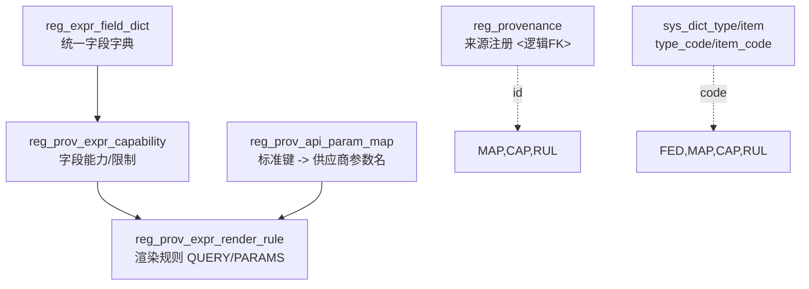

# Papertrace Registry · Expr Guide

导航： [体系总览](../README.md) ｜ 同域： [Expr Reference](Registry-expr-reference.md) ｜ [Expr Usage](Registry-expr-usage.md)

## 目录
- [1. 设计背景与目标](#sec-1)
- [2. 模型与依赖](#sec-2)

##  1. 设计背景与目标

**目标**：将系统的统一查询语义（Expr）抽象，与不同数据源（Provenance）的查询语法解耦，通过配置实现：
- 统一内部字段语义（`reg_expr_field_dict`）。
- 将标准键映射为供应商参数名（`reg_prov_api_param_map`）。
- 定义来源在各字段上的能力与约束（`reg_prov_expr_capability`）。
- 将 Expr 原子（字段 + 操作）渲染为 query 片段或 params（`reg_prov_expr_render_rule`）。

**原则**：
- **跨环境稳定**：一律使用 `*_code`（来自 `sys_dict_item.item_code`），不使用 ENUM。
- **确定性选择**：源敏感表按照“**作用域/任务类型/时间片 [from, to)** + 维度唯一键”建模，读侧任一时刻只返回 0..1 条。
- **职责边界清晰**：参数名映射（键名层）与渲染（模板层）分离；值级转换与模板级策略分离。
- **无物理外键**：`provenance_id` 等采用逻辑外键；靠上线校验与应用缓存保证一致性。

**非目标**：
- 不覆盖端点/分页等 HTTP 执行合同（仍由 `reg_prov_*` 负责）。
- 不做运行时合并/优先级竞争（用“时间片 + 唯一维度 + 当前生效”规则）。

---

##  2. 模型与依赖

**字典类型建议**：
- `reg_data_type`：`DATE/DATETIME/NUMBER/TEXT/KEYWORD/BOOLEAN/TOKEN`
- `reg_cardinality`：`SINGLE/MULTI`
- `reg_operation`：`SEARCH/DETAIL/LOOKUP`
- `reg_expr_op`：`TERM/IN/RANGE/EXISTS/TOKEN`
- `reg_range_kind`：`NONE/DATE/DATETIME/NUMBER`
- `reg_match_type`：`PHRASE/EXACT/ANY`
- `reg_emit_type`：`QUERY/PARAMS`
- `reg_transform`：如 `TO_EXCLUSIVE_MINUS_1D`、`PUBMED_DATETYPE`（可扩展）

> 约定：`item_code` 全大写；配置表中的 `*_code` 推荐大写，或查询时 `UPPER()` 对齐。

> 字典种子请参考《Registry-dict-schema-design》，规范编码包含 `endpoint_usage=DETAIL`（legacy `FETCH`）、`retry_after_policy=IGNORE/RESPECT/CLAMP`、`bucket_granularity_scope=GLOBAL/PER_KEY/PER_ENDPOINT/PER_IP/PER_TASK` 等。

---
