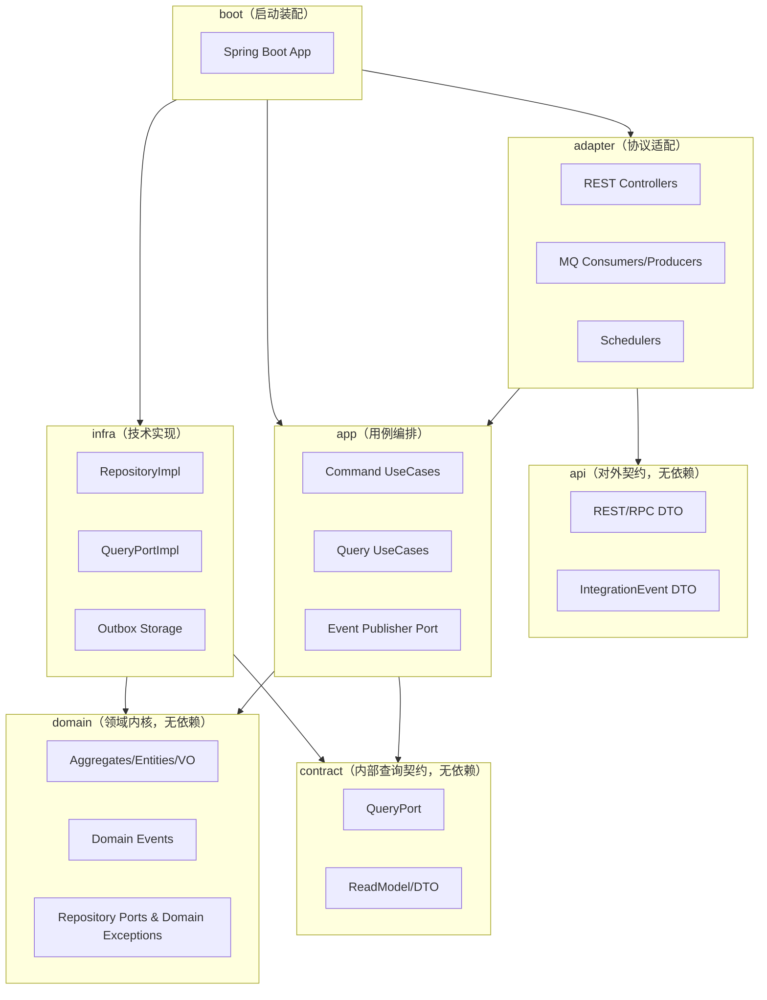
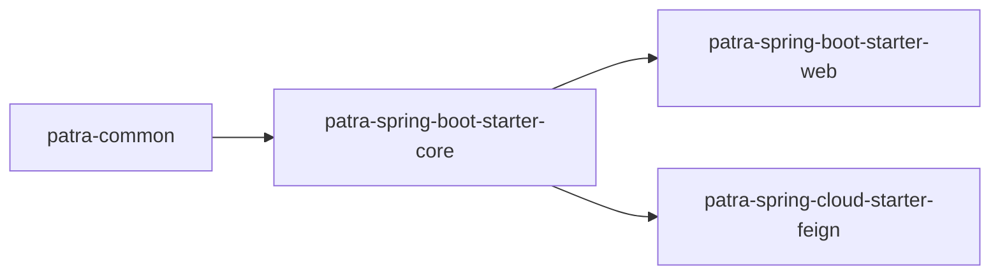
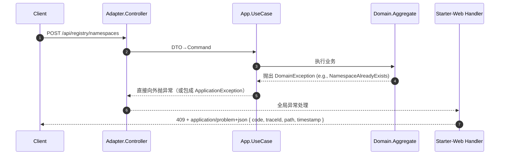
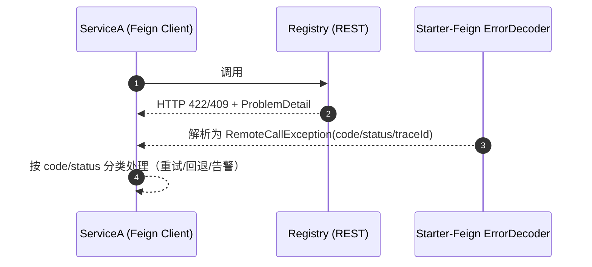

# Patra 异常体系设计规范（Hexagonal + DDD + CQRS，最终版）

> 版本：v1.0  
> 日期：2025-09-19  
> 适用技术栈：Java 21、Spring Boot 3.2.4、Spring Cloud 2023.0.1、Spring Cloud Alibaba 2023.0.1.0、MyBatis-Plus 3.5.12、Jackson  
> 适用架构：六边形架构（Hexagonal / Ports & Adapters）+ DDD + CQRS

---


## 目录
- [1. 目标与范围](#1-目标与范围)
- [2. 分层与依赖](#2-分层与依赖)
- [3. 设计原则](#3-设计原则)
- [4. 模块与分包](#4-模块与分包)
  - [4.1 patra-common（无 Spring 依赖）](#41-patra-common无-spring-依赖)
  - [4.2 patra-spring-boot-starter-core（需要 Spring Boot）](#42-patra-spring-boot-starter-core需要-spring-boot)
  - [4.3 patra-spring-boot-starter-web（需要 Web）](#43-patra-spring-boot-starter-web需要-web)
  - [4.4 patra-spring-cloud-starter-feign（需要 Feign）](#44-patra-spring-cloud-starter-feign需要-feign)
- [5. 错误码与 ProblemDetail 规范](#5-错误码与-problemdetail-规范)
- [6. 解析算法：从异常到 ProblemDetail（零配置优先）](#6-解析算法从异常到-problemdetail零配置优先)
- [7. Registry 业务上下文示例](#7-registry-业务上下文示例)
- [8. 配置最小集与示例](#8-配置最小集与示例)
- [9. 流程与时序](#9-流程与时序)
- [10. 测试策略](#10-测试策略)
- [11. 迁移与落地步骤](#11-迁移与落地步骤)
- [12. 反模式与守卫](#12-反模式与守卫)
- [13. 交付清单与目录模板](#13-交付清单与目录模板)
- [附录 A. 术语](#附录-a-术语)

---

## 1. 目标与范围

- 保持领域内核纯净：**domain** 只表达业务事实，不出现 HTTP/框架细节。
- 统一对外协议：REST 输出 `application/problem+json`（RFC 7807），Feign 客户端统一解码。
- 横切复用：异常处理、错误码映射、可观测字段注入沉淀到 Starter，一次实现，处处复用。
- 多上下文适配：每个上下文仅维护**领域异常**与**错误码清单**，无需重复写异常处理器/解码器。
- 可扩展与低维护：以 **约定优于配置** 与 **类型驱动** 为主，配置仅作少量补丁。

---

## 2. 分层与依赖

### 2.1 六边形分层（A → B 表示 A 依赖 B）



### 2.2 Starter 之间的依赖



---

## 3. 设计原则

1. **语义内聚**：领域异常只在所属上下文定义，命名体现语义（NotFound/Conflict/RuleViolation…）。
2. **技术隔离**：HTTP/ProblemDetail 仅在 Web Starter；Feign 解码仅在 Feign Starter。
3. **约定优于配置**：90% 通过类型/命名/特征解析；仅少量“细分业务码”通过代码映射覆盖。
4. **一次实现，全局复用**：全局异常处理器、Feign 解码器、状态映射 SPI 在 Starter 中只存在一份。
5. **契约优先**：错误码在 `api` 模块集中登记，ProblemDetail 扩展字段命名稳定。

---

## 4. 模块与分包

### 4.1 patra-common（无 Spring 依赖）

**职责**  
- 错误码契约与通用码集合。  
- 领域异常与应用异常的抽象（无 HTTP 概念）。  
- ProblemDetail 扩展字段常量。  
- 语义特征（ErrorTrait）与可选执行器（UseCaseExecutor）。

**对外契约（建议接口/常量）**  
- `com.patra.common.error.codes.ErrorCodeLike`：`String code()`（如 `REG-0409`）。  
- `com.patra.common.problem.ErrorKeys`：固定扩展键：`code/traceId/path/timestamp/errors`。  
- `com.patra.common.exception.DomainException`：运行时异常基类。  
- `com.patra.common.exception.ApplicationException`：带 `ErrorCodeLike code` 的运行时异常。  
- `com.patra.common.error.trait.ErrorTrait`、`HasErrorTraits`：语义特征声明。  
- `com.patra.common.core.UseCaseExecutor`（可选）：去除用例层样板 `try/catch`。

**包结构建议**  
```
com.patra.common
 ├─ error/
 │   ├─ codes/      # ErrorCodeLike & 通用码
 │   └─ trait/      # ErrorTrait, HasErrorTraits
 ├─ exception/      # DomainException, ApplicationException
 └─ problem/        # ErrorKeys 常量
```

---

### 4.2 patra-spring-boot-starter-core（需要 Spring Boot）

**职责**  
- 自动装配开关与配置属性。  
- SPI：状态映射、trace 提供、ProblemDetail 扩展字段贡献、异常→错误码覆盖映射。  
- 合并全局映射并供 Web/Feign Starter 使用。

**配置项（建议）**  
- `patra.error.enabled=true`  
- `patra.error.context-prefix=REG`（服务级别上下文前缀；**核心唯一必填**）  
- `patra.error.map-status.strategy=suffix-heuristic`  
- `patra.tracing.header-names=[ "traceId","X-B3-TraceId","traceparent" ]`

**SPI**  
- `StatusMappingStrategy`：`ErrorCodeLike → HttpStatus`（默认按后缀 04xx/05xx 推断）。  
- `TraceProvider`：提供 `traceId`（默认从请求头/MDC）。  
- `ProblemFieldContributor`：允许追加统一字段（如 tenant/env）。  
- `ErrorMappingContributor`：**少量细分码覆盖**：`Class<? extends Throwable> → ErrorCodeLike`。

**包结构建议**  
```
com.patra.starter.core
 ├─ autoconfig/        # CoreErrorAutoConfiguration
 ├─ config/            # ErrorProperties, TracingProperties
 └─ error/spi/         # StatusMappingStrategy, TraceProvider, ...
```

---

### 4.3 patra-spring-boot-starter-web（需要 Web）

**职责**  
- 全局 `@RestControllerAdvice`，把异常统一转换为 `application/problem+json`。  
- ProblemDetail 构建器与扩展字段写入。  
- 校验错误（JSR-380）标准化。

**配置项（建议）**  
- `patra.web.problem.enabled=true`  
- `patra.web.problem.type-base-url=https://errors.example.com/`  
- `patra.web.problem.include-stack=false`（非生产可开）

**扩展点**  
- `ExceptionMapperRegistry`：按异常类型定制 detail/title/status。  
- `ValidationErrorsFormatter`：定制字段错误数组。  
- `ProblemCustomizer`：ProblemDetail 最终加工。

**包结构建议**  
```
com.patra.starter.web
 ├─ autoconfig/                # WebErrorAutoConfiguration
 ├─ advice/                    # GlobalRestExceptionHandler
 └─ problem/                   # ProblemDetailBuilder, ValidationErrorsFormatter, ProblemCustomizer
```

---

### 4.4 patra-spring-cloud-starter-feign（需要 Feign）

**职责**  
- 统一 `ErrorDecoder`：解码下游 `ProblemDetail` → `RemoteCallException`。  
- 提供 `RemoteErrorHelper`（工具方法：`isConflict/isNotFound/is(code, "...")`）。  
- 可选“有限重试 + 抖动退避”（默认关闭）。

**配置项（建议）**  
- `patra.feign.problem.enabled=true`  
- `patra.feign.problem.tolerant=true`  
- `patra.feign.retry.enabled=false`

**包结构建议**  
```
com.patra.starter.feign
 ├─ autoconfig/            # FeignErrorAutoConfiguration
 ├─ error/                 # ProblemDetailErrorDecoder, RemoteCallException, RemoteErrorHelper
 └─ runtime/               # PatraFeignProperties, RequestInterceptor(传递 traceId)
```

---

## 5. 错误码与 ProblemDetail 规范

### 5.1 错误码格式
- 统一格式：`<CTX>-<NNNN>`，如 `REG-0409`。  
  - `<CTX>`：上下文前缀（Registry=REG、Order=ORD、Inventory=INV…）。  
  - `<NNNN>`：四位编号；建议约定与 HTTP 对齐：`0400/0404/0409/0422/0429/0500/0503/0504`。

### 5.2 ProblemDetail 扩展字段（固定）
- `code`（业务错误码，必填）  
- `traceId`（链路）  
- `path`（请求路径）  
- `timestamp`（ISO8601）  
- `errors`（字段校验错误数组，按需）

### 5.3 OpenAPI 约定
- 默认错误响应为 `ProblemDetail`，文档化扩展字段。  
- 链接错误码目录（每个上下文的 `api/error`）。

---

## 6. 解析算法：从异常到 ProblemDetail（零配置优先）

**解析顺序（命中即返回）**

1. **ApplicationException（强约束）**：直接使用其 `code`。  
2. **ErrorMappingContributor（细分覆盖，代码，而非 YAML）**：命中则使用映射的 `code`。  
3. **HasErrorTraits / 语义基类**：根据特征确定 HTTP 与 `<CTX>-04xx/05xx` 通用码。  
4. **命名约定兜底**：`*NotFound/*Conflict/*RuleViolation/*QuotaExceeded/*Unauthorized/*Forbidden/*Timeout/*Invalid`。  
5. **最终兜底**：返回 `422/<CTX>-0422` 或 `500/<CTX>-0500`。

**HTTP 状态缺省映射（核心策略）**  
| 特征/后缀 | HTTP |
|---|---|
| NOT_FOUND / `*NotFound` | 404 |
| CONFLICT / `*Conflict` | 409 |
| RULE_VIOLATION / `*Invalid/*Validation` | 422 |
| QUOTA / `*QuotaExceeded` | 429 |
| UNAUTHORIZED | 401 |
| FORBIDDEN | 403 |
| DEP_UNAVAILABLE | 503 |
| TIMEOUT | 504 |
| 未命中 | 422 或 500 |

**type 构造**：`{type-base-url}/{code.toLowerCase()}`。

---

## 7. Registry 业务上下文示例

### 7.1 领域异常（已实现清单）

**已实现的Registry领域异常层次结构**  
位于：`patra-registry-domain/src/main/java/com/patra/registry/domain/exception/`

**语义基类**
- `RegistryException`：Registry服务所有领域异常的基类
- `RegistryNotFound`：资源未找到类异常（实现 `HasErrorTraits`，返回 `NOT_FOUND` 特征）
- `RegistryConflict`：资源冲突类异常（实现 `HasErrorTraits`，返回 `CONFLICT` 特征）
- `RegistryRuleViolation`：业务规则违反类异常（实现 `HasErrorTraits`，返回 `RULE_VIOLATION` 特征）

**具体领域异常**

| 异常类（domain） | 继承关系 | 场景 | 错误码 | HTTP |
|---|---|---|---|---|
| `DictionaryNotFoundException` | `RegistryNotFound` | 字典类型/项目不存在 | REG-1401/1402 | 404 |
| `DictionaryItemDisabled` | `RegistryRuleViolation` | 字典项目被禁用 | REG-1403 | 422 |
| `DictionaryTypeAlreadyExists` | `RegistryConflict` | 字典类型已存在 | REG-1404 | 409 |
| `DictionaryItemAlreadyExists` | `RegistryConflict` | 字典项目已存在 | REG-1405 | 409 |
| `DictionaryTypeDisabled` | `RegistryRuleViolation` | 字典类型被禁用 | REG-1406 | 422 |
| `DictionaryValidationException` | `RegistryRuleViolation` | 字典数据验证失败 | REG-1407 | 422 |
| `DictionaryDefaultItemMissing` | `RegistryRuleViolation` | 缺少必需的默认项目 | REG-1408 | 422 |
| `DictionaryRepositoryException` | `RegistryException` | 数据库/存储层错误 | REG-1409 | 500 |
| `RegistryQuotaExceeded` | `RegistryException` | 配额超限 | REG-1501 | 429 |

**异常特性**
- 所有异常都包含详细的上下文信息（如 `typeCode`、`itemCode`）
- 实现了完整的构造函数重载（message、cause支持）
- 通过 `HasErrorTraits` 接口提供语义特征，支持自动HTTP状态映射
- 异常消息格式化统一，便于日志记录和问题排查

> **实现位置**：`patra-registry-domain/src/main/java/com/patra/registry/domain/exception/*`

### 7.2 错误码目录（由 `api` 模块维护）

**已实现的错误码目录**  
Registry服务的错误码目录已完整实现，位于 `patra-registry-api` 模块，与实际的领域异常完全对应。

**通用段（04xx/05xx）**  
`REG-0400/0401/0403/0404/0409/0422/0429`、`REG-0500/0503/0504`。

**业务细分段（1xxx）**（已实现）  
**字典操作（14xx系列）**
- `REG-1401` DICTIONARY_TYPE_NOT_FOUND → `DictionaryNotFoundException`（类型级别）
- `REG-1402` DICTIONARY_ITEM_NOT_FOUND → `DictionaryNotFoundException`（项目级别）
- `REG-1403` DICTIONARY_ITEM_DISABLED → `DictionaryItemDisabled`
- `REG-1404` DICTIONARY_TYPE_ALREADY_EXISTS → `DictionaryTypeAlreadyExists`
- `REG-1405` DICTIONARY_ITEM_ALREADY_EXISTS → `DictionaryItemAlreadyExists`
- `REG-1406` DICTIONARY_TYPE_DISABLED → `DictionaryTypeDisabled`
- `REG-1407` DICTIONARY_VALIDATION_ERROR → `DictionaryValidationException`
- `REG-1408` DICTIONARY_DEFAULT_ITEM_MISSING → `DictionaryDefaultItemMissing`
- `REG-1409` DICTIONARY_REPOSITORY_ERROR → `DictionaryRepositoryException`

**Registry通用操作（15xx系列）**
- `REG-1501` REGISTRY_QUOTA_EXCEEDED → `RegistryQuotaExceeded`

> **实现位置**：
> - 错误码枚举：`patra-registry-api/src/main/java/com/patra/registry/api/error/RegistryErrorCode.java`
> - 完整文档：`patra-registry-api/ERROR_CODE_CATALOG.md`
> - 包文档：`patra-registry-api/src/main/java/com/patra/registry/api/error/package-info.java`
> - 使用指南：`patra-registry-api/README.md`

**append-only原则**：新错误码可以追加，但现有错误码不可修改或删除，确保API稳定性。

### 7.3 Registry错误代码目录实现状态

**实现完成情况**  
Registry服务的错误代码目录已完整实现，包含以下组件：

**核心文件**
- `RegistryErrorCode.java`：实现 `ErrorCodeLike` 接口的错误码枚举
- `ERROR_CODE_CATALOG.md`：完整的错误码参考文档，包含使用示例
- `package-info.java`：包级别文档说明
- `README.md`：模块使用指南

**错误码映射策略**
```java
// 在 ErrorMappingContributor 中的映射示例
public class RegistryErrorMappingContributor implements ErrorMappingContributor {
    @Override
    public Optional<ErrorCodeLike> mapException(Throwable exception) {
        return switch (exception) {
            case DictionaryNotFoundException dnf when dnf.getItemCode() == null -> 
                Optional.of(RegistryErrorCode.REG_1401);
            case DictionaryNotFoundException dnf when dnf.getItemCode() != null -> 
                Optional.of(RegistryErrorCode.REG_1402);
            case DictionaryItemDisabled did -> 
                Optional.of(RegistryErrorCode.REG_1403);
            case DictionaryTypeAlreadyExists dtae -> 
                Optional.of(RegistryErrorCode.REG_1404);
            // ... 其他映射
            default -> Optional.empty();
        };
    }
}
```

**文档特性**
- **完整性**：涵盖所有已实现的领域异常
- **可检索性**：按类别组织，便于查找
- **示例丰富**：包含Java和客户端使用示例
- **版本管理**：遵循append-only原则，确保向后兼容

**集成验证**
- ✅ 编译通过验证
- ✅ 与现有领域异常完全对应
- ✅ 错误码格式符合 `REG-NNNN` 规范
- ✅ 文档完整性检查

### 7.5 App 层策略
- **常规做法**：**直接抛领域异常**，无需在用例里拼接错误码。系统会自动通过 `ErrorMappingContributor` 将领域异常映射到对应的错误码。
- **细分码场景**：对于需要特定错误码的场景，可以：
  - 抛 `ApplicationException(RegistryErrorCode.REG_xxxx)` 
  - 在 `RegistryErrorMappingContributor` 中添加精确映射
- **异常处理**：可选使用 `UseCaseExecutor` 把未知异常包装成 `REG-0500`，降低样板 `try/catch` 代码。

**实际使用示例**
```java
// App层服务示例
@Service
public class DictionaryAppService {
    
    // 直接抛领域异常，系统自动映射到 REG-1401
    public void validateDictionaryType(String typeCode) {
        if (!dictionaryRepository.existsByTypeCode(typeCode)) {
            throw new DictionaryNotFoundException(typeCode);
        }
    }
    
    // 需要特定错误码时使用 ApplicationException
    public void performCriticalOperation() {
        try {
            // 业务逻辑
        } catch (Exception e) {
            throw new ApplicationException(RegistryErrorCode.REG_1501, 
                "Critical operation failed: " + e.getMessage());
        }
    }
}
```

### 7.6 运行时示例（ProblemDetail）

**字典类型已存在异常示例**
```json
{
  "type": "https://errors.example.com/reg-1404",
  "title": "REG-1404",
  "status": 409,
  "detail": "Dictionary type already exists: sources",
  "code": "REG-1404",
  "traceId": "c9d2a6f4c7b9e21a",
  "path": "/api/registry/dictionaries/types",
  "timestamp": "2025-09-19T03:08:02.417Z"
}
```

**字典项目未找到异常示例**
```json
{
  "type": "https://errors.example.com/reg-1402",
  "title": "REG-1402",
  "status": 404,
  "detail": "Dictionary item not found: typeCode=sources, itemCode=pubmed",
  "code": "REG-1402",
  "traceId": "a1b2c3d4e5f6g7h8",
  "path": "/api/registry/dictionaries/sources/items/pubmed",
  "timestamp": "2025-09-19T03:08:02.417Z"
}
```

**字典项目被禁用异常示例**
```json
{
  "type": "https://errors.example.com/reg-1403",
  "title": "REG-1403",
  "status": 422,
  "detail": "Dictionary item is disabled: typeCode=sources, itemCode=deprecated-source",
  "code": "REG-1403",
  "traceId": "x1y2z3a4b5c6d7e8",
  "path": "/api/registry/dictionaries/sources/items/deprecated-source",
  "timestamp": "2025-09-19T03:08:02.417Z"
}
```

---

## 8. 配置最小集与示例

> 仅需上下文前缀，其他为默认约定。极少量覆盖使用 **代码映射** 而非 YAML。

```yaml
patra:
  error:
    enabled: true
    context-prefix: REG           # 每个服务一个值
    map-status:
      strategy: suffix-heuristic  # 默认即可
  web:
    problem:
      enabled: true
      type-base-url: https://errors.example.com/
      include-stack: false        # 非生产 false
  feign:
    problem:
      enabled: true
      tolerant: true
  tracing:
    header-names: [ "traceId", "X-B3-TraceId", "traceparent" ]
```

---

## 9. 流程与时序

### 9.1 REST 写侧（典型）


### 9.2 Feign 调用（典型）


---

## 10. 测试策略

- **domain**：对每个领域异常编写触发用例，验证不变量与规则。  
- **app**：验证少量 `ApplicationException(REG-1xxx)` 的决策点；`UseCaseExecutor` 包装逻辑。  
- **web**：集成测断言 HTTP 状态与 ProblemDetail 扩展字段；校验异常输出 `errors[]`。  
- **feign**：模拟多种下游 ProblemDetail；校验解码后的 `RemoteCallException` 字段与分类工具。

---

## 11. 迁移与落地步骤

1. 在每个 `xxx-domain` 建立 `…domain.exception` 语义层级（NotFound/Conflict/RuleViolation/QuotaExceeded…）。  
2. 在 `xxx-api/error` 建立错误码清单（前缀化、可检索）。  
3. 在 `xxx-app` 仅在 **少数**场景使用 `ApplicationException(REG-1xxx)`，其余直接抛领域异常。  
4. 引入 Starter：删除本地 `@ExceptionHandler`/`ErrorDecoder`，启用统一处理与解码。  
5. 在 `boot` 层配置 `patra.error.context-prefix` 与 `type-base-url`。  
6. OpenAPI 文档声明默认错误响应为 ProblemDetail，并链接错误码清单。  
7. 建立观测看板：`HTTP × code × path` 与 `Feign 下游 × code`。

---

## 12. 反模式与守卫

- 在 domain 中出现 HTTP/ProblemDetail → **禁止**。  
- 大量 YAML 列举“异常→状态/码” → **弃用**，改用类型/特征与少量代码映射。  
- 滥用“万能 BusinessException” → **拆分**为语义类（NotFound/Conflict/RuleViolation…）。  
- 在 adapter 中拼错误码或拦截异常 → **收敛**到 Starter。  
- 生产返回堆栈 → `include-stack=false`。

---

## 13. 交付清单与目录模板

**一览**  
- `patra-common`：错误码契约、异常抽象、ProblemDetail 常量、ErrorTrait/HasErrorTraits、（可选）UseCaseExecutor。  
- `patra-spring-boot-starter-core`：配置属性、SPI（StatusMappingStrategy/TraceProvider/ProblemFieldContributor/ErrorMappingContributor）、自动装配。  
- `patra-spring-boot-starter-web`：全局异常处理器、ProblemDetail 构建器、校验错误标准化、扩展点、自动装配。  
- `patra-spring-cloud-starter-feign`：ErrorDecoder、RemoteCallException、RemoteErrorHelper、（可选）重试、自动装配。  
- **Registry上下文**（✅ 已实现）：
  - `domain.exception`：完整的语义化异常层级（NotFound/Conflict/RuleViolation等）
  - `api/error`：完整的错误码目录（RegistryErrorCode枚举 + 文档）
  - 错误码映射：领域异常到业务错误码的完整映射关系

**目录模板（与现有结构对齐）**

```
patra-common/
  src/main/java/com/patra/common/{error,exception,problem}/...

patra-spring-boot-starter-core/
  src/main/java/com/patra/starter/core/{autoconfig,config,error/spi}/...

patra-spring-boot-starter-web/
  src/main/java/com/patra/starter/web/{autoconfig,advice,problem}/...

patra-spring-cloud-starter-feign/
  src/main/java/com/patra/starter/feign/{autoconfig,error,runtime}/...

patra-registry-domain/
  src/main/java/com/patra/registry/domain/{exception,model,port}/...

patra-registry-api/ (✅ 已实现)
  src/main/java/com/patra/registry/api/error/
    ├── RegistryErrorCode.java           # 错误码枚举
    └── package-info.java                # 包文档
  ├── ERROR_CODE_CATALOG.md              # 完整错误码参考文档
  └── README.md                          # 模块使用指南
```

---

## 附录 A. 术语

- **领域异常（DomainException）**：仅表达业务规则/不变量破坏，不携带 HTTP/协议信息。  
- **应用异常（ApplicationException）**：用例层语义异常，可携带业务错误码，但仍与 HTTP 解耦。  
- **ProblemDetail**：RFC 7807 标准问题详情结构，作为 REST 统一错误响应体。  
- **错误码（ErrorCodeLike）**：对外可见的业务错误编号（如 `REG-0409`）。  
- **语义特征（ErrorTrait）**：对异常进行语义标注，以驱动默认 HTTP 与通用码映射。  
- **细分码覆盖（ErrorMappingContributor）**：以**代码**映射小量异常到更细粒度的业务码（如 `REG-1001`）。
