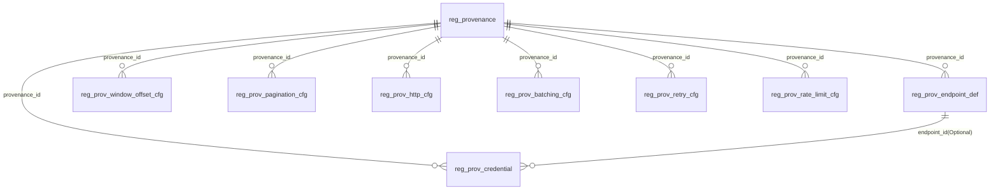

# Papertrace Registry · Provenance Config Reference

导航： [体系总览](../README.md) ｜ 同域： [Prov Guide](Registry-prov-config-guide.md) ｜ [Prov Ops](Registry-prov-config-ops.md) ｜ [Prov Examples](Registry-prov-config-examples.md)

## 目录
- [1. 表清单与关系概览](#sec-1)
  - [1.1 表清单（逐表一句话定位）](#sec-1-1)
  - [1.2 关系图（ER 概览）](#sec-1-2)
  - [1.3 维度、作用域与时间区间的组合规则](#sec-1-3)
  - [1.4 “当前生效配置”的装配流程（读侧）](#sec-1-4)
  - [1.5 发布与“仅一条当前生效”的应用侧护栏](#sec-1-5)
- [2. 表结构详解（字段、索引、外键、使用建议）](#sec-2)
  - [2.1 `reg_provenance` — 来源主数据](#sec-2-1)
  - [2.2 `reg_prov_endpoint_def` — 端点定义](#sec-2-2)
  - [2.3 `reg_prov_window_offset_cfg` — 时间窗口与增量指针](#sec-2-3)
  - [2.4 `reg_prov_pagination_cfg` — 分页与游标](#sec-2-4)
  - [2.5 `reg_prov_http_cfg` — HTTP 策略](#sec-2-5)
  - [2.6 `reg_prov_batching_cfg` — 批量抓取与请求成型](#sec-2-6)
  - [2.7 `reg_prov_retry_cfg` — 重试与退避](#sec-2-7)
  - [2.8 `reg_prov_rate_limit_cfg` — 限流与并发](#sec-2-8)
  - [2.9 `reg_prov_credential` — 鉴权/密钥](#sec-2-9)
  - [2.10 查询与索引使用建议（通用）](#sec-2-10)


## <a id="sec-1"></a> 1. 表清单与关系概览

### <a id="sec-1-1"></a> 1.1 表清单（逐表一句话定位）

* **`reg_provenance`**：来源主数据（Provenance Registry），登记外部数据源（如 PubMed、Crossref）的基础信息（编码、名称、默认
  BaseURL、默认时区、启用状态等）。
* **`reg_prov_endpoint_def`**：端点定义（Endpoint Definition），描述某来源在某时间区间内可用的**搜索/详情/令牌**
  等端点形态与默认参数（HTTP 方法、路径模板、默认 query/body、是否鉴权、端点级分页参数名等）。
* **`reg_prov_window_offset_cfg`**：时间窗口与增量指针配置（Window &
  Offset），定义窗口切分模式（滑动/日历对齐）、窗口长度/重叠/回看、水位滞后，以及增量指针类型与默认日期字段。
* **`reg_prov_pagination_cfg`**：分页与游标配置（Pagination），定义页码/游标/令牌式分页策略及响应中下一游标的提取方式。
* **`reg_prov_http_cfg`**：HTTP 策略（HTTP Policy），定义基础 URL 覆盖、默认请求头、超时、TLS、代理、`Retry-After` 与幂等等策略。
* **`reg_prov_batching_cfg`**：批量抓取与请求成型（Batching & Request Shaping），控制详情批量、ID 参数名/分隔符、并行度/背压、请求模板与压缩策略。
* **`reg_prov_retry_cfg`**：重试与退避（Retry & Backoff），定义最大重试、退避策略、状态码白/黑名单、断路器阈值与冷却时间。
* **`reg_prov_rate_limit_cfg`**：限流与并发（Rate Limit & Concurrency），定义 QPS、突发桶、并发上限、桶粒度（全局/按密钥/按端点）、平滑窗口、自适应服务端速率头。
* **`reg_prov_credential`**：鉴权/密钥（Credentials/Authentication），定义多把凭证（API Key、Bearer、Basic、OAuth2 等），可**可选
  **绑定到某个端点定义，支持区间重叠以实现平滑轮换。

> 注：除凭证外，所有 `reg_prov_*` 配置/定义表均支持**作用域** `scope_code={SOURCE|TASK}` 与**任务**
`task_type={harvest|update|backfill}`；生成列 `task_type_key = IFNULL(task_type,'ALL')` 用于唯一索引与查询过滤。
> 约定：**不使用触发器/CHECK**；区间不重叠、作用域-任务互斥等规则由**应用层保证**。

### <a id="sec-1-2"></a> 1.2 关系图（ER 概览）



* **强外键**

    * 所有 `reg_prov_*` 表通过 `provenance_id → reg_provenance.id` 强关联。
    * `reg_prov_credential.endpoint_id → reg_prov_endpoint_def.id` 为**可选外键**（即此凭证仅用于某个端点）。
* **弱组合（运行时装配）**

    * 端点定义 + HTTP 策略 + 分页/游标 + 批量成型 + 重试退避 + 限流并发 + 凭证，共同构成一次“采集运行合同”。
    * 组合时，**每个维度只取一条“当前生效记录”**（优先 TASK → 回退 SOURCE）。

### <a id="sec-1-3"></a> 1.3 维度、作用域与时间区间的组合规则

* **作用域选择**：当同一维度同时存在 `TASK` 与 `SOURCE` 两种配置，运行时**优先 TASK**（严格匹配 `task_type`），否则回退
  `SOURCE`。
* **时间区间**：采用 `[effective_from, effective_to)`；`effective_to` 可为 NULL 表示“未设结束时间”。同维度不重叠由**应用层
  **保证。
* **端点局部覆盖**：端点定义提供 `page_param_name / page_size_param_name / cursor_param_name / ids_param_name` 等**端点级覆盖
  **，只对该端点请求生效。

### <a id="sec-1-4"></a> 1.4 “当前生效配置”的装配流程（读侧）

**输入**：`provenance_code`、`task_type`（可选）、`endpoint_name`（可选）。
**输出**：每个维度一条“当前生效”记录。

伪 SQL 模板（以“分页维度”为例，其它维度仅换表名）：

```sql
-- 获取 provenance_id
SELECT id
INTO @pid
FROM reg_provenance
WHERE provenance_code = :code;

-- 统一时间戳（UTC）
SET @now = UTC_TIMESTAMP();

-- 优先 TASK 级（严格匹配 task_type）
(SELECT *
 FROM reg_prov_pagination_cfg
 WHERE provenance_id = @pid
   AND scope_code = 'TASK'
   AND task_type = :taskType
   AND lifecycle_status_code = 'ACTIVE'
   AND deleted = 0
   AND effective_from <= @now
   AND (effective_to IS NULL OR effective_to > @now)
 ORDER BY effective_from DESC, id DESC
 LIMIT 1)
UNION ALL
-- 回退 SOURCE 级
(SELECT *
 FROM reg_prov_pagination_cfg
 WHERE provenance_id = @pid
   AND scope_code = 'SOURCE'
   AND lifecycle_status_code = 'ACTIVE'
   AND deleted = 0
   AND effective_from <= @now
   AND (effective_to IS NULL OR effective_to > @now)
 ORDER BY effective_from DESC, id DESC
 LIMIT 1)
LIMIT 1;
```

> 建议：应用层封装“取一维度当前生效”的通用方法，避免重复 SQL。

---

### <a id="sec-1-5"></a> 1.5 发布与“仅一条当前生效”的应用侧护栏

不在 DB 端做区间重叠的强校验；发布流建议：

- 幂等键：每次“发布版本”生成 `publish_idempotency_key`，以免重复提交。
- 锁粒度：按维度获取行级锁（例如“当前维度最近一条”`SELECT ... FOR UPDATE`），再插入新记录；避免并发写入冲突。
- 乐观锁：使用 `version` 字段做乐观锁更新；冲突时重试。
- 重叠检测：应用侧在提交前做“与现有区间的轻量冲突检查”，只提示告警，不阻塞（允许有意轮换的重叠）。

读取侧一律依据 `effective_from/to` 与 `ORDER BY effective_from DESC, id DESC LIMIT 1` 选择当前生效，不受区间重叠影响。

`(provenance_id, scope_code, task_type_key, [endpoint_name], effective_from)`。

#### 1.5.A 伪代码（Java，应用层，无触发器）

```java
// 目标：发布一条“新区间配置”并确保读侧可预测、写侧无死锁/无触发器

class Dim {
    Long provenanceId;
    String scope_code;           // "TASK" | "SOURCE"
    String taskType;        // may be null when scope_code == SOURCE
    Long endpointId;        // optional for credential binding
}

interface PublishLogRepository {
    boolean existsByKey(String idempotencyKey);

    void save(String idempotencyKey, String table, Dim dim, Long newId);
}

interface GenericConfigRepository<T> {
    // 锁住该维度最近一条（FOR UPDATE），避免并发写冲突
    Optional<T> selectLatestForUpdate(String table, Dim dim);

    // 轻量重叠检查（仅提示，不强挡写）
    boolean existsOverlap(String table, Dim dim, Instant from, Instant toNullable);

    Long insert(String table, T record);
}

class PublishService {
    private final PublishLogRepository publishLogRepo;
    private final GenericConfigRepository<Object> repo;

    PublishService(PublishLogRepository publishLogRepo, GenericConfigRepository<Object> repo) {
        this.publishLogRepo = publishLogRepo;
        this.repo = repo;
    }

    // @Transactional
    public void publishConfig(String table, Dim dim, Object newRecord, String idempotencyKey) {
        if (publishLogRepo.existsByKey(idempotencyKey)) {
            return; // 幂等：重复提交直接返回
        }

        // tx.begin();
        Instant now = Instant.now();

        // 1) 锁维度最近一条，避免并发写入（行级锁）
        repo.selectLatestForUpdate(table, dim);

        // 2) 重叠检查（仅日志告警，不阻塞）
        // 假定 newRecord 有 getEffectiveFrom()/getEffectiveTo()
        Instant from = (Instant) invoke(newRecord, "getEffectiveFrom");
        Instant to = (Instant) invoke(newRecord, "getEffectiveTo");
        if (repo.existsOverlap(table, dim, from, to)) {
            // log.warn("interval overlapped; allowed for rotation/gray release");
        }

        // 3) 插入新记录（不修改旧记录的起点；如需回收，另行设置旧记录 effective_to）
        set(newRecord, "lifecycleStatusCode", "ACTIVE");
        set(newRecord, "deleted", 0);
        set(newRecord, "createdAt", now);
        set(newRecord, "updatedAt", now);
        set(newRecord, "version", 0);
        Long newId = repo.insert(table, newRecord);

        publishLogRepo.save(idempotencyKey, table, dim, newId);
        // tx.commit();
    }
}

// 读取单维度当前生效（TASK 优先，SOURCE 回退）。返回 0/1 行
class ActiveSelector {
    /**
     * SQL 形态（两段 UNION ALL 取 Top1）：
     * 1) scope_code='TASK' and task_type=?
     * 2) scope_code='SOURCE'
     * where lifecycle_status_code='ACTIVE' and deleted=0
     *   and effective_from<=now and (effective_to is null or effective_to>now)
     * order by effective_from desc, id desc limit 1
     */
    Optional<Object> selectActive(String table, long pid, String taskType, Instant now) {
        // 伪代码：用查询构造器/Mapper 实现上述 SQL
        return Optional.empty();
    }
}

// 凭证选择：端点绑定优先 → 默认标记 → 最新（按 effective_from desc, id desc）
class CredentialSelector {
    List<Object> listActiveCredentials(long pid, String taskType, Long endpointId, Instant now, int topN) {
        List<Object> bound = queryCredentials(pid, taskType, endpointId, now);
        List<Object> global = queryCredentials(pid, taskType, null, now);
        List<Object> merged = new ArrayList<>();
        merged.addAll(bound);
        merged.addAll(global);
        // 排序：is_default_preferred desc, effective_from desc, id desc
        merged.sort((a, b) -> compare(a, b));
        return merged.stream().limit(topN).toList();
    }

    private List<Object> queryCredentials(long pid, String taskType, Long endpointId, Instant now) {
        // 伪实现：SELECT * FROM reg_prov_credential WHERE ...
        return List.of();
    }
}

// 区间重叠检查（应用层；仅提示，不依赖触发器/CHECK）
class OverlapChecker {
    boolean overlapsWithExisting(String table, Dim dim, Instant from, Instant toNullable) {
        // exists (
        //  select 1 from {table}
        //   where provenance_id=? and scope_code=? and task_type_key=COALESCE(?, 'ALL')
        //     and NOT( (effective_to is not null and effective_to <= :from)
        //              or (:toNullable is not null and :toNullable <= effective_from) )
        //  limit 1
        // )
        return false;
    }
}
```

---


## <a id="sec-2"></a> 2. 表结构详解（字段、索引、外键、使用建议）

> 说明：以下与已发布的建表 SQL 一一对应；不含触发器/CHECK/审计字段。
> 公共字段模式（除凭证）：`provenance_id` + `scope_code` + `task_type` + `effective_from/to` + 生成列 `task_type_key` +
> 维度唯一索引

### <a id="sec-2-1"></a> 2.1 `reg_provenance` — 来源主数据

**定位**：登记外部数据源（Provenance），作为所有配置的外键根。
**关键字段**

* `id`：主键。
* `provenance_code`（唯一）：来源编码（如 `pubmed` / `crossref`），用于配置引用与查找。
* `provenance_name`：人类可读名称。
* `base_url_default`：默认基础 URL（例如 PubMed 的 `https://eutils.ncbi.nlm.nih.gov/entrez`），可被 HTTP 策略覆盖。
* `timezone_default`：默认时区（IANA，如 `UTC`）。
* `docs_url`：官方文档链接（便于排障）。
* `is_active`：是否启用。

**索引/唯一**

* `uk_reg_provenance_code (provenance_code)`：保证编码唯一。

**使用建议**

* 写入前先检查是否存在相同 `provenance_code`。
* **读侧**以 `provenance_code` 换取 `id`，作为其它维度的查询入参。

---

### <a id="sec-2-2"></a> 2.2 `reg_prov_endpoint_def` — 端点定义

**定位**：定义搜索/详情/令牌等端点，附带默认 query/body、HTTP 方法、是否鉴权；提供端点级分页参数覆盖。
**关键字段**

* `provenance_id`：外键 → `reg_provenance.id`。
* `scope_code` / `task_type` / `task_type_key`：作用域与任务。
* `endpoint_name`：端点逻辑名（如 `esearch`、`efetch`、`works`、`token`）。
* `effective_from/to`：生效区间。
* `endpoint_usage_code`：用途枚举（`SEARCH|DETAIL|TOKEN|...`，`FETCH` 为 legacy 别名，通过字典 alias 映射至 `DETAIL`）。
* `http_method_code`：`GET|POST|PUT|PATCH|DELETE|HEAD|OPTIONS`。
* `path_template`：相对（推荐）或绝对路径。
* `default_query_params` / `default_body_payload`（JSON）：默认 query 与 body（应用层合并）。
* `request_content_type`：请求体类型（JSON/Form 等）。
* `is_auth_required`：是否需要鉴权。
* `credential_hint_name`：偏好的凭证标签（与 `reg_prov_credential.credential_name` 协作）。
* 覆盖参数名：`page_param_name | page_size_param_name | cursor_param_name | ids_param_name`。

**索引/唯一**

* **维度唯一**
  `uk_reg_prov_endpoint_def__dim_from (provenance_id, scope_code, task_type_key, endpoint_name, effective_from)`
* 辅助索引：`idx_reg_prov_endpoint_def__dim_to (...)`、`idx_reg_prov_endpoint_def__usage (endpoint_usage_code)`

**使用建议**

* 搜索请求：取 `endpoint_usage_code='SEARCH'` 的当前生效端点；详情请求：取 `DETAIL`。
* 覆盖分页参数名：若设置则在该端点**优先生效**，否则落回 `reg_prov_pagination_cfg`。

---

### <a id="sec-2-3"></a> 2.3 `reg_prov_window_offset_cfg` — 时间窗口与增量指针

**定位**：切窗策略（滑动/日历对齐）、窗口长度/重叠/回看、水位滞后；增量指针（DATE/ID/COMPOSITE）。
**关键字段**

* 窗口：`window_mode_code (SLIDING|CALENDAR)`、`window_size_value + window_size_unit_code`、`calendar_align_to`、
  `lookback_value/unit`、`overlap_value/unit`、`watermark_lag_seconds`。
* 指针：`offset_type_code (DATE|ID|COMPOSITE)`、`offset_field_name`、`offset_date_format`、`default_date_field_name`。
* 限制：`max_ids_per_window`、`max_window_span_seconds`（防止超大窗口）。

**索引/唯一**

* `uk_reg_prov_window_offset_cfg__dim_from (provenance_id, scope_code, task_type_key, effective_from)`
* `idx_reg_prov_window_offset_cfg__dim_to (...)`

**使用建议**

* **PubMed Update**：常用 `SLIDING` + `window_size=1 DAY` + `overlap=1 DAY` + `default_date_field_name='EDAT'`。
* **Crossref Harvest**：常用 `SLIDING` + `default_date_field_name='indexed'`。
* `watermark_lag_seconds` 用于乱序/迟到处理，配合应用内的 Watermark 逻辑。

---

### <a id="sec-2-4"></a> 2.4 `reg_prov_pagination_cfg` — 分页与游标

**定位**：页码（`PAGE_NUMBER`）、游标（`CURSOR`）、令牌（`TOKEN`）、滚动（`SCROLL`）的参数与响应提取规则。
**关键字段**

* 基本：`pagination_mode_code`、`page_size_value`、`max_pages_per_execution`、`page_number_param_name`、
  `page_size_param_name`、
  `start_page_number`、`sort_field_param_name`、`sort_direction`。
* 游标/令牌：`cursor_param_name`、`initial_cursor_value`、`next_cursor_jsonpath`、`has_more_jsonpath`、
  `total_count_jsonpath`。

**索引/唯一**

* `uk_reg_prov_pagination_cfg__dim_from (...)`
* `idx_reg_prov_pagination_cfg__dim_to (...)`

**使用建议**

* **PubMed**：多用 `PAGE_NUMBER`，`page_number_param_name='page'`，`page_size_param_name='retmax'`。
* **Crossref**：多用 `CURSOR`，`cursor_param_name='cursor'`，`next_cursor_jsonpath='$.message["next-cursor"]'`。
* 若端点定义里设置了 `page_param_name` 等，则优先使用端点级覆盖。

---

### <a id="sec-2-5"></a> 2.5 `reg_prov_http_cfg` — HTTP 策略

**定位**：来源/TASK 级 HTTP 行为（BaseURL 覆盖、默认 Header、超时、TLS、代理、`Retry-After`、幂等等）。
**关键字段**

* `base_url_override`：覆盖 `reg_provenance.base_url_default`。
* `default_headers_json`：常见 UA/邮箱/`mailto` 等。
* 超时：`timeout_connect_millis`、`timeout_read_millis`、`timeout_total_millis`。
* TLS/代理：`tls_verify_enabled`、`proxy_url_value`、`prefer_http2_enabled`、`accept_compress_enabled`。
* `Retry-After`：`retry_after_policy_code (IGNORE|RESPECT|CLAMP)` + `retry_after_cap_millis`。
* 幂等：`idempotency_header_name` + `idempotency_ttl_seconds`。

**索引/唯一**

* `uk_reg_prov_http_cfg__dim_from (...)`
* `idx_reg_prov_http_cfg__dim_to (...)`

**使用建议**

* **Crossref** 官方建议加 `User-Agent` 与 `mailto`，可放入 `default_headers_json`。
* 若存在多个 BaseURL（如地域线路），可用区间切换实现灰度/回滚。

---

### <a id="sec-2-6"></a> 2.6 `reg_prov_batching_cfg` — 批量抓取与请求成型

**定位**：详情批量、ID 参数名/分隔符、并行/背压、请求模板与压缩。
**关键字段**

* 批量：`detail_fetch_batch_size`、`ids_param_name`、`ids_join_delimiter`、`max_ids_per_request`。
* 并发：`app_parallelism_degree`、`per_host_concurrency_limit`、`http_conn_pool_size`。
* 背压：`backpressure_strategy_code (BLOCK|DROP|YIELD)`。
* 成型：`request_template_json`（自定义 query/body 映射）。
* 压缩：`payload_compress_strategy_code (NONE|GZIP)`、`prefer_compact_payload`。

**索引/唯一**

* `uk_reg_prov_batching_cfg__dim_from (...)`
* `idx_reg_prov_batching_cfg__dim_to (...)`

**使用建议**

* 与 `reg_prov_endpoint_def.ids_param_name` 组合：端点覆盖优先生效。
* `max_ids_per_request` 需小于服务端限制；以免 414/413。
* 并发与限流需协同 `reg_prov_rate_limit_cfg`。

---

### <a id="sec-2-7"></a> 2.7 `reg_prov_retry_cfg` — 重试与退避

**定位**：网络/服务端异常的重试与退避规则，支持断路器。
**关键字段**

* 次数与退避：`max_retry_times`、`backoff_policy_type_code (FIXED|EXP|EXP_JITTER|DECOR_JITTER)`、`initial_delay_millis`、
  `max_delay_millis`、`exp_multiplier_value`、`jitter_factor_ratio`。
* 状态码：`retry_http_status_json`（可重试）与 `giveup_http_status_json`（不重试）。
* 网络错误：`retry_on_network_error`。
* 断路器：`circuit_break_threshold`、`circuit_cooldown_millis`。

**索引/唯一**

* `uk_reg_prov_retry_cfg__dim_from (...)`
* `idx_reg_prov_retry_cfg__dim_to (...)`

**使用建议**

* **429/503** 常设为可重试；**400/401** 通常不重试。
* **带抖动的指数退避**（`EXP_JITTER`）更稳健，减少惊群。
* 与 `HTTP.retry_after_policy_code` 联动：若服务端返回 `Retry-After`，可选择尊重或限幅。

---

### <a id="sec-2-8"></a> 2.8 `reg_prov_rate_limit_cfg` — 限流与并发

**定位**：客户端侧的令牌桶/QPS、突发、并发上限与桶粒度设置。
**关键字段**

* 速率与突发：`rate_tokens_per_second`、`burst_bucket_capacity`。
* 并发：`max_concurrent_requests`。
* 粒度：`bucket_granularity_scope_code (GLOBAL|PER_KEY|PER_ENDPOINT|PER_IP|PER_TASK)`。
* 自适应：`respect_server_rate_header`（遵循服务端 `X-RateLimit-*`）。
* 平滑：`smoothing_window_millis`。

**索引/唯一**

* `uk_reg_prov_rate_limit_cfg__dim_from (...)`
* `idx_reg_prov_rate_limit_cfg__dim_to (...)`

**使用建议**

* 若使用多把密钥，可设 `bucket_granularity_scope_code='PER_KEY'`，并配合 `per_credential_qps_limit`（见字段
  `per_credential_qps_limit`）。
* 与 `reg_prov_batching_cfg.app_parallelism_degree` 协同，避免客户端拥塞。

> 注：本表字段名在 SQL 中为
> `rate_tokens_per_second` / `burst_bucket_capacity` / `max_concurrent_requests` /
> `per_credential_qps_limit` / `bucket_granularity_scope_code` /
> `smoothing_window_millis` / `respect_server_rate_header`。

---

### <a id="sec-2-9"></a> 2.9 `reg_prov_credential` — 鉴权/密钥

**定位**：为来源/TASK 配置多把凭证（API Key、Bearer、Basic、OAuth2…），**可选**绑定端点，允许区间重叠以支持轮换。
**关键字段**

* 归属：`provenance_id`（外键） + `scope_code/task_type`。
* **端点绑定**：`endpoint_id`（可空；外键 → `reg_prov_endpoint_def.id`），用于“某凭证只给某个端点使用”。
* 基本信息：`credential_name`（标签）、`auth_type`、`inbound_location_code (HEADER|QUERY|BODY)`。
* API Key/Bearer：`credential_field_name`、`credential_value_prefix`（如 `"Bearer "`）、`credential_value_plain`（建议存引用）。
* Basic：`basic_username`、`basic_password`。
* OAuth2：`oauth_token_url`、`oauth_client_id`、`oauth_client_secret`、`oauth_scope`、`oauth_audience`。
* 扩展：`extra_json`（签名算法、HMAC 盐、额外 Header 模板等）。
* 生效区间：`effective_from/effective_to`（允许重叠）；优先策略由应用侧决定（可参考 `is_default_preferred`）。

**索引/外键**

* 外键：`provenance_id → reg_provenance.id`；`endpoint_id → reg_prov_endpoint_def.id`（可空）。
* 索引：`idx_reg_prov_credential__dim (provenance_id, scope_code, task_type, endpoint_id, credential_name)`、
  `idx_reg_prov_credential__effective (effective_from, effective_to)`。

**使用建议**

* **轮换**：先插入新凭证（`effective_from=当前`），将旧凭证 `effective_to=当前+重叠窗口`，待观测稳定后再关闭旧凭证。
* **端点绑定**：若某端点需要单独的密钥或更高配额，可填 `endpoint_id` 指向对应端点定义。
* **安全**：`credential_value_plain` 建议存**引用**（如 KMS 的 key id），真实密钥由应用从安全存储获取。

---

### <a id="sec-2-10"></a> 2.10 查询与索引使用建议（通用）

* **过滤顺序**：`provenance_id` → `scope_code`/`task_type`（或 `task_type_key`）→ `effective_from <= now < effective_to` →
  `ORDER BY effective_from DESC, id DESC LIMIT 1`。
* **复合索引命中**：已在各表建立 `(provenance_id, scope_code, task_type_key, ..., effective_from)` 复合唯一索引，结合
  `effective_to` 辅助索引，能高效支撑“当前生效记录”的检索。
* **缓存建议**：读侧可将“（provenance\_code, task\_type）→ 维度配置聚合体”进行短 TTL 缓存；端点级也可按 `endpoint_name`
  做二级缓存。
* **并发写入**：灰度/回滚建议采用“先加新→再关旧”的顺序，并在应用侧做幂等与区间冲突检测。
