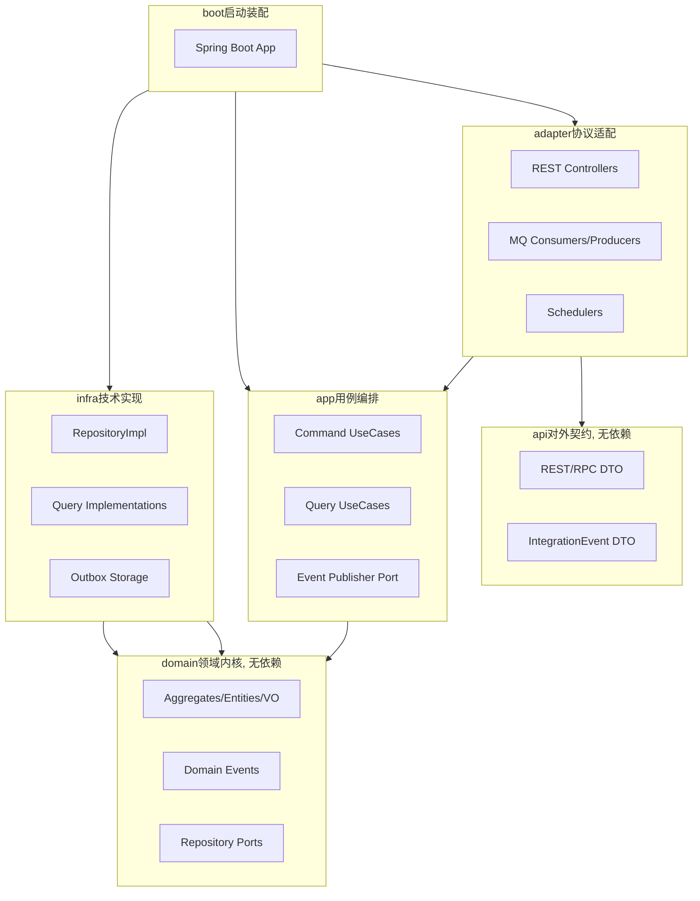
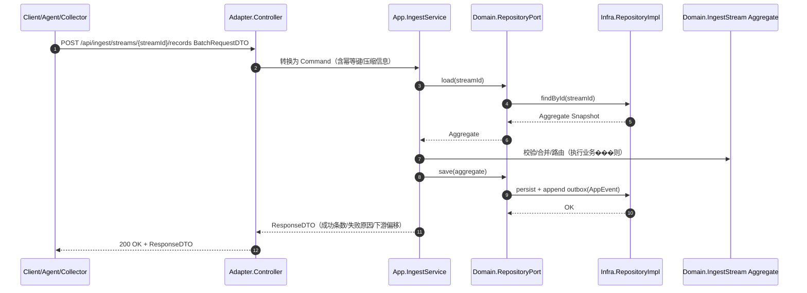
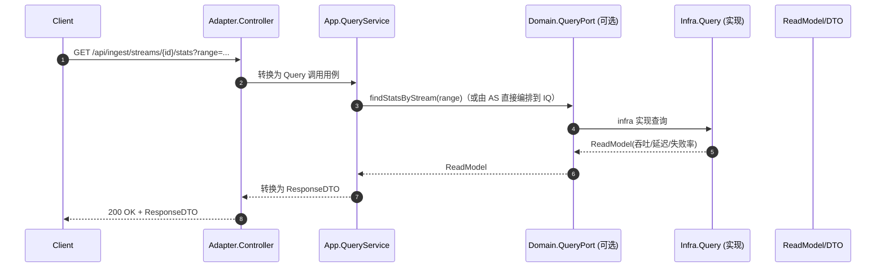
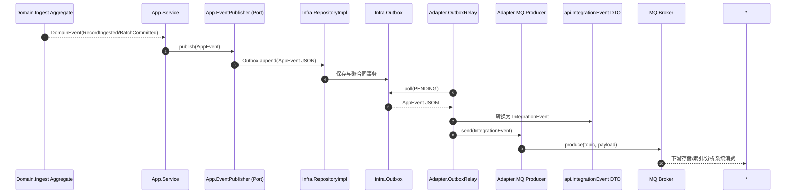

# `patra-ingest`

> Ingest 服务：可观测数据与业务事件的统一入口，负责高吞吐低延迟地接收、校验、规范化与落地（持久化/缓存/转发），并通过 Outbox + Relay 实现对外发布；作为写侧入口，读侧通过 app/infra 提供必要的查询能力（状态/偏移/任务）。
> 架构采用 六边形架构（Hexagonal / Ports & Adapters）+ DDD 分层 + CQRS，保持业务内核纯净与技术细节隔离。

---

## 1. 分层与依赖原则

整体分层结构与依赖方向与仓库统一约束一致：

- 接口层（api）：对外契约（REST/RPC DTO、IntegrationEvent DTO、错误码、路径常量等）。
  - 仅依赖：`jakarta.validation`。
  - 不依赖 Spring、domain、infra、app、contract。

 

- 适配层（adapter）：协议适配（Web、MQ、Scheduler）。
  - 依赖：`app` + `api`，可选 Web/MQ SDK。
  - 不依赖 domain、infra。

- 应用层（app）：用例编排（鉴权、事务、聚合协作、事件触发）。
  - 依赖：`domain`、`patra-common` 等共享库。
  - 不依赖 adapter、infra、api。

- 领域层（domain）：业务内核（聚合、实体、值对象、领域事件、仓储端口、查询视图接口）。
  - 依赖：`patra-common`（含 hutool-core）。
  - 不依赖 Spring、MyBatis、Web、api。

- 基础设施层（infra）：持久化/缓存/消息等技术实现。
  - 依赖：`domain`、`patra-spring-boot-starter-mybatis` 等。
  - 不依赖 app、adapter、api。

依赖方向（A → B 表示 A 依赖 B）：

```
boot     → adapter, app, infra
adapter  → app, api
app      → domain
infra    → domain
api      → (no deps)
domain   → (no deps，仅通用库)
```

---

## 2. 模块说明

### 2.1 `patra-ingest-api`

职责

- 定义对��契约：REST/RPC DTO、IntegrationEvent DTO、路径与错误码常量。
- 统一 Ingest 协议（支持批量/压缩/分片等可选能力，向后兼容演进）。

约束

- 只依赖 `jakarta.validation`。
- 不包含任何实现逻辑。

目录结构

```
rest/dto/{request,response}/
rpc/client/
events/
enums/
error/
```

---

（原 `patra-ingest-contract` 模块已移除，查询相关接口可由 domain 暴露、由 infra 实现或由 app 聚合封装。）

---

### 2.3 `patra-ingest-adapter`

职责

- 协议适配：
  - REST 控制器：对接 Agent/SDK/Collector（如 OpenTelemetry Collector）入站写入接口；
  - MQ Consumer：支持外部系统推送或重放；
  - Scheduler：重试/补偿/定时聚合与 Outbox Relay；
  - Producer：实现 app 发布端口，将 AppEvent → IntegrationEvent（api DTO）→ 通过 MQ/HTTP 发送。
- 只做参数校验/映射/转发，不写业务逻辑。

约束

- 依赖：`app` + `api`。
- 不依赖 domain/infra/contract。

---

### 2.4 `patra-ingest-app`

职责

- 用例编排：
  - 写侧���鉴权、幂等、解压/解码、规范化、分流与聚合边界调用、事务控制；
  - 读侧：经 `contract.QueryPort` 聚合查询读模型；
  - 事件：将领域事件转为 AppEvent，通过发布端口写入 Outbox。
- 转换领域异常为应用异常。

约束

- 依赖：`domain`、`contract`、`patra-common`（以及必要的 starter）。
- 不依赖 adapter/infra/api。

---

### 2.5 `patra-ingest-domain`

职责

- 领域建模：
  - 聚合：IngestStream、IngestBatch、RoutingRule、Source 等；
  - 领域行为：验证 schema、不变量与配额；批次合并与提交；
  - 领域事件：RecordIngested、BatchCommitted、StreamRouted 等；
  - 仓储端口：加载/持久化聚合快照与事件。

约束

- 依赖：`patra-common`。
- 不依赖 Spring/ORM/Web/api/contract；零注解。

---

### 2.6 `patra-ingest-infra`

职责

- 技术落地：
  - 实现 `domain.port.*` 的仓储，维护 DO ↔ 聚合映射；
  - 实现 `contract.QueryPort` 的查询（状态/吞吐/延迟/失败原因等读模型）；
  - Outbox 托管与事务一致性；
  - 可选缓存与批量写优化（分片、合并、异步刷盘）。

约束

- 依赖：`domain` + `contract` + MyBatis/Starter 等。
- 不依赖 app/adapter/api。

---

## 3. 事件流转规范

- 领域事件（DomainEvent）：在 domain 产生，描述 Ingest 业务事实（如某条记录被接收、批次已提交）。
- 应用事件（AppEvent）：在 app 定义/触发，承载编排语境；通过发布端口写入 Outbox。
- 集成事件（IntegrationEvent）：在 api 定义，作为对外契约（供下游存储/索引/分析或其他服务订阅）。
- 发布链路：DomainEvent → AppEvent → adapter → IntegrationEvent → MQ/RPC/REST。
- 订阅链路：adapter 消费 IntegrationEvent → 转为 command/query → 调 app → domain 执行业务 → infra 落库。

---

## 4. 开发约束与风格

- 零注解/零框架污染：domain 层不出现 `@Component/@Entity/@Table`。
- Lombok 强制：数据类与 DO/DTO/VO 等统一使用 Lombok，不手写 getter/setter/toString/equals/hashCode。
- MapStruct：Converter 必须被 Spring 管理；只做字段映射，不含业务。
- Mapper：所有 Mapper 必须 `extends BaseMapper<DO>`。
- DTO/事件演进��新增字段向后兼容，破坏性修改采用版本化策略（Ingest 协议 version 字段）。
- 幂等等：写侧通过 requestId/traceId/内容哈希等形成幂等键；批次内去重；可选滑动窗口控制。
- 回压与限流：在 adapter 层进行初步限流，app 层保障背压与排队策略，infra 层批量落库。

---

## 5. 测试策略

- domain：聚合行为与不变量（批次合并、配额校验、路由规则）。
- app：编排链路（幂等等、解压/解码、事件发布）。
- infra：仓储单测覆盖 DO ↔ 聚合 ↔ ReadModel 映射、CRUD、并发控制、Outbox 一致性。
- adapter：契约测试（REST/MQ 输入输出与文档一致，包含批量与压缩场景）。
- api：DTO/事件模型序列化正确，包含 version 演进用例。

---

## 6. 版本与演进

- 向后兼容优先；Ingest 协议通过 `version` 字段演进。
- 弃用策略：旧接口/事件标记 `@Deprecated` 并设定淘汰周期；
- 契约文档：OpenAPI/AsyncAPI 或 Markdown 同步更新。

---

## 7. 架构分层与依赖方向（Hexagonal + DDD + CQRS）



---

## 8. 入站写入典型调用链（REST 批量写）



---

## 9. 查询调用链（读侧）



---

## 10. 事件发布典型链路（出站）


