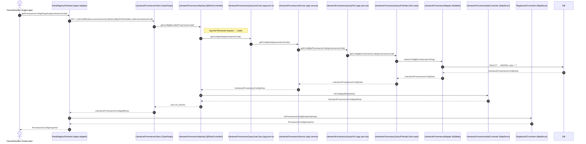

# LiteratureProvenanceHttpApi#getConfigByCode 调用链路与时序

本文档说明 `com.patra.registry.api.rpc.contract.ProvenanceHttpApi#getConfigByCode` 的实现方与调用方，以及端到端的数据与控制流转细节，并附详细时序图。

---

## 接口概览

- 契约接口：`com.patra.registry.api.rpc.contract.ProvenanceHttpApi`
- 路径与方法：`GET /_internal/literature-provenances/{code}/config`
- 入参：`@PathVariable("code") ProvenanceCode provenanceCode`
- 出参：`com.patra.registry.api.rpc.dto.LiteratureProvenanceConfigApiResp`

## 端到端调用链路（模块与文件）

服务端（patra-registry）：
- Adapter 层（实现 HTTP 契约）
  - `patra-registry-adapter/.../rest/_internal/client/LiteratureProvenanceApiImpl`
    - 实现 `LiteratureProvenanceHttpApi`
    - 记录入参日志 → 委派到 UseCase → MapStruct 转换为 API DTO
  - `patra-registry-adapter/.../rest/_internal/converter/LiteratureProvenanceApiConverter`
    - MapStruct：`LiteratureProvenanceConfigView` → `LiteratureProvenanceConfigApiResp`
- App 层（用例编排）
  - `patra-registry-app/.../usecase/LiteratureProvenanceQueryUseCase`
  - `patra-registry-app/.../service/LiteratureProvenanceService`
    - 实现 UseCase，委派到 Port-Out
- Contract（Port & View）
  - `patra-registry-contract/.../port/LiteratureProvenanceQueryPort`
  - `patra-registry-contract/.../view/LiteratureProvenanceConfigView`
- Infra 层（持久化实现）
  - `patra-registry-infra/.../repository/LiteratureProvenanceQueryPortImpl`
    - 组合 Mapper，调用 `selectConfigByCode`
  - `patra-registry-infra/.../mapper/LiteratureProvenanceMapper`
    - MyBatis-Plus BaseMapper + 自定义方法 `selectConfigByCode(@Param("code") String code)`

客户端（patra-ingest 调用 registry）：
- Feign 客户端（继承契约）
  - `patra-registry-api/.../rpc/client/LiteratureProvenanceClient`
    - `@FeignClient(name = "patra-registry", contextId = "literatureProvenanceConfigClient")`
    - 直接继承 `LiteratureProvenanceHttpApi`，通过服务发现发起 HTTP 请求
- Ingest 适配层（对上游 app 暴露中立模型）
  - `patra-ingest-adapter/.../out/registry/PatraRegistryPortImpl`
    - 调用 `provenanceClient.getConfigByCode(code)`
    - 使用 `RegistryAclConverter` 转为中立模型 `ProvenanceConfigSnapshot`
  - `patra-ingest-adapter/.../out/registry/mapper/RegistryAclConverter`
    - MapStruct：`LiteratureProvenanceConfigApiResp` → `ProvenanceConfigSnapshot`
- 上层使用者示例（ingest app）
  - `patra-ingest-app/.../service/handler/HarvestHandler`
    - 调用 `registryPort.getProvenanceConfigSnapshot(prov)` 获取并使用配置快照

## 数据模型与字段映射

- API DTO（返回体）：`LiteratureProvenanceConfigApiResp`
  - 字段：`provenanceId, provenanceCode, timezone, retryMax, backoffMs, rateLimitPerSec, searchPageSize, fetchBatchSize, maxSearchIdsPerWindow, overlapDays, retryJitter, enableAccess, dateFieldDefault, baseUrl, headers`
  - 约束：注释提示 `headers` 仅公共头，敏感认证头不透出
- Query View（服务端内部查询视图）：`LiteratureProvenanceConfigView`
  - 字段与 API DTO 基本一一对应
- 中立模型（ingest 使用）：`ProvenanceConfigSnapshot`
  - 类型提升与分组：
    - `timezone: String → ZoneId`
    - 组合策略对象：`RetryPolicy / RateLimitPolicy / PagingPolicy / WindowPolicy`
- MapStruct 转换细节：
  - 视图 → API（`LiteratureProvenanceApiConverter`）
    - `@Mapper(componentModel = "spring", unmappedTargetPolicy = ReportingPolicy.ERROR)`
  - API → 中立模型（`RegistryAclConverter`）
    - `timezone`：`ZoneId.of(resp.timezone())`
    - `retryJitter`：`null → 0.0`
    - `rateLimitPerSec`：`null → 0`
    - `overlapDays` / `maxSearchIdsPerWindow`：`null → 0`
    - `headers → publicHeaders`

## 详细时序图（Mermaid）

## 边界与异常

- 枚举路径变量：`ProvenanceCode` 的路径变量默认按枚举名解析（如 `PUBMED`）。Infra 查询使用 `provenanceCode.getCode()`（如 `pubmed`）与 DB 匹配。
- 空值处理：客户端转换对若干可空字段做了保底（`retryJitter/rateLimitPerSec/overlapDays/maxSearchIdsPerWindow`）。
- 时区合法性：`ZoneId.of(timezone)` 需保证配置有效，否则会抛出异常。
- 未命中：当 DB 未命中记录时，当前实现未显式返回 404。可按业务语义补充异常到 HTTP 层的转换。

## 分层与质量

- 六边形架构契合：adapter 仅做协议/映射，app 负责编排，infra 负责持久化，api 定义契约。
- 转换器：均由 Spring 托管，`ReportingPolicy.ERROR` 避免字段漏映射。

## 影响面与扩展建议

- 若新增配置字段：需同步更新 `LiteratureProvenanceConfigView`、`LiteratureProvenanceApiConverter`、`LiteratureProvenanceConfigApiResp`、`RegistryAclConverter` 与 `ProvenanceConfigSnapshot`。
- 若变更路径或服务名：注意 `LiteratureProvenanceClient` 的 `@FeignClient(name="patra-registry")` 与网关/注册中心配置。
