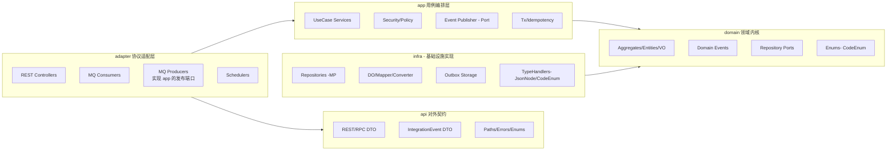
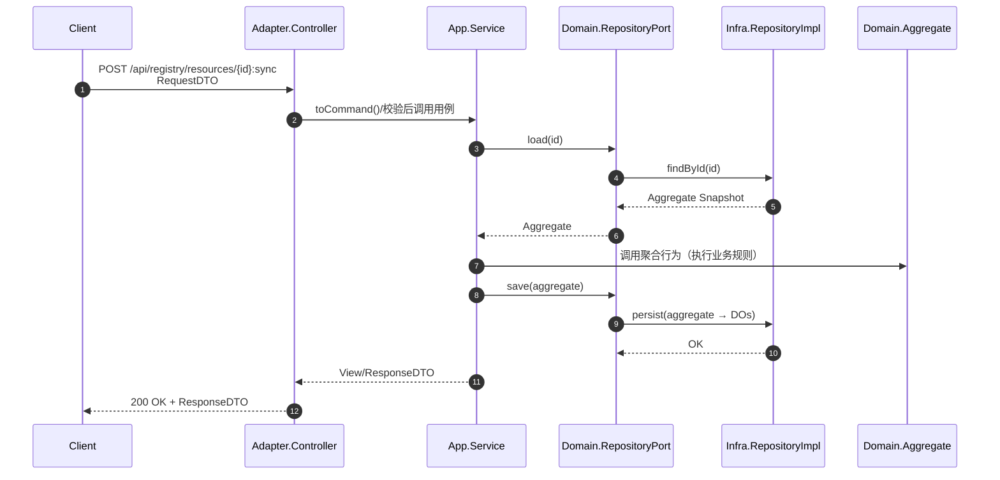
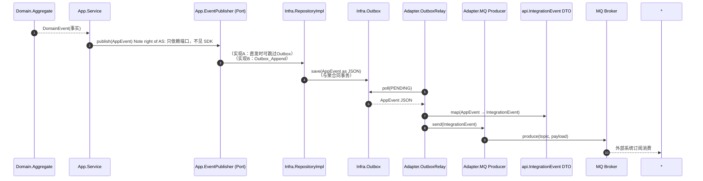

# `patra-registry`

> **Registry 服务**：系统的唯一真实数据来源（SSOT, Single Source of Truth），负责字典/配置等核心元数据的管理与下发。
> 架构采用 **六边形架构（Hexagonal / Ports & Adapters）** + **DDD 分层**，以保证业务内核纯净、技术细节隔离。

---

## 1. 分层与依赖原则

整体分层结构如下：

* **接口层（api）**：对外契约（REST/RPC DTO、集成事件 DTO、枚举、路径常量等）。

    * 仅依赖：`jakarta.validation`。
    * 不依赖 Spring、domain、infra、app。

* **适配层（adapter）**：对外协议适配（Web、RPC、MQ、Scheduler）。

    * 依赖：`app` + `api`，可选 `patra-spring-boot-starter-web`、MQ/RPC SDK。
    * 不依赖 domain、infra。

* **应用层（app）**：用例编排（权限校验、事务边界、聚合协作、事件触发）。

    * 依赖：`domain`、`patra-common`、`patra-spring-boot-starter-core` 等共享库。
    * 不依赖 adapter、infra、api。

* **领域层（domain）**：业务语义内核（聚合、实体、值对象、领域事件、仓储端口）。

    * 依赖：`patra-common`（含 hutool-core 工具）。
    * 不依赖 Spring、MyBatis、Web、api。

* **基础设施层（infra）**：持久化/缓存等技术实现。

    * 依赖：`domain`、`patra-spring-boot-starter-mybatis`、`patra-spring-boot-starter-core`。
    * 不依赖 app、adapter、api。

依赖方向：

```
adapter → app → domain ← infra
                 ↑
                api （对外契约）
```

---

## 2. 模块说明

### 2.1 `patra-registry-api`

**职责**：

* 定义对外契约：REST/RPC DTO、事件 DTO（IntegrationEvent）、路径与错误码常量。
* 承载跨服务通信的公共模型（Feign 接口可选）。

**约束**：

* 只依赖 `jakarta.validation`。
* 不包含任何实现逻辑。
* 事件 DTO 与 Topic 常量统一在此定义。

**目录结构**：

```
rest/dto/{request,response}/    // REST/RPC 请求/响应
rpc/client/                     // 可选的 Feign 接口
events/                         // IntegrationEvent DTO + Topic 常量
enums/                          // 协议层枚举（与领域枚举解耦）
error/                          // 错误码常量（可选）
```

---

### 2.2 `patra-registry-adapter`

**职责**：

* 协议适配：REST 控制器、MQ 消费者/生产者、Scheduler 任务入口。
* 转换请求/消息 → app 用例输入；调用 app 服务。
* 实现 app 的发布端口：将 AppEvent → IntegrationEvent（api DTO）→ 通过 SDK 发送。

**约束**：

* 依赖：`app` + `api`，可选 Web/MQ SDK。
* 不包含业务逻辑；不直接依赖 domain/infra。
* DTO 校验在 controller；统一返回 View/Response。

**目录结构**：

```
rest/controller/      // REST 控制器
rest/dto/             // REST 专用 DTO
scheduler/            // 定时任务入口
mq/consumer/          // MQ 消费者
mq/producer/          // MQ 生产者（实现 app 端口）
config/               // 协议层配置
```

---

### 2.3 `patra-registry-app`

**职责**：

* 用例编排：权限检查、事务控制、聚合协作、事件触发。
* 转换领域异常为应用异常；封装应用事件。
* 定义事件发布端口（EventPublisher），由 adapter 实现。

**约束**：

* 依赖：`domain`、`patra-common`、`patra-spring-boot-starter-core`。
* 不依赖 adapter/infra/api。
* 不暴露领域对象；对上层返回 DTO/View。

**目录结构**：

```
service/              // 用例编排入口
usecase/{command,query}/
mapping/              // app ↔ domain 映射
security/             // 权限检查接口
event/                // 应用事件
event/publisher/      // 发布端口（接口）
tx/                   // 幂等/分布式锁工具
config/               // Bean 配置
```

---

### 2.4 `patra-registry-domain`

**职责**：

* 承载业务语义：实体、值对象、聚合、领域事件、仓储端口。
* 校验不变量；定义行为（方法驱动，而非属性赋值）。

**约束**：

* 依赖：`patra-common`（含 hutool-core）。
* 不依赖 Spring/ORM/Web/api。
* 领域枚举统一在此定义（实现 `CodeEnum<C>` 以映射数据库字段）。
* 二值开关用 `boolean`，不建枚举。

**目录结构**：

```
model/aggregate/      // 聚合根与子实体
model/vo/             // 值对象
model/event/          // 领域事件
model/enums/          // 领域枚举（实现 CodeEnum）
port/                 // 仓储端口接口
```

---

### 2.5 `patra-registry-infra`

**职责**：

* 实现 `domain.port.*` 的仓储，持久化/缓存/技术落地。
* 聚合 ↔ DO 映射；维护 Outbox 事件托管。

**约束**：

* 依赖：`domain` + MyBatis/Starter。
* 不依赖 app/adapter/api。
* DO 的数据库枚举字段必须用 `domain` 的枚举（实现 `CodeEnum`）。
* DO 的 JSON 字段统一用 `JsonNode`（Starter 已注册 TypeHandler）。
* 所有 Mapper 必须继承 `BaseMapper<DO>`；简单 SQL 不写 XML，直接在 Repository 用 `baseMapper` + Wrapper。
* Converter 使用 MapStruct，保持简洁；只做字段映射，不承载业务逻辑。

**目录结构**：

```
persistence/entity/    // DO（继承 BaseDO）
persistence/mapper/    // MyBatis-Plus Mapper
persistence/repository/ // 仓储实现
mapstruct/             // DO ↔ 聚合 转换器
config/                // 数据源/事务/MP 配置
```

---

## 3. 事件流转规范

* **领域事件（DomainEvent）**：在 domain 产生，描述业务事实。
* **应用事件（AppEvent）**：在 app 定义/触发，承载编排语境；通过 `EventPublisher` 端口发布。
* **集成事件（IntegrationEvent）**：在 api 定义，作为跨系统对外契约。
* **发布链路**：

    * domain 触发 DomainEvent → app 转为 AppEvent → adapter 实现端口 → 映射成 IntegrationEvent → MQ/RPC/REST 发出。
* **订阅链路**：

    * adapter 消费 IntegrationEvent（api DTO）→ 转为 command/query → 调 app 用例 → domain 聚合执行 → infra 落库。
* **infra**：通过 Outbox 托管事件，保证与聚合同事务。

---

## 4. 开发约束与风格

* **零注解/零框架污染**：domain 不出现 `@Component/@Entity/@Table` 等注解。
* **工具使用**：通用方法直接用 hutool-core（`StrUtil`、`CollUtil`、`DateUtil`、`Assert`、`IdUtil`）。不得在 domain 自行造工具类。
* **Mapper 规范**：所有 Mapper 必须继承 `BaseMapper<DO>`；简单 SQL 不写 XML。
* **Converter 规范**：MapStruct 转换器保持简洁，一个聚合一个 Converter，注解最小化。
* **DTO/事件模型演进**：新增字段向后兼容，破坏性修改采用版本化策略。

---

## 5. 测试策略

* **domain**：单元测试聚合行为与不变量（Given-When-Then）。
* **app**：测试用例编排链路（权限→聚合→保存→事件）。
* **infra**：仓储单测覆盖 DO ↔ 聚合映射、CRUD、并发控制；集成测试使用容器化数据库。
* **adapter**：契约测试（REST/MQ 输入输出与文档一致），集成测试验证转发链路。
* **api**：仅需保证 DTO/事件模型的序列化/反序列化正确。

---

## 6. 版本与演进

* **向后兼容优先**：新增字段有默认值；事件/DTO 演进通过版本化。
* **弃用策略**：旧接口/事件标记 `@Deprecated` 并设定淘汰周期。
* **契约文档**：OpenAPI/AsyncAPI 或 Markdown 文档同步更新，随版本管理。

---

> `patra-registry` = **单一真实数据来源**。
>
> * domain：定义业务规则与内核。
> * app：编排用例与触发事件。
> * adapter：协议翻译与对外交互。
> * infra：持久化与技术落地。
> * api：对外契约与跨服务通信。


## 7. 架构分层与依赖方向（Hexagonal + DDD）



**要点**：

- 依赖方向：adapter → app → domain ← infra，adapter → api；app/domain/infra 均不依赖 api。
- app 中只有“发布端口接口”，真正的 MQ Producer 在 adapter 实现。
- infra 专注持久化与 Outbox 托管，不发不收消息。

## 8. REST 请求典型调用链（入站）



**规范落点**：

- Controller 仅做参数校验/DTO 转换/调用 app，不写业务。
- AppService 负责权限、事务边界、聚合协作与事件触发。
- Repository 以聚合为单位 load/save，Mapper 简单 SQL 不写 XML，直接 BaseMapper + Wrapper。

## 9.事件发布典型链路（出站，支持 Outbox）



**落地提示**：

- Outbox 实现：与业务写库同事务，避免消息与数据不一致。
- App 只见 Port：EventPublisher 为接口；真正 Producer & Relay 在 adapter。
- api 中只放 IntegrationEvent：对外契约；AppEvent/DomainEvent 不进 api。
