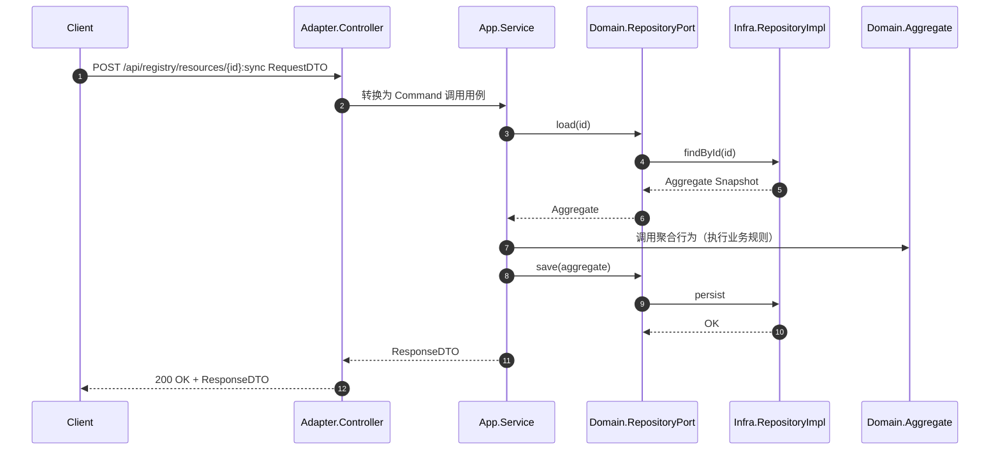
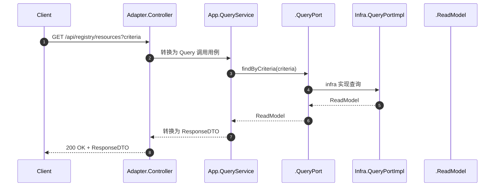
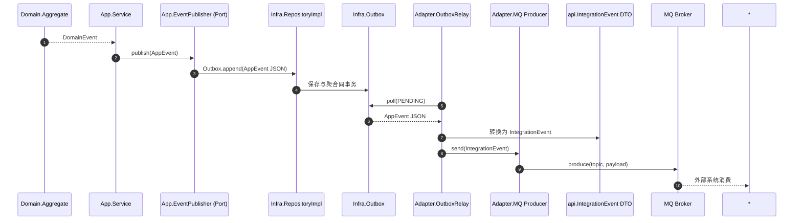

# `patra-registry`

> **Registry 服务**：系统的唯一真实数据来源（SSOT, Single Source of Truth），负责字典/配置等核心元数据的管理与下发。
> 架构采用 **六边形架构（Hexagonal / Ports & Adapters）** + **DDD 分层** + **CQRS**，以保证业务内核纯净、技术细节隔离。

---

## 1. 分层与依赖原则

整体分层结构如下：

* **接口层（api）**：对外契约（REST/RPC DTO、集成事件 DTO、枚举、路径常量等）。

    * 仅依赖：`jakarta.validation`。
    * 不依赖 Spring、domain、infra、app、。

* **适配层（adapter）**：对外协议适配（Web、RPC、MQ、Scheduler）。

    * 依赖：`app` + `api`，可选 Web/MQ SDK。
    * 不依赖 domain、infra、。

* **应用层（app）**：用例编排（权限校验、事务边界、聚合协作、事件触发）。

    * 依赖：`domain`、``、`patra-common` 等共享库。
    * 不依赖 adapter、infra、api。

* **领域层（domain）**：业务语义内核（聚合、实体、值对象、领域事件、仓储端口）。

    * 依赖：`patra-common`（含 hutool-core 工具）。
    * 不依赖 Spring、MyBatis、Web、api、。

* **基础设施层（infra）**：持久化/缓存等技术实现。

    * 依赖：`domain`、``、`patra-spring-boot-starter-mybatis` 等技术组件。
    * 不依赖 app、adapter、api。

依赖方向：

```
boot     → adapter, app, infra
adapter  → app, api
app      → domain, 
infra    → domain, 
api      → (no deps)
 → (no deps)
domain   → (no deps，仅通用库)
```

---

## 2. 模块说明

### 2.1 `patra-registry-api`

**职责**

* 定义对外契约：REST/RPC DTO、事件 DTO（IntegrationEvent）、路径与错误码常量。
* 承载跨服务通信的公共模型（Feign 接口可选）。

**约束**

* 只依赖 `jakarta.validation`。
* 不包含任何实现逻辑。

**目录结构**

```
rest/dto/{request,response}/
rpc/client/         
events/             
enums/              
error/              
```

---

### 2.3 `patra-registry-adapter`

**职责**

* 协议适配：REST 控制器、MQ 消费者/生产者、Scheduler。
* 转换请求/消息 → app 用例输入；调用 app 服务。
* 实现 app 的发布端口：将 AppEvent → IntegrationEvent（api DTO）→ 通过 SDK 发送。

**约束**

* 依赖：`app` + `api`。
* 不包含业务逻辑；不依赖 domain/infra/。

---

### 2.4 `patra-registry-app`

**职责**

* 用例编排：权限检查、事务控制、聚合协作、事件触发。
* 调用 `domain.Repository`（写侧）和 `.QueryPort`（读侧）。
* 转换领域异常为应用异常；封装应用事件。

**约束**

* 依赖：`domain`、``、`patra-common`。
* 不依赖 adapter/infra/api。

---

### 2.5 `patra-registry-domain`

**职责**

* 承载业务语义：实体、值对象、聚合、领域事件、仓储端口。
* 校验不变量；定义行为。

**约束**

* 依赖：`patra-common`。
* 不依赖 Spring/ORM/Web/api/。

---

### 2.6 `patra-registry-infra`

**职责**

* 实现 `domain.port.*` 的仓储，持久化/缓存/技术落地。
* DO ↔ 聚合 ↔ ReadModel 映射；维护 Outbox 事件托管。

**约束**

* 依赖：`domain` + MyBatis/Starter。
* 不依赖 app/adapter/api。

---

## 3. 事件流转规范

* **领域事件（DomainEvent）**：在 domain 产生，描述业务事实。
* **应用事件（AppEvent）**：在 app 定义/触发，承载编排语境；通过 `EventPublisher` 端口发布。
* **集成事件（IntegrationEvent）**：在 api 定义，作为跨系统对外契约。
* **发布链路**：DomainEvent → AppEvent → adapter → IntegrationEvent → MQ/RPC/REST。
* **订阅链路**：adapter 消费 IntegrationEvent → 转为 command/query → 调 app → domain 聚合执行 → infra 落库。

---

## 4. 开发约束与风格

* **零注解/零框架污染**：domain 不出现 `@Component/@Entity/@Table`。
* **工具使用**：通用方法直接用 hutool-core。
* **Mapper 规范**：所有 Mapper 必须继承 `BaseMapper<DO>`。
* **Converter 规范**：MapStruct 转换器保持简洁，一个聚合一个 Converter。
* **DTO/事件模型演进**：新增字段向后兼容，破坏性修改采用版本化策略。

---

## 5. 测试策略

* **domain**：单元测试聚合行为与不变量。
* **app**：测试用例编排链路。
* **infra**：仓储单测覆盖 DO ↔ 聚合 ↔ ReadModel 映射、CRUD、并发控制。
* **adapter**：契约测试（REST/MQ 输入输出与文档一致）。
* **api**：保证 DTO/事件模型序列化正确。

---

## 6. 版本与演进

* **向后兼容优先**。
* **弃用策略**：旧接口/事件标记 `@Deprecated` 并设定淘汰周期。
* **契约文档**：OpenAPI/AsyncAPI 或 Markdown 文档同步更新。

---


---

## 8. REST 请求典型调用链（入站）



---

## 9. 查询调用链（读侧，经过 ）



---

## 10. 事件发布典型链路（出站）


