# `patra-registry`

> **Registry 服务**：系统的唯一真实数据来源（SSOT, Single Source of Truth），负责字典/配置等核心元数据的管理与下发。
> 架构采用 **六边形架构（Hexagonal / Ports & Adapters）** + **DDD 分层**，以保证业务内核纯净、技术细节隔离。

---

## 1. 分层与依赖原则

整体分层结构如下：

* **接口层（api）**：对外契约（REST/RPC DTO、集成事件 DTO、枚举、路径常量等）。

    * 仅依赖：`jakarta.validation`。
    * 不依赖 Spring、domain、infra、app。

* **适配层（adapter）**：对外协议适配（Web、RPC、MQ、Scheduler）。

    * 依赖：`app` + `api`，可选 `patra-spring-boot-starter-web`、MQ/RPC SDK。
    * 不依赖 domain、infra。

* **应用层（app）**：用例编排（权限校验、事务边界、聚合协作、事件触发）。

    * 依赖：`domain`、`patra-common`、`patra-spring-boot-starter-core` 等共享库。
    * 不依赖 adapter、infra。

* **领域层（domain）**：业务语义内核（聚合、实体、值对象、领域事件、仓储端口）。

    * 依赖：`patra-common`（含 hutool-core 工具）。
    * 不依赖 Spring、MyBatis、Web、api。

* **基础设施层（infra）**：持久化/缓存等技术实现。

    * 依赖：`domain`、`patra-spring-boot-starter-mybatis`、`patra-spring-boot-starter-core`。
    * 不依赖 app、adapter、api。

依赖方向：

```
          infra
           👇
adapter → app → domain 
  👇
  api(契约)
```

---

## 2. 模块说明

### 2.1 `patra-registry-api`

**职责**：

* 定义对外契约：REST/RPC DTO、事件 DTO（IntegrationEvent）、路径与错误码常量。
* 承载跨服务通信的公共模型（Feign 接口可选）。

**约束**：

* 只依赖 `jakarta.validation`。
* 不包含任何实现逻辑。
* 事件 DTO 与 Topic 常量统一在此定义。

**目录结构**：

```
rest/dto/{request,response}/    // REST/RPC 请求/响应
rpc/client/                     // 可选的 Feign 接口
events/                         // IntegrationEvent DTO + Topic 常量
enums/                          // 协议层枚举（与领域枚举解耦）
error/                          // 错误码常量（可选）
```

---

### 2.2 `patra-registry-adapter`

**职责**：

* 协议适配：REST 控制器、MQ 消费者/生产者、Scheduler 任务入口。
* 转换请求/消息 → app 用例输入；调用 app 服务。
* 实现 app 的发布端口：将 AppEvent → IntegrationEvent（api DTO）→ 通过 SDK 发送。

**约束**：

* 依赖：`app` + `api`，可选 Web/MQ SDK。
* 不包含业务逻辑；不直接依赖 domain/infra。
* DTO 校验在 controller；统一返回 View/Response。

**目录结构**：

```
rest/controller/      // REST 控制器
rest/dto/             // REST 专用 DTO
scheduler/            // 定时任务入口
mq/consumer/          // MQ 消费者
mq/producer/          // MQ 生产者（实现 app 端口）
config/               // 协议层配置
```

---

### 2.3 `patra-registry-app`

**职责**：

* 用例编排：权限检查、事务控制、聚合协作、事件触发。
* 转换领域异常为应用异常；封装应用事件。
* 定义事件发布端口（EventPublisher），由 adapter 实现。

**约束**：

* 依赖：`domain`、`patra-common`、`patra-spring-boot-starter-core`。
* 不依赖 adapter/infra/api。
* 不暴露领域对象；对上层返回 DTO/View。

**目录结构**：

```
service/              // 用例编排入口
usecase/{command,query}/
mapping/              // app ↔ domain 映射
security/             // 权限检查接口
event/                // 应用事件
event/publisher/      // 发布端口（接口）
tx/                   // 幂等/分布式锁工具
config/               // Bean 配置
```

---

### 2.4 `patra-registry-domain`

**职责**：

* 承载业务语义：实体、值对象、聚合、领域事件、仓储端口。
* 校验不变量；定义行为（方法驱动，而非属性赋值）。

**约束**：

* 依赖：`patra-common`（含 hutool-core）。
* 不依赖 Spring/ORM/Web/api。
* 领域枚举统一在此定义（实现 `CodeEnum<C>` 以映射数据库字段）。
* 二值开关用 `boolean`，不建枚举。

**目录结构**：

```
model/aggregate/      // 聚合根与子实体
model/vo/             // 值对象
model/event/          // 领域事件
model/enums/          // 领域枚举（实现 CodeEnum）
port/                 // 仓储端口接口
```

---

### 2.5 `patra-registry-infra`

**职责**：

* 实现 `domain.port.*` 的仓储，持久化/缓存/技术落地。
* 聚合 ↔ DO 映射；维护 Outbox 事件托管。

**约束**：

* 依赖：`domain` + MyBatis/Starter。
* 不依赖 app/adapter/api。
* DO 的数据库枚举字段必须用 `domain` 的枚举（实现 `CodeEnum`）。
* DO 的 JSON 字段统一用 `JsonNode`（Starter 已注册 TypeHandler）。
* 所有 Mapper 必须继承 `BaseMapper<DO>`；简单 SQL 不写 XML，直接在 Repository 用 `baseMapper` + Wrapper。
* Converter 使用 MapStruct，保持简洁；只做字段映射，不承载业务逻辑。

**目录结构**：

```
persistence/entity/    // DO（继承 BaseDO）
persistence/mapper/    // MyBatis-Plus Mapper
persistence/repository/ // 仓储实现
mapstruct/             // DO ↔ 聚合 转换器
config/                // 数据源/事务/MP 配置
```

---

## 3. 事件流转规范

* **领域事件（DomainEvent）**：在 domain 产生，描述业务事实。
* **应用事件（AppEvent）**：在 app 定义/触发，承载编排语境；通过 `EventPublisher` 端口发布。
* **集成事件（IntegrationEvent）**：在 api 定义，作为跨系统对外契约。
* **发布链路**：

    * domain 触发 DomainEvent → app 转为 AppEvent → adapter 实现端口 → 映射成 IntegrationEvent → MQ/RPC/REST 发出。
* **订阅链路**：

    * adapter 消费 IntegrationEvent（api DTO）→ 转为 command/query → 调 app 用例 → domain 聚合执行 → infra 落库。
* **infra**：通过 Outbox 托管事件，保证与聚合同事务。

---

## 4. 开发约束与风格

* **零注解/零框架污染**：domain 不出现 `@Component/@Entity/@Table` 等注解。
* **工具使用**：通用方法直接用 hutool-core（`StrUtil`、`CollUtil`、`DateUtil`、`Assert`、`IdUtil`）。不得在 domain 自行造工具类。
* **Mapper 规范**：所有 Mapper 必须继承 `BaseMapper<DO>`；简单 SQL 不写 XML。
* **Converter 规范**：MapStruct 转换器保持简洁，一个聚合一个 Converter，注解最小化。
* **DTO/事件模型演进**：新增字段向后兼容，破坏性修改采用版本化策略。

---

## 5. 测试策略

* **domain**：单元测试聚合行为与不变量（Given-When-Then）。
* **app**：测试用例编排链路（权限→聚合→保存→事件）。
* **infra**：仓储单测覆盖 DO ↔ 聚合映射、CRUD、并发控制；集成测试使用容器化数据库。
* **adapter**：契约测试（REST/MQ 输入输出与文档一致），集成测试验证转发链路。
* **api**：仅需保证 DTO/事件模型的序列化/反序列化正确。

---

## 6. 版本与演进

* **向后兼容优先**：新增字段有默认值；事件/DTO 演进通过版本化。
* **弃用策略**：旧接口/事件标记 `@Deprecated` 并设定淘汰周期。
* **契约文档**：OpenAPI/AsyncAPI 或 Markdown 文档同步更新，随版本管理。

---

> `patra-registry` = **单一真实数据来源**。
>
> * domain：定义业务规则与内核。
> * app：编排用例与触发事件。
> * adapter：协议翻译与对外交互。
> * infra：持久化与技术落地。
> * api：对外契约与跨服务通信。


## 7. 架构分层与依赖方向（Hexagonal + DDD）

```mermaid
flowchart LR
  subgraph API[api  对外契约]
    API1[REST/RPC DTO]
    API2[IntegrationEvent DTO]
    API3[Paths/Errors/Enums]
  end

  subgraph ADAPTER[adapter 协议适配层]
    A1[REST Controllers]
    A2[MQ Consumers]
    A3[MQ Producers<br/> 实现 app 的发布端口]
    A4[Schedulers]
  end

  subgraph APP[app  用例编排层]
    P1[UseCase Services]
    P2[Security/Policy]
    P3[Event Publisher - Port]
    P4[Tx/Idempotency]
  end

  subgraph DOMAIN[domain  领域内核]
    D1[Aggregates/Entities/VO]
    D2[Domain Events]
    D3[Repository Ports]
    D4[Enums- CodeEnum]
  end

  subgraph INFRA[infra - 基础设施实现]
    I1[Repositories -MP]
    I2[DO/Mapper/Converter]
    I3[Outbox Storage]
    I4[TypeHandlers- JsonNode/CodeEnum]
  end

  %% 依赖箭头：外向内，保持向心
  ADAPTER --> APP
  ADAPTER --> API
  APP --> DOMAIN
  INFRA --> DOMAIN

  %% 备注
  classDef thin fill:#0b0,stroke:#0b0,stroke-width:0px,color:#fff;


```



**要点**：

- 依赖方向：adapter → app → domain ← infra，adapter → api；app/domain/infra 均不依赖 api。
- app 中只有“发布端口接口”，真正的 MQ Producer 在 adapter 实现。
- infra 专注持久化与 Outbox 托管，不发不收消息。

## 8. REST 请求典型调用链（入站）

```mermaid
sequenceDiagram
  autonumber
  participant C as Client
  participant AC as Adapter.Controller
  participant AS as App.Service
  participant RP as Domain.RepositoryPort
  participant IR as Infra.RepositoryImpl
  participant AG as Domain.Aggregate

  C->>AC: POST /api/registry/resources/{id}:sync<br/>RequestDTO
  AC->>AS: toCommand()/校验后调用用例
  AS->>RP: load(id)
  RP->>IR: findById(id)
  IR-->>RP: Aggregate Snapshot
  RP-->>AS: Aggregate
  AS->>AG: 调用聚合行为（执行业务规则）
  AS->>RP: save(aggregate)
  RP->>IR: persist(aggregate → DOs)
  IR-->>RP: OK
  AS-->>AC: View/ResponseDTO
  AC-->>C: 200 OK + ResponseDTO
```



**规范落点**：

- Controller 仅做参数校验/DTO 转换/调用 app，不写业务。
- AppService 负责权限、事务边界、聚合协作与事件触发。
- Repository 以聚合为单位 load/save，Mapper 简单 SQL 不写 XML，直接 BaseMapper + Wrapper。

## 9.事件发布典型链路（出站，支持 Outbox）

```mermaid
sequenceDiagram
  autonumber
  participant AG as Domain.Aggregate
  participant AS as App.Service
  participant EP as App.EventPublisher (Port)
  participant IR as Infra.RepositoryImpl
  participant OB as Infra.Outbox
  participant RL as Adapter.OutboxRelay
  participant MP as Adapter.MQ Producer
  participant API as api.IntegrationEvent DTO
  participant MQ as MQ Broker

  AG-->>AS: DomainEvent(事实)
  AS->>EP: publish(AppEvent)   Note right of AS: 只依赖端口，不见 SDK
  EP->>IR: （实现A：直发时可跳过Outbox）<br/>（实现B：Outbox_Append）
  IR->>OB: save(AppEvent as JSON)<br/>（与聚合同事务）
  RL->>OB: poll(PENDING)
  OB-->>RL: AppEvent JSON
  RL->>API: map(AppEvent → IntegrationEvent)
  RL->>MP: send(IntegrationEvent)
  MP->>MQ: produce(topic, payload)
  MQ-->>*: 外部系统订阅消费

```



**落地提示**：

- Outbox 实现：与业务写库同事务，避免消息与数据不一致。
- App 只见 Port：EventPublisher 为接口；真正 Producer & Relay 在 adapter。
- api 中只放 IntegrationEvent：对外契约；AppEvent/DomainEvent 不进 api。
